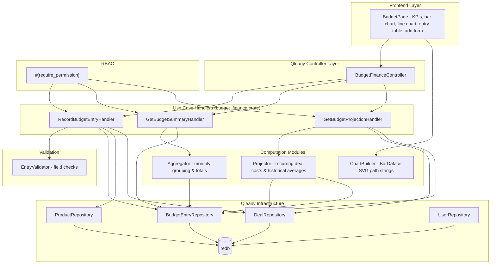

# Design Document: Budget & Finance

## Overview

This design covers the three use cases in the `budget_finance` feature group: `record_budget_entry` (undoable), `get_budget_summary` (read-only), and `get_budget_projection` (read-only). These use cases are implemented as Qleany feature handlers in the `budget_finance` crate, layered on top of Qleany-generated CRUD infrastructure for BudgetEntry, Deal, Product, and User entities.

The record handler validates input fields, resolves the authenticated user from the SecurityContext to set `recorded_by`, creates the BudgetEntry entity, and supports undo via Qleany's snapshot mechanism. The summary handler aggregates entries within a date range into totals and monthly breakdowns. The projection handler computes future budget estimates using active recurring deal costs and historical averages.

All use cases are gated by RBAC via proc macros from `inventory_security_macros`. Write operations require `budget:*` permission (Admin, Manager). Read operations require `budget:*` or `*:read` permission (Admin, Manager, Viewer).

The Slint UI BudgetPage provides KPI stat cards, a bar chart (monthly breakdown), a line chart (projection), an entry table, and an add-entry form gated by role. Chart data (BarData arrays and SVG path strings) is computed in Rust and passed to Slint.

## Architecture



## Components and Interfaces

### Module: `validate` — Budget Entry Input Validation

```rust
use chrono::NaiveDateTime;

/// Validate all fields of a RecordBudgetEntryDto before entity creation.
/// Returns Ok(()) or the first validation error encountered.
pub fn validate_entry_input(
    amount: f64,
    description: &str,
) -> Result<(), BudgetError>;

/// Verify that the Product referenced by product_id exists (skip if product_id == 0).
pub fn validate_product(
    db_context: &DbContext,
    product_id: i32,
) -> Result<Option<u32>, BudgetError>;

/// Verify that the Deal referenced by deal_id exists (skip if deal_id == 0).
pub fn validate_deal(
    db_context: &DbContext,
    deal_id: i32,
) -> Result<Option<u32>, BudgetError>;
```

### Module: `aggregator` — Monthly Grouping and Totals

```rust
use chrono::NaiveDateTime;

/// Represents the aggregated budget summary for a date range.
pub struct AggregatedSummary {
    pub total_purchases: f64,
    pub total_sales: f64,
    pub total_expenses: f64,
    pub net_balance: f64,
    pub monthly_labels: Vec<String>,       // "YYYY-MM" format, chronological
    pub monthly_purchases: Vec<f64>,
    pub monthly_sales: Vec<f64>,
    pub monthly_expenses: Vec<f64>,
}

/// Aggregate BudgetEntry entities within [from_date, to_date] into totals
/// and monthly breakdowns. Groups by calendar month (year-month).
/// Entries with entry_type Forecast are excluded from totals.
pub fn aggregate_entries(
    entries: &[BudgetEntry],
    from_date: &NaiveDateTime,
    to_date: &NaiveDateTime,
) -> AggregatedSummary;
```

### Module: `projector` — Budget Projection Engine

```rust
/// Frequency multiplier: how many times per month a deal recurs.
/// Weekly: 52/12 ≈ 4.33, Monthly: 1, Quarterly: 1/3, Yearly: 1/12, OneTime: 0
pub fn frequency_to_monthly_factor(freq: DealFrequency) -> f64;

/// Compute recurring deal costs per month from active deals.
/// Sum of (deal.unit_cost * frequency_to_monthly_factor(deal.frequency))
/// for all deals with status Active.
pub fn compute_recurring_costs(active_deals: &[Deal]) -> f64;

/// Compute historical average monthly income (Sale entries) and expense (Expense entries)
/// from all existing BudgetEntry entities.
pub fn compute_historical_averages(
    entries: &[BudgetEntry],
) -> (f64, f64); // (avg_monthly_income, avg_monthly_expense)

/// Build the full projection for months_ahead months.
pub struct Projection {
    pub month_labels: Vec<String>,          // "YYYY-MM", starting from next month
    pub projected_income: Vec<f64>,
    pub projected_expenses: Vec<f64>,
    pub projected_balance: Vec<f64>,
    pub recurring_deal_costs: Vec<f64>,
}

pub fn project_budget(
    active_deals: &[Deal],
    historical_entries: &[BudgetEntry],
    months_ahead: u32,
) -> Projection;
```

### Module: `chart` — Chart Data Builders

```rust
/// Bar chart data passed to Slint.
pub struct BarData {
    pub labels: Vec<String>,
    pub purchases: Vec<f64>,
    pub sales: Vec<f64>,
    pub expenses: Vec<f64>,
}

/// Build BarData from an AggregatedSummary.
pub fn build_bar_data(summary: &AggregatedSummary) -> BarData;

/// Build SVG path strings from projection data for the line chart.
/// Returns (income_path, expenses_path, balance_path).
/// Each path is an SVG "M x0,y0 L x1,y1 ..." string scaled to
/// (chart_width, chart_height) with max value as vertical reference.
pub fn build_line_chart_paths(
    projection: &Projection,
    chart_width: f64,
    chart_height: f64,
) -> (String, String, String);
```

### Handler: `RecordBudgetEntryHandler`

```rust
#[require_permission("budget:*")]
pub fn execute(
    &mut self,
    dto: &RecordBudgetEntryDto,
    security_context: &SecurityContext,
) -> Result<RecordBudgetEntryResultDto, BudgetError> {
    // 1. Validate input fields (amount non-negative, description non-empty)
    // 2. Validate product_id if non-zero (must exist)
    // 3. Validate deal_id if non-zero (must exist)
    // 4. Snapshot current state (Qleany undo support)
    // 5. Create BudgetEntry entity with:
    //    - entry_type, amount, description, entry_date from DTO
    //    - product relationship (if product_id != 0)
    //    - deal relationship (if deal_id != 0)
    //    - recorded_by = security_context.user_id
    // 6. Return RecordBudgetEntryResultDto { entry_id }
}
```

### Handler: `GetBudgetSummaryHandler`

```rust
#[require_permission("budget:read")]
pub fn execute(
    &mut self,
    dto: &GetBudgetSummaryDto,
) -> Result<BudgetSummaryDto, BudgetError> {
    // 1. Validate from_date <= to_date
    // 2. Query all BudgetEntry entities where entry_date in [from_date, to_date]
    // 3. Call aggregator::aggregate_entries(...)
    // 4. Map AggregatedSummary to BudgetSummaryDto
    // 5. Return BudgetSummaryDto
}
```

### Handler: `GetBudgetProjectionHandler`

```rust
#[require_permission("budget:read")]
pub fn execute(
    &mut self,
    dto: &GetBudgetProjectionDto,
) -> Result<BudgetProjectionDto, BudgetError> {
    // 1. Validate months_ahead > 0
    // 2. Query all Deal entities with status Active
    // 3. Query all BudgetEntry entities (for historical averages)
    // 4. Call projector::project_budget(active_deals, entries, months_ahead)
    // 5. Map Projection to BudgetProjectionDto
    // 6. Return BudgetProjectionDto
}
```

### Slint UI: `BudgetPage`

```
// ui/pages/budget_page.slint
// KPI stat cards: total_purchases, total_sales, total_expenses, net_balance
// Bar chart: monthly breakdown using BarData[] from Rust
// Line chart: projection using SVG path strings from Rust
// Entry table: entry_type, amount, description, entry_date, product_name,
//              deal_title, recorded_by_display_name
// Add entry form: visible only for Admin/Manager roles
// Date range filter: from_date, to_date pickers → re-fetches summary
// Projection slider: months_ahead (3-12) → re-fetches projection
```

## Data Models

### DTOs (Qleany-generated from manifest)

```rust
// Input DTOs
pub struct RecordBudgetEntryDto {
    pub entry_type: BudgetEntryTypeInput,
    pub amount: f64,
    pub description: String,
    pub entry_date: NaiveDateTime,
    pub product_id: i32,
    pub deal_id: i32,
}

pub struct GetBudgetSummaryDto {
    pub from_date: NaiveDateTime,
    pub to_date: NaiveDateTime,
}

pub struct GetBudgetProjectionDto {
    pub months_ahead: i32,
}

// Output DTOs
pub struct RecordBudgetEntryResultDto {
    pub entry_id: i32,
}

pub struct BudgetSummaryDto {
    pub total_purchases: f64,
    pub total_sales: f64,
    pub total_expenses: f64,
    pub net_balance: f64,
    pub monthly_labels: Vec<String>,
    pub monthly_purchases: Vec<f64>,
    pub monthly_sales: Vec<f64>,
    pub monthly_expenses: Vec<f64>,
}

pub struct BudgetProjectionDto {
    pub month_labels: Vec<String>,
    pub projected_income: Vec<f64>,
    pub projected_expenses: Vec<f64>,
    pub projected_balance: Vec<f64>,
    pub recurring_deal_costs: Vec<f64>,
}
```

### Enums

```rust
pub enum BudgetEntryType {
    Purchase,
    Sale,
    Expense,
    Forecast,
}

pub enum BudgetEntryTypeInput {
    Purchase,
    Sale,
    Expense,
    Forecast,
}
```

### BudgetEntry Entity (from Qleany manifest)

| Field | Type | Description |
|-------|------|-------------|
| id | u32 | Primary key (from EntityBase) |
| created_at | DateTime | Creation timestamp (from EntityBase) |
| updated_at | DateTime | Last update timestamp (from EntityBase) |
| entry_type | BudgetEntryType | Purchase, Sale, Expense, or Forecast |
| amount | f64 | Financial amount (non-negative) |
| description | String | Entry description |
| entry_date | DateTime | Date of the financial event |
| product | Product (many_to_one, optional) | Associated product |
| deal | Deal (many_to_one, optional) | Associated deal |
| recorded_by | User (many_to_one, optional) | User who created the entry |

### Frequency-to-Monthly Factor Table

| DealFrequency | Monthly Factor | Rationale |
|---------------|---------------|-----------|
| OneTime | 0.0 | Does not recur in projections |
| Weekly | 4.333 (52/12) | ~4.33 occurrences per month |
| Monthly | 1.0 | Once per month |
| Quarterly | 0.333 (1/3) | Once every 3 months |
| Yearly | 0.083 (1/12) | Once every 12 months |

### Error Types

```rust
#[derive(Debug, thiserror::Error)]
pub enum BudgetError {
    #[error("Product not found: {id}")]
    ProductNotFound { id: i32 },
    #[error("Deal not found: {id}")]
    DealNotFound { id: i32 },
    #[error("Amount must be non-negative")]
    NegativeAmount,
    #[error("Description is required")]
    EmptyDescription,
    #[error("from_date must not be later than to_date")]
    InvalidDateRange,
    #[error("months_ahead must be a positive integer")]
    InvalidMonthsAhead,
    #[error(transparent)]
    Auth(#[from] AuthError),
    #[error("Internal error: {0}")]
    Internal(String),
}
```

## Correctness Properties

*A property is a characteristic or behavior that should hold true across all valid executions of a system — essentially, a formal statement about what the system should do. Properties serve as the bridge between human-readable specifications and machine-verifiable correctness guarantees.*

### Property 1: Record entry field persistence round-trip

*For any* valid RecordBudgetEntryDto (non-negative amount, non-empty description, valid product_id and deal_id) and *for any* authenticated SecurityContext, creating a BudgetEntry and then reading it back SHALL produce an entity whose entry_type, amount, description, entry_date, product, deal, and recorded_by fields match the input DTO and security context user_id.

**Validates: Requirements 1.1, 1.6**

### Property 2: Invalid entry input rejection

*For any* RecordBudgetEntryDto where the amount is negative or the description is composed entirely of whitespace characters, the Record_Entry_Handler SHALL reject the creation and leave the database unchanged.

**Validates: Requirements 1.4, 1.5**

### Property 3: Entry creation undo removes entry

*For any* successfully created BudgetEntry, undoing the creation via Qleany's undo mechanism SHALL result in the entry no longer existing in the database.

**Validates: Requirements 1.7, 4.2**

### Property 4: Undo then redo restores entry

*For any* successfully created BudgetEntry, undoing and then redoing the creation SHALL result in the entry existing in the database with all original field values preserved.

**Validates: Requirements 4.3**

### Property 5: Net balance invariant

*For any* set of BudgetEntry entities and *for any* valid date range, the net_balance returned by the Summary_Handler SHALL equal total_sales minus total_purchases minus total_expenses.

**Validates: Requirements 2.2**

### Property 6: Monthly breakdowns sum to totals

*For any* set of BudgetEntry entities and *for any* valid date range, the sum of monthly_purchases SHALL equal total_purchases, the sum of monthly_sales SHALL equal total_sales, and the sum of monthly_expenses SHALL equal total_expenses.

**Validates: Requirements 2.12**

### Property 7: Aggregation date filtering and monthly grouping

*For any* set of BudgetEntry entities and *for any* valid date range, the Summary_Handler SHALL include only entries whose entry_date falls within [from_date, to_date], group them by calendar month, and produce monthly_labels in chronological "YYYY-MM" order.

**Validates: Requirements 2.3, 2.4, 2.6**

### Property 8: Projection output structure

*For any* positive months_ahead value, all output arrays (month_labels, projected_income, projected_expenses, projected_balance, recurring_deal_costs) SHALL have exactly months_ahead elements, and month_labels SHALL start from the month after the current date in chronological "YYYY-MM" order.

**Validates: Requirements 3.1, 3.6**

### Property 9: Recurring deal cost computation

*For any* set of active Deal entities, the recurring_deal_costs for each projected month SHALL equal the sum of (deal.unit_cost × frequency_to_monthly_factor(deal.frequency)) across all active deals.

**Validates: Requirements 3.2**

### Property 10: Projection formula correctness

*For any* projection output, projected_expenses[i] SHALL equal recurring_deal_costs[i] plus the historical average monthly expense, projected_income[i] SHALL equal the historical average monthly income, and projected_balance[i] SHALL equal projected_income[i] minus projected_expenses[i].

**Validates: Requirements 3.3, 3.4, 3.5**

### Property 11: BarData mapping from summary

*For any* AggregatedSummary, the BarData produced by build_bar_data SHALL have labels matching monthly_labels, and purchases, sales, expenses arrays matching the corresponding monthly arrays, all with equal lengths.

**Validates: Requirements 6.1, 6.2**

### Property 12: SVG path computation

*For any* Projection with at least one month, the SVG path strings produced by build_line_chart_paths SHALL each contain exactly months_ahead data points, scale y-coordinates using the maximum value across all three series as the vertical reference, and produce three distinct path strings (income, expenses, balance).

**Validates: Requirements 7.1, 7.2, 7.4**

## Error Handling

### Record Budget Entry Errors

| Error | Trigger | Behavior |
|-------|---------|----------|
| `NegativeAmount` | amount < 0 | Return error, no entry created |
| `EmptyDescription` | description is empty or whitespace-only | Return error, no entry created |
| `ProductNotFound` | product_id != 0 and doesn't reference existing Product | Return error, no entry created |
| `DealNotFound` | deal_id != 0 and doesn't reference existing Deal | Return error, no entry created |
| `Auth::AccessDenied` | User lacks `budget:*` permission | Return error before handler executes |

All validation happens before any mutations. If any check fails, the database state is unchanged.

### Get Budget Summary Errors

| Error | Trigger | Behavior |
|-------|---------|----------|
| `InvalidDateRange` | from_date > to_date | Return error |
| `Auth::AccessDenied` | User lacks `budget:read` permission | Return error before handler executes |

### Get Budget Projection Errors

| Error | Trigger | Behavior |
|-------|---------|----------|
| `InvalidMonthsAhead` | months_ahead <= 0 | Return error |
| `Auth::AccessDenied` | User lacks `budget:read` permission | Return error before handler executes |

### RBAC Errors

`record_budget_entry` requires `budget:*` permission (Admin, Manager). `get_budget_summary` and `get_budget_projection` require `budget:read` permission (matched by `budget:*` or `*:read` — Admin, Manager, Viewer). Operator role has no budget permissions and is denied all three operations. If the SecurityContext lacks the required permission, an `AuthError::AccessDeniedPermission` is returned before the handler body executes.

## Testing Strategy

### Property-Based Testing

Library: `proptest` (Rust)

Each correctness property (Properties 1–12) maps to a single `proptest!` test. Tests run with a minimum of 100 iterations.

Tag format: `// Feature: budget-finance, Property N: <title>`

Generator strategies:
- **RecordBudgetEntryDto**: Generate random entry_type (one of four BudgetEntryType values), amount (`0.0..99999.99f64`), description (non-empty `"[a-zA-Z][a-zA-Z0-9 ]{1,100}"`), entry_date (random datetime within reasonable range), product_id (from pre-seeded products or 0), deal_id (from pre-seeded deals or 0)
- **Invalid DTOs**: Generate DTOs with negative amounts, empty/whitespace descriptions, non-existent product/deal IDs
- **BudgetEntry sets**: Collections of entries with random types, amounts, and dates spanning multiple months
- **Date ranges**: Random (from_date, to_date) pairs where from_date <= to_date
- **Deal sets**: Collections of active deals with random frequencies and unit_costs
- **months_ahead**: Random positive integers in range 1..24
- **AggregatedSummary**: Random summaries with varying numbers of months and values
- **Projection**: Random projections with varying months_ahead and values

### Unit Testing

Unit tests complement property tests for specific examples and edge cases:

- Record entry with non-existent product_id returns ProductNotFound (Requirement 1.2)
- Record entry with non-existent deal_id returns DealNotFound (Requirement 1.3)
- Record entry with product_id=0 creates entry without product link (Requirement 1.9)
- Record entry with deal_id=0 creates entry without deal link (Requirement 1.10)
- Summary with empty date range returns zeros and empty arrays (Requirement 2.5)
- Summary with from_date > to_date returns InvalidDateRange (Requirement 2.10)
- Projection with months_ahead=0 returns InvalidMonthsAhead (Requirement 3.7)
- Projection with no active deals sets recurring_deal_costs to zero (Requirement 3.8)
- Projection with no historical data uses zero averages (Requirement 3.9)
- RBAC rejects Operator for record_budget_entry (Requirement 1.8)
- RBAC rejects Operator for get_budget_summary (Requirement 2.11)
- RBAC allows Viewer for get_budget_summary (Requirement 2.11)
- RBAC allows Viewer for get_budget_projection (Requirement 3.10)
- BarData with empty summary produces empty arrays (Requirement 6.3)
- SVG paths with all-zero projection produce flat baseline lines (Requirement 7.3)

### Test Organization

```
crates/budget_finance/tests/
├── record_entry_tests.rs     # Properties 1, 2, 3, 4 + unit tests for 1.2, 1.3, 1.8, 1.9, 1.10
├── summary_tests.rs          # Properties 5, 6, 7 + unit tests for 2.5, 2.10, 2.11
├── projection_tests.rs       # Properties 8, 9, 10 + unit tests for 3.7, 3.8, 3.9, 3.10
├── chart_tests.rs            # Properties 11, 12 + unit tests for 6.3, 7.3
├── rbac_tests.rs             # Unit tests for RBAC enforcement
```

### Dependencies

```toml
[dev-dependencies]
proptest = "1"
```
