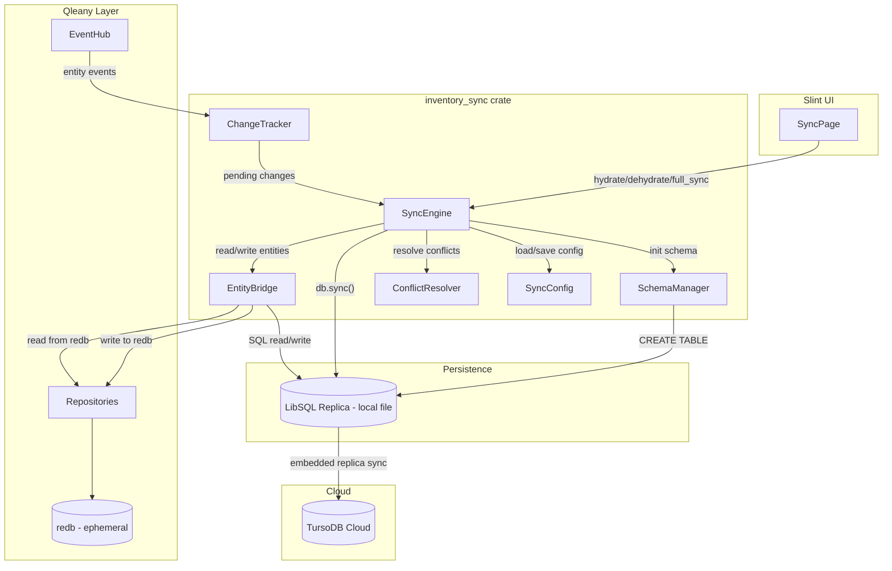
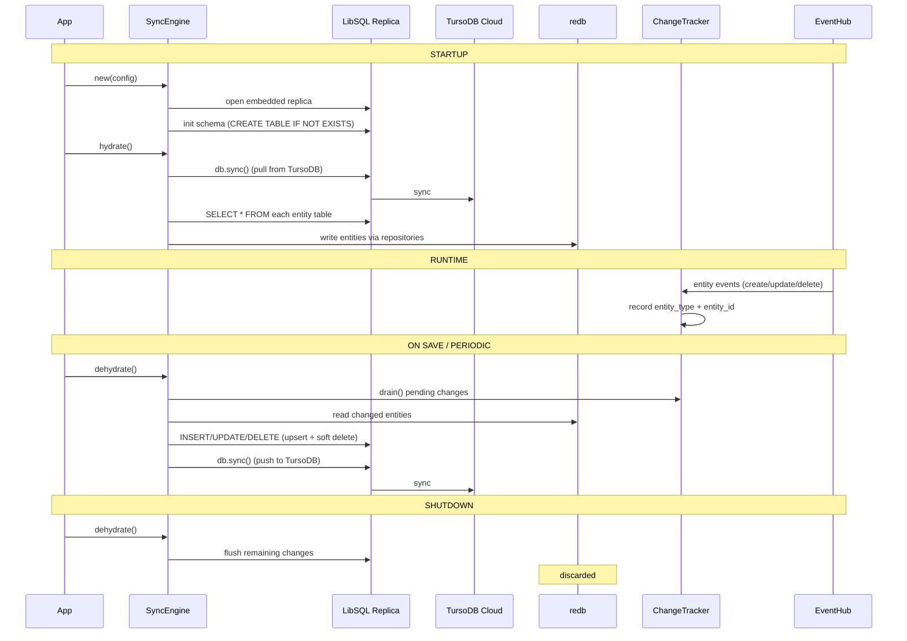

# Design Document: Data Sync

## Overview

This design covers the `inventory_sync` crate — a standalone Rust crate that bridges Qleany's internal redb database with TursoDB Cloud via LibSQL embedded replicas. The crate is not a Qleany feature; it directly accesses redb and LibSQL, providing online/offline capability with configurable sync strategies.

The architecture uses a two-database model: redb serves as Qleany's fast ephemeral runtime cache (supporting undo/redo), while a LibSQL embedded replica acts as the persistent local database that syncs bidirectionally with TursoDB Cloud. The sync crate manages the data flow between these two databases through hydration (LibSQL → redb), dehydration (redb → LibSQL), and remote sync (LibSQL ↔ TursoDB Cloud).

Key design decisions:
- LibSQL embedded replica handles the complexity of bidirectional cloud sync — we only bridge redb ↔ LibSQL
- Change tracking via Qleany EventHub subscription enables incremental dehydration (delta only)
- Soft deletes with `deleted_at` tombstones ensure deletions propagate correctly across sync
- Conflict resolution is strategy-based and configurable per sync operation
- The crate is async (tokio) since LibSQL and network operations are inherently async

## Architecture



### Lifecycle Flow



## Components and Interfaces

### SyncEngine (`engine.rs`)

The central orchestrator for all sync operations.

```rust
pub struct SyncEngine {
    config: RwLock<SyncConfig>,
    db: libsql::Database,
    conn: libsql::Connection,
    change_tracker: Arc<ChangeTracker>,
    auto_sync_handle: Mutex<Option<tokio::task::JoinHandle<()>>>,
}

impl SyncEngine {
    /// Open embedded replica, init schema, subscribe to EventHub.
    pub async fn new(config: SyncConfig, event_hub: &EventHub) -> Result<Self, SyncError>;

    /// Startup: sync remote → local replica, then load all entities into redb.
    pub async fn hydrate(&self, db_context: &DbContext) -> Result<HydrateResult, SyncError>;

    /// Save: flush changed entities from redb → LibSQL, then sync to remote.
    pub async fn dehydrate(&self, db_context: &DbContext) -> Result<DehydrateResult, SyncError>;

    /// Manual sync: push + pull with conflict resolution.
    pub async fn full_sync(
        &self,
        db_context: &DbContext,
        strategy: SyncStrategy,
    ) -> Result<SyncResult, SyncError>;

    /// Check TursoDB Cloud connectivity.
    pub async fn is_online(&self) -> bool;

    /// Update and persist configuration.
    pub async fn configure(&self, config: SyncConfig) -> Result<(), SyncError>;

    /// Start auto-sync timer if enabled.
    async fn start_auto_sync(&self, db_context: Arc<DbContext>);

    /// Stop auto-sync timer.
    async fn stop_auto_sync(&self);
}
```

### ChangeTracker (`tracker.rs`)

Subscribes to Qleany's EventHub and records pending changes.

```rust
pub struct ChangeTracker {
    pending: Mutex<HashMap<String, HashSet<u32>>>,
}

impl ChangeTracker {
    pub fn new() -> Self;

    /// Called when Qleany emits an entity event (create/update/delete).
    pub fn on_entity_event(&self, entity_type: &str, entity_ids: &[u32]);

    /// Drain all pending changes, resetting internal state.
    pub fn drain(&self) -> HashMap<String, HashSet<u32>>;

    /// Get the total count of pending changes (for UI display).
    pub fn pending_count(&self) -> usize;
}
```

### ConflictResolver (`conflict.rs`)

Resolves conflicts between local and remote entity versions.

```rust
pub struct ConflictResolver;

impl ConflictResolver {
    /// Resolve a conflict between local and remote versions of an entity.
    /// Returns the winning version.
    pub fn resolve(
        strategy: &SyncStrategy,
        local: &EntityRow,
        remote: &EntityRow,
    ) -> ResolvedEntity;
}

pub enum ResolvedEntity {
    KeepLocal(EntityRow),
    KeepRemote(EntityRow),
}
```

### EntityBridge (`bridge.rs`)

Converts entities between redb structs and LibSQL rows.

```rust
pub trait EntityBridge {
    type Entity;

    /// Convert a Qleany entity to LibSQL column values.
    fn to_row(entity: &Self::Entity) -> Result<Vec<libsql::Value>, SyncError>;

    /// Convert a LibSQL row to a Qleany entity.
    fn from_row(row: &libsql::Row) -> Result<Self::Entity, SyncError>;

    /// Table name in LibSQL.
    fn table_name() -> &'static str;

    /// Column definitions for CREATE TABLE.
    fn column_defs() -> &'static str;

    /// Generate an upsert SQL statement.
    fn upsert_sql() -> String;
}

// Implementations for each entity type:
pub struct ProductBridge;
pub struct CategoryBridge;
pub struct PersonBridge;
pub struct ContactBridge;
pub struct DealBridge;
pub struct LocationBridge;
pub struct UserBridge;
pub struct SessionBridge;
pub struct StockMovementBridge;
pub struct BudgetEntryBridge;
```

### SyncConfig (`config.rs`)

Configuration and persistence.

```rust
#[derive(Debug, Clone, Serialize, Deserialize)]
pub struct SyncConfig {
    pub turso_url: String,
    pub turso_auth_token: String,
    pub auto_sync_enabled: bool,
    pub sync_interval_seconds: u64,
    pub default_strategy: SyncStrategy,
}

#[derive(Debug, Clone, Copy, Serialize, Deserialize, PartialEq)]
pub enum SyncStrategy {
    Full,
    Incremental,
    ConflictResolveLocal,
    ConflictResolveRemote,
}

impl SyncConfig {
    pub fn default() -> Self;
    pub fn load(path: &Path) -> Result<Self, SyncError>;
    pub fn save(&self, path: &Path) -> Result<(), SyncError>;
}
```

### SchemaManager (`schema.rs`)

Handles LibSQL table creation.

```rust
pub struct SchemaManager;

impl SchemaManager {
    /// Execute CREATE TABLE IF NOT EXISTS for all entity tables + sync_metadata.
    pub async fn init_schema(conn: &libsql::Connection) -> Result<(), SyncError>;
}
```

### Result Types

```rust
#[derive(Debug, Clone)]
pub struct HydrateResult {
    pub entities_loaded: HashMap<String, usize>,
    pub was_online: bool,
}

#[derive(Debug, Clone)]
pub struct DehydrateResult {
    pub entities_written: HashMap<String, usize>,
    pub remote_sync_succeeded: bool,
}

#[derive(Debug, Clone)]
pub struct SyncResult {
    pub pushed: HashMap<String, usize>,
    pub pulled: HashMap<String, usize>,
    pub conflicts_resolved: usize,
    pub strategy_used: SyncStrategy,
}
```

### Error Types

```rust
#[derive(Debug, thiserror::Error)]
pub enum SyncError {
    #[error("LibSQL error: {0}")]
    LibSql(#[from] libsql::Error),

    #[error("Connection failed: {0}")]
    ConnectionFailed(String),

    #[error("Schema initialization failed: {0}")]
    SchemaInit(String),

    #[error("Entity serialization error: {entity_type} id={entity_id}: {message}")]
    Serialization {
        entity_type: String,
        entity_id: u32,
        message: String,
    },

    #[error("Config error: {0}")]
    Config(String),

    #[error("Redb access error: {0}")]
    RedbAccess(String),

    #[error("Access denied: {0}")]
    AccessDenied(String),

    #[error("Sync offline: remote unreachable")]
    Offline,
}
```

## Data Models

### LibSQL Entity Tables

All entity tables follow the same pattern, mirroring Qleany entity fields with sync-specific additions.

#### Products Table

```sql
CREATE TABLE IF NOT EXISTS products (
    id INTEGER PRIMARY KEY,
    name TEXT NOT NULL,
    reference TEXT,
    description TEXT,
    quantity INTEGER DEFAULT 0,
    price_unit REAL DEFAULT 0.0,
    status TEXT DEFAULT 'Available',
    category_id INTEGER,
    supplier_id INTEGER,
    location_id INTEGER,
    created_at TEXT NOT NULL,
    updated_at TEXT NOT NULL,
    deleted_at TEXT
);
```

#### Categories Table

```sql
CREATE TABLE IF NOT EXISTS categories (
    id INTEGER PRIMARY KEY,
    name TEXT NOT NULL,
    description TEXT,
    parent_category_id INTEGER,
    created_at TEXT NOT NULL,
    updated_at TEXT NOT NULL,
    deleted_at TEXT
);
```

#### Persons Table

```sql
CREATE TABLE IF NOT EXISTS persons (
    id INTEGER PRIMARY KEY,
    name TEXT NOT NULL,
    role TEXT NOT NULL,
    contact_id INTEGER,
    created_at TEXT NOT NULL,
    updated_at TEXT NOT NULL,
    deleted_at TEXT
);
```

#### Contacts Table

```sql
CREATE TABLE IF NOT EXISTS contacts (
    id INTEGER PRIMARY KEY,
    phone TEXT,
    email TEXT,
    created_at TEXT NOT NULL,
    updated_at TEXT NOT NULL,
    deleted_at TEXT
);
```

#### Deals Table

```sql
CREATE TABLE IF NOT EXISTS deals (
    id INTEGER PRIMARY KEY,
    title TEXT NOT NULL,
    description TEXT,
    unit_cost REAL DEFAULT 0.0,
    total_value REAL DEFAULT 0.0,
    start_date TEXT,
    end_date TEXT,
    frequency TEXT DEFAULT 'OneTime',
    status TEXT DEFAULT 'Draft',
    product_id INTEGER,
    supplier_id INTEGER,
    manager_id INTEGER,
    created_at TEXT NOT NULL,
    updated_at TEXT NOT NULL,
    deleted_at TEXT
);
```

#### Locations Table

```sql
CREATE TABLE IF NOT EXISTS locations (
    id INTEGER PRIMARY KEY,
    name TEXT NOT NULL,
    address TEXT,
    latitude REAL DEFAULT 0.0,
    longitude REAL DEFAULT 0.0,
    capacity INTEGER DEFAULT 0,
    created_at TEXT NOT NULL,
    updated_at TEXT NOT NULL,
    deleted_at TEXT
);
```

#### Users Table

```sql
CREATE TABLE IF NOT EXISTS users (
    id INTEGER PRIMARY KEY,
    username TEXT NOT NULL,
    password_hash TEXT NOT NULL,
    display_name TEXT,
    role TEXT NOT NULL,
    is_active INTEGER DEFAULT 1,
    person_id INTEGER,
    created_at TEXT NOT NULL,
    updated_at TEXT NOT NULL,
    deleted_at TEXT
);
```

#### Sessions Table

```sql
CREATE TABLE IF NOT EXISTS sessions (
    id INTEGER PRIMARY KEY,
    token TEXT NOT NULL,
    expires_at TEXT NOT NULL,
    created_at TEXT NOT NULL,
    updated_at TEXT NOT NULL,
    deleted_at TEXT
);
```

#### StockMovements Table

```sql
CREATE TABLE IF NOT EXISTS stock_movements (
    id INTEGER PRIMARY KEY,
    movement_type TEXT NOT NULL,
    quantity INTEGER NOT NULL,
    note TEXT,
    product_id INTEGER,
    from_location_id INTEGER,
    to_location_id INTEGER,
    performed_by_id INTEGER,
    created_at TEXT NOT NULL,
    updated_at TEXT NOT NULL,
    deleted_at TEXT
);
```

#### BudgetEntries Table

```sql
CREATE TABLE IF NOT EXISTS budget_entries (
    id INTEGER PRIMARY KEY,
    entry_type TEXT NOT NULL,
    amount REAL NOT NULL,
    description TEXT,
    entry_date TEXT,
    product_id INTEGER,
    deal_id INTEGER,
    recorded_by_id INTEGER,
    created_at TEXT NOT NULL,
    updated_at TEXT NOT NULL,
    deleted_at TEXT
);
```

#### Sync Metadata Table

```sql
CREATE TABLE IF NOT EXISTS sync_metadata (
    entity_type TEXT PRIMARY KEY,
    last_push_at TEXT,
    last_pull_at TEXT,
    last_push_count INTEGER DEFAULT 0,
    last_pull_count INTEGER DEFAULT 0
);
```

### EntityRow (Generic Row Representation)

Used internally for conflict resolution — a generic representation of any entity row.

```rust
#[derive(Debug, Clone)]
pub struct EntityRow {
    pub entity_type: String,
    pub id: u32,
    pub data: serde_json::Value,
    pub created_at: chrono::NaiveDateTime,
    pub updated_at: chrono::NaiveDateTime,
    pub deleted_at: Option<chrono::NaiveDateTime>,
}
```

### SyncConfig File Format

Persisted as JSON at a configurable path (default: `sync_config.json` next to the app binary).

```json
{
    "turso_url": "libsql://mydb-myorg.turso.io",
    "turso_auth_token": "eyJ...",
    "auto_sync_enabled": false,
    "sync_interval_seconds": 300,
    "default_strategy": "Incremental"
}
```

### Crate Structure

```
crates/inventory_sync/
├── Cargo.toml
└── src/
    ├── lib.rs           # Public API re-exports
    ├── engine.rs        # SyncEngine
    ├── config.rs        # SyncConfig, SyncStrategy, file I/O
    ├── tracker.rs       # ChangeTracker
    ├── conflict.rs      # ConflictResolver
    ├── schema.rs        # SchemaManager (CREATE TABLE statements)
    ├── bridge.rs        # EntityBridge trait + implementations
    ├── error.rs         # SyncError
    └── types.rs         # HydrateResult, DehydrateResult, SyncResult, EntityRow
```

### Dependencies

```toml
[dependencies]
libsql = "0.6"
serde = { version = "1", features = ["derive"] }
serde_json = "1"
chrono = { version = "0.4", features = ["serde"] }
anyhow = "1"
thiserror = "2"
tokio = { version = "1", features = ["rt-multi-thread", "time", "sync"] }
uuid = { version = "1", features = ["v4"] }

[dev-dependencies]
proptest = "1"
tokio-test = "0.4"
```

## Correctness Properties

*A property is a characteristic or behavior that should hold true across all valid executions of a system — essentially, a formal statement about what the system should do. Properties serve as the bridge between human-readable specifications and machine-verifiable correctness guarantees.*

### Property 1: Entity bridge round-trip

*For any* valid Qleany entity instance (Product, Category, Person, Contact, Deal, Location, User, Session, StockMovement, or BudgetEntry) — including entities with None optional fields, all enum variants, and various datetime values — converting with `to_row` then `from_row` SHALL produce an entity equivalent to the original.

**Validates: Requirements 9.1, 9.2, 9.3, 9.4, 9.5, 9.6**

### Property 2: SyncConfig round-trip

*For any* valid SyncConfig (with any combination of turso_url, turso_auth_token, auto_sync_enabled, sync_interval_seconds, and SyncStrategy variant), saving to a file with `save` then loading with `load` SHALL produce a SyncConfig equivalent to the original.

**Validates: Requirements 6.2, 6.5**

### Property 3: ChangeTracker records events with set semantics and drains correctly

*For any* sequence of entity events (with arbitrary entity types and entity IDs, including duplicates), the ChangeTracker SHALL contain exactly the unique set of entity IDs per entity type. After draining, the ChangeTracker SHALL return all recorded entries and its pending count SHALL be zero.

**Validates: Requirements 7.1, 7.3, 7.4, 3.7**

### Property 4: Hydrate loads non-deleted entities preserving field values

*For any* set of entities in LibSQL (some with `deleted_at` set, some with `deleted_at` NULL), hydrate SHALL load into redb only those entities where `deleted_at` is NULL, the returned HydrateResult counts SHALL match the number of non-deleted entities per type, and each loaded entity's field values (including `created_at` and `updated_at`) SHALL be identical to the LibSQL source.

**Validates: Requirements 2.3, 2.4, 2.5**

### Property 5: Dehydrate writes all tracked changes including soft deletes

*For any* set of entities tracked by the ChangeTracker (creates, updates, and deletes), dehydrate SHALL write all tracked entities to LibSQL. For created/updated entities, the LibSQL row SHALL contain the entity's current field values with `updated_at` reflecting the dehydrate time. For deleted entities, the LibSQL row SHALL have `deleted_at` set to a non-NULL timestamp. The returned DehydrateResult counts SHALL match the number of entities written per type.

**Validates: Requirements 3.1, 3.2, 3.3, 3.6**

### Property 6: Conflict resolution follows configured strategy

*For any* pair of local and remote EntityRow versions of the same entity and *for any* SyncStrategy: ConflictResolveLocal SHALL keep the local version, ConflictResolveRemote SHALL keep the remote version, and Full/Incremental SHALL keep the version with the later `updated_at` timestamp.

**Validates: Requirements 4.3, 4.4, 4.5, 4.6**

### Property 7: Incremental sync filters by last sync timestamp

*For any* set of entities with various `updated_at` timestamps and *for any* last sync timestamp recorded in Sync_Metadata, incremental sync SHALL only process entities whose `updated_at` is strictly later than the last sync timestamp.

**Validates: Requirements 4.9, 8.4**

### Property 8: Sync metadata updated after sync operations

*For any* successful dehydrate or hydrate operation that processes entities of a given type, the corresponding Sync_Metadata row SHALL have its timestamp updated to a value no earlier than the operation start time, and its count SHALL match the number of entities processed.

**Validates: Requirements 8.2, 8.3**

### Property 9: RBAC enforcement for sync operations

*For any* user with a given UserRole, sync trigger operations (push/pull) SHALL succeed if and only if the user has the `sync:trigger` permission (Admin or Manager), and sync configuration operations SHALL succeed if and only if the user is Admin. All other roles SHALL receive an AccessDenied error.

**Validates: Requirements 12.1, 12.2, 12.3, 12.4**

### Property 10: Invalid config produces error without panic

*For any* malformed TursoDB URL or auth token string, constructing a SyncEngine SHALL return a SyncError::ConnectionFailed rather than panicking.

**Validates: Requirements 1.2**

## Error Handling

### SyncError Variants and Handling Strategy

| Error | Trigger | User-Facing Message |
|-------|---------|---------------------|
| `LibSql` | LibSQL driver errors (query failures, connection drops) | "Database error: {details}" |
| `ConnectionFailed` | Invalid TursoDB URL/token, network failure during init | "Connection failed: {details}" |
| `SchemaInit` | CREATE TABLE failures | "Schema initialization failed: {details}" |
| `Serialization` | Entity ↔ row conversion failures (type mismatch, missing fields) | "Sync error for {entity_type} #{id}: {message}" |
| `Config` | Config file read/write/parse failures | "Configuration error: {details}" |
| `RedbAccess` | Failures reading/writing redb via Qleany repositories | "Database access error: {details}" |
| `AccessDenied` | RBAC check failure (insufficient role/permission) | "Access denied: {details}" |
| `Offline` | TursoDB Cloud unreachable (non-fatal in most contexts) | "Remote server unreachable — working offline" |

### Error Propagation Strategy

- All `SyncEngine` public methods return `Result<T, SyncError>`
- `Offline` errors during hydrate/dehydrate are non-fatal: the operation completes locally and reports `was_online: false` or `remote_sync_succeeded: false` in the result
- `Offline` errors during `is_online()` are swallowed — the method returns `false`
- `LibSql` and `Serialization` errors during hydrate/dehydrate are fatal for that operation — the error propagates to the caller
- `AccessDenied` errors are returned immediately before any sync work begins
- The Slint UI catches `SyncError` and displays the user-facing message on the SyncPage
- Auto-sync timer catches errors and logs them without stopping the timer

### Offline Graceful Degradation

The sync crate treats offline as a normal operating mode, not an error:
1. `hydrate()` — uses local LibSQL data, sets `was_online: false`
2. `dehydrate()` — writes to local LibSQL, sets `remote_sync_succeeded: false`
3. `full_sync()` — returns `Offline` error (requires connectivity)
4. `is_online()` — returns `false`
5. Auto-sync — skips remote push, logs "offline, will retry"

## Testing Strategy

### Property-Based Testing

Library: `proptest` (Rust's standard property-based testing crate)

Each correctness property (Properties 1–10) maps to a single `proptest!` test. Tests run with a minimum of 100 iterations.

Tag format: `// Feature: data-sync, Property N: <title>`

Generator strategies:
- **Entities**: Custom `Arbitrary` implementations for each entity type, generating random field values including edge cases (None optionals, all enum variants, boundary datetimes)
- **SyncConfig**: Random URLs (`"libsql://[a-z]{3,10}-[a-z]{3,10}\\.turso\\.io"`), random tokens, random bools, random intervals (0–3600), random strategies
- **Entity events**: Random entity type names from the known set, random u32 IDs, random event sequences with controlled duplicates
- **EntityRow pairs**: Random local/remote pairs with varying `updated_at` timestamps for conflict resolution testing
- **UserRoles**: `prop_oneof![Just(Admin), Just(Manager), Just(Operator), Just(Viewer)]`

### Unit Testing

Unit tests complement property tests for specific examples and edge cases:

- Schema initialization creates all 11 tables (10 entities + sync_metadata) (Requirement 10.1)
- Hydrate with offline TursoDB proceeds with local data (Requirement 2.2)
- Dehydrate with offline TursoDB completes local write (Requirement 3.5)
- Default SyncConfig values when no config file exists (Requirement 6.6)
- `is_online()` returns false when TursoDB unreachable (Requirement 5.2)
- Full sync returns SyncResult with correct counts (Requirement 4.8)
- Schema includes `deleted_at` column on all entity tables (Requirement 10.2)

### Test Organization

```
crates/inventory_sync/tests/
├── bridge_tests.rs          # Property 1 (entity round-trip)
├── config_tests.rs          # Property 2 (config round-trip) + unit tests for defaults
├── tracker_tests.rs         # Property 3 (change tracker)
├── hydrate_tests.rs         # Property 4 (hydrate) + offline edge case
├── dehydrate_tests.rs       # Property 5 (dehydrate) + offline edge case
├── conflict_tests.rs        # Property 6 (conflict resolution)
├── incremental_tests.rs     # Property 7 (incremental filtering)
├── metadata_tests.rs        # Property 8 (sync metadata)
├── rbac_tests.rs            # Property 9 (RBAC enforcement)
├── init_tests.rs            # Property 10 (invalid config) + schema unit tests
```

### Test Infrastructure

- Use in-memory LibSQL (`:memory:`) for all tests — no TursoDB Cloud dependency
- Mock `DbContext` with in-memory redb for hydrate/dehydrate tests
- Mock `EventHub` for ChangeTracker subscription tests
- Mock `SecurityContext` for RBAC tests
- Use `tempfile` crate for config file round-trip tests

### Dependencies

```toml
[dev-dependencies]
proptest = "1"
tokio-test = "0.4"
tempfile = "3"
```
