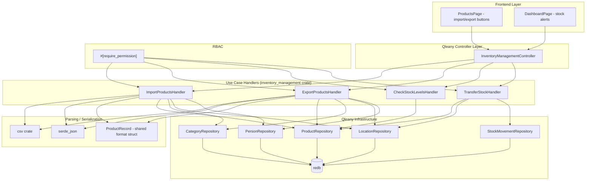

# Design Document: Inventory Management

## Overview

This design covers the four custom use cases in the `inventory_management` feature group: `import_products`, `export_products`, `check_stock_levels`, and `transfer_stock`. These use cases are implemented as Qleany feature handlers in the `inventory_management` crate, layered on top of Qleany-generated CRUD infrastructure for Product, Category, Location, and Person entities.

The import handler parses CSV (via the `csv` crate) or JSON (via `serde_json`) files and creates Product entities with resolved foreign-key relationships. The export handler serializes Products with denormalized relationship names. The stock checker performs a threshold query across all products. The transfer handler atomically moves quantity between locations with undo support and StockMovement audit logging.

All four use cases are gated by RBAC via `#[require_permission]` proc macros from `inventory_security_macros`.

## Architecture



## Components and Interfaces

### Shared Format Struct: `ProductRecord`

A flat, denormalized representation used for both import and export. This is the bridge between file formats and the entity model.

```rust
use serde::{Deserialize, Serialize};

/// Flat record for CSV/JSON import and export.
/// Field names match the CSV header and JSON keys.
#[derive(Debug, Clone, Serialize, Deserialize)]
pub struct ProductRecord {
    pub name: String,
    pub reference: String,
    pub description: String,
    pub quantity: i32,
    pub price_unit: f64,
    pub status: String,           // "Available", "OutOfStock", "Discontinued", "Reserved"
    pub category_name: String,    // empty string if none
    pub supplier_name: String,    // empty string if none
    pub location_name: String,    // empty string if none
}
```

### Module: `parse` — File Parsing

```rust
/// Parse a CSV file into ProductRecords.
/// Returns an error if the file is unreadable or structurally malformed.
pub fn parse_csv(file_path: &str) -> Result<Vec<ProductRecord>, ImportError>;

/// Parse a JSON file (array of objects) into ProductRecords.
/// Returns an error if the file is unreadable or not valid JSON.
pub fn parse_json(file_path: &str) -> Result<Vec<ProductRecord>, ImportError>;
```

### Module: `serialize` — File Writing

```rust
/// Write ProductRecords to a CSV file with header row.
pub fn write_csv(records: &[ProductRecord], output_path: &str) -> Result<(), ExportError>;

/// Write ProductRecords to a JSON file as an array of objects.
pub fn write_json(records: &[ProductRecord], output_path: &str) -> Result<(), ExportError>;
```

### Module: `resolve` — Relationship Resolution

```rust
/// Resolve a category name to a Category ID.
/// Returns None if the name is empty, Err if non-empty but not found.
pub fn resolve_category(
    db_context: &DbContext,
    category_name: &str,
) -> Result<Option<u32>, ImportError>;

/// Resolve a supplier name to a Person ID (must have role Supplier).
/// Returns None if the name is empty, Err if non-empty but not found.
pub fn resolve_supplier(
    db_context: &DbContext,
    supplier_name: &str,
) -> Result<Option<u32>, ImportError>;

/// Resolve a location name to a Location ID.
/// Returns None if the name is empty, Err if non-empty but not found.
pub fn resolve_location(
    db_context: &DbContext,
    location_name: &str,
) -> Result<Option<u32>, ImportError>;
```

### Handler: `ImportProductsHandler`

```rust
#[require_permission("import:*")]
pub fn execute(
    &mut self,
    dto: &ImportProductsDto,
    progress: &dyn ProgressReporter,
) -> Result<ImportProductsReturnDto, InventoryError> {
    // 1. Parse file based on format (Csv → parse_csv, Json → parse_json)
    // 2. For each record:
    //    a. Validate required fields (name, reference)
    //    b. Parse status enum
    //    c. Resolve category, supplier, location names to IDs
    //    d. On success: create Product entity, increment imported_count
    //    e. On failure: increment skipped_count, push error message
    //    f. Report progress percentage
    // 3. Return ImportProductsReturnDto
}
```

### Handler: `ExportProductsHandler`

```rust
#[require_permission("export:*")]
pub fn execute(
    &mut self,
    dto: &ExportProductsDto,
) -> Result<ExportProductsReturnDto, InventoryError> {
    // 1. Load all Products with their Category, Location, supplier Person
    // 2. Map each to ProductRecord (empty string for missing relationships)
    // 3. Write based on format (Csv → write_csv, Json → write_json)
    // 4. Return ExportProductsReturnDto { exported_count }
}
```

### Handler: `CheckStockLevelsHandler`

```rust
#[require_permission("product:read")]
pub fn execute(
    &mut self,
    dto: &CheckStockLevelsDto,
) -> Result<StockAlertDto, InventoryError> {
    // 1. If threshold <= 0, return empty arrays
    // 2. Load all Products
    // 3. Filter where product.quantity < threshold
    // 4. Build parallel arrays: product_id, product_names, quantities
    // 5. Return StockAlertDto
}
```

### Handler: `TransferStockHandler`

```rust
#[require_permission("stock:*")]
pub fn execute(
    &mut self,
    dto: &TransferStockDto,
) -> Result<TransferStockReturnDto, InventoryError> {
    // 1. Validate: quantity > 0, from != to
    // 2. Load Product, source Location, dest Location (error if not found)
    // 3. Check source has sufficient quantity
    // 4. Snapshot current state (Qleany undo support)
    // 5. Decrease source quantity, increase dest quantity
    // 6. Update Product entity
    // 7. Record StockMovement { Transfer, quantity, product, from, to, user }
    // 8. Return TransferStockReturnDto { success: true, new quantities }
}
```

## Data Models

### DTOs (Qleany-generated from manifest)

```rust
// Input DTOs
pub struct ImportProductsDto {
    pub file_path: String,
    pub format: ImportFormat,
}

pub struct ExportProductsDto {
    pub output_path: String,
    pub format: ExportFormat,
}

pub struct CheckStockLevelsDto {
    pub threshold: i32,
}

pub struct TransferStockDto {
    pub product_id: i32,
    pub from_location_id: i32,
    pub to_location_id: i32,
    pub quantity: i32,
}

// Output DTOs
pub struct ImportProductsReturnDto {
    pub imported_count: i32,
    pub skipped_count: i32,
    pub error_messages: Vec<String>,
}

pub struct ExportProductsReturnDto {
    pub exported_count: i32,
}

pub struct StockAlertDto {
    pub product_id: Vec<i32>,
    pub product_names: Vec<String>,
    pub quantities: Vec<i32>,
}

pub struct TransferStockReturnDto {
    pub success: bool,
    pub new_quantity_at_source: i32,
    pub new_quantity_at_dest: i32,
}
```

### Enums

```rust
pub enum ImportFormat { Csv, Json }
pub enum ExportFormat { Csv, Json }

// From Qleany entity definition
pub enum ProductStatus {
    Available,
    OutOfStock,
    Discontinued,
    Reserved,
}
```

### ProductRecord (shared import/export format)

| Field | Type | CSV Column | JSON Key | Notes |
|-------|------|-----------|----------|-------|
| name | String | name | name | Required for import |
| reference | String | reference | reference | Required for import |
| description | String | description | description | Optional, defaults to empty |
| quantity | i32 | quantity | quantity | Defaults to 0 |
| price_unit | f64 | price_unit | price_unit | Defaults to 0.0 |
| status | String | status | status | Must be valid ProductStatus |
| category_name | String | category_name | category_name | Resolved to Category ID |
| supplier_name | String | supplier_name | supplier_name | Resolved to Person ID |
| location_name | String | location_name | location_name | Resolved to Location ID |

### StockMovement (for transfer audit)

| Field | Type | Description |
|-------|------|-------------|
| id | u32 | Primary key |
| movement_type | MovementType | Always `Transfer` for this use case |
| quantity | i32 | Amount transferred |
| product | Product | The transferred product |
| from_location | Location | Source location |
| to_location | Location | Destination location |
| performed_by | User | The user who initiated the transfer |
| created_at | DateTime | When the transfer occurred |

### Error Types

```rust
#[derive(Debug, thiserror::Error)]
pub enum ImportError {
    #[error("File not found: {path}")]
    FileNotFound { path: String },
    #[error("File not readable: {path}")]
    FileNotReadable { path: String },
    #[error("Malformed CSV: {details}")]
    MalformedCsv { details: String },
    #[error("Invalid JSON: {details}")]
    InvalidJson { details: String },
    #[error("Row {row}: missing required field '{field}'")]
    MissingField { row: usize, field: String },
    #[error("Row {row}: unknown category '{name}'")]
    UnknownCategory { row: usize, name: String },
    #[error("Row {row}: unknown supplier '{name}'")]
    UnknownSupplier { row: usize, name: String },
    #[error("Row {row}: unknown location '{name}'")]
    UnknownLocation { row: usize, name: String },
    #[error("Row {row}: invalid status '{value}'")]
    InvalidStatus { row: usize, value: String },
}

#[derive(Debug, thiserror::Error)]
pub enum ExportError {
    #[error("Output path not writable: {path}")]
    NotWritable { path: String },
    #[error("Serialization error: {details}")]
    SerializationError { details: String },
}

#[derive(Debug, thiserror::Error)]
pub enum TransferError {
    #[error("Product not found: {id}")]
    ProductNotFound { id: i32 },
    #[error("Location not found: {id}")]
    LocationNotFound { id: i32 },
    #[error("Insufficient stock: available {available}, requested {requested}")]
    InsufficientStock { available: i32, requested: i32 },
    #[error("Transfer quantity must be positive")]
    InvalidQuantity,
    #[error("Source and destination locations must differ")]
    SameLocation,
}

/// Top-level error wrapping all inventory management errors.
#[derive(Debug, thiserror::Error)]
pub enum InventoryError {
    #[error(transparent)]
    Import(#[from] ImportError),
    #[error(transparent)]
    Export(#[from] ExportError),
    #[error(transparent)]
    Transfer(#[from] TransferError),
    #[error(transparent)]
    Auth(#[from] AuthError),
    #[error("Internal error: {0}")]
    Internal(String),
}
```


## Correctness Properties

*A property is a characteristic or behavior that should hold true across all valid executions of a system — essentially, a formal statement about what the system should do. Properties serve as the bridge between human-readable specifications and machine-verifiable correctness guarantees.*

### Property 1: Import/Export round-trip (CSV)

*For any* set of Product entities with valid Category, Location, and supplier associations, exporting to CSV and then importing from the resulting CSV file SHALL produce Product entities with equivalent name, reference, description, quantity, price_unit, status, category, supplier, and location values.

**Validates: Requirements 1.1, 1.4, 1.6, 1.8, 2.1, 3.1, 3.2, 3.3**

### Property 2: Import/Export round-trip (JSON)

*For any* set of Product entities with valid Category, Location, and supplier associations, exporting to JSON and then importing from the resulting JSON file SHALL produce Product entities with equivalent name, reference, description, quantity, price_unit, status, category, supplier, and location values.

**Validates: Requirements 1.2, 1.4, 1.6, 1.8, 2.2, 3.1, 3.2, 3.3**

### Property 3: Import count invariant

*For any* import file containing a mix of valid and invalid rows, the Import_Handler SHALL return imported_count + skipped_count equal to the total number of rows, and error_messages length equal to skipped_count.

**Validates: Requirements 1.3**

### Property 4: Unknown reference causes skip

*For any* import row containing a non-empty category_name, supplier_name, or location_name that does not match any existing entity, the Import_Handler SHALL skip that row, increment skipped_count, and include a descriptive error message.

**Validates: Requirements 1.5, 1.7, 1.9**

### Property 5: Missing required fields causes skip

*For any* import row where name or reference is empty, the Import_Handler SHALL skip that row, increment skipped_count, and include an error message identifying the missing field.

**Validates: Requirements 1.10**

### Property 6: Invalid status causes skip

*For any* import row where the status field is not one of "Available", "OutOfStock", "Discontinued", or "Reserved", the Import_Handler SHALL skip that row, increment skipped_count, and include an error message.

**Validates: Requirements 7.5**

### Property 7: Export count matches product count

*For any* set of Product entities in the database, the Export_Handler SHALL return an exported_count equal to the total number of Product entities.

**Validates: Requirements 2.3**

### Property 8: Stock check filter correctness

*For any* set of Product entities and *for any* positive threshold value, the Stock_Checker SHALL return exactly those Products whose quantity is strictly less than the threshold, with correctly aligned parallel arrays (product_id[i], product_names[i], quantities[i] all refer to the same Product).

**Validates: Requirements 4.1, 4.2**

### Property 9: Transfer quantity conservation

*For any* Product at a source Location with quantity >= transfer amount, and *for any* distinct destination Location, executing a transfer SHALL preserve the total quantity across both locations (source_before + dest_before == source_after + dest_after), and the returned new_quantity_at_source and new_quantity_at_dest SHALL match the actual post-transfer quantities.

**Validates: Requirements 5.1, 5.2**

### Property 10: Transfer rejects insufficient stock

*For any* transfer request where the requested quantity exceeds the available quantity at the source location, the Transfer_Handler SHALL return an InsufficientStock error and leave all quantities unchanged.

**Validates: Requirements 5.3**

### Property 11: Transfer creates audit StockMovement

*For any* successful transfer, the Transfer_Handler SHALL create a StockMovement entity with movement_type Transfer, the correct quantity, product, from_location, to_location, and performing user.

**Validates: Requirements 5.8**

### Property 12: Transfer undo restores quantities

*For any* successful transfer followed by an undo operation, the quantities at both the source and destination locations SHALL return to their pre-transfer values.

**Validates: Requirements 5.9**

## Error Handling

### Import Errors

| Error | Trigger | Behavior |
|-------|---------|----------|
| `FileNotFound` | File path does not exist | Return error, no products created |
| `FileNotReadable` | File exists but cannot be read | Return error, no products created |
| `MalformedCsv` | CSV structure is invalid (wrong delimiters, unclosed quotes) | Return error, no products created |
| `InvalidJson` | JSON is not valid or not an array of objects | Return error, no products created |
| `MissingField` | Row lacks name or reference | Skip row, add to error_messages |
| `UnknownCategory` | Category name not found in DB | Skip row, add to error_messages |
| `UnknownSupplier` | Supplier name not found or not role Supplier | Skip row, add to error_messages |
| `UnknownLocation` | Location name not found in DB | Skip row, add to error_messages |
| `InvalidStatus` | Status string not a valid ProductStatus | Skip row, add to error_messages |

File-level errors (FileNotFound, MalformedCsv, InvalidJson) abort the entire import. Row-level errors skip individual rows and continue processing.

### Export Errors

| Error | Trigger | Behavior |
|-------|---------|----------|
| `NotWritable` | Output path cannot be written to | Return error, no file created |
| `SerializationError` | Unexpected serialization failure | Return error, no partial file |

The export handler opens the file for writing first, and only writes after all records are serialized in memory, preventing partial file creation.

### Transfer Errors

| Error | Trigger | Behavior |
|-------|---------|----------|
| `ProductNotFound` | product_id doesn't exist | Return error, no changes |
| `LocationNotFound` | from or to location_id doesn't exist | Return error, no changes |
| `InsufficientStock` | Requested quantity > source quantity | Return error, no changes |
| `InvalidQuantity` | Quantity <= 0 | Return error, no changes |
| `SameLocation` | from_location_id == to_location_id | Return error, no changes |

All transfer validation happens before any mutations. If any check fails, the database state is unchanged.

### RBAC Errors

All four use cases are gated by `#[require_permission]`. If the SecurityContext lacks the required permission, an `AuthError::AccessDeniedPermission` is returned before the handler body executes.

## Testing Strategy

### Property-Based Testing

Library: `proptest` (Rust)

Each correctness property (Properties 1–12) maps to a single `proptest!` test. Tests run with a minimum of 100 iterations.

Tag format: `// Feature: inventory-management, Property N: <title>`

Generator strategies:
- **ProductRecord**: Generate random name (`"[a-zA-Z][a-zA-Z0-9 ]{1,30}"`), reference (`"REF-[A-Z0-9]{4,8}"`), description (arbitrary string), quantity (`0..10000i32`), price_unit (`0.01..9999.99f64`), status (one of the four valid enum values)
- **Category names**: Pick from a pre-seeded set of known categories in the test DB
- **Supplier names**: Pick from a pre-seeded set of known Persons with role Supplier
- **Location names**: Pick from a pre-seeded set of known Locations
- **Threshold**: `prop::num::i32::ANY` for stock check tests
- **Transfer quantity**: `1..=source_quantity` for valid transfers, `source_quantity+1..` for insufficient stock tests
- **Invalid records**: Generate records with empty name/reference, unknown category/supplier/location names, or invalid status strings

### Unit Testing

Unit tests complement property tests for specific examples and edge cases:

- Import with non-existent file path returns FileNotFound (Requirement 1.11)
- Import with malformed CSV content returns MalformedCsv (Requirement 1.12)
- Import with invalid JSON content returns InvalidJson (Requirement 1.12)
- Export with non-writable path returns NotWritable (Requirement 2.5)
- Export writes empty strings for products without relationships (Requirement 2.4)
- Stock check with threshold 0 returns empty arrays (Requirement 4.4)
- Stock check with negative threshold returns empty arrays (Requirement 4.4)
- Transfer with quantity 0 returns InvalidQuantity (Requirement 5.4)
- Transfer with negative quantity returns InvalidQuantity (Requirement 5.4)
- Transfer with same source and destination returns SameLocation (Requirement 5.5)
- Transfer with non-existent product returns ProductNotFound (Requirement 5.6)
- Transfer with non-existent location returns LocationNotFound (Requirement 5.7)
- CSV header order matches specification (Requirement 7.1)
- JSON export produces array of objects with correct keys (Requirement 7.3)
- RBAC rejects Operator/Viewer for import (Requirement 1.13)
- RBAC rejects Operator/Viewer for export (Requirement 2.6)
- RBAC allows all roles for check_stock_levels (Requirement 4.5)
- RBAC rejects Viewer for transfer_stock (Requirement 5.10)

### Test Organization

```
crates/inventory_management/tests/
├── import_tests.rs          # Properties 1, 3, 4, 5, 6 + unit tests for 1.11, 1.12
├── export_tests.rs          # Properties 2, 7 + unit tests for 2.4, 2.5
├── roundtrip_tests.rs       # Properties 1, 2 (round-trip focused)
├── stock_check_tests.rs     # Property 8 + unit tests for 4.3, 4.4
├── transfer_tests.rs        # Properties 9, 10, 11, 12 + unit tests for 5.4–5.7
├── rbac_tests.rs            # Unit tests for 1.13, 2.6, 4.5, 5.10
```

### Dependencies

```toml
[dev-dependencies]
proptest = "1"
tempfile = "3"    # For creating temporary import/export files in tests
```
