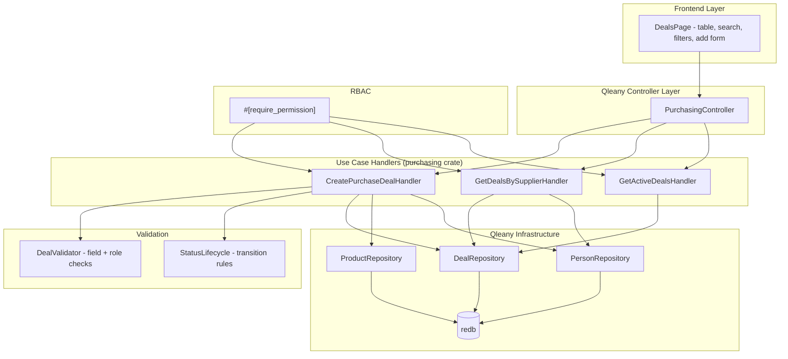

# Design Document: Purchasing

## Overview

This design covers the three use cases in the `purchasing` feature group: `create_purchase_deal`, `get_deals_by_supplier`, and `get_active_deals`. These use cases are implemented as Qleany feature handlers in the `purchasing` crate, layered on top of Qleany-generated CRUD infrastructure for Deal, Product, and Person entities.

The create handler validates input fields, enforces Person role constraints (supplier must have role Supplier, manager must have role Manager), enforces deal status lifecycle rules, creates the Deal entity with initial status Draft, and supports undo via Qleany's snapshot mechanism. The two query handlers filter deals by supplier relationship or by Active status respectively.

All use cases are gated by RBAC via proc macros from `inventory_security_macros`. Write operations require `deal:*` permission (Admin, Manager). Read operations require `deal:*` or `*:read` permission (Admin, Manager, Viewer).

The Slint UI DealsPage provides a table view with search, frequency/status filters, and an add-deal form gated by role.

## Architecture



## Components and Interfaces

### Module: `validate` — Deal Input Validation

```rust
use chrono::NaiveDateTime;

/// Validate all fields of a CreatePurchaseDealDto before entity creation.
/// Returns Ok(()) or the first validation error encountered.
pub fn validate_deal_input(
    title: &str,
    unit_cost: f64,
    total_value: f64,
    start_date: &NaiveDateTime,
    end_date: &NaiveDateTime,
) -> Result<(), PurchasingError>;

/// Verify that the Person referenced by supplier_id exists and has role Supplier.
pub fn validate_supplier(
    db_context: &DbContext,
    supplier_id: u32,
) -> Result<(), PurchasingError>;

/// Verify that the Person referenced by manager_id exists and has role Manager.
pub fn validate_manager(
    db_context: &DbContext,
    manager_id: u32,
) -> Result<(), PurchasingError>;

/// Verify that the Product referenced by product_id exists.
pub fn validate_product(
    db_context: &DbContext,
    product_id: u32,
) -> Result<(), PurchasingError>;
```

### Module: `lifecycle` — Deal Status Transitions

```rust
/// Allowed status transitions:
///   Draft   → Active, Cancelled
///   Active  → Completed, Cancelled
///   Completed → (none)
///   Cancelled → (none)
pub fn can_transition(from: DealStatus, to: DealStatus) -> bool;

/// Attempt a status transition. Returns error if the transition is not allowed.
pub fn transition_status(
    current: DealStatus,
    target: DealStatus,
) -> Result<DealStatus, PurchasingError>;
```

### Handler: `CreatePurchaseDealHandler`

```rust
#[require_permission("deal:*")]
pub fn execute(
    &mut self,
    dto: &CreatePurchaseDealDto,
) -> Result<CreatePurchaseDealReturnDto, PurchasingError> {
    // 1. Validate input fields (title non-empty, costs non-negative, dates valid)
    // 2. Validate product_id exists
    // 3. Validate supplier_id exists and Person.role == Supplier
    // 4. Validate manager_id exists and Person.role == Manager
    // 5. Snapshot current state (Qleany undo support)
    // 6. Create Deal entity with status = Draft, all fields from DTO
    // 7. Return CreatePurchaseDealReturnDto { deal_id }
}
```

### Handler: `GetDealsBySupplierHandler`

```rust
#[require_permission("deal:read")]
pub fn execute(
    &mut self,
    dto: &GetDealsBySupplierDto,
) -> Result<DealListDto, PurchasingError> {
    // 1. Validate supplier_id references an existing Person
    // 2. Query all Deal entities where deal.supplier.id == supplier_id
    // 3. Build parallel arrays: deal_ids, titles
    // 4. Return DealListDto
}
```

### Handler: `GetActiveDealsHandler`

```rust
#[require_permission("deal:read")]
pub fn execute(&mut self) -> Result<ActiveDealsDto, PurchasingError> {
    // 1. Query all Deal entities where deal.status == Active
    // 2. Build parallel arrays: deal_ids, titles, statuses
    // 3. Return ActiveDealsDto
}
```

### Slint UI: `DealsPage`

```
// ui/pages/deals_page.slint
// Table columns: title, supplier_name, product_name, status, frequency,
//                unit_cost, total_value, start_date, end_date
// Search: filters by title or supplier_name (case-insensitive)
// Filters: DealFrequency dropdown, DealStatus dropdown
// Add form: visible only for Admin/Manager roles
// Dropdowns: supplier (Person with role Supplier), product (Product entities)
```

## Data Models

### DTOs (Qleany-generated from manifest)

```rust
// Input DTOs
pub struct CreatePurchaseDealDto {
    pub title: String,
    pub description: String,
    pub product_id: i32,
    pub supplier_id: i32,
    pub manager_id: i32,
    pub unit_cost: f64,
    pub total_value: f64,
    pub frequency: DealFrequencyInput,
    pub start_date: NaiveDateTime,
    pub end_date: NaiveDateTime,
}

pub struct GetDealsBySupplierDto {
    pub supplier_id: i32,
}

// Output DTOs
pub struct CreatePurchaseDealReturnDto {
    pub deal_id: i32,
}

pub struct DealListDto {
    pub deal_ids: Vec<i32>,
    pub titles: Vec<String>,
}

pub struct ActiveDealsDto {
    pub deal_ids: Vec<i32>,
    pub titles: Vec<String>,
    pub statuses: Vec<String>,
}
```

### Enums

```rust
pub enum DealFrequency {
    OneTime,
    Weekly,
    Monthly,
    Quarterly,
    Yearly,
}

pub enum DealFrequencyInput {
    OneTime,
    Weekly,
    Monthly,
    Quarterly,
    Yearly,
}

pub enum DealStatus {
    Draft,
    Active,
    Completed,
    Cancelled,
}
```

### Deal Entity (from Qleany manifest)

| Field | Type | Description |
|-------|------|-------------|
| id | u32 | Primary key (from EntityBase) |
| created_at | DateTime | Creation timestamp (from EntityBase) |
| updated_at | DateTime | Last update timestamp (from EntityBase) |
| title | String | Deal title |
| description | String | Deal description |
| unit_cost | f64 | Cost per unit |
| total_value | f64 | Total deal value |
| start_date | DateTime | Deal start date |
| end_date | DateTime | Deal end date |
| frequency | DealFrequency | Recurrence frequency |
| status | DealStatus | Lifecycle status (Draft/Active/Completed/Cancelled) |
| product | Product (many_to_one) | The product being purchased |
| supplier | Person (many_to_one) | The supplier (must have role Supplier) |
| manager | Person (many_to_one) | The deal manager (must have role Manager) |

### Status Transition Matrix

| From \ To | Draft | Active | Completed | Cancelled |
|-----------|-------|--------|-----------|-----------|
| Draft | — | ✓ | ✗ | ✓ |
| Active | ✗ | — | ✓ | ✓ |
| Completed | ✗ | ✗ | — | ✗ |
| Cancelled | ✗ | ✗ | ✗ | — |

### Error Types

```rust
#[derive(Debug, thiserror::Error)]
pub enum PurchasingError {
    #[error("Product not found: {id}")]
    ProductNotFound { id: i32 },
    #[error("Supplier Person not found: {id}")]
    SupplierNotFound { id: i32 },
    #[error("Manager Person not found: {id}")]
    ManagerNotFound { id: i32 },
    #[error("Person {id} does not have role Supplier")]
    NotASupplier { id: i32 },
    #[error("Person {id} does not have role Manager")]
    NotAManager { id: i32 },
    #[error("Title is required")]
    EmptyTitle,
    #[error("unit_cost must be non-negative")]
    NegativeUnitCost,
    #[error("total_value must be non-negative")]
    NegativeTotalValue,
    #[error("end_date must not be earlier than start_date")]
    InvalidDateRange,
    #[error("Invalid status transition from {from:?} to {to:?}")]
    InvalidStatusTransition { from: DealStatus, to: DealStatus },
    #[error(transparent)]
    Auth(#[from] AuthError),
    #[error("Internal error: {0}")]
    Internal(String),
}
```


## Correctness Properties

*A property is a characteristic or behavior that should hold true across all valid executions of a system — essentially, a formal statement about what the system should do. Properties serve as the bridge between human-readable specifications and machine-verifiable correctness guarantees.*

### Property 1: Create deal field persistence round-trip

*For any* valid CreatePurchaseDealDto (non-empty title, non-negative costs, valid date range, existing product, valid supplier, valid manager), creating a deal and then reading it back SHALL produce a Deal entity whose title, description, product, supplier, manager, unit_cost, total_value, frequency, start_date, end_date match the input, and whose status is Draft.

**Validates: Requirements 1.1, 1.11, 4.1**

### Property 2: Person role validation rejects wrong roles

*For any* Person entity, if that Person's role is not Supplier and it is used as supplier_id in a CreatePurchaseDealDto, the Create_Deal_Handler SHALL reject the creation. Similarly, if a Person's role is not Manager and it is used as manager_id, the Create_Deal_Handler SHALL reject the creation.

**Validates: Requirements 1.2, 1.3**

### Property 3: Negative financial fields rejected

*For any* CreatePurchaseDealDto where unit_cost is negative or total_value is negative, the Create_Deal_Handler SHALL reject the creation and leave the database unchanged.

**Validates: Requirements 1.9, 1.10**

### Property 4: Invalid date range rejected

*For any* CreatePurchaseDealDto where end_date is strictly earlier than start_date, the Create_Deal_Handler SHALL reject the creation and leave the database unchanged.

**Validates: Requirements 1.8**

### Property 5: Deal creation undo removes deal

*For any* successfully created deal, undoing the creation via Qleany's undo mechanism SHALL result in the deal no longer existing in the database.

**Validates: Requirements 1.12**

### Property 6: Get deals by supplier returns only matching deals

*For any* set of Deal entities with various supplier relationships, and *for any* valid supplier_id, the Deals_By_Supplier_Handler SHALL return exactly those deals whose supplier matches the given supplier_id, with correctly aligned parallel arrays (deal_ids[i] and titles[i] refer to the same Deal).

**Validates: Requirements 2.1, 2.2**

### Property 7: Get active deals returns only Active deals

*For any* set of Deal entities with various statuses, the Active_Deals_Handler SHALL return exactly those deals whose status is Active, with correctly aligned parallel arrays (deal_ids[i], titles[i], statuses[i] refer to the same Deal, and all statuses[i] equal "Active").

**Validates: Requirements 3.1, 3.2**

### Property 8: Status transition correctness

*For any* DealStatus value and *for any* target DealStatus value, the transition SHALL succeed if and only if the (from, to) pair is in the set {(Draft, Active), (Draft, Cancelled), (Active, Completed), (Active, Cancelled)}, and SHALL fail for all other pairs.

**Validates: Requirements 4.3, 4.4, 4.5**

### Property 9: Deals search filter correctness

*For any* set of Deal entries and *for any* search string, the search filter SHALL return exactly those deals whose title or supplier name contains the search string (case-insensitive comparison).

**Validates: Requirements 5.2**

### Property 10: Deals frequency and status filter correctness

*For any* set of Deal entries and *for any* selected DealFrequency or DealStatus filter value, the filter SHALL return exactly those deals matching the selected value.

**Validates: Requirements 5.3, 5.4**

## Error Handling

### Create Deal Errors

| Error | Trigger | Behavior |
|-------|---------|----------|
| `EmptyTitle` | Title is empty string | Return error, no deal created |
| `NegativeUnitCost` | unit_cost < 0 | Return error, no deal created |
| `NegativeTotalValue` | total_value < 0 | Return error, no deal created |
| `InvalidDateRange` | end_date < start_date | Return error, no deal created |
| `ProductNotFound` | product_id doesn't exist | Return error, no deal created |
| `SupplierNotFound` | supplier_id doesn't exist | Return error, no deal created |
| `ManagerNotFound` | manager_id doesn't exist | Return error, no deal created |
| `NotASupplier` | Person exists but role != Supplier | Return error, no deal created |
| `NotAManager` | Person exists but role != Manager | Return error, no deal created |
| `InvalidStatusTransition` | Illegal status change attempted | Return error, status unchanged |

All validation happens before any mutations. If any check fails, the database state is unchanged.

### Query Errors

| Error | Trigger | Behavior |
|-------|---------|----------|
| `SupplierNotFound` | supplier_id in get_deals_by_supplier doesn't exist | Return error |

The `get_active_deals` handler has no input validation errors — it always returns a result (possibly empty).

### RBAC Errors

All three use cases are gated by proc macros. `create_purchase_deal` requires `deal:*` permission. `get_deals_by_supplier` and `get_active_deals` require `deal:read` permission (matched by `deal:*` or `*:read`). If the SecurityContext lacks the required permission, an `AuthError::AccessDeniedPermission` is returned before the handler body executes.

## Testing Strategy

### Property-Based Testing

Library: `proptest` (Rust)

Each correctness property (Properties 1–10) maps to a single `proptest!` test. Tests run with a minimum of 100 iterations.

Tag format: `// Feature: purchasing, Property N: <title>`

Generator strategies:
- **CreatePurchaseDealDto**: Generate random title (`"[a-zA-Z][a-zA-Z0-9 ]{1,50}"`), description (arbitrary string), product_id (from pre-seeded products), supplier_id (from pre-seeded Persons with role Supplier), manager_id (from pre-seeded Persons with role Manager), unit_cost (`0.0..99999.99f64`), total_value (`0.0..999999.99f64`), frequency (one of the five DealFrequency values), start_date (random datetime), end_date (start_date + random positive duration)
- **Invalid DTOs**: Generate DTOs with negative costs, reversed dates, empty titles, wrong-role Person IDs
- **DealStatus pairs**: All 16 combinations of (from, to) for transition testing
- **Search strings**: Random substrings of known deal titles and supplier names, plus random strings
- **Deal sets**: Collections of deals with random statuses and frequencies for filter testing

### Unit Testing

Unit tests complement property tests for specific examples and edge cases:

- Create deal with non-existent product_id returns ProductNotFound (Requirement 1.4)
- Create deal with non-existent supplier_id returns SupplierNotFound (Requirement 1.5)
- Create deal with non-existent manager_id returns ManagerNotFound (Requirement 1.6)
- Create deal with empty title returns EmptyTitle (Requirement 1.7)
- Get deals by supplier with non-existent supplier returns SupplierNotFound (Requirement 2.3)
- Get deals by supplier with no matching deals returns empty arrays (Requirement 2.2)
- Get active deals with no active deals returns empty arrays (Requirement 3.2)
- RBAC rejects Operator for create_purchase_deal (Requirement 1.13)
- RBAC rejects Viewer for create_purchase_deal (Requirement 1.13)
- RBAC allows Viewer for get_deals_by_supplier (Requirement 2.4)
- RBAC allows Viewer for get_active_deals (Requirement 3.3)

### Test Organization

```
crates/purchasing/tests/
├── create_deal_tests.rs      # Properties 1, 2, 3, 4, 5 + unit tests for 1.4–1.7
├── query_deal_tests.rs       # Properties 6, 7 + unit tests for 2.2, 2.3, 3.2
├── lifecycle_tests.rs         # Property 8
├── filter_tests.rs            # Properties 9, 10
├── rbac_tests.rs              # Unit tests for 1.13, 2.4, 3.3
```

### Dependencies

```toml
[dev-dependencies]
proptest = "1"
```
