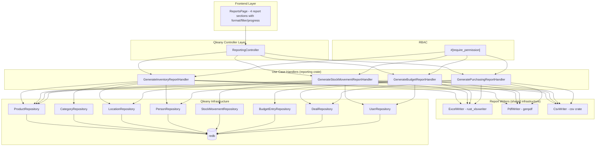

# Design Document: Reporting

## Overview

This design covers the four use cases in the `reporting` feature group: `generate_inventory_report`, `generate_stock_movement_report`, `generate_budget_report`, and `generate_purchasing_report`. These use cases are implemented as Qleany feature handlers in the `reporting` crate, layered on top of Qleany-generated CRUD infrastructure for Product, Category, Location, Person, StockMovement, BudgetEntry, Deal, and User entities.

Each report handler queries the relevant entities, applies user-specified filters, and delegates to a shared format writer infrastructure that supports Excel (.xlsx via `rust_xlsxwriter`), PDF (.pdf via `genpdf`), and CSV (.csv via `csv`). All four use cases are long operations running on background threads with progress reporting via Qleany's `ProgressReporter` mechanism.

All use cases are read-only and gated by RBAC via `#[require_permission("report:generate")]` proc macros from `inventory_security_macros`. Admin and Manager roles match via `report:*`, Viewer matches via `report:generate`.

The Slint UI ReportsPage provides four report sections, each with a format selector, filter options, a generate button, and a progress indicator.

## Architecture



## Components and Interfaces

### Trait: `ReportWriter` — Format Abstraction

A common trait that all format writers implement, allowing handlers to be format-agnostic.

```rust
/// A row of string values to write to the report.
pub type ReportRow = Vec<String>;

/// Trait for writing tabular report data to a specific file format.
pub trait ReportWriter {
    /// Initialize the writer with a report title and column headers.
    fn begin(&mut self, title: &str, headers: &[&str]) -> Result<(), ReportError>;

    /// Write a single data row.
    fn write_row(&mut self, row: &ReportRow) -> Result<(), ReportError>;

    /// Begin a new section (used for projection appendix in budget reports).
    /// For Excel: new sheet. For PDF: new page with section title. For CSV: separator row + section header.
    fn begin_section(&mut self, title: &str, headers: &[&str]) -> Result<(), ReportError>;

    /// Finalize and flush the report to disk.
    fn finish(&mut self) -> Result<(), ReportError>;
}

/// Create the appropriate writer for the given format and output path.
pub fn create_writer(
    format: &ReportFormat,
    output_path: &str,
) -> Result<Box<dyn ReportWriter>, ReportError>;
```

### Module: `excel_writer` — Excel Format Writer

```rust
use rust_xlsxwriter::{Workbook, Worksheet, Format};

pub struct ExcelWriter {
    workbook: Workbook,
    current_sheet: Option<Worksheet>,
    output_path: String,
    row_index: u32,
    header_format: Format,  // Bold
}

impl ReportWriter for ExcelWriter {
    // begin: creates first worksheet, writes bold headers, enables auto-column-width
    // write_row: writes data to current row, increments row_index
    // begin_section: adds new worksheet with section title and headers
    // finish: saves workbook to output_path
}
```

### Module: `pdf_writer` — PDF Format Writer

```rust
use genpdf::{Document, Element, elements, fonts, style};

pub struct PdfWriter {
    doc: Document,
    output_path: String,
    current_table: Option<Vec<Vec<String>>>,
    headers: Vec<String>,
}

impl ReportWriter for PdfWriter {
    // begin: creates document with title, stores headers for table rendering
    // write_row: accumulates rows into current_table
    // begin_section: flushes current table, adds page break, starts new section
    // finish: flushes final table, renders document to output_path
}
```

### Module: `csv_writer` — CSV Format Writer

```rust
use csv::Writer;
use std::fs::File;

pub struct CsvReportWriter {
    writer: Writer<File>,
    output_path: String,
}

impl ReportWriter for CsvReportWriter {
    // begin: writes header row
    // write_row: writes data row
    // begin_section: writes empty row, section title row, then section headers
    // finish: flushes writer
}
```


### Module: `collectors` — Data Collection and Row Building

Each report type has a collector function that queries entities and builds `ReportRow` vectors.

```rust
/// Inventory report columns:
/// name, reference, description, quantity, price_unit, status, category_name, location_name, supplier_name
pub fn collect_inventory_rows(
    db_context: &DbContext,
    include_zero_stock: bool,
) -> Result<(Vec<ReportRow>, usize), ReportError>;

/// Stock movement report columns:
/// date, movement_type, product_name, product_reference, quantity, from_location, to_location, performed_by, note
pub fn collect_stock_movement_rows(
    db_context: &DbContext,
    from_date: &NaiveDateTime,
    to_date: &NaiveDateTime,
) -> Result<(Vec<ReportRow>, usize), ReportError>;

/// Budget report columns:
/// entry_date, entry_type, amount, description, product_name, deal_title, recorded_by
pub fn collect_budget_rows(
    db_context: &DbContext,
    from_date: &NaiveDateTime,
    to_date: &NaiveDateTime,
) -> Result<(Vec<ReportRow>, usize), ReportError>;

/// Budget projection rows (for appendix):
/// month, projected_income, projected_expenses, projected_balance, recurring_deal_costs
pub fn collect_budget_projection_rows(
    db_context: &DbContext,
) -> Result<Vec<ReportRow>, ReportError>;

/// Purchasing report columns:
/// title, description, supplier_name, product_name, status, frequency, unit_cost, total_value, start_date, end_date
pub fn collect_purchasing_rows(
    db_context: &DbContext,
    status_filter: &DealStatusFilter,
) -> Result<(Vec<ReportRow>, usize), ReportError>;
```

### Module: `generate` — Report Generation Orchestrator

```rust
/// Shared generation logic: collect rows, create writer, write rows with progress, finish.
pub fn generate_report(
    title: &str,
    headers: &[&str],
    rows: Vec<ReportRow>,
    format: &ReportFormat,
    output_path: &str,
    progress: &dyn ProgressReporter,
) -> Result<(String, usize), ReportError>;

/// Extended generation with an optional appendix section (for budget projections).
pub fn generate_report_with_appendix(
    title: &str,
    headers: &[&str],
    rows: Vec<ReportRow>,
    appendix_title: &str,
    appendix_headers: &[&str],
    appendix_rows: Vec<ReportRow>,
    format: &ReportFormat,
    output_path: &str,
    progress: &dyn ProgressReporter,
) -> Result<(String, usize), ReportError>;
```

### Handler: `GenerateInventoryReportHandler`

```rust
#[require_permission("report:generate")]
pub fn execute(
    &mut self,
    dto: &GenerateInventoryReportDto,
    progress: &dyn ProgressReporter,
) -> Result<GenerateReportReturnDto, ReportError> {
    // 1. Collect inventory rows (filtered by include_zero_stock)
    // 2. Call generate_report with inventory headers and rows
    // 3. Return GenerateReportReturnDto { file_path, row_count }
}
```

### Handler: `GenerateStockMovementReportHandler`

```rust
#[require_permission("report:generate")]
pub fn execute(
    &mut self,
    dto: &GenerateStockMovementReportDto,
    progress: &dyn ProgressReporter,
) -> Result<GenerateStockReportReturnDto, ReportError> {
    // 1. Validate from_date <= to_date
    // 2. Collect stock movement rows within date range
    // 3. Call generate_report with stock movement headers and rows
    // 4. Return GenerateStockReportReturnDto { file_path, row_count }
}
```

### Handler: `GenerateBudgetReportHandler`

```rust
#[require_permission("report:generate")]
pub fn execute(
    &mut self,
    dto: &GenerateBudgetReportDto,
    progress: &dyn ProgressReporter,
) -> Result<GenerateBudgetReportReturnDto, ReportError> {
    // 1. Validate from_date <= to_date
    // 2. Collect budget rows within date range
    // 3. If include_projections:
    //    a. Collect projection rows (next 6 months)
    //    b. Call generate_report_with_appendix
    // 4. Else: Call generate_report
    // 5. Return GenerateBudgetReportReturnDto { file_path, row_count }
}
```

### Handler: `GeneratePurchasingReportHandler`

```rust
#[require_permission("report:generate")]
pub fn execute(
    &mut self,
    dto: &GeneratePurchasingReportDto,
    progress: &dyn ProgressReporter,
) -> Result<GeneratePurchasingReportReturnDto, ReportError> {
    // 1. Collect purchasing rows filtered by status_filter
    // 2. Call generate_report with purchasing headers and rows
    // 3. Return GeneratePurchasingReportReturnDto { file_path, row_count }
}
```

### Slint UI: `ReportsPage`

```
// ui/pages/reports_page.slint
// Four report sections, each containing:
//   - Format selector: ComboBox with Excel, PDF, CSV options
//   - Report-specific filter options:
//     - Inventory: include_zero_stock checkbox
//     - Stock Movement: from_date, to_date date pickers
//     - Budget: from_date, to_date date pickers, include_projections checkbox
//     - Purchasing: status_filter ComboBox (All, Active Only, Completed Only)
//   - Output path: text input (pre-filled with default path)
//   - Generate button: triggers use case, disabled during generation
//   - Progress bar: visible during generation, shows percentage
//   - Status label: shows success message with file path or error message
// Generate buttons hidden for users without report:generate permission
```

## Data Models

### DTOs (Qleany-generated from manifest)

```rust
// Input DTOs
pub struct GenerateInventoryReportDto {
    pub output_path: String,
    pub format: ReportFormat,
    pub include_zero_stock: bool,
}

pub struct GenerateStockMovementReportDto {
    pub output_path: String,
    pub format: StockReportFormat,
    pub from_date: NaiveDateTime,
    pub to_date: NaiveDateTime,
}

pub struct GenerateBudgetReportDto {
    pub output_path: String,
    pub format: BudgetReportFormat,
    pub from_date: NaiveDateTime,
    pub to_date: NaiveDateTime,
    pub include_projections: bool,
}

pub struct GeneratePurchasingReportDto {
    pub output_path: String,
    pub format: PurchasingReportFormat,
    pub status_filter: DealStatusFilter,
}

// Output DTOs
pub struct GenerateReportReturnDto {
    pub file_path: String,
    pub row_count: i32,
}

pub struct GenerateStockReportReturnDto {
    pub file_path: String,
    pub row_count: i32,
}

pub struct GenerateBudgetReportReturnDto {
    pub file_path: String,
    pub row_count: i32,
}

pub struct GeneratePurchasingReportReturnDto {
    pub file_path: String,
    pub row_count: i32,
}
```

### Enums

```rust
pub enum ReportFormat { Excel, Pdf, Csv }
pub enum StockReportFormat { Excel, Pdf, Csv }
pub enum BudgetReportFormat { Excel, Pdf, Csv }
pub enum PurchasingReportFormat { Excel, Pdf, Csv }
pub enum DealStatusFilter { All, ActiveOnly, CompletedOnly }
```

### Report Column Definitions

| Report Type | Columns |
|-------------|---------|
| Inventory | name, reference, description, quantity, price_unit, status, category_name, location_name, supplier_name |
| Stock Movement | date, movement_type, product_name, product_reference, quantity, from_location, to_location, performed_by, note |
| Budget | entry_date, entry_type, amount, description, product_name, deal_title, recorded_by |
| Budget Projection (appendix) | month, projected_income, projected_expenses, projected_balance, recurring_deal_costs |
| Purchasing | title, description, supplier_name, product_name, status, frequency, unit_cost, total_value, start_date, end_date |

### Error Types

```rust
#[derive(Debug, thiserror::Error)]
pub enum ReportError {
    #[error("Output path not writable: {path}")]
    NotWritable { path: String },
    #[error("from_date must not be later than to_date")]
    InvalidDateRange,
    #[error("Excel write error: {details}")]
    ExcelError { details: String },
    #[error("PDF write error: {details}")]
    PdfError { details: String },
    #[error("CSV write error: {details}")]
    CsvError { details: String },
    #[error(transparent)]
    Auth(#[from] AuthError),
    #[error("Internal error: {0}")]
    Internal(String),
}
```


## Correctness Properties

*A property is a characteristic or behavior that should hold true across all valid executions of a system — essentially, a formal statement about what the system should do. Properties serve as the bridge between human-readable specifications and machine-verifiable correctness guarantees.*

### Property 1: File existence and row count accuracy

*For any* successful report generation (any report type, any format), the generated file SHALL exist at the specified output_path, and the row_count in the return DTO SHALL equal the number of data rows written to the file (excluding headers and projection appendix sections).

**Validates: Requirements 1.1, 5.5, 7.1, 7.2**

### Property 2: Inventory zero-stock filter

*For any* set of Product entities with mixed quantities (some zero, some positive) and *for any* ReportFormat, generating an inventory report with include_zero_stock=false SHALL produce a row_count equal to the number of products with quantity > 0, and generating with include_zero_stock=true SHALL produce a row_count equal to the total number of products.

**Validates: Requirements 1.2, 1.3**

### Property 3: Stock movement date range filter and chronological ordering

*For any* set of StockMovement entities and *for any* valid date range [from_date, to_date], the stock movement report SHALL contain exactly those movements whose created_at falls within the inclusive range, and the rows SHALL be ordered chronologically by created_at.

**Validates: Requirements 2.1, 2.3**

### Property 4: Budget date range filter

*For any* set of BudgetEntry entities and *for any* valid date range [from_date, to_date], the budget report SHALL contain exactly those entries whose entry_date falls within the inclusive range, and the row_count SHALL equal the count of matching entries.

**Validates: Requirements 3.1**

### Property 5: Purchasing status filter

*For any* set of Deal entities with mixed statuses and *for any* DealStatusFilter value, the purchasing report row_count SHALL equal the number of deals matching the filter: all deals for All, only Active deals for ActiveOnly, and only Completed deals for CompletedOnly.

**Validates: Requirements 4.1, 4.2, 4.3**

### Property 6: Budget projection appendix toggle

*For any* set of BudgetEntry and Deal entities and *for any* valid date range, generating a budget report with include_projections=true SHALL produce output containing a projection section with 6 months of data, and generating with include_projections=false SHALL produce output without a projection section.

**Validates: Requirements 3.3, 3.4**

### Property 7: CSV round-trip for inventory report

*For any* set of Product entities (with and without Category, Location, and supplier associations), generating an inventory CSV report and parsing the output file back SHALL produce records whose name, reference, description, quantity, price_unit, status, category_name, location_name, and supplier_name fields match the source entity data (with empty strings for absent relationships).

**Validates: Requirements 1.4, 1.5, 8.1**

### Property 8: CSV round-trip for stock movement report

*For any* set of StockMovement entities within a valid date range, generating a stock movement CSV report and parsing the output file back SHALL produce records whose date, movement_type, product_name, product_reference, quantity, from_location, to_location, performed_by, and note fields match the source entity data.

**Validates: Requirements 2.2, 8.2**

### Property 9: CSV round-trip for budget report

*For any* set of BudgetEntry entities within a valid date range, generating a budget CSV report and parsing the output file back SHALL produce records whose entry_date, entry_type, amount, description, product_name, deal_title, and recorded_by fields match the source entity data.

**Validates: Requirements 3.2, 8.3**

### Property 10: CSV round-trip for purchasing report

*For any* set of Deal entities matching a given status filter, generating a purchasing CSV report and parsing the output file back SHALL produce records whose title, description, supplier_name, product_name, status, frequency, unit_cost, total_value, start_date, and end_date fields match the source entity data (with empty strings for absent relationships).

**Validates: Requirements 4.4, 4.5, 8.4**

## Error Handling

### Date Range Validation Errors

| Error | Trigger | Behavior |
|-------|---------|----------|
| `InvalidDateRange` | from_date > to_date (stock movement or budget report) | Return error, no file created |

Date range validation is the first check in handlers that accept from_date/to_date. If invalid, the handler returns immediately without querying entities or creating files.

### File Output Errors

| Error | Trigger | Behavior |
|-------|---------|----------|
| `NotWritable` | output_path cannot be written to | Return error, no file created |
| `ExcelError` | `rust_xlsxwriter` write failure | Return error, no partial file |
| `PdfError` | `genpdf` rendering failure | Return error, no partial file |
| `CsvError` | `csv` crate write failure | Return error, no partial file |

The `generate_report` orchestrator validates the output path is writable before beginning row writing. Format-specific errors are caught and wrapped in the appropriate `ReportError` variant. Writers accumulate data in memory (or use buffered I/O) and only finalize to disk on `finish()`, preventing partial file creation.

### RBAC Errors

All four use cases are gated by `#[require_permission("report:generate")]`. If the SecurityContext lacks the required permission, an `AuthError::AccessDeniedPermission` is returned before the handler body executes. Admin and Manager match via `report:*`, Viewer matches via `report:generate`, Operator has no report permissions and is denied.

### Empty Result Handling

When filters produce zero matching entities (empty date range, no matching deals), the handlers generate a valid report file containing only headers (and return row_count of 0) rather than returning an error. This is intentional — an empty report is a valid result.

## Testing Strategy

### Property-Based Testing

Library: `proptest` (Rust)

Each correctness property (Properties 1–10) maps to a single `proptest!` test. Tests run with a minimum of 100 iterations.

Tag format: `// Feature: reporting, Property N: <title>`

Generator strategies:
- **Product sets**: Generate random products with name (`"[a-zA-Z][a-zA-Z0-9 ]{1,30}"`), reference (`"REF-[A-Z0-9]{4,8}"`), quantity (`0..1000i32` — includes zero for zero-stock filter testing), price_unit (`0.01..9999.99f64`), status (one of four ProductStatus values), with optional Category/Location/Person associations (some None to test empty-string handling)
- **StockMovement sets**: Generate random movements with movement_type (one of five MovementType values), quantity (`1..500i32`), created_at (random datetimes spanning several months), with associated Product and Location entities
- **BudgetEntry sets**: Generate random entries with entry_type (one of four BudgetEntryType values), amount (`0.0..99999.99f64`), entry_date (random datetimes), with optional Product and Deal associations
- **Deal sets**: Generate random deals with title, status (one of four DealStatus values — ensuring mix of Active, Completed, Draft, Cancelled), frequency, unit_cost, total_value, with optional Product and Person associations
- **Date ranges**: Random (from_date, to_date) pairs where from_date <= to_date, spanning subsets of the generated entity dates
- **ReportFormat**: Uniform selection from Excel, Pdf, Csv (CSV used for round-trip verification)
- **DealStatusFilter**: Uniform selection from All, ActiveOnly, CompletedOnly
- **include_zero_stock**: Random boolean
- **include_projections**: Random boolean
- **output_path**: Temporary file paths via `tempfile` crate

### Unit Testing

Unit tests complement property tests for specific examples and edge cases:

- Stock movement report with from_date > to_date returns InvalidDateRange (Requirement 2.4)
- Budget report with from_date > to_date returns InvalidDateRange (Requirement 3.5)
- Report generation with non-writable output_path returns NotWritable (Requirement 5.4)
- Inventory report with all zero-quantity products and include_zero_stock=false returns row_count 0 (Requirement 1.2 edge case)
- Stock movement report with no movements in date range returns row_count 0 (Requirement 2.5)
- Budget report with no entries in date range returns row_count 0 (Requirement 3.6)
- Purchasing report with no matching deals returns row_count 0 (Requirement 4.6)
- Excel output file has valid .xlsx magic bytes (Requirement 5.1)
- PDF output file has valid %PDF header (Requirement 5.2)
- CSV output file has correct header row (Requirement 5.3)
- RBAC rejects Operator for all four report types (Requirements 1.6, 2.6, 3.7, 4.7)
- RBAC allows Viewer for all four report types (Requirements 1.6, 2.6, 3.7, 4.7)
- RBAC allows Manager for all four report types (Requirements 1.6, 2.6, 3.7, 4.7)

### Test Organization

```
crates/reporting/tests/
├── inventory_report_tests.rs    # Properties 1, 2, 7 + unit tests for zero-stock edge case, format validation
├── stock_movement_report_tests.rs # Properties 1, 3, 8 + unit tests for date range errors, empty results
├── budget_report_tests.rs       # Properties 1, 4, 6, 9 + unit tests for date range errors, projection toggle
├── purchasing_report_tests.rs   # Properties 1, 5, 10 + unit tests for empty filter results
├── rbac_tests.rs                # Unit tests for RBAC enforcement across all report types
├── writer_tests.rs              # Unit tests for Excel/PDF/CSV writer edge cases (non-writable path, format validation)
```

### Dependencies

```toml
[dev-dependencies]
proptest = "1"
tempfile = "3"    # For creating temporary output files in tests
```
