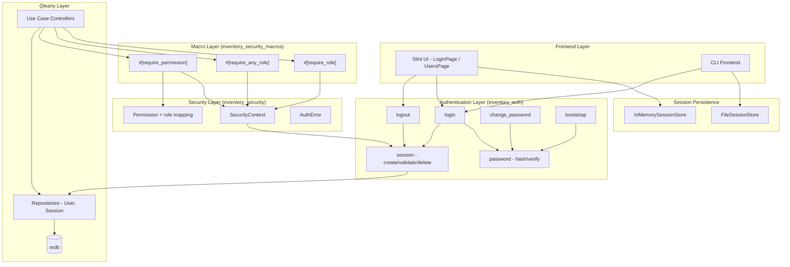

# Design Document: Security & Authentication

## Overview

This design covers the complete security and authentication layer for the Inventory Management Application. The implementation spans three hand-written Rust crates (`inventory_auth`, `inventory_security`, `inventory_security_macros`) that integrate with Qleany-generated entities (User, Session) and the existing Slint UI shell.

The architecture follows a layered approach: password hashing and session lifecycle at the bottom, a SecurityContext extraction layer in the middle, and proc-macro-based RBAC enforcement at the top. The Slint UI already has login and users pages scaffolded — this design wires them to the backend.

## Architecture



## Components and Interfaces

### Crate: `inventory_auth`

Handles authentication operations and user lifecycle. Depends on `inventory_security` for types.

#### Module: `password`

```rust
/// Hash a plaintext password using argon2 with a random salt.
pub fn hash_password(password: &str) -> Result<String, AuthError>;

/// Verify a plaintext password against a stored argon2 hash.
pub fn verify_password(password: &str, hash: &str) -> Result<bool, AuthError>;
```

#### Module: `session`

```rust
/// Generate a new session token (UUID v4) with 24h expiry.
/// Persists a Session entity linked to the user.
/// If the user already has a session, the old one is deleted first.
pub fn create_session(db_context: &DbContext, user_id: u32) -> Result<Session, AuthError>;

/// Validate a session token: exists and not expired.
/// Returns the associated User if valid.
pub fn validate_session(db_context: &DbContext, token: &str) -> Result<(User, Session), AuthError>;

/// Delete a session by token. No-op if token doesn't exist.
pub fn delete_session(db_context: &DbContext, token: &str) -> Result<(), AuthError>;
```

#### Module: `session_store`

```rust
/// Trait for frontend-specific session token persistence.
pub trait SessionStore: Send + Sync {
    fn save_token(&self, token: &str) -> Result<(), AuthError>;
    fn load_token(&self) -> Result<Option<String>, AuthError>;
    fn clear_token(&self) -> Result<(), AuthError>;
}

/// Desktop (Slint): in-memory, lost on app close.
pub struct InMemorySessionStore {
    token: Mutex<Option<String>>,
}

/// CLI: file-based (~/.inventory_manager/session).
pub struct FileSessionStore {
    path: PathBuf,
}
```

#### Module: `bootstrap`

```rust
/// Check if any users exist. If not, create the default admin.
/// Returns true if bootstrap was performed.
pub fn ensure_admin_exists(db_context: &DbContext) -> Result<bool, AuthError>;
```

#### Top-level functions (lib.rs)

```rust
/// Authenticate a user. Returns login result with token on success.
pub fn login(
    db_context: &DbContext,
    username: &str,
    password: &str,
) -> Result<LoginResultDto, AuthError>;

/// Terminate a session by token. Idempotent.
pub fn logout(db_context: &DbContext, token: &str) -> Result<(), AuthError>;

/// Change password for a user. Requires correct old password.
pub fn change_password(
    db_context: &DbContext,
    user_id: u32,
    old_password: &str,
    new_password: &str,
) -> Result<(), AuthError>;

/// Create a new user (admin operation).
pub fn create_user(
    db_context: &DbContext,
    username: &str,
    password: &str,
    display_name: &str,
    role: UserRole,
    person_id: Option<u32>,
) -> Result<u32, AuthError>;

/// Deactivate a user and force-logout (admin operation).
pub fn deactivate_user(db_context: &DbContext, user_id: u32) -> Result<(), AuthError>;

/// List all users.
pub fn list_users(db_context: &DbContext) -> Result<Vec<UserSummary>, AuthError>;
```

### Crate: `inventory_security`

Provides the SecurityContext, Permission type, role-to-permission mapping, and error types.

#### Module: `context`

```rust
#[derive(Debug, Clone)]
pub struct SecurityContext {
    pub user_id: u32,
    pub role: UserRole,
    pub permissions: Vec<Permission>,
    pub token: String,
}

impl SecurityContext {
    /// Build a SecurityContext from a session token.
    /// Validates the session, loads the user, resolves permissions.
    pub fn from_token(db_context: &DbContext, token: &str) -> Result<Self, AuthError>;

    pub fn has_role(&self, role: UserRole) -> bool;
    pub fn has_any_role(&self, roles: &[UserRole]) -> bool;
    pub fn has_permission(&self, perm: &str) -> bool;
    pub fn is_admin(&self) -> bool;
}
```

#### Module: `permission`

```rust
#[derive(Debug, Clone, PartialEq, Eq, Hash)]
pub struct Permission(pub String);

/// Return the set of permissions for a given role.
pub fn permissions_for_role(role: &UserRole) -> Vec<Permission>;

/// Check if a permission set satisfies a required permission,
/// handling wildcards (*:* and resource:*).
pub fn permission_matches(held: &Permission, required: &str) -> bool;
```

#### Module: `error`

```rust
#[derive(Debug, thiserror::Error)]
pub enum AuthError {
    #[error("Invalid credentials")]
    InvalidCredentials,
    #[error("Account deactivated")]
    AccountDeactivated,
    #[error("Session expired")]
    SessionExpired,
    #[error("Invalid session")]
    InvalidSession,
    #[error("Access denied: requires role {required}")]
    AccessDeniedRole { required: String },
    #[error("Access denied: requires permission {required}")]
    AccessDeniedPermission { required: String },
    #[error("Duplicate username: {username}")]
    DuplicateUsername { username: String },
    #[error("Password too short: minimum 8 characters")]
    PasswordTooShort,
    #[error("New password must differ from current password")]
    PasswordUnchanged,
    #[error("Password change required")]
    PasswordChangeRequired,
    #[error("Internal error: {0}")]
    Internal(String),
}
```

### Crate: `inventory_security_macros`

Proc macros that expand into guard code before the function body.

```rust
/// Reject if SecurityContext.role != specified role (Admin always passes).
#[proc_macro_attribute]
pub fn require_role(attr: TokenStream, item: TokenStream) -> TokenStream;

/// Reject if SecurityContext.role not in specified roles (Admin always passes).
#[proc_macro_attribute]
pub fn require_any_role(attr: TokenStream, item: TokenStream) -> TokenStream;

/// Reject if SecurityContext doesn't hold the specified permission (Admin always passes).
#[proc_macro_attribute]
pub fn require_permission(attr: TokenStream, item: TokenStream) -> TokenStream;
```

Each macro expands to inject a guard at the start of the function body:

```rust
// Example expansion of #[require_role(UserRole::Manager)]
{
    let ctx = self.security_context();
    if !ctx.is_admin() && !ctx.has_role(UserRole::Manager) {
        return Err(AuthError::AccessDeniedRole {
            required: "Manager".to_string(),
        }.into());
    }
    // ... original function body
}
```

## Data Models

### User Entity (Qleany-generated)

| Field | Type | Description |
|-------|------|-------------|
| id | u32 | Primary key (from EntityBase) |
| created_at | DateTime | Creation timestamp |
| updated_at | DateTime | Last update timestamp |
| username | String | Unique login identifier |
| password_hash | String | Argon2 hash of the password |
| display_name | String | Human-readable name |
| role | UserRole | Enum: Admin, Manager, Operator, Viewer |
| is_active | bool | Whether the account can log in |
| person | Option\<Person\> | Optional link to a business contact |
| session | Option\<Session\> | One-to-one active session |

### Session Entity (Qleany-generated)

| Field | Type | Description |
|-------|------|-------------|
| id | u32 | Primary key |
| created_at | DateTime | Creation timestamp |
| updated_at | DateTime | Last update timestamp |
| token | String | UUID v4 session token |
| expires_at | DateTime | Expiration (created_at + 24h) |

### UserRole Enum (Qleany-generated)

```rust
pub enum UserRole {
    Admin,
    Manager,
    Operator,
    Viewer,
}
```

### Permission Matrix

| Permission | Admin | Manager | Operator | Viewer |
|---|---|---|---|---|
| `*:*` | ✓ | | | |
| `product:*` | | ✓ | | |
| `product:read` | | | ✓ | |
| `category:*` | | ✓ | | |
| `category:read` | | | ✓ | |
| `person:*` | | ✓ | | |
| `deal:*` | | ✓ | | |
| `location:*` | | ✓ | | |
| `location:read` | | | ✓ | |
| `stock:*` | | ✓ | ✓ | |
| `budget:*` | | ✓ | | |
| `report:*` | | ✓ | | |
| `report:generate` | | | | ✓ |
| `import:*` | | ✓ | | |
| `export:*` | | ✓ | | |
| `sync:trigger` | | ✓ | | |
| `dashboard:read` | | | ✓ | |
| `*:read` | | | | ✓ |

### LoginResultDto

```rust
pub struct LoginResultDto {
    pub success: bool,
    pub token: String,
    pub user_id: u32,
    pub role: String,
    pub display_name: String,
    pub error_message: String,
    pub password_change_required: bool,
}
```

### UserSummary (for list_users)

```rust
pub struct UserSummary {
    pub id: u32,
    pub username: String,
    pub display_name: String,
    pub role: String,
    pub is_active: bool,
}
```


## Correctness Properties

*A property is a characteristic or behavior that should hold true across all valid executions of a system — essentially, a formal statement about what the system should do. Properties serve as the bridge between human-readable specifications and machine-verifiable correctness guarantees.*

### Property 1: Password hash round-trip

*For any* plaintext password, hashing it with `hash_password` and then verifying the same plaintext against the resulting hash with `verify_password` SHALL return true.

**Validates: Requirements 9.1, 9.2**

### Property 2: Password hash uniqueness

*For any* plaintext password, two successive calls to `hash_password` SHALL produce different hash strings (due to random salt generation).

**Validates: Requirements 9.3**

### Property 3: Successful login contract

*For any* active User with a known password, calling `login` with the correct username and password SHALL return a `LoginResultDto` where `success` is true, `token` is a valid UUID v4, `user_id` matches the User's ID, `role` matches the User's role, `display_name` matches the User's display name, and a Session entity exists with `expires_at` approximately 24 hours in the future.

**Validates: Requirements 1.1, 1.5**

### Property 4: Failed login indistinguishable errors

*For any* login attempt that fails due to a non-existent username and *for any* login attempt that fails due to an incorrect password for an existing user, the returned error message SHALL be identical.

**Validates: Requirements 1.2, 1.3**

### Property 5: Deactivated account login rejection

*For any* User with `is_active` set to false and a known correct password, calling `login` SHALL return an error indicating the account is deactivated.

**Validates: Requirements 1.4**

### Property 6: Re-login invalidates previous session

*For any* User who has an active session, calling `login` again SHALL invalidate the previous session token (validation of the old token fails) and produce a new valid session token.

**Validates: Requirements 1.6**

### Property 7: Logout invalidates session

*For any* valid session token, calling `logout` with that token SHALL cause subsequent `validate_session` calls with the same token to fail.

**Validates: Requirements 2.1**

### Property 8: Logout is idempotent

*For any* string (including random strings, expired tokens, and previously-logged-out tokens), calling `logout` SHALL succeed without returning an error.

**Validates: Requirements 2.2**

### Property 9: Password change round-trip

*For any* active User with a known password and *for any* new password of 8 or more characters that differs from the current password, calling `change_password` with the correct old password and the new password SHALL succeed, and subsequently calling `login` with the new password SHALL succeed.

**Validates: Requirements 3.1**

### Property 10: Password change rejects wrong old password

*For any* User and *for any* old password that does not match the User's current password, calling `change_password` SHALL return an error.

**Validates: Requirements 3.2**

### Property 11: Bootstrap idempotence

*For any* database that already contains at least one User, calling `ensure_admin_exists` SHALL not change the user count.

**Validates: Requirements 4.2**

### Property 12: Session token validation correctness

*For any* token string, `SecurityContext::from_token` SHALL succeed if and only if a Session entity with that token exists in the database and its `expires_at` is in the future.

**Validates: Requirements 5.1, 5.2, 5.3**

### Property 13: SecurityContext resolves correct permissions

*For any* valid session token belonging to a User with role R, the `SecurityContext` constructed from that token SHALL have `permissions` equal to `permissions_for_role(R)`.

**Validates: Requirements 5.4**

### Property 14: SessionStore round-trip

*For any* `SessionStore` implementation (InMemorySessionStore or FileSessionStore) and *for any* non-empty token string, calling `save_token(token)` followed by `load_token()` SHALL return `Some(token)` with the same value.

**Validates: Requirements 6.2, 6.3**

### Property 15: Role-to-permission mapping correctness

*For any* `UserRole` value, `permissions_for_role` SHALL return the exact set of permissions defined in the permission matrix (Admin → `*:*`; Manager → `product:*`, `category:*`, `person:*`, `deal:*`, `location:*`, `stock:*`, `budget:*`, `report:*`, `import:*`, `export:*`, `sync:trigger`; Operator → `product:read`, `category:read`, `location:read`, `stock:*`, `dashboard:read`; Viewer → `*:read`, `report:generate`).

**Validates: Requirements 7.1**

### Property 16: Role-based access control

*For any* `UserRole` and *for any* set of required roles, `has_role` / `has_any_role` SHALL return true if and only if the user's role is Admin or the user's role is in the required set.

**Validates: Requirements 7.2, 7.3**

### Property 17: Permission-based access control with wildcards

*For any* held `Permission` and *for any* required permission string, `permission_matches` SHALL return true if: (a) the held permission is `*:*`, or (b) the held permission is `resource:*` and the required permission starts with `resource:`, or (c) the held permission equals the required permission exactly. `has_permission` SHALL return true if the role is Admin or any held permission matches.

**Validates: Requirements 7.4, 7.5**

### Property 18: User creation persists correctly

*For any* valid username (not already taken), password, display name, role, and optional person ID, calling `create_user` SHALL create a User entity where the username, display_name, and role match the inputs, `is_active` is true, and `password_hash` is a valid argon2 hash that verifies against the original password.

**Validates: Requirements 8.1**

### Property 19: Duplicate username rejection

*For any* username that already exists in the database, calling `create_user` with that username SHALL return a `DuplicateUsername` error.

**Validates: Requirements 8.2**

### Property 20: Deactivation force-logout

*For any* active User with an active session, calling `deactivate_user` SHALL set `is_active` to false and delete the User's session (the old session token becomes invalid).

**Validates: Requirements 8.3**

### Property 21: List users completeness

*For any* set of User entities in the database, `list_users` SHALL return a list with the same count, and each entry SHALL contain the correct `id`, `username`, `display_name`, `role`, and `is_active` values.

**Validates: Requirements 8.4**

## Error Handling

### AuthError Variants and Handling Strategy

| Error | Trigger | HTTP-like Code | User-Facing Message |
|-------|---------|----------------|---------------------|
| `InvalidCredentials` | Wrong password or non-existent username | 401 | "Invalid username or password" |
| `AccountDeactivated` | Login with `is_active=false` | 403 | "Account has been deactivated" |
| `SessionExpired` | Token past `expires_at` | 401 | "Session expired, please log in again" |
| `InvalidSession` | Token not found in DB | 401 | "Invalid session" |
| `AccessDeniedRole` | Role check fails | 403 | "Access denied: requires {role} role" |
| `AccessDeniedPermission` | Permission check fails | 403 | "Access denied: requires {permission}" |
| `DuplicateUsername` | Username already taken | 409 | "Username already exists" |
| `PasswordTooShort` | New password < 8 chars | 400 | "Password must be at least 8 characters" |
| `PasswordUnchanged` | New password == old password | 400 | "New password must differ from current" |
| `PasswordChangeRequired` | Default admin first login | 200 (with flag) | "Password change required" |
| `Internal` | Unexpected failures | 500 | "An internal error occurred" |

### Error Propagation

- `inventory_auth` functions return `Result<T, AuthError>`
- `inventory_security` context extraction returns `Result<SecurityContext, AuthError>`
- Proc macros convert `AuthError` into the use case's error type via `From<AuthError>`
- The Slint UI displays `error_message` from `LoginResultDto` or catches `AuthError` from callbacks
- The CLI prints error messages to stderr

### Security Considerations

- `InvalidCredentials` is used for both wrong password and non-existent username to prevent username enumeration
- Password hashes use argon2 with random salts — no timing attacks on hash comparison
- Session tokens are UUID v4 (122 bits of randomness) — not guessable
- Expired sessions are rejected, not silently renewed
- Admin always bypasses role/permission checks (superuser pattern)

## Testing Strategy

### Property-Based Testing

Library: `proptest` (Rust's standard property-based testing crate)

Each correctness property (Properties 1–21) maps to a single `proptest!` test. Tests run with a minimum of 100 iterations.

Tag format: `// Feature: security-authentication, Property N: <title>`

Generator strategy:
- Usernames: `"[a-z][a-z0-9_]{2,20}"` regex strategy
- Passwords: `".{8,64}"` for valid passwords, `".{0,7}"` for short passwords
- Roles: `prop_oneof![Just(Admin), Just(Manager), Just(Operator), Just(Viewer)]`
- Tokens: UUID v4 strings via `uuid::Uuid::new_v4().to_string()`
- Permission strings: `"(product|category|person|deal|location|stock|budget|report|import|export|sync|dashboard|\\*):(read|write|delete|generate|trigger|\\*)"` regex strategy

### Unit Testing

Unit tests complement property tests for specific examples and edge cases:

- Bootstrap creates "admin"/"admin" with Admin role (Requirement 4.1)
- Default admin login flags `password_change_required` (Requirement 4.3)
- `load_token` on fresh store returns None (Requirement 6.4)
- Password change rejects passwords shorter than 8 characters (Requirement 3.3)
- Password change rejects same password (Requirement 3.4)
- `AccessDenied` errors contain the required role/permission string (Requirement 7.6)
- Specific permission matrix spot-checks (e.g., Operator cannot `deal:write`)

### Test Organization

```
crates/inventory_auth/tests/
├── password_tests.rs       # Properties 1, 2
├── login_tests.rs          # Properties 3, 4, 5, 6
├── logout_tests.rs         # Properties 7, 8
├── change_password_tests.rs # Properties 9, 10
├── bootstrap_tests.rs      # Property 11 + unit tests for 4.1, 4.3
├── session_tests.rs        # Properties 12, 13
├── session_store_tests.rs  # Property 14 + unit test for 6.4
├── user_management_tests.rs # Properties 18, 19, 20, 21

crates/inventory_security/tests/
├── permission_tests.rs     # Properties 15, 16, 17
├── context_tests.rs        # Properties 12, 13 (integration)
```

### Dependencies

```toml
[dev-dependencies]
proptest = "1"
```
