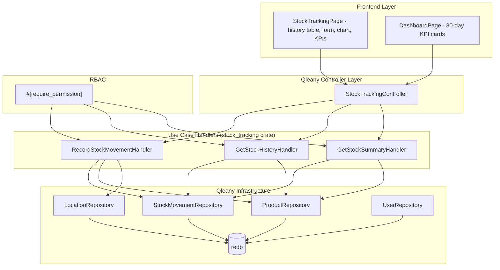

# Design Document: Stock Tracking

## Overview

This design covers the three use cases in the `stock_tracking` feature group: `record_stock_movement`, `get_stock_history`, and `get_stock_summary`. These use cases are implemented as Qleany feature handlers in the `stock_tracking` crate, layered on top of Qleany-generated CRUD infrastructure for StockMovement, Product, Location, and User entities.

The movement recorder validates movement-type-specific constraints (location requirements, sufficient stock), creates an immutable StockMovement entity, and atomically updates the Product quantity. The history query retrieves chronologically ordered movements for a product within a date range and computes running totals. The summary query aggregates 30-day inbound/outbound quantities across all products for dashboard KPIs.

All three use cases are gated by RBAC via `#[require_permission]` or `#[require_any_role]` proc macros from `inventory_security_macros`. Stock movements are non-undoable to preserve audit trail integrity.

The Slint UI provides a `StockTrackingPage` with a movement history table, record movement form, stock trend line chart, and 30-day KPI cards.

## Architecture



## Components and Interfaces

### Module: `validation` — Movement-Type-Specific Validation

```rust
use crate::error::StockTrackingError;

/// Validate a stock movement request based on movement type.
/// Checks location requirements, quantity constraints, and sufficient stock.
pub fn validate_movement(
    movement_type: &MovementType,
    quantity: i32,
    product_quantity: i32,
    from_location_id: Option<u32>,
    to_location_id: Option<u32>,
) -> Result<(), StockTrackingError> {
    // 1. Reject zero quantity for all types
    // 2. Per movement_type:
    //    - Inbound: require to_location_id, quantity > 0
    //    - Outbound: require from_location_id, quantity > 0, product_quantity >= quantity
    //    - Transfer: require both locations, locations differ, quantity > 0, product_quantity >= quantity
    //    - Adjustment: allow positive or negative, but reject if result would be negative
    //    - Return: require to_location_id, quantity > 0
}
```

### Module: `quantity` — Quantity Delta Computation

```rust
/// Compute the signed quantity change for a movement.
/// Inbound: +quantity, Outbound: -quantity, Transfer: -quantity (source),
/// Adjustment: +/-quantity as-is, Return: +quantity.
pub fn compute_delta(movement_type: &MovementType, quantity: i32) -> i32;

/// Apply a movement delta to a product quantity.
/// Returns the new quantity. Caller must validate before calling.
pub fn apply_delta(current_quantity: i32, delta: i32) -> i32;
```

### Module: `running_total` — Running Total Computation

```rust
/// Compute running totals from a chronologically ordered list of movements.
/// Starting from `initial_quantity`, applies each movement's signed delta.
/// Returns a Vec<i32> of the same length as `movements`.
pub fn compute_running_totals(
    initial_quantity: i32,
    movements: &[(MovementType, i32)],  // (movement_type, quantity)
) -> Vec<i32>;
```

### Module: `summary` — 30-Day Aggregation

```rust
use chrono::{DateTime, Utc};

/// Aggregate inbound and outbound quantities for a product from movements
/// within the last 30 days.
/// Inbound = sum of Inbound + Return + Transfer-in quantities.
/// Outbound = sum of Outbound + Transfer-out quantities.
pub fn aggregate_30d(
    movements: &[StockMovementRecord],
    cutoff: DateTime<Utc>,
) -> (i32, i32);  // (inbound_30d, outbound_30d)
```

### Handler: `RecordStockMovementHandler`

```rust
#[require_permission("stock:*")]
pub fn execute(
    &mut self,
    dto: &RecordStockMovementDto,
    security_context: &SecurityContext,
) -> Result<RecordStockMovementResultDto, StockTrackingError> {
    // 1. Load Product by product_id (error if not found)
    // 2. Validate from_location_id / to_location_id exist if provided (error if not found)
    // 3. Call validate_movement() for type-specific checks
    // 4. Compute delta via compute_delta()
    // 5. Apply delta to product quantity
    // 6. Update Product entity in repository
    // 7. Create StockMovement entity with all fields + performed_by from SecurityContext
    // 8. Return RecordStockMovementResultDto { movement_id, new_product_quantity }
}
```

### Handler: `GetStockHistoryHandler`

```rust
#[require_permission("stock:*", "*:read")]
pub fn execute(
    &mut self,
    dto: &GetStockHistoryDto,
) -> Result<StockHistoryDto, StockTrackingError> {
    // 1. Validate product exists (error if not found)
    // 2. Query StockMovement entities for product_id within [from_date, to_date], ordered by created_at ASC
    // 3. Compute initial_quantity = product.quantity minus sum of all deltas from movements after from_date
    //    (or query movements before from_date to reconstruct)
    // 4. Call compute_running_totals(initial_quantity, movements)
    // 5. Build parallel arrays: movement_ids, movement_types, quantities, dates, running_totals
    // 6. Return StockHistoryDto
}
```

### Handler: `GetStockSummaryHandler`

```rust
#[require_permission("stock:*", "*:read")]
pub fn execute(
    &mut self,
) -> Result<StockSummaryDto, StockTrackingError> {
    // 1. Load all Products
    // 2. Compute cutoff = now - 30 days
    // 3. For each product:
    //    a. Query StockMovement entities for product within last 30 days
    //    b. Call aggregate_30d() to get (inbound_30d, outbound_30d)
    // 4. Build parallel arrays: product_ids, product_names, current_quantities, inbound_30d, outbound_30d
    // 5. Return StockSummaryDto
}
```

### Slint UI: `StockTrackingPage`

```slint
// ui/pages/stock_tracking_page.slint
// Components:
//   - MovementHistoryTable: columns for type, quantity, date, from_location, to_location, user, note
//   - RecordMovementForm: product selector, movement type dropdown, quantity input,
//     from/to location selectors, note text field, submit button
//   - StockTrendChart: line chart of running totals over time for selected product
//   - KPICards: 30-day total inbound, 30-day total outbound
```

The page binds to a `StockTrackingAdapter` that bridges Slint callbacks to the `StockTrackingController`:
- `record-movement(dto)` → calls `record_stock_movement`, refreshes history table on success, shows error on failure
- `load-history(product_id, from_date, to_date)` → calls `get_stock_history`, populates table and chart
- `load-summary()` → calls `get_stock_summary`, populates KPI cards

## Data Models

### DTOs (Qleany-generated from manifest)

```rust
// Input DTOs
pub struct RecordStockMovementDto {
    pub product_id: i32,
    pub movement_type: MovementTypeInput,  // Inbound | Outbound | Transfer | Adjustment | Return
    pub quantity: i32,
    pub from_location_id: i32,             // 0 or unused when not applicable
    pub to_location_id: i32,               // 0 or unused when not applicable
    pub note: String,
}

pub struct GetStockHistoryDto {
    pub product_id: i32,
    pub from_date: DateTime<Utc>,
    pub to_date: DateTime<Utc>,
}

// Output DTOs
pub struct RecordStockMovementResultDto {
    pub movement_id: i32,
    pub new_product_quantity: i32,
}

pub struct StockHistoryDto {
    pub movement_ids: Vec<i32>,
    pub movement_types: Vec<String>,
    pub quantities: Vec<i32>,
    pub dates: Vec<String>,
    pub running_totals: Vec<i32>,
}

pub struct StockSummaryDto {
    pub product_ids: Vec<i32>,
    pub product_names: Vec<String>,
    pub current_quantities: Vec<i32>,
    pub inbound_30d: Vec<i32>,
    pub outbound_30d: Vec<i32>,
}
```

### Enums

```rust
// From Qleany entity definition
pub enum MovementType {
    Inbound,
    Outbound,
    Transfer,
    Adjustment,
    Return,
}

// Input enum (Qleany-generated)
pub enum MovementTypeInput {
    Inbound,
    Outbound,
    Transfer,
    Adjustment,
    Return,
}
```

### StockMovement Entity (from Qleany manifest)

| Field | Type | Description |
|-------|------|-------------|
| id | u32 | Primary key (from EntityBase) |
| created_at | DateTime | Timestamp of creation (from EntityBase) |
| updated_at | DateTime | Timestamp of last update (from EntityBase) |
| movement_type | MovementType | Inbound, Outbound, Transfer, Adjustment, or Return |
| quantity | i32 | Amount moved (always stored as positive; sign determined by type) |
| note | String | Free-text note for audit context |
| product | Product (many_to_one) | The product affected |
| from_location | Location (many_to_one, optional) | Source location (required for Outbound, Transfer) |
| to_location | Location (many_to_one, optional) | Destination location (required for Inbound, Transfer, Return) |
| performed_by | User (many_to_one, optional) | The user who performed the movement |

### Error Types

```rust
#[derive(Debug, thiserror::Error)]
pub enum StockTrackingError {
    #[error("Product not found: {id}")]
    ProductNotFound { id: i32 },
    #[error("Location not found: {id}")]
    LocationNotFound { id: i32 },
    #[error("Insufficient stock: available {available}, requested {requested}")]
    InsufficientStock { available: i32, requested: i32 },
    #[error("Movement quantity must not be zero")]
    ZeroQuantity,
    #[error("Outbound/Transfer quantity must be positive")]
    NegativeQuantity,
    #[error("Inbound movement requires a to_location")]
    MissingToLocation,
    #[error("Outbound movement requires a from_location")]
    MissingFromLocation,
    #[error("Transfer requires both from_location and to_location")]
    MissingTransferLocations,
    #[error("Transfer source and destination must differ")]
    SameLocation,
    #[error("Adjustment would result in negative quantity: current {current}, adjustment {adjustment}")]
    AdjustmentUnderflow { current: i32, adjustment: i32 },
    #[error(transparent)]
    Auth(#[from] AuthError),
    #[error("Internal error: {0}")]
    Internal(String),
}
```

### Quantity Delta Rules

| Movement Type | Delta | Constraint |
|---------------|-------|------------|
| Inbound | +quantity | quantity > 0, to_location required |
| Outbound | -quantity | quantity > 0, from_location required, product.quantity >= quantity |
| Transfer | -quantity (source) / +quantity (dest) | quantity > 0, both locations required, locations differ, product.quantity >= quantity |
| Adjustment | +/-quantity as provided | Result must be >= 0 |
| Return | +quantity | quantity > 0, to_location required |

## Correctness Properties

*A property is a characteristic or behavior that should hold true across all valid executions of a system — essentially, a formal statement about what the system should do. Properties serve as the bridge between human-readable specifications and machine-verifiable correctness guarantees.*

### Property 1: Quantity update per movement type

*For any* Product with a known quantity and *for any* valid movement (Inbound with positive quantity, Outbound with positive quantity not exceeding stock, Adjustment where result stays non-negative, Return with positive quantity), recording the movement SHALL change the Product quantity by exactly the signed delta: +quantity for Inbound/Return, -quantity for Outbound, +/-quantity for Adjustment.

**Validates: Requirements 1.1, 1.2, 1.4, 1.5, 1.6**

### Property 2: Transfer quantity conservation

*For any* Product at a source Location with quantity >= transfer amount, and *for any* distinct destination Location, recording a Transfer movement SHALL preserve the total quantity across both locations (source_before + dest_before == source_after + dest_after), with the source decreasing and destination increasing by exactly the transfer amount.

**Validates: Requirements 1.3, 1.6**

### Property 3: Insufficient stock rejection

*For any* Product and *for any* Outbound or Transfer movement where the requested quantity exceeds the current Product quantity, the Movement_Recorder SHALL return an InsufficientStock error and leave the Product quantity unchanged.

**Validates: Requirements 1.10**

### Property 4: Audit trail records performing user

*For any* successfully recorded stock movement, the created StockMovement entity's performed_by field SHALL reference the same User as the SecurityContext used to execute the operation.

**Validates: Requirements 1.14**

### Property 5: History chronological ordering and date filtering

*For any* Product with movements across various dates, and *for any* date range [from_date, to_date], the History_Query SHALL return only movements within that range, ordered by created_at ascending, with no movements outside the range included.

**Validates: Requirements 2.1**

### Property 6: Running totals correctness

*For any* Product and *for any* chronologically ordered sequence of movements, the running_totals array SHALL equal the initial quantity (product quantity at from_date) plus the cumulative sum of signed deltas applied in order, where each running_total[i] = running_total[i-1] + delta(movement[i]).

**Validates: Requirements 2.2, 2.3**

### Property 7: 30-day summary aggregation correctness

*For any* set of Products and *for any* set of StockMovement entities, the Summary_Query SHALL compute inbound_30d as the sum of quantities from Inbound, Return, and Transfer-in movements in the last 30 days, and outbound_30d as the sum of quantities from Outbound and Transfer-out movements in the last 30 days, for each product. Products with no movements in the period SHALL have zero for both values.

**Validates: Requirements 3.1, 3.2, 3.3, 3.4, 3.5**

## Error Handling

### Record Stock Movement Errors

| Error | Trigger | Behavior |
|-------|---------|----------|
| `ProductNotFound` | product_id doesn't reference an existing Product | Return error, no changes |
| `LocationNotFound` | from_location_id or to_location_id doesn't reference an existing Location | Return error, no changes |
| `InsufficientStock` | Outbound/Transfer quantity > product quantity | Return error, no changes |
| `ZeroQuantity` | quantity == 0 | Return error, no changes |
| `NegativeQuantity` | Outbound/Transfer/Inbound/Return with quantity < 0 | Return error, no changes |
| `MissingToLocation` | Inbound/Return without to_location_id | Return error, no changes |
| `MissingFromLocation` | Outbound without from_location_id | Return error, no changes |
| `MissingTransferLocations` | Transfer without both location IDs | Return error, no changes |
| `SameLocation` | Transfer with from_location_id == to_location_id | Return error, no changes |
| `AdjustmentUnderflow` | Adjustment would make quantity negative | Return error, no changes |

All validation happens before any mutations. If any check fails, the database state is unchanged.

### Query Errors

| Error | Trigger | Behavior |
|-------|---------|----------|
| `ProductNotFound` | get_stock_history with invalid product_id | Return error |

The `get_stock_summary` use case has no input parameters that can fail validation — it operates on all products.

### RBAC Errors

- `record_stock_movement`: requires `stock:*` permission (Admin, Manager, Operator). Viewer is rejected with `AccessDenied`.
- `get_stock_history`: requires `stock:*` or `*:read` permission (all roles have access).
- `get_stock_summary`: requires `stock:*` or `*:read` permission (all roles have access).

## Testing Strategy

### Property-Based Testing

Library: `proptest` (Rust)

Each correctness property (Properties 1–7) maps to a single `proptest!` test. Tests run with a minimum of 100 iterations.

Tag format: `// Feature: stock-tracking, Property N: <title>`

Generator strategies:
- **MovementType**: Uniform selection from `{Inbound, Outbound, Transfer, Adjustment, Return}`
- **Quantity**: `1..=1000i32` for positive quantities, `-500..=500i32` for Adjustment
- **Product**: Generate with random quantity `0..=10000i32`, valid name and reference
- **Location pairs**: Generate two distinct Location IDs from a pre-seeded test set
- **Date ranges**: Generate `from_date` and `to_date` within a 90-day window, ensuring `from_date <= to_date`
- **Movement sequences**: Generate `Vec<(MovementType, i32, DateTime)>` with valid quantities relative to running product quantity, random timestamps within a 90-day window
- **SecurityContext**: Generate with random User ID and role from `{Admin, Manager, Operator}`

### Unit Testing

Unit tests complement property tests for specific examples and edge cases:

- Record Inbound without to_location returns MissingToLocation (Requirement 1.7)
- Record Outbound without from_location returns MissingFromLocation (Requirement 1.8)
- Record Transfer without both locations returns MissingTransferLocations (Requirement 1.9)
- Record Transfer with same source and destination returns SameLocation (Requirement 1.9)
- Record movement with zero quantity returns ZeroQuantity (Requirement 1.13)
- Record movement with non-existent product returns ProductNotFound (Requirement 1.11)
- Record movement with non-existent location returns LocationNotFound (Requirement 1.12)
- Adjustment that would make quantity negative returns AdjustmentUnderflow (Requirement 1.4)
- History query with non-existent product returns ProductNotFound (Requirement 2.5)
- History query with no movements in range returns empty arrays (Requirement 2.4)
- Summary returns zero inbound/outbound for products with no recent movements (Requirement 3.4)
- RBAC rejects Viewer for record_stock_movement (Requirement 1.15)
- RBAC allows all roles for get_stock_history (Requirement 2.6)
- RBAC allows all roles for get_stock_summary (Requirement 3.6)

### Test Organization

```
crates/stock_tracking/tests/
├── record_movement_tests.rs    # Properties 1, 2, 3, 4 + validation unit tests
├── history_tests.rs            # Properties 5, 6 + edge case unit tests
├── summary_tests.rs            # Property 7 + edge case unit tests
├── rbac_tests.rs               # RBAC unit tests for all three use cases
```

### Dependencies

```toml
[dev-dependencies]
proptest = "1"
chrono = { version = "0.4", features = ["clock"] }
```
