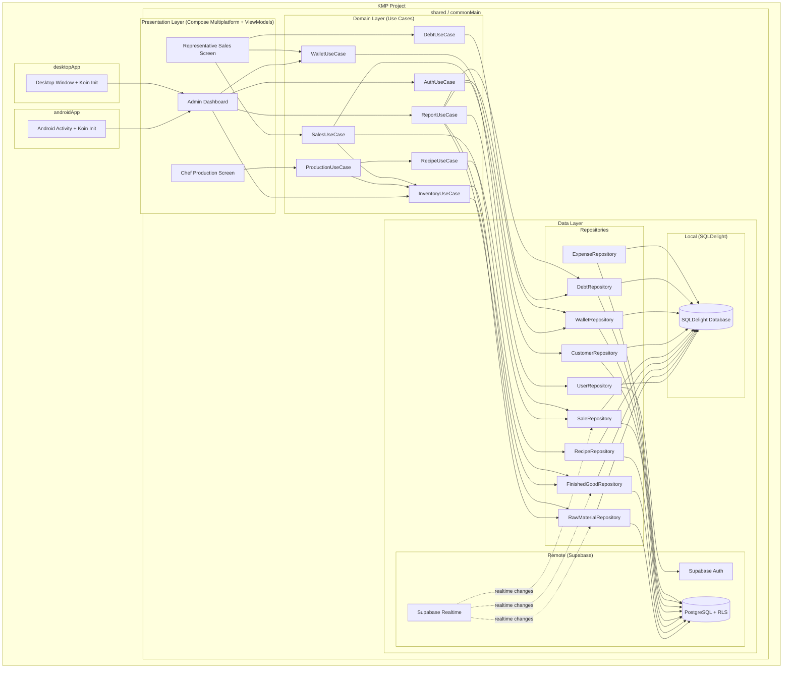

# Design Document: Sweet Lab ERP

## Overview

Sweet Lab ERP is a Kotlin Multiplatform (KMP) application targeting Android and Desktop that re-implements and extends the existing ChaOffice JavaFX desktop application for a confectionery factory. The system follows Clean Architecture with MVVM presentation, using SQLDelight for local persistence, Supabase (PostgreSQL + Auth + Realtime) for cloud services, Compose Multiplatform for the shared UI layer, and Koin for multiplatform dependency injection.

The existing ChaOffice project serves as the reference MVP. Its core patterns — service-layer business logic, SQLite-backed persistence, role-based auth, transactional billing with inventory deduction — map directly to the new architecture. The key additions are: recipe-based production, multi-wallet financials, customer debt tracking, real-time multi-user sync with offline support, and a Desktop target alongside Android.

## Architecture



### KMP Project Structure

```
sweet-lab-erp/
├── shared/
│   ├── build.gradle.kts
│   └── src/
│       ├── commonMain/kotlin/com/sweetlab/erp/
│       │   ├── domain/
│       │   │   ├── model/          # Domain data classes, enums, errors
│       │   │   ├── usecase/        # Use case interfaces + implementations
│       │   │   ├── rbac/           # Hand-rolled RBAC (Permission, RolePermissions)
│       │   │   └── validation/     # konform validators
│       │   ├── data/
│       │   │   ├── repository/     # Repository implementations
│       │   │   ├── local/          # SQLDelight driver expect/actual, queries
│       │   │   ├── remote/         # Supabase client wrappers
│       │   │   ├── sync/           # SyncManager, offline queue
│       │   │   └── mapper/         # Entity ↔ Domain mappers
│       │   └── presentation/
│       │       ├── navigation/     # Role-based nav graph
│       │       ├── viewmodel/      # ViewModels (common)
│       │       ├── screen/         # Shared Compose screens
│       │       └── component/      # Shared UI components
│       ├── commonMain/sqldelight/com/sweetlab/erp/
│       │   └── *.sq                # SQLDelight table definitions + queries
│       ├── androidMain/kotlin/com/sweetlab/erp/
│       │   ├── di/                 # Android-specific Koin modules
│       │   └── platform/           # Android actual declarations (SQLDriver, etc.)
│       └── desktopMain/kotlin/com/sweetlab/erp/
│           ├── di/                 # Desktop-specific Koin modules
│           └── platform/           # Desktop actual declarations (SQLDriver, etc.)
├── androidApp/
│   ├── build.gradle.kts
│   └── src/main/kotlin/com/sweetlab/erp/android/
│       └── MainActivity.kt         # Koin init + Compose entry
├── desktopApp/
│   ├── build.gradle.kts
│   └── src/main/kotlin/com/sweetlab/erp/desktop/
│       └── Main.kt                 # Koin init + Compose window
├── build.gradle.kts                # Root build
├── settings.gradle.kts
└── gradle.properties
```

### Layer Responsibilities

- **Presentation**: Compose Multiplatform screens + ViewModels in `commonMain`. Each role gets a distinct navigation graph. ViewModels expose UI state as `StateFlow` and delegate to use cases. Platform-specific UI (e.g., file pickers) uses `expect`/`actual`.
- **Domain**: Pure Kotlin use cases in `commonMain` with no platform dependencies. Each use case encapsulates one business operation (e.g., `ExecuteProductionUseCase` handles recipe validation, atomic inventory deduction, and production logging).
- **Data**: Repository implementations in `commonMain` that coordinate between SQLDelight (offline-first local source of truth) and Supabase (cloud sync). Repositories expose `Flow<T>` for reactive data.

### Sync Strategy

SQLDelight serves as the local source of truth. All reads come from SQLDelight. Writes go to SQLDelight first, then are pushed to Supabase PostgreSQL. Supabase Realtime channels push remote changes back to the local database.

**Offline writes**: When offline, writes are stored in a local `sync_queue` table in SQLDelight. On connectivity restore, queued items are pushed to Supabase in FIFO order.

**Conflict resolution**: Last-write-wins using `updated_at` timestamps. Conflicts are logged in a `conflict_log` table for admin review.

**Realtime subscriptions**: The app subscribes to Supabase Realtime channels for each table. Incoming changes are upserted into SQLDelight, triggering Flow emissions to the UI.

### RBAC Strategy

A hand-rolled RBAC system lives in `commonMain`. Three roles (Admin, Chef, Representative) map to a simple permission set. This can be swapped to Casbin4j later if needed.

Server-side enforcement uses Supabase Row-Level Security (RLS) policies on PostgreSQL. The user's role is stored in the `auth.users` metadata and referenced in RLS policies.

## Components and Interfaces

### Authentication & RBAC

```kotlin
// Domain models — commonMain
enum class UserRole { ADMIN, CHEF, REPRESENTATIVE }

data class AppUser(
    val id: String,
    val username: String,
    val fullName: String,
    val role: UserRole
)

// Hand-rolled RBAC — commonMain
enum class Permission {
    VIEW_ADMIN_DASHBOARD, MANAGE_USERS, MANAGE_RECIPES,
    VIEW_INVENTORY, MANAGE_INVENTORY,
    EXECUTE_PRODUCTION, VIEW_PRODUCTION_LOG,
    CREATE_SALE, VIEW_SALES, MANAGE_CUSTOMERS,
    MANAGE_WALLETS, VIEW_WALLETS, TRANSFER_FUNDS,
    RECORD_EXPENSE, VIEW_EXPENSES,
    COLLECT_PAYMENT, VIEW_DEBTS,
    VIEW_REPORTS, EXPORT_PDF
}

object RolePermissions {
    private val permissions: Map<UserRole, Set<Permission>> = mapOf(
        UserRole.ADMIN to Permission.entries.toSet(), // full access
        UserRole.CHEF to setOf(
            Permission.EXECUTE_PRODUCTION, Permission.VIEW_PRODUCTION_LOG,
            Permission.VIEW_INVENTORY
        ),
        UserRole.REPRESENTATIVE to setOf(
            Permission.CREATE_SALE, Permission.VIEW_SALES,
            Permission.MANAGE_CUSTOMERS, Permission.VIEW_WALLETS,
            Permission.RECORD_EXPENSE, Permission.VIEW_EXPENSES,
            Permission.COLLECT_PAYMENT, Permission.VIEW_DEBTS,
            Permission.VIEW_INVENTORY, Permission.MANAGE_INVENTORY
        )
    )

    fun hasPermission(role: UserRole, permission: Permission): Boolean =
        permissions[role]?.contains(permission) == true

    fun getPermissions(role: UserRole): Set<Permission> =
        permissions[role] ?: emptySet()
}

// Use case interface — commonMain
interface AuthUseCase {
    suspend fun login(email: String, password: String): Result<AppUser>
    suspend fun logout()
    suspend fun createUser(email: String, password: String, fullName: String, role: UserRole): Result<AppUser>
    suspend fun updateUserRole(userId: String, newRole: UserRole): Result<Unit>
    fun getCurrentUser(): Flow<AppUser?>
    fun isSessionValid(): Boolean
}
```

**Design Decision**: Supabase Auth handles credential storage and session tokens. The user's role is stored in `user_metadata` on the Supabase `auth.users` record and also in a custom `users` table for querying. RLS policies reference `auth.uid()` and the role from the `users` table to enforce server-side access control. The `RolePermissions` object in `commonMain` provides client-side permission checks. Session validity is checked against an 8-hour inactivity window stored locally via `kotlinx-datetime`.

### Inventory Management

```kotlin
// commonMain
data class RawMaterial(
    val id: String,
    val name: String,
    val unit: String,
    val currentQuantity: Double,
    val lastUpdated: Instant  // kotlinx-datetime
)

data class FinishedGood(
    val id: String,
    val name: String,
    val currentQuantity: Double,
    val unitPrice: Double,
    val lastUpdated: Instant
)

interface InventoryUseCase {
    fun getRawMaterials(): Flow<List<RawMaterial>>
    fun getFinishedGoods(): Flow<List<FinishedGood>>
    suspend fun addRawMaterialPurchase(materialId: String, quantity: Double): Result<RawMaterial>
    suspend fun deductRawMaterials(deductions: Map<String, Double>): Result<Unit>
    suspend fun addFinishedGoods(goodId: String, quantity: Double): Result<FinishedGood>
    suspend fun deductFinishedGoods(goodId: String, quantity: Double): Result<FinishedGood>
}
```

**Design Decision**: Inventory operations that cross multiple materials (production deductions) are wrapped in SQLDelight transactions to guarantee atomicity. If any single material has insufficient stock, the entire transaction rolls back. The `deductRawMaterials` method accepts a map of materialId→quantity so the caller (production use case) can pass all deductions at once. Timestamps use `kotlinx-datetime.Instant` for multiplatform compatibility.

### Recipe Management

```kotlin
// commonMain
data class RecipeIngredient(
    val rawMaterialId: String,
    val rawMaterialName: String,
    val requiredQuantity: Double
)

data class Recipe(
    val id: String,
    val name: String,
    val finishedGoodId: String,
    val finishedGoodName: String,
    val ingredients: List<RecipeIngredient>  // 1..10 items
)

interface RecipeUseCase {
    fun getRecipes(): Flow<List<Recipe>>
    suspend fun createRecipe(name: String, finishedGoodId: String, ingredients: List<RecipeIngredient>): Result<Recipe>
    suspend fun updateRecipe(recipe: Recipe): Result<Recipe>
    suspend fun deleteRecipe(recipeId: String): Result<Unit>
    suspend fun validateIngredients(ingredients: List<RecipeIngredient>): Result<Unit>
}
```

**Design Decision**: Recipe validation is a two-step process: (1) structural validation via konform (1–10 ingredients, positive quantities, unique material references), (2) referential validation (all referenced materials exist in inventory). Deletion is blocked if any `production_logs` row references the recipe, enforced via a SQLDelight query check.

### Production Execution

```kotlin
// commonMain
data class ProductionLog(
    val id: String,
    val recipeId: String,
    val recipeName: String,
    val chefId: String,
    val chefName: String,
    val productionQuantity: Int,
    val materialsConsumed: Map<String, Double>,
    val finishedGoodId: String,
    val timestamp: Instant
)

data class RecipeAvailability(
    val recipe: Recipe,
    val maxProducible: Int,
    val insufficientMaterials: List<String>
)

interface ProductionUseCase {
    suspend fun executeProduction(recipeId: String, quantity: Int): Result<ProductionLog>
    fun getRecipeAvailability(): Flow<List<RecipeAvailability>>
    fun getProductionHistory(): Flow<List<ProductionLog>>
}
```

**Design Decision**: `executeProduction` is the core transactional operation. It: (1) loads the recipe, (2) calculates total requirements (ingredient qty × production qty), (3) validates all materials have sufficient stock, (4) atomically deducts raw materials and increments the finished good, (5) writes the production log. All within a single SQLDelight transaction. The `RecipeAvailability` model pre-computes how many units of each recipe can be produced given current stock.

### Customer Management

```kotlin
// commonMain
data class Customer(
    val id: String,
    val name: String,
    val city: String,
    val mobile: String,
    val reliabilityRating: Int,  // 0-5 stars, 0 = initial
    val totalDebt: Double,
    val overdueDays: Int
)

interface CustomerUseCase {
    fun getCustomers(): Flow<List<Customer>>
    suspend fun createCustomer(name: String, city: String, mobile: String): Result<Customer>
    suspend fun updateReliabilityRating(customerId: String, rating: Int): Result<Unit>
    fun searchCustomers(query: String): Flow<List<Customer>>
}
```

**Design Decision**: `totalDebt` and `overdueDays` are computed fields derived from debt records. They are denormalized into the customer row for display performance but recalculated from source debt records during sync. Mobile uniqueness is enforced at both the SQLDelight (UNIQUE constraint) and Supabase (UNIQUE constraint + RLS) levels.

### Sales Transactions

```kotlin
// commonMain
data class SaleLineItem(
    val finishedGoodId: String,
    val finishedGoodName: String,
    val quantity: Int,
    val unitPrice: Double
)

data class Sale(
    val id: String,
    val customerId: String,
    val customerName: String,
    val lineItems: List<SaleLineItem>,
    val totalAmount: Double,
    val amountPaid: Double,
    val paymentWalletId: String,
    val timestamp: Instant
)

interface SalesUseCase {
    suspend fun createSale(
        customerId: String,
        lineItems: List<SaleLineItem>,
        amountPaid: Double,
        walletId: String
    ): Result<Sale>
    fun getSalesHistory(): Flow<List<Sale>>
    suspend fun generateReceipt(saleId: String): Result<Receipt>
}

data class Receipt(
    val sale: Sale,
    val customerDetails: Customer,
    val businessName: String,
    val remainingBalance: Double,
    val formattedDate: String
)
```

**Design Decision**: `createSale` orchestrates multiple operations in a SQLDelight transaction: (1) validate finished goods stock, (2) deduct inventory, (3) credit wallet with `amountPaid`, (4) if `amountPaid < totalAmount`, create a debt record for the difference. The `totalAmount` is always server-calculated as `sum(lineItem.quantity * lineItem.unitPrice)`. Receipt generation produces a `Receipt` data object that the presentation layer renders to PDF via OpenPDF (JVM, shared between Android and Desktop).

### Wallet Management

```kotlin
// commonMain
enum class WalletType { BANK, CASH, REPRESENTATIVE }

data class Wallet(
    val id: String,
    val name: String,
    val type: WalletType,
    val currentBalance: Double
)

data class WalletTransaction(
    val id: String,
    val walletId: String,
    val amount: Double,          // positive = credit, negative = debit
    val description: String,
    val relatedEntityId: String?,
    val timestamp: Instant
)

data class FundTransfer(
    val id: String,
    val sourceWalletId: String,
    val destinationWalletId: String,
    val amount: Double,
    val timestamp: Instant
)

interface WalletUseCase {
    fun getWallets(): Flow<List<Wallet>>
    fun getTransactionHistory(walletId: String): Flow<List<WalletTransaction>>
    suspend fun transferFunds(sourceId: String, destinationId: String, amount: Double): Result<FundTransfer>
    suspend fun creditWallet(walletId: String, amount: Double, description: String, relatedEntityId: String?): Result<Unit>
    suspend fun debitWallet(walletId: String, amount: Double, description: String, relatedEntityId: String?): Result<Unit>
}
```

**Design Decision**: All wallet mutations go through `creditWallet`/`debitWallet` which create `WalletTransaction` records for audit trail. `transferFunds` atomically debits source and credits destination in a single SQLDelight transaction. Balance checks happen inside the transaction to prevent race conditions.

### Debt Tracking

```kotlin
// commonMain
data class DebtRecord(
    val id: String,
    val customerId: String,
    val customerName: String,
    val saleId: String,
    val originalAmount: Double,
    val remainingAmount: Double,
    val saleDate: Instant,
    val overdueDays: Int,        // computed: (now - saleDate) in days
    val isCritical: Boolean,     // true if overdueDays > 30
    val isSettled: Boolean
)

data class DebtPayment(
    val id: String,
    val customerId: String,
    val amount: Double,
    val walletId: String,
    val appliedTo: List<DebtAllocation>,
    val timestamp: Instant
)

data class DebtAllocation(
    val debtRecordId: String,
    val amountApplied: Double
)

interface DebtUseCase {
    fun getActiveDebts(): Flow<List<DebtRecord>>
    fun getDebtAgingReport(): Flow<List<DebtRecord>>
    suspend fun recordPayment(customerId: String, amount: Double, walletId: String): Result<DebtPayment>
    suspend fun createDebtRecord(customerId: String, saleId: String, amount: Double): Result<DebtRecord>
}
```

**Design Decision**: `recordPayment` implements FIFO allocation — it sorts the customer's active debts by `saleDate` ascending, then applies the payment amount to each debt in order until the payment is exhausted. If a debt's `remainingAmount` reaches zero, it's marked as settled. The `overdueDays` and `isCritical` fields are computed at query time using `kotlinx-datetime` to calculate the difference between `Clock.System.now()` and `saleDate`.

### Expense Management

```kotlin
// commonMain
enum class ExpenseCategory { PURCHASE, OPERATING_COST }

data class Expense(
    val id: String,
    val description: String,
    val amount: Double,
    val category: ExpenseCategory,
    val walletId: String,
    val walletName: String,
    val recordedBy: String,
    val timestamp: Instant
)

interface ExpenseUseCase {
    suspend fun recordExpense(
        description: String,
        amount: Double,
        category: ExpenseCategory,
        walletId: String
    ): Result<Expense>
    fun getExpenses(startDate: Instant, endDate: Instant): Flow<List<Expense>>
    fun getExpensesByCategory(startDate: Instant, endDate: Instant): Flow<Map<ExpenseCategory, List<Expense>>>
}
```

**Design Decision**: `recordExpense` validates wallet balance via `WalletUseCase.debitWallet` before persisting the expense. If the wallet debit fails (insufficient funds), the expense is not created. Expense queries support date-range filtering for the report generator. All timestamps use `kotlinx-datetime.Instant`.

### Reporting & Invoicing

```kotlin
// commonMain
data class FinancialSummary(
    val totalRevenue: Double,
    val totalExpenses: Double,
    val netProfit: Double,
    val walletBalances: List<Wallet>,
    val dateRange: Pair<Instant, Instant>
)

data class InventoryReport(
    val rawMaterials: List<RawMaterialReport>,
    val finishedGoods: List<FinishedGoodReport>
)

data class RawMaterialReport(
    val material: RawMaterial,
    val isLowStock: Boolean
)

data class FinishedGoodReport(
    val good: FinishedGood,
    val isLowStock: Boolean
)

data class Invoice(
    val businessName: String,
    val customerName: String,
    val customerCity: String,
    val customerMobile: String,
    val lineItems: List<SaleLineItem>,
    val totalAmount: Double,
    val amountPaid: Double,
    val remainingBalance: Double,
    val date: String,
    val invoiceNumber: String
)

interface ReportUseCase {
    suspend fun getFinancialSummary(startDate: Instant, endDate: Instant): Result<FinancialSummary>
    suspend fun getInventoryReport(lowStockThreshold: Double): Result<InventoryReport>
    suspend fun generateInvoice(saleId: String): Result<Invoice>
    suspend fun exportToPdf(invoice: Invoice): Result<ByteArray>
}
```

**Design Decision**: Financial summary aggregates sales revenue from `SaleRepository` and expenses from `ExpenseRepository` for the date range. Net profit = revenue - expenses. Inventory report uses a configurable threshold (default: 10 units) to flag low-stock items. PDF generation uses OpenPDF (JVM library), which works on both Android and Desktop since both run on JVM. The `exportToPdf` implementation lives in `commonMain` (JVM-only targets).

### Offline Mode & Sync

```kotlin
// commonMain
enum class SyncStatus { SYNCED, PENDING, CONFLICT }

data class SyncQueueItem(
    val id: String,
    val entityType: String,
    val entityId: String,
    val operation: String,       // "CREATE", "UPDATE", "DELETE"
    val payload: String,         // JSON serialized entity
    val createdAt: Instant,
    val status: SyncStatus
)

data class ConflictLog(
    val id: String,
    val entityType: String,
    val entityId: String,
    val localVersion: String,
    val remoteVersion: String,
    val resolvedWith: String,    // "LOCAL" or "REMOTE"
    val timestamp: Instant
)

interface SyncManager {
    fun getSyncStatus(): Flow<SyncStatus>
    fun isOnline(): Flow<Boolean>
    suspend fun syncAll(): Result<Unit>
    suspend fun queueModification(entityType: String, entityId: String, operation: String, payload: String)
    fun getConflictLog(): Flow<List<ConflictLog>>
}
```

**Design Decision**: SQLDelight is the local source of truth. The `SyncManager` coordinates: (1) pushing local changes to Supabase via Ktor Client, (2) receiving remote changes via Supabase Realtime subscriptions, (3) tracking sync status for UI indicators, (4) logging conflicts for admin review. The sync queue is a SQLDelight table that tracks pending writes. On connectivity restore, items are processed in FIFO order. Last-write-wins is the conflict resolution strategy using `updated_at` timestamps. Kermit is used for structured logging of sync events.

### Data Persistence & Serialization

```kotlin
// commonMain — Kotlinx Serialization
@Serializable
data class SerializableRawMaterial(
    val id: String,
    val name: String,
    val unit: String,
    val currentQuantity: Double,
    @Serializable(with = InstantSerializer::class)
    val lastUpdated: Instant
)

// Mapper between domain and serializable models
object EntityMapper {
    fun RawMaterial.toSerializable(): SerializableRawMaterial = SerializableRawMaterial(
        id = id, name = name, unit = unit,
        currentQuantity = currentQuantity, lastUpdated = lastUpdated
    )
    fun SerializableRawMaterial.toDomain(): RawMaterial = RawMaterial(
        id = id, name = name, unit = unit,
        currentQuantity = currentQuantity, lastUpdated = lastUpdated
    )
}

// Schema validation using konform
val rawMaterialValidation = Validation<SerializableRawMaterial> {
    SerializableRawMaterial::name {
        minLength(1)
        maxLength(100)
    }
    SerializableRawMaterial::unit {
        minLength(1)
    }
    SerializableRawMaterial::currentQuantity {
        minimum(0.0)
    }
}

// Schema validator interface
interface SchemaValidator {
    fun <T : Any> validate(json: String, type: KClass<T>): Result<T>
}
```

**Design Decision**: Domain models and serializable models are kept separate to decouple business logic from serialization concerns. `Kotlinx Serialization` handles JSON encoding/decoding. `konform` provides declarative validation rules. The `SchemaValidator` checks that deserialized JSON conforms to expected field types and constraints before the data enters the application state. `kotlinx-datetime.Instant` is serialized via a custom serializer for JSON round-trip.

## Data Models

### SQLDelight Schema

#### Users.sq

```sql
CREATE TABLE users (
    id TEXT NOT NULL PRIMARY KEY,
    email TEXT NOT NULL UNIQUE,
    full_name TEXT NOT NULL,
    role TEXT NOT NULL,  -- "ADMIN", "CHEF", "REPRESENTATIVE"
    last_login_at TEXT,  -- ISO-8601 Instant
    session_expires_at TEXT,
    sync_status TEXT NOT NULL DEFAULT 'SYNCED',
    updated_at TEXT NOT NULL
);

selectAll:
SELECT * FROM users;

selectById:
SELECT * FROM users WHERE id = ?;

selectByEmail:
SELECT * FROM users WHERE email = ?;

insert:
INSERT OR REPLACE INTO users (id, email, full_name, role, last_login_at, session_expires_at, sync_status, updated_at)
VALUES (?, ?, ?, ?, ?, ?, ?, ?);

updateRole:
UPDATE users SET role = ?, sync_status = 'PENDING', updated_at = ? WHERE id = ?;

updateSession:
UPDATE users SET last_login_at = ?, session_expires_at = ?, updated_at = ? WHERE id = ?;
```

#### RawMaterials.sq

```sql
CREATE TABLE raw_materials (
    id TEXT NOT NULL PRIMARY KEY,
    name TEXT NOT NULL,
    unit TEXT NOT NULL,
    current_quantity REAL NOT NULL DEFAULT 0.0,
    last_updated TEXT NOT NULL,
    sync_status TEXT NOT NULL DEFAULT 'SYNCED',
    updated_at TEXT NOT NULL
);

selectAll:
SELECT * FROM raw_materials ORDER BY name;

selectById:
SELECT * FROM raw_materials WHERE id = ?;

insert:
INSERT OR REPLACE INTO raw_materials (id, name, unit, current_quantity, last_updated, sync_status, updated_at)
VALUES (?, ?, ?, ?, ?, ?, ?);

updateQuantity:
UPDATE raw_materials SET current_quantity = ?, last_updated = ?, sync_status = 'PENDING', updated_at = ? WHERE id = ?;

addQuantity:
UPDATE raw_materials SET current_quantity = current_quantity + ?, last_updated = ?, sync_status = 'PENDING', updated_at = ? WHERE id = ?;

deductQuantity:
UPDATE raw_materials SET current_quantity = current_quantity - ?, last_updated = ?, sync_status = 'PENDING', updated_at = ?
WHERE id = ? AND current_quantity >= ?;
```

#### FinishedGoods.sq

```sql
CREATE TABLE finished_goods (
    id TEXT NOT NULL PRIMARY KEY,
    name TEXT NOT NULL,
    current_quantity REAL NOT NULL DEFAULT 0.0,
    unit_price REAL NOT NULL DEFAULT 0.0,
    last_updated TEXT NOT NULL,
    sync_status TEXT NOT NULL DEFAULT 'SYNCED',
    updated_at TEXT NOT NULL
);

selectAll:
SELECT * FROM finished_goods ORDER BY name;

selectById:
SELECT * FROM finished_goods WHERE id = ?;

insert:
INSERT OR REPLACE INTO finished_goods (id, name, current_quantity, unit_price, last_updated, sync_status, updated_at)
VALUES (?, ?, ?, ?, ?, ?, ?);

addQuantity:
UPDATE finished_goods SET current_quantity = current_quantity + ?, last_updated = ?, sync_status = 'PENDING', updated_at = ? WHERE id = ?;

deductQuantity:
UPDATE finished_goods SET current_quantity = current_quantity - ?, last_updated = ?, sync_status = 'PENDING', updated_at = ?
WHERE id = ? AND current_quantity >= ?;
```

#### Recipes.sq

```sql
CREATE TABLE recipes (
    id TEXT NOT NULL PRIMARY KEY,
    name TEXT NOT NULL,
    finished_good_id TEXT NOT NULL REFERENCES finished_goods(id),
    sync_status TEXT NOT NULL DEFAULT 'SYNCED',
    updated_at TEXT NOT NULL
);

CREATE TABLE recipe_ingredients (
    id TEXT NOT NULL PRIMARY KEY,
    recipe_id TEXT NOT NULL REFERENCES recipes(id) ON DELETE CASCADE,
    raw_material_id TEXT NOT NULL REFERENCES raw_materials(id),
    required_quantity REAL NOT NULL,
    UNIQUE(recipe_id, raw_material_id)
);

selectAllRecipes:
SELECT * FROM recipes ORDER BY name;

selectRecipeById:
SELECT * FROM recipes WHERE id = ?;

selectIngredientsByRecipeId:
SELECT ri.*, rm.name AS raw_material_name
FROM recipe_ingredients ri
JOIN raw_materials rm ON ri.raw_material_id = rm.id
WHERE ri.recipe_id = ?;

insertRecipe:
INSERT OR REPLACE INTO recipes (id, name, finished_good_id, sync_status, updated_at) VALUES (?, ?, ?, ?, ?);

insertIngredient:
INSERT OR REPLACE INTO recipe_ingredients (id, recipe_id, raw_material_id, required_quantity) VALUES (?, ?, ?, ?);

deleteRecipe:
DELETE FROM recipes WHERE id = ?;

deleteIngredientsByRecipeId:
DELETE FROM recipe_ingredients WHERE recipe_id = ?;

countProductionLogsForRecipe:
SELECT COUNT(*) FROM production_logs WHERE recipe_id = ?;
```

#### ProductionLogs.sq

```sql
CREATE TABLE production_logs (
    id TEXT NOT NULL PRIMARY KEY,
    recipe_id TEXT NOT NULL REFERENCES recipes(id),
    chef_id TEXT NOT NULL REFERENCES users(id),
    production_quantity INTEGER NOT NULL,
    materials_consumed_json TEXT NOT NULL,  -- JSON map
    finished_good_id TEXT NOT NULL REFERENCES finished_goods(id),
    timestamp TEXT NOT NULL,
    sync_status TEXT NOT NULL DEFAULT 'SYNCED',
    updated_at TEXT NOT NULL
);

selectAll:
SELECT * FROM production_logs ORDER BY timestamp DESC;

selectByChefId:
SELECT * FROM production_logs WHERE chef_id = ? ORDER BY timestamp DESC;

insert:
INSERT INTO production_logs (id, recipe_id, chef_id, production_quantity, materials_consumed_json, finished_good_id, timestamp, sync_status, updated_at)
VALUES (?, ?, ?, ?, ?, ?, ?, ?, ?);
```

#### Customers.sq

```sql
CREATE TABLE customers (
    id TEXT NOT NULL PRIMARY KEY,
    name TEXT NOT NULL,
    city TEXT NOT NULL,
    mobile TEXT NOT NULL UNIQUE,
    reliability_rating INTEGER NOT NULL DEFAULT 0,
    sync_status TEXT NOT NULL DEFAULT 'SYNCED',
    updated_at TEXT NOT NULL
);

selectAll:
SELECT * FROM customers ORDER BY name;

selectById:
SELECT * FROM customers WHERE id = ?;

search:
SELECT * FROM customers
WHERE name LIKE '%' || ? || '%'
   OR city LIKE '%' || ? || '%'
   OR mobile LIKE '%' || ? || '%'
ORDER BY name;

insert:
INSERT OR REPLACE INTO customers (id, name, city, mobile, reliability_rating, sync_status, updated_at)
VALUES (?, ?, ?, ?, ?, ?, ?);

updateRating:
UPDATE customers SET reliability_rating = ?, sync_status = 'PENDING', updated_at = ? WHERE id = ?;

selectByMobile:
SELECT * FROM customers WHERE mobile = ?;
```

#### Sales.sq

```sql
CREATE TABLE sales (
    id TEXT NOT NULL PRIMARY KEY,
    customer_id TEXT NOT NULL REFERENCES customers(id),
    total_amount REAL NOT NULL,
    amount_paid REAL NOT NULL,
    payment_wallet_id TEXT NOT NULL REFERENCES wallets(id),
    timestamp TEXT NOT NULL,
    sync_status TEXT NOT NULL DEFAULT 'SYNCED',
    updated_at TEXT NOT NULL
);

CREATE TABLE sale_line_items (
    id TEXT NOT NULL PRIMARY KEY,
    sale_id TEXT NOT NULL REFERENCES sales(id) ON DELETE CASCADE,
    finished_good_id TEXT NOT NULL,
    finished_good_name TEXT NOT NULL,
    quantity INTEGER NOT NULL,
    unit_price REAL NOT NULL
);

selectAllSales:
SELECT * FROM sales ORDER BY timestamp DESC;

selectSaleById:
SELECT * FROM sales WHERE id = ?;

selectLineItemsBySaleId:
SELECT * FROM sale_line_items WHERE sale_id = ?;

insertSale:
INSERT INTO sales (id, customer_id, total_amount, amount_paid, payment_wallet_id, timestamp, sync_status, updated_at)
VALUES (?, ?, ?, ?, ?, ?, ?, ?);

insertLineItem:
INSERT INTO sale_line_items (id, sale_id, finished_good_id, finished_good_name, quantity, unit_price)
VALUES (?, ?, ?, ?, ?, ?);

selectSalesInDateRange:
SELECT * FROM sales WHERE timestamp >= ? AND timestamp <= ? ORDER BY timestamp DESC;
```

#### Wallets.sq

```sql
CREATE TABLE wallets (
    id TEXT NOT NULL PRIMARY KEY,
    name TEXT NOT NULL,
    type TEXT NOT NULL,  -- "BANK", "CASH", "REPRESENTATIVE"
    current_balance REAL NOT NULL DEFAULT 0.0,
    sync_status TEXT NOT NULL DEFAULT 'SYNCED',
    updated_at TEXT NOT NULL
);

CREATE TABLE wallet_transactions (
    id TEXT NOT NULL PRIMARY KEY,
    wallet_id TEXT NOT NULL REFERENCES wallets(id),
    amount REAL NOT NULL,
    description TEXT NOT NULL,
    related_entity_id TEXT,
    timestamp TEXT NOT NULL,
    sync_status TEXT NOT NULL DEFAULT 'SYNCED',
    updated_at TEXT NOT NULL
);

selectAllWallets:
SELECT * FROM wallets ORDER BY name;

selectWalletById:
SELECT * FROM wallets WHERE id = ?;

creditWallet:
UPDATE wallets SET current_balance = current_balance + ?, sync_status = 'PENDING', updated_at = ? WHERE id = ?;

debitWallet:
UPDATE wallets SET current_balance = current_balance - ?, sync_status = 'PENDING', updated_at = ?
WHERE id = ? AND current_balance >= ?;

insertTransaction:
INSERT INTO wallet_transactions (id, wallet_id, amount, description, related_entity_id, timestamp, sync_status, updated_at)
VALUES (?, ?, ?, ?, ?, ?, ?, ?);

selectTransactionsByWalletId:
SELECT * FROM wallet_transactions WHERE wallet_id = ? ORDER BY timestamp DESC;
```

#### DebtRecords.sq

```sql
CREATE TABLE debt_records (
    id TEXT NOT NULL PRIMARY KEY,
    customer_id TEXT NOT NULL REFERENCES customers(id),
    sale_id TEXT NOT NULL REFERENCES sales(id),
    original_amount REAL NOT NULL,
    remaining_amount REAL NOT NULL,
    sale_date TEXT NOT NULL,
    is_settled INTEGER NOT NULL DEFAULT 0,
    sync_status TEXT NOT NULL DEFAULT 'SYNCED',
    updated_at TEXT NOT NULL
);

selectActiveDebts:
SELECT * FROM debt_records WHERE is_settled = 0 ORDER BY sale_date ASC;

selectActiveDebtsByCustomer:
SELECT * FROM debt_records WHERE customer_id = ? AND is_settled = 0 ORDER BY sale_date ASC;

selectAllForAgingReport:
SELECT dr.*, c.name AS customer_name
FROM debt_records dr
JOIN customers c ON dr.customer_id = c.id
WHERE dr.is_settled = 0
ORDER BY dr.sale_date ASC;

insert:
INSERT INTO debt_records (id, customer_id, sale_id, original_amount, remaining_amount, sale_date, is_settled, sync_status, updated_at)
VALUES (?, ?, ?, ?, ?, ?, ?, ?, ?);

updateRemainingAmount:
UPDATE debt_records SET remaining_amount = ?, is_settled = ?, sync_status = 'PENDING', updated_at = ? WHERE id = ?;

selectTotalDebtByCustomer:
SELECT COALESCE(SUM(remaining_amount), 0.0) FROM debt_records WHERE customer_id = ? AND is_settled = 0;
```

#### Expenses.sq

```sql
CREATE TABLE expenses (
    id TEXT NOT NULL PRIMARY KEY,
    description TEXT NOT NULL,
    amount REAL NOT NULL,
    category TEXT NOT NULL,  -- "PURCHASE", "OPERATING_COST"
    wallet_id TEXT NOT NULL REFERENCES wallets(id),
    recorded_by TEXT NOT NULL REFERENCES users(id),
    timestamp TEXT NOT NULL,
    sync_status TEXT NOT NULL DEFAULT 'SYNCED',
    updated_at TEXT NOT NULL
);

selectAll:
SELECT * FROM expenses ORDER BY timestamp DESC;

selectInDateRange:
SELECT * FROM expenses WHERE timestamp >= ? AND timestamp <= ? ORDER BY timestamp DESC;

selectByCategoryInDateRange:
SELECT * FROM expenses WHERE category = ? AND timestamp >= ? AND timestamp <= ? ORDER BY timestamp DESC;

insert:
INSERT INTO expenses (id, description, amount, category, wallet_id, recorded_by, timestamp, sync_status, updated_at)
VALUES (?, ?, ?, ?, ?, ?, ?, ?, ?);

selectTotalInDateRange:
SELECT COALESCE(SUM(amount), 0.0) FROM expenses WHERE timestamp >= ? AND timestamp <= ?;
```

#### SyncQueue.sq

```sql
CREATE TABLE sync_queue (
    id TEXT NOT NULL PRIMARY KEY,
    entity_type TEXT NOT NULL,
    entity_id TEXT NOT NULL,
    operation TEXT NOT NULL,  -- "CREATE", "UPDATE", "DELETE"
    payload TEXT NOT NULL,
    created_at TEXT NOT NULL,
    status TEXT NOT NULL DEFAULT 'PENDING'
);

CREATE TABLE conflict_log (
    id TEXT NOT NULL PRIMARY KEY,
    entity_type TEXT NOT NULL,
    entity_id TEXT NOT NULL,
    local_version TEXT NOT NULL,
    remote_version TEXT NOT NULL,
    resolved_with TEXT NOT NULL,  -- "LOCAL", "REMOTE"
    timestamp TEXT NOT NULL
);

selectPendingQueue:
SELECT * FROM sync_queue WHERE status = 'PENDING' ORDER BY created_at ASC;

insertQueueItem:
INSERT INTO sync_queue (id, entity_type, entity_id, operation, payload, created_at, status)
VALUES (?, ?, ?, ?, ?, ?, ?);

updateQueueStatus:
UPDATE sync_queue SET status = ? WHERE id = ?;

deleteQueueItem:
DELETE FROM sync_queue WHERE id = ?;

insertConflict:
INSERT INTO conflict_log (id, entity_type, entity_id, local_version, remote_version, resolved_with, timestamp)
VALUES (?, ?, ?, ?, ?, ?, ?);

selectConflicts:
SELECT * FROM conflict_log ORDER BY timestamp DESC;

countPending:
SELECT COUNT(*) FROM sync_queue WHERE status = 'PENDING';
```

### Supabase PostgreSQL Schema & Row-Level Security

#### PostgreSQL Tables

```sql
-- Users table (mirrors auth.users metadata)
CREATE TABLE public.users (
    id UUID PRIMARY KEY REFERENCES auth.users(id) ON DELETE CASCADE,
    email TEXT NOT NULL UNIQUE,
    full_name TEXT NOT NULL,
    role TEXT NOT NULL CHECK (role IN ('ADMIN', 'CHEF', 'REPRESENTATIVE')),
    last_login_at TIMESTAMPTZ,
    updated_at TIMESTAMPTZ NOT NULL DEFAULT now()
);

CREATE TABLE public.raw_materials (
    id UUID PRIMARY KEY DEFAULT gen_random_uuid(),
    name TEXT NOT NULL,
    unit TEXT NOT NULL,
    current_quantity DOUBLE PRECISION NOT NULL DEFAULT 0.0 CHECK (current_quantity >= 0),
    last_updated TIMESTAMPTZ NOT NULL DEFAULT now(),
    updated_at TIMESTAMPTZ NOT NULL DEFAULT now()
);

CREATE TABLE public.finished_goods (
    id UUID PRIMARY KEY DEFAULT gen_random_uuid(),
    name TEXT NOT NULL,
    current_quantity DOUBLE PRECISION NOT NULL DEFAULT 0.0 CHECK (current_quantity >= 0),
    unit_price DOUBLE PRECISION NOT NULL DEFAULT 0.0 CHECK (unit_price >= 0),
    last_updated TIMESTAMPTZ NOT NULL DEFAULT now(),
    updated_at TIMESTAMPTZ NOT NULL DEFAULT now()
);

CREATE TABLE public.recipes (
    id UUID PRIMARY KEY DEFAULT gen_random_uuid(),
    name TEXT NOT NULL,
    finished_good_id UUID NOT NULL REFERENCES public.finished_goods(id),
    updated_at TIMESTAMPTZ NOT NULL DEFAULT now()
);

CREATE TABLE public.recipe_ingredients (
    id UUID PRIMARY KEY DEFAULT gen_random_uuid(),
    recipe_id UUID NOT NULL REFERENCES public.recipes(id) ON DELETE CASCADE,
    raw_material_id UUID NOT NULL REFERENCES public.raw_materials(id),
    required_quantity DOUBLE PRECISION NOT NULL CHECK (required_quantity > 0),
    UNIQUE(recipe_id, raw_material_id)
);

CREATE TABLE public.production_logs (
    id UUID PRIMARY KEY DEFAULT gen_random_uuid(),
    recipe_id UUID NOT NULL REFERENCES public.recipes(id),
    chef_id UUID NOT NULL REFERENCES public.users(id),
    production_quantity INTEGER NOT NULL CHECK (production_quantity > 0),
    materials_consumed_json JSONB NOT NULL,
    finished_good_id UUID NOT NULL REFERENCES public.finished_goods(id),
    timestamp TIMESTAMPTZ NOT NULL DEFAULT now(),
    updated_at TIMESTAMPTZ NOT NULL DEFAULT now()
);

CREATE TABLE public.customers (
    id UUID PRIMARY KEY DEFAULT gen_random_uuid(),
    name TEXT NOT NULL,
    city TEXT NOT NULL,
    mobile TEXT NOT NULL UNIQUE,
    reliability_rating INTEGER NOT NULL DEFAULT 0 CHECK (reliability_rating >= 0 AND reliability_rating <= 5),
    updated_at TIMESTAMPTZ NOT NULL DEFAULT now()
);

CREATE TABLE public.sales (
    id UUID PRIMARY KEY DEFAULT gen_random_uuid(),
    customer_id UUID NOT NULL REFERENCES public.customers(id),
    total_amount DOUBLE PRECISION NOT NULL CHECK (total_amount >= 0),
    amount_paid DOUBLE PRECISION NOT NULL CHECK (amount_paid >= 0),
    payment_wallet_id UUID NOT NULL REFERENCES public.wallets(id),
    timestamp TIMESTAMPTZ NOT NULL DEFAULT now(),
    updated_at TIMESTAMPTZ NOT NULL DEFAULT now()
);

CREATE TABLE public.sale_line_items (
    id UUID PRIMARY KEY DEFAULT gen_random_uuid(),
    sale_id UUID NOT NULL REFERENCES public.sales(id) ON DELETE CASCADE,
    finished_good_id UUID NOT NULL,
    finished_good_name TEXT NOT NULL,
    quantity INTEGER NOT NULL CHECK (quantity > 0),
    unit_price DOUBLE PRECISION NOT NULL CHECK (unit_price >= 0)
);

CREATE TABLE public.wallets (
    id UUID PRIMARY KEY DEFAULT gen_random_uuid(),
    name TEXT NOT NULL,
    type TEXT NOT NULL CHECK (type IN ('BANK', 'CASH', 'REPRESENTATIVE')),
    current_balance DOUBLE PRECISION NOT NULL DEFAULT 0.0,
    updated_at TIMESTAMPTZ NOT NULL DEFAULT now()
);

CREATE TABLE public.wallet_transactions (
    id UUID PRIMARY KEY DEFAULT gen_random_uuid(),
    wallet_id UUID NOT NULL REFERENCES public.wallets(id),
    amount DOUBLE PRECISION NOT NULL,
    description TEXT NOT NULL,
    related_entity_id UUID,
    timestamp TIMESTAMPTZ NOT NULL DEFAULT now(),
    updated_at TIMESTAMPTZ NOT NULL DEFAULT now()
);

CREATE TABLE public.debt_records (
    id UUID PRIMARY KEY DEFAULT gen_random_uuid(),
    customer_id UUID NOT NULL REFERENCES public.customers(id),
    sale_id UUID NOT NULL REFERENCES public.sales(id),
    original_amount DOUBLE PRECISION NOT NULL CHECK (original_amount > 0),
    remaining_amount DOUBLE PRECISION NOT NULL CHECK (remaining_amount >= 0),
    sale_date TIMESTAMPTZ NOT NULL,
    is_settled BOOLEAN NOT NULL DEFAULT false,
    updated_at TIMESTAMPTZ NOT NULL DEFAULT now()
);

CREATE TABLE public.expenses (
    id UUID PRIMARY KEY DEFAULT gen_random_uuid(),
    description TEXT NOT NULL,
    amount DOUBLE PRECISION NOT NULL CHECK (amount > 0),
    category TEXT NOT NULL CHECK (category IN ('PURCHASE', 'OPERATING_COST')),
    wallet_id UUID NOT NULL REFERENCES public.wallets(id),
    recorded_by UUID NOT NULL REFERENCES public.users(id),
    timestamp TIMESTAMPTZ NOT NULL DEFAULT now(),
    updated_at TIMESTAMPTZ NOT NULL DEFAULT now()
);
```

#### Row-Level Security Policies

```sql
-- Enable RLS on all tables
ALTER TABLE public.users ENABLE ROW LEVEL SECURITY;
ALTER TABLE public.raw_materials ENABLE ROW LEVEL SECURITY;
ALTER TABLE public.finished_goods ENABLE ROW LEVEL SECURITY;
ALTER TABLE public.recipes ENABLE ROW LEVEL SECURITY;
ALTER TABLE public.recipe_ingredients ENABLE ROW LEVEL SECURITY;
ALTER TABLE public.production_logs ENABLE ROW LEVEL SECURITY;
ALTER TABLE public.customers ENABLE ROW LEVEL SECURITY;
ALTER TABLE public.sales ENABLE ROW LEVEL SECURITY;
ALTER TABLE public.sale_line_items ENABLE ROW LEVEL SECURITY;
ALTER TABLE public.wallets ENABLE ROW LEVEL SECURITY;
ALTER TABLE public.wallet_transactions ENABLE ROW LEVEL SECURITY;
ALTER TABLE public.debt_records ENABLE ROW LEVEL SECURITY;
ALTER TABLE public.expenses ENABLE ROW LEVEL SECURITY;

-- Helper function: get current user's role
CREATE OR REPLACE FUNCTION public.get_user_role()
RETURNS TEXT AS $$
  SELECT role FROM public.users WHERE id = auth.uid();
$$ LANGUAGE sql SECURITY DEFINER STABLE;

-- USERS: Admins can CRUD, others can read own profile
CREATE POLICY "admins_manage_users" ON public.users
    FOR ALL USING (public.get_user_role() = 'ADMIN');
CREATE POLICY "users_read_own" ON public.users
    FOR SELECT USING (id = auth.uid());

-- RAW MATERIALS: All authenticated can read; Admin + Representative can write
CREATE POLICY "authenticated_read_materials" ON public.raw_materials
    FOR SELECT USING (auth.uid() IS NOT NULL);
CREATE POLICY "admin_rep_write_materials" ON public.raw_materials
    FOR ALL USING (public.get_user_role() IN ('ADMIN', 'REPRESENTATIVE'));

-- FINISHED GOODS: All authenticated can read; Admin can write; production/sales modify quantities
CREATE POLICY "authenticated_read_goods" ON public.finished_goods
    FOR SELECT USING (auth.uid() IS NOT NULL);
CREATE POLICY "admin_write_goods" ON public.finished_goods
    FOR ALL USING (public.get_user_role() = 'ADMIN');
CREATE POLICY "chef_rep_update_goods" ON public.finished_goods
    FOR UPDATE USING (public.get_user_role() IN ('CHEF', 'REPRESENTATIVE'));

-- RECIPES: All authenticated can read; Admin can CRUD
CREATE POLICY "authenticated_read_recipes" ON public.recipes
    FOR SELECT USING (auth.uid() IS NOT NULL);
CREATE POLICY "admin_manage_recipes" ON public.recipes
    FOR ALL USING (public.get_user_role() = 'ADMIN');
CREATE POLICY "authenticated_read_ingredients" ON public.recipe_ingredients
    FOR SELECT USING (auth.uid() IS NOT NULL);
CREATE POLICY "admin_manage_ingredients" ON public.recipe_ingredients
    FOR ALL USING (public.get_user_role() = 'ADMIN');

-- PRODUCTION LOGS: Chef can insert; all authenticated can read
CREATE POLICY "authenticated_read_production" ON public.production_logs
    FOR SELECT USING (auth.uid() IS NOT NULL);
CREATE POLICY "chef_insert_production" ON public.production_logs
    FOR INSERT WITH CHECK (public.get_user_role() = 'CHEF' AND chef_id = auth.uid());

-- CUSTOMERS: Representative + Admin can CRUD
CREATE POLICY "authenticated_read_customers" ON public.customers
    FOR SELECT USING (auth.uid() IS NOT NULL);
CREATE POLICY "rep_admin_manage_customers" ON public.customers
    FOR ALL USING (public.get_user_role() IN ('ADMIN', 'REPRESENTATIVE'));

-- SALES: Representative can insert; all authenticated can read
CREATE POLICY "authenticated_read_sales" ON public.sales
    FOR SELECT USING (auth.uid() IS NOT NULL);
CREATE POLICY "rep_insert_sales" ON public.sales
    FOR INSERT WITH CHECK (public.get_user_role() IN ('ADMIN', 'REPRESENTATIVE'));
CREATE POLICY "authenticated_read_line_items" ON public.sale_line_items
    FOR SELECT USING (auth.uid() IS NOT NULL);
CREATE POLICY "rep_insert_line_items" ON public.sale_line_items
    FOR INSERT WITH CHECK (public.get_user_role() IN ('ADMIN', 'REPRESENTATIVE'));

-- WALLETS: Admin + Representative can manage; all can read
CREATE POLICY "authenticated_read_wallets" ON public.wallets
    FOR SELECT USING (auth.uid() IS NOT NULL);
CREATE POLICY "admin_rep_manage_wallets" ON public.wallets
    FOR ALL USING (public.get_user_role() IN ('ADMIN', 'REPRESENTATIVE'));
CREATE POLICY "authenticated_read_wallet_tx" ON public.wallet_transactions
    FOR SELECT USING (auth.uid() IS NOT NULL);
CREATE POLICY "admin_rep_insert_wallet_tx" ON public.wallet_transactions
    FOR INSERT WITH CHECK (public.get_user_role() IN ('ADMIN', 'REPRESENTATIVE'));

-- DEBT RECORDS: Admin + Representative can manage
CREATE POLICY "authenticated_read_debts" ON public.debt_records
    FOR SELECT USING (auth.uid() IS NOT NULL);
CREATE POLICY "admin_rep_manage_debts" ON public.debt_records
    FOR ALL USING (public.get_user_role() IN ('ADMIN', 'REPRESENTATIVE'));

-- EXPENSES: Representative can insert; Admin can read all
CREATE POLICY "admin_read_expenses" ON public.expenses
    FOR SELECT USING (public.get_user_role() = 'ADMIN');
CREATE POLICY "rep_manage_own_expenses" ON public.expenses
    FOR ALL USING (public.get_user_role() = 'REPRESENTATIVE' AND recorded_by = auth.uid());
```

### Koin Dependency Injection Setup

```kotlin
// commonMain — shared DI modules
val domainModule = module {
    single<AuthUseCase> { AuthUseCaseImpl(get(), get()) }
    single<InventoryUseCase> { InventoryUseCaseImpl(get(), get()) }
    single<RecipeUseCase> { RecipeUseCaseImpl(get(), get()) }
    single<ProductionUseCase> { ProductionUseCaseImpl(get(), get(), get()) }
    single<CustomerUseCase> { CustomerUseCaseImpl(get()) }
    single<SalesUseCase> { SalesUseCaseImpl(get(), get(), get(), get()) }
    single<WalletUseCase> { WalletUseCaseImpl(get()) }
    single<DebtUseCase> { DebtUseCaseImpl(get(), get()) }
    single<ExpenseUseCase> { ExpenseUseCaseImpl(get(), get()) }
    single<ReportUseCase> { ReportUseCaseImpl(get(), get(), get(), get(), get()) }
    single<SyncManager> { SyncManagerImpl(get(), get(), get()) }
}

val dataModule = module {
    single<UserRepository> { UserRepositoryImpl(get(), get()) }
    single<RawMaterialRepository> { RawMaterialRepositoryImpl(get(), get()) }
    single<FinishedGoodRepository> { FinishedGoodRepositoryImpl(get(), get()) }
    single<RecipeRepository> { RecipeRepositoryImpl(get(), get()) }
    single<SaleRepository> { SaleRepositoryImpl(get(), get()) }
    single<CustomerRepository> { CustomerRepositoryImpl(get(), get()) }
    single<WalletRepository> { WalletRepositoryImpl(get(), get()) }
    single<DebtRepository> { DebtRepositoryImpl(get(), get()) }
    single<ExpenseRepository> { ExpenseRepositoryImpl(get(), get()) }
}

// commonMain — Supabase client
val supabaseModule = module {
    single {
        createSupabaseClient(
            supabaseUrl = BuildConfig.SUPABASE_URL,
            supabaseKey = BuildConfig.SUPABASE_ANON_KEY
        ) {
            install(Auth)
            install(Postgrest)
            install(Realtime)
        }
    }
}

// androidMain — platform-specific
val androidPlatformModule = module {
    single<SqlDriver> {
        AndroidSqliteDriver(SweetLabDatabase.Schema, get(), "sweetlab.db")
    }
    single { SweetLabDatabase(get()) }
}

// desktopMain — platform-specific
val desktopPlatformModule = module {
    single<SqlDriver> {
        JdbcSqliteDriver("jdbc:sqlite:sweetlab.db").also {
            SweetLabDatabase.Schema.create(it)
        }
    }
    single { SweetLabDatabase(get()) }
}
```

### Platform SQLDriver (expect/actual)

```kotlin
// commonMain
expect class DatabaseDriverFactory {
    fun createDriver(): SqlDriver
}

// androidMain
actual class DatabaseDriverFactory(private val context: Context) {
    actual fun createDriver(): SqlDriver =
        AndroidSqliteDriver(SweetLabDatabase.Schema, context, "sweetlab.db")
}

// desktopMain
actual class DatabaseDriverFactory {
    actual fun createDriver(): SqlDriver =
        JdbcSqliteDriver("jdbc:sqlite:sweetlab.db").also {
            SweetLabDatabase.Schema.create(it)
        }
}
```

## Correctness Properties

*A property is a characteristic or behavior that should hold true across all valid executions of a system — essentially, a formal statement about what the system should do. Properties serve as the bridge between human-readable specifications and machine-verifiable correctness guarantees.*

### Property 1: Role-based navigation routing

*For any* user with a valid role (Admin, Chef, or Representative), after login the navigation destination SHALL match the role's designated screen (Admin → Admin Dashboard, Chef → Production Screen, Representative → Sales Screen).

**Validates: Requirements 1.3, 2.4, 2.5, 2.6**

### Property 2: Role permission enforcement

*For any* user with a given role and *for any* resource outside that role's permission set, the Auth_Service SHALL deny access. Conversely, for any resource within the role's permission set, access SHALL be granted.

**Validates: Requirements 1.5, 2.1**

### Property 3: Invalid credentials rejection

*For any* login attempt with invalid credentials (wrong email, wrong password, or both), the Auth_Service SHALL reject the attempt and the returned error message SHALL NOT reveal which specific field was incorrect.

**Validates: Requirements 1.2**

### Property 4: User creation field validation

*For any* user creation request missing any of the required fields (email, password, fullName, role), the Auth_Service SHALL reject the request. For any request with all required fields present and valid, the creation SHALL succeed.

**Validates: Requirements 2.2**

### Property 5: Role update applies on next login

*For any* user whose role is updated by an admin, after the update and a subsequent login, the user's session SHALL reflect the new role.

**Validates: Requirements 2.3**

### Property 6: Raw material purchase increases quantity

*For any* raw material with current quantity Q and *for any* positive purchase amount A, after recording the purchase the material's quantity SHALL equal Q + A.

**Validates: Requirements 3.2**

### Property 7: Insufficient raw material stock rejection

*For any* raw material with current quantity Q and *for any* deduction amount D where D > Q, the Inventory_Service SHALL reject the operation and the material's quantity SHALL remain Q.

**Validates: Requirements 3.4**

### Property 8: Production run inventory conservation

*For any* valid production run with recipe R and production quantity P, after execution: (a) each raw material's quantity SHALL decrease by exactly (ingredient.requiredQuantity × P), and (b) the finished good's quantity SHALL increase by exactly P.

**Validates: Requirements 5.1, 5.2, 3.3, 6.2**

### Property 9: Production run rejection on insufficient stock

*For any* production run where at least one required raw material has insufficient stock, the Recipe_Engine SHALL reject the entire run, no material quantities SHALL change, and the error SHALL list all materials with insufficient quantities.

**Validates: Requirements 5.3**

### Property 10: Production log completeness

*For any* completed production run, the resulting ProductionLog SHALL contain the chef's identity, recipe used, production quantity, timestamp, and all material quantities consumed.

**Validates: Requirements 5.4**

### Property 11: Recipe availability calculation

*For any* recipe, the maxProducible value SHALL equal the minimum of (material.currentQuantity / ingredient.requiredQuantity) across all ingredients, floored to an integer.

**Validates: Requirements 5.5**

### Property 12: Recipe ingredient count bounds

*For any* recipe creation or update, the Recipe_Engine SHALL accept recipes with 1 to 10 ingredients inclusive and reject recipes with 0 or more than 10 ingredients.

**Validates: Requirements 4.1**

### Property 13: Recipe material existence validation

*For any* recipe that references a raw material not present in the Inventory_Service, the Recipe_Engine SHALL reject the recipe and identify the missing material(s).

**Validates: Requirements 4.2, 4.4**

### Property 14: Recipe deletion protection

*For any* recipe that has been referenced by at least one ProductionLog entry, deletion SHALL be rejected. For any recipe with zero ProductionLog references, deletion SHALL succeed.

**Validates: Requirements 4.5**

### Property 15: Finished good insufficient stock rejection

*For any* finished good with current quantity Q and *for any* sale quantity S where S > Q, the Inventory_Service SHALL reject the sale and the quantity SHALL remain Q.

**Validates: Requirements 6.4**

### Property 16: Customer initial reliability rating

*For any* newly created customer, the reliability rating SHALL be 0 stars, and the stored customer SHALL contain the provided name, city, and mobile number.

**Validates: Requirements 7.1**

### Property 17: Customer reliability rating bounds

*For any* reliability rating update, the Sales_Service SHALL accept values in [1, 5] and reject values outside that range.

**Validates: Requirements 7.2**

### Property 18: Customer mobile uniqueness

*For any* two customer creation requests with the same mobile number, the second request SHALL be rejected.

**Validates: Requirements 7.3**

### Property 19: Customer search correctness

*For any* customer in the system and *for any* search query that matches the customer's name, city, or mobile number, the customer SHALL appear in the search results.

**Validates: Requirements 7.4**

### Property 20: Sale total calculation

*For any* list of SaleLineItems, the sale total SHALL equal the sum of (quantity × unitPrice) for each line item.

**Validates: Requirements 8.4**

### Property 21: Sale financial orchestration

*For any* sale with totalAmount T and amountPaid P: (a) the specified wallet's balance SHALL increase by P, (b) inventory SHALL decrease by the sold quantities, and (c) if P < T, a debt record SHALL be created for (T - P) linked to the customer.

**Validates: Requirements 8.1, 8.2, 8.3**

### Property 22: Receipt completeness

*For any* finalized sale, the generated receipt SHALL contain the customer name, itemized list of products, total amount, amount paid, remaining balance, and date.

**Validates: Requirements 8.5**

### Property 23: Wallet transfer conservation

*For any* fund transfer of amount A between source wallet (balance S) and destination wallet (balance D) where A ≤ S, after the transfer: source balance SHALL equal S - A and destination balance SHALL equal D + A. The total balance across both wallets SHALL be conserved.

**Validates: Requirements 9.2**

### Property 24: Wallet insufficient funds rejection

*For any* wallet with balance B and *for any* debit operation (transfer, expense, or other) with amount A where A > B, the operation SHALL be rejected and the wallet balance SHALL remain B.

**Validates: Requirements 9.3, 11.3**

### Property 25: Expense wallet debit

*For any* expense with amount A recorded against a wallet with sufficient balance B, the wallet balance SHALL decrease by A and the expense record SHALL contain description, amount, category, wallet source, and timestamp.

**Validates: Requirements 9.4, 11.1, 11.2**

### Property 26: Customer payment reduces debt and credits wallet

*For any* customer payment of amount A against wallet W, the wallet balance SHALL increase by A and the customer's total outstanding debt SHALL decrease by A.

**Validates: Requirements 9.5**

### Property 27: Debt overdue days calculation

*For any* unpaid debt record with sale date SD and current date CD, the overdue days SHALL equal (CD - SD) in days.

**Validates: Requirements 10.1**

### Property 28: Debt aging report sort order

*For any* set of active debt records, the debt aging report SHALL return them sorted by overdue days in descending order.

**Validates: Requirements 10.2**

### Property 29: Debt payment FIFO allocation

*For any* customer with multiple active debts and *for any* payment amount, the payment SHALL be applied to debts in order of oldest sale date first. Each debt's remaining amount SHALL decrease by the allocated portion, and debts fully paid SHALL be marked as settled.

**Validates: Requirements 10.3, 10.4**

### Property 30: Debt critical flag threshold

*For any* debt record, isCritical SHALL be true if and only if overdueDays > 30.

**Validates: Requirements 10.5**

### Property 31: Expense report grouping and totals

*For any* set of expenses in a date range, the expense report SHALL group expenses by category, each category subtotal SHALL equal the sum of expense amounts in that category, and the grand total SHALL equal the sum of all subtotals.

**Validates: Requirements 11.4**

### Property 32: Financial summary calculation

*For any* date range, the financial summary SHALL report: totalRevenue = sum of all sale totalAmounts, totalExpenses = sum of all expense amounts, and netProfit = totalRevenue - totalExpenses.

**Validates: Requirements 12.1**

### Property 33: Low stock alert accuracy

*For any* inventory item and *for any* configurable threshold T, the item SHALL be flagged as low stock if and only if its current quantity is below T.

**Validates: Requirements 12.2**

### Property 34: Invoice completeness

*For any* generated invoice, the document SHALL contain the business name, customer name, customer city, customer mobile, itemized products with quantities and prices, total amount, payment status, and date.

**Validates: Requirements 12.3**

### Property 35: Offline queue persistence

*For any* data modification performed while offline, the modification SHALL be stored in the sync queue with the correct entity type, entity ID, operation, and payload.

**Validates: Requirements 13.1**

### Property 36: Sync queue FIFO ordering

*For any* set of queued modifications, synchronization SHALL process them in the order they were created (ascending by createdAt timestamp).

**Validates: Requirements 13.2**

### Property 37: Conflict resolution logging

*For any* synchronization conflict, the Sync_Engine SHALL apply last-write-wins and create a ConflictLog entry containing the entity type, entity ID, local version, remote version, and resolution strategy.

**Validates: Requirements 13.3**

### Property 38: JSON serialization round-trip

*For any* valid application object (RawMaterial, FinishedGood, Recipe, Sale, Customer, Wallet, DebtRecord, Expense, ProductionLog), serializing to JSON then deserializing SHALL produce an object equivalent to the original.

**Validates: Requirements 14.1, 14.2, 14.3**

### Property 39: Schema validation rejects malformed data

*For any* JSON string that does not conform to the expected schema (missing required fields, wrong types, out-of-range values), the SchemaValidator SHALL reject it and return a descriptive error.

**Validates: Requirements 14.4**

## Error Handling

### Error Model

```kotlin
// commonMain
sealed class AppError {
    data class AuthenticationError(val message: String) : AppError()
    data class AuthorizationError(val requiredRole: UserRole, val actualRole: UserRole) : AppError()
    data class InsufficientStockError(
        val materialName: String,
        val available: Double,
        val requested: Double
    ) : AppError()
    data class InsufficientFundsError(
        val walletName: String,
        val available: Double,
        val requested: Double
    ) : AppError()
    data class ValidationError(val field: String, val message: String) : AppError()
    data class DuplicateError(val field: String, val value: String) : AppError()
    data class DeletionBlockedError(val entity: String, val reason: String) : AppError()
    data class SyncConflictError(val entityType: String, val entityId: String) : AppError()
    data class NetworkError(val cause: Throwable) : AppError()
    data class UnknownError(val cause: Throwable) : AppError()
}
```

### Error Handling Strategy

| Scenario | Error Type | Handling |
|---|---|---|
| Invalid login credentials | `AuthenticationError` | Display generic "Invalid credentials" message (Req 1.2) |
| Unauthorized resource access | `AuthorizationError` | Deny access, show "Access denied" (Req 1.5) |
| Raw material stock insufficient | `InsufficientStockError` | Reject operation, show material name and shortfall (Req 3.4, 5.3) |
| Finished good stock insufficient | `InsufficientStockError` | Reject sale, show product and shortfall (Req 6.4) |
| Wallet balance insufficient | `InsufficientFundsError` | Reject transfer/expense, show wallet and shortfall (Req 9.3, 11.3) |
| Duplicate customer mobile | `DuplicateError` | Reject creation, show conflicting mobile (Req 7.3) |
| Recipe with missing materials | `ValidationError` | Reject recipe, list missing materials (Req 4.4) |
| Recipe deletion with production refs | `DeletionBlockedError` | Reject deletion, explain production log dependency (Req 4.5) |
| Sync conflict | `SyncConflictError` | Apply last-write-wins, log conflict (Req 13.3) |
| Network loss | `NetworkError` | Switch to offline mode, queue writes (Req 13.1) |

### Transaction Safety

All multi-step operations use SQLDelight `transaction { }` blocks to ensure atomicity:

- **Production execution**: Deduct all raw materials + increment finished good + write production log
- **Sale creation**: Deduct inventory + credit wallet + create debt record (if partial payment)
- **Fund transfer**: Debit source wallet + credit destination wallet + write transaction records
- **Debt payment**: Credit wallet + allocate payment across debts (FIFO) + mark settled debts

If any step within a transaction fails, the entire transaction rolls back and the appropriate `AppError` is returned.

## Testing Strategy

### Testing Framework

- **Unit Tests**: JUnit 5 with `kotlinx-coroutines-test` for suspend function testing
- **Property-Based Tests**: Kotest property testing module (`io.kotest:kotest-property`)
- **Mocking**: MockK for repository mocking
- **Test Database**: SQLDelight in-memory database (JdbcSqliteDriver with `:memory:`) for DAO tests

### Property-Based Testing Configuration

Each property test MUST:
- Use Kotest's `forAll` or `checkAll` with a minimum of 100 iterations
- Reference the design document property number in a comment tag
- Use custom `Arb` (arbitrary) generators for domain objects

Tag format: `// Feature: sweet-lab-erp, Property {N}: {title}`

Each correctness property from the design document MUST be implemented by a SINGLE property-based test.

### Custom Generators

```kotlin
// commonTest — shared Arb generators
fun Arb.Companion.rawMaterial(): Arb<RawMaterial> = arbitrary {
    RawMaterial(
        id = Arb.uuid().bind().toString(),
        name = Arb.string(minSize = 1, maxSize = 50).bind(),
        unit = Arb.element("kg", "liters", "pieces", "grams").bind(),
        currentQuantity = Arb.double(min = 0.0, max = 10000.0).bind(),
        lastUpdated = Arb.instant(
            minValue = Instant.parse("2024-01-01T00:00:00Z"),
            maxValue = Instant.parse("2025-12-31T23:59:59Z")
        ).bind()
    )
}

fun Arb.Companion.finishedGood(): Arb<FinishedGood> = arbitrary {
    FinishedGood(
        id = Arb.uuid().bind().toString(),
        name = Arb.string(minSize = 1, maxSize = 50).bind(),
        currentQuantity = Arb.double(min = 0.0, max = 10000.0).bind(),
        unitPrice = Arb.double(min = 0.01, max = 9999.99).bind(),
        lastUpdated = Arb.instant(
            minValue = Instant.parse("2024-01-01T00:00:00Z"),
            maxValue = Instant.parse("2025-12-31T23:59:59Z")
        ).bind()
    )
}

fun Arb.Companion.customer(): Arb<Customer> = arbitrary {
    Customer(
        id = Arb.uuid().bind().toString(),
        name = Arb.string(minSize = 1, maxSize = 100).bind(),
        city = Arb.string(minSize = 1, maxSize = 50).bind(),
        mobile = Arb.string(minSize = 10, maxSize = 15, codepoints = Arb.int(48..57).map { Codepoint(it) }).bind(),
        reliabilityRating = Arb.int(0..5).bind(),
        totalDebt = Arb.double(min = 0.0, max = 100000.0).bind(),
        overdueDays = Arb.int(0..365).bind()
    )
}

fun Arb.Companion.wallet(): Arb<Wallet> = arbitrary {
    Wallet(
        id = Arb.uuid().bind().toString(),
        name = Arb.string(minSize = 1, maxSize = 30).bind(),
        type = Arb.element(WalletType.BANK, WalletType.CASH, WalletType.REPRESENTATIVE).bind(),
        currentBalance = Arb.double(min = 0.0, max = 1000000.0).bind()
    )
}

fun Arb.Companion.saleLineItem(): Arb<SaleLineItem> = arbitrary {
    SaleLineItem(
        finishedGoodId = Arb.uuid().bind().toString(),
        finishedGoodName = Arb.string(minSize = 1, maxSize = 50).bind(),
        quantity = Arb.int(1..100).bind(),
        unitPrice = Arb.double(min = 0.01, max = 9999.99).bind()
    )
}
```

### Test Organization

```
shared/src/commonTest/kotlin/com/sweetlab/erp/
├── domain/
│   ├── auth/
│   │   ├── AuthUseCaseTest.kt              // Unit tests for auth logic
│   │   └── AuthPropertyTest.kt             // Properties 1-5
│   ├── inventory/
│   │   ├── InventoryUseCaseTest.kt          // Unit tests for inventory
│   │   └── InventoryPropertyTest.kt         // Properties 6-8, 15
│   ├── recipe/
│   │   ├── RecipeUseCaseTest.kt             // Unit tests for recipes
│   │   └── RecipePropertyTest.kt            // Properties 11-14
│   ├── production/
│   │   ├── ProductionUseCaseTest.kt         // Unit tests for production
│   │   └── ProductionPropertyTest.kt        // Properties 8-11
│   ├── customer/
│   │   ├── CustomerUseCaseTest.kt           // Unit tests for customers
│   │   └── CustomerPropertyTest.kt          // Properties 16-19
│   ├── sales/
│   │   ├── SalesUseCaseTest.kt              // Unit tests for sales
│   │   └── SalesPropertyTest.kt             // Properties 20-22
│   ├── wallet/
│   │   ├── WalletUseCaseTest.kt             // Unit tests for wallets
│   │   └── WalletPropertyTest.kt            // Properties 23-26
│   ├── debt/
│   │   ├── DebtUseCaseTest.kt               // Unit tests for debt tracking
│   │   └── DebtPropertyTest.kt              // Properties 27-30
│   ├── expense/
│   │   ├── ExpenseUseCaseTest.kt            // Unit tests for expenses
│   │   └── ExpensePropertyTest.kt           // Property 25, 31
│   ├── report/
│   │   ├── ReportUseCaseTest.kt             // Unit tests for reports
│   │   └── ReportPropertyTest.kt            // Properties 32-34
│   └── sync/
│       ├── SyncManagerTest.kt               // Unit tests for sync
│       └── SyncPropertyTest.kt              // Properties 35-37
├── data/
│   ├── serialization/
│   │   └── SerializationPropertyTest.kt     // Properties 38-39
│   └── local/
│       ├── RawMaterialQueriesTest.kt        // SQLDelight query tests
│       ├── CustomerQueriesTest.kt
│       ├── SaleQueriesTest.kt
│       ├── WalletQueriesTest.kt
│       └── DebtRecordQueriesTest.kt
└── generators/
    └── DomainGenerators.kt                  // Shared Arb generators
```

### Dual Testing Approach

- **Unit tests** (JUnit 5): Specific examples, edge cases, error conditions, SQLDelight query correctness, integration between components
- **Property tests** (Kotest): Universal properties across randomized inputs, covering all 39 correctness properties

Unit tests focus on:
- Specific known-good and known-bad inputs
- Edge cases (zero quantities, empty lists, boundary values)
- Error condition paths (insufficient stock, invalid credentials)
- SQLDelight query correctness with in-memory database

Property tests focus on:
- Universal invariants (inventory conservation, wallet balance conservation)
- Round-trip properties (serialization/deserialization)
- Ordering properties (debt FIFO, report sorting)
- Computation correctness (sale totals, overdue days, financial summaries)
