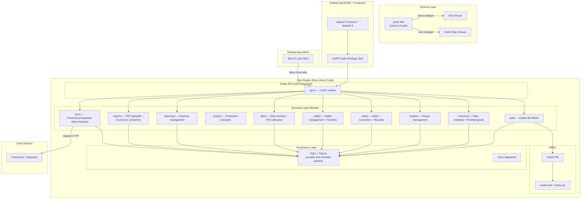

# Design Document: Sweet Lab ERP

## Overview

Sweet Lab ERP is a polyglot, multi-platform ERP-lite system for a confectionery factory. The architecture follows a shared-core pattern:

1. **Schema Layer** — Protocol Buffers (`.proto`) define the canonical data models. `prost` generates Rust structs, `wire` (Square) generates Kotlin data classes.
2. **Core Engine** — A pure Rust library crate (`sweet-lab-core`) implements all business logic, RBAC (Casbin-RS), persistence (SQLx/SQLite), report generation (`genpdf`/`rust_xlsxwriter`), and sync (`reqwest`). The core has zero platform dependencies.
3. **Android App** — Kotlin + Jetpack Compose + Material Design 3. Calls the Rust core via UniFFI-generated Kotlin bindings (JNI).
4. **Desktop App** — Slint UI framework (Rust-native). Calls the Rust core directly — no FFI needed.

The existing ChaOffice JavaFX project serves as the reference MVP. Core business logic is re-implemented in Rust with equivalent data models and service layers. The SQLite schema maps to SQLx migrations.

## Architecture



### Project Structure

```
sweet-lab/
├── proto/                          ← Protobuf schema (source of truth)
│   ├── buf.yaml
│   └── sweetlab/
│       ├── models.proto            ← All entity definitions
│       ├── auth.proto              ← Auth/RBAC messages
│       └── services.proto          ← Service request/response messages
│
├── core/                           ← Rust core engine (library crate)
│   ├── Cargo.toml
│   ├── build.rs                    ← prost codegen + UniFFI
│   ├── src/
│   │   ├── lib.rs
│   │   ├── models/                 ← Generated from proto + domain extensions
│   │   │   ├── mod.rs
│   │   │   ├── generated.rs        ← prost-generated structs
│   │   │   └── domain.rs           ← Domain-specific extensions and conversions
│   │   ├── auth/
│   │   │   ├── mod.rs
│   │   │   ├── service.rs          ← Authentication logic (argon2)
│   │   │   ├── session.rs          ← Session management (chrono)
│   │   │   └── rbac.rs             ← Casbin-RS integration
│   │   ├── inventory/
│   │   │   ├── mod.rs
│   │   │   ├── raw_materials.rs
│   │   │   └── finished_goods.rs
│   │   ├── recipes/
│   │   │   ├── mod.rs
│   │   │   ├── management.rs       ← CRUD + validation
│   │   │   └── production.rs       ← Production execution
│   │   ├── sales/
│   │   │   ├── mod.rs
│   │   │   ├── transactions.rs     ← Sale orchestration
│   │   │   ├── customers.rs        ← Customer management
│   │   │   └── receipts.rs         ← Receipt generation
│   │   ├── wallet/
│   │   │   ├── mod.rs
│   │   │   └── service.rs          ← Wallet ops + fund transfers
│   │   ├── debt/
│   │   │   ├── mod.rs
│   │   │   └── tracker.rs          ← FIFO allocation + aging
│   │   ├── expenses/
│   │   │   ├── mod.rs
│   │   │   └── service.rs
│   │   ├── reports/
│   │   │   ├── mod.rs
│   │   │   ├── financial.rs        ← Financial summaries
│   │   │   ├── inventory_report.rs ← Inventory + low-stock alerts
│   │   │   ├── pdf.rs              ← genpdf integration
│   │   │   └── excel.rs            ← rust_xlsxwriter integration
│   │   ├── sync/
│   │   │   ├── mod.rs
│   │   │   ├── engine.rs           ← Sync orchestration
│   │   │   ├── queue.rs            ← Offline queue management
│   │   │   └── conflict.rs         ← Conflict resolution
│   │   ├── persistence/
│   │   │   ├── mod.rs
│   │   │   ├── db.rs               ← SQLx pool setup
│   │   │   └── queries/            ← Organized query modules
│   │   ├── error.rs                ← thiserror error types
│   │   └── api.rs                  ← UniFFI-exported public API
│   ├── migrations/                 ← SQLx migrations
│   │   ├── 001_create_users.sql
│   │   ├── 002_create_raw_materials.sql
│   │   ├── 003_create_finished_goods.sql
│   │   ├── 004_create_recipes.sql
│   │   ├── 005_create_production_logs.sql
│   │   ├── 006_create_customers.sql
│   │   ├── 007_create_sales.sql
│   │   ├── 008_create_wallets.sql
│   │   ├── 009_create_debt_records.sql
│   │   ├── 010_create_expenses.sql
│   │   └── 011_create_sync_tables.sql
│   ├── policies/                   ← Casbin policy files
│   │   ├── model.conf
│   │   └── policy.csv
│   ├── uniffi.toml                 ← UniFFI configuration
│   └── tests/                      ← proptest property-based tests
│       ├── generators.rs           ← Shared proptest generators
│       ├── auth_properties.rs
│       ├── inventory_properties.rs
│       ├── production_properties.rs
│       ├── recipe_properties.rs
│       ├── sales_properties.rs
│       ├── customer_properties.rs
│       ├── wallet_properties.rs
│       ├── debt_properties.rs
│       ├── expense_properties.rs
│       ├── report_properties.rs
│       ├── sync_properties.rs
│       └── serialization_properties.rs
│
├── android/                        ← Android app (Kotlin + Compose)
│   ├── build.gradle.kts
│   └── app/src/main/
│       ├── kotlin/org/sweetlab/
│       │   ├── SweetLabApp.kt
│       │   ├── ui/
│       │   │   ├── auth/
│       │   │   ├── admin/
│       │   │   ├── chef/
│       │   │   └── representative/
│       │   └── bindings/           ← UniFFI-generated Kotlin bindings
│       └── AndroidManifest.xml
│
├── desktop/                        ← Desktop app (Slint)
│   ├── Cargo.toml
│   ├── src/main.rs
│   └── ui/                         ← .slint UI files
│       ├── app.slint
│       ├── login.slint
│       ├── admin/
│       ├── chef/
│       └── representative/
│
└── docs/                           ← Architecture documentation
```

### Layer Responsibilities

- **Schema Layer**: Protobuf `.proto` files define every entity, enum, and service message. `prost` generates Rust structs in `build.rs`. `wire` generates Kotlin data classes for the Android app. The proto files are the single source of truth — no manual model duplication.
- **Core Engine**: Pure Rust library crate. All business logic, validation, persistence, RBAC, and report generation live here. Zero platform dependencies. Exposed to Android via UniFFI, consumed directly by the Desktop app.
- **Persistence**: SQLx with SQLite. Compile-time checked queries. Versioned migrations from day one. All multi-step operations use SQLx transactions for atomicity.
- **RBAC**: Casbin-RS with a declarative RBAC model (`model.conf`) and policy rules (`policy.csv`). SQLite adapter stores policies. Three roles: Admin, Chef, Representative.
- **Android UI**: Thin Kotlin/Compose shell. Calls Rust core via UniFFI-generated Kotlin bindings (JNI). Material Design 3. Kotlin Coroutines for async calls.
- **Desktop UI**: Thin Slint shell. Calls Rust core directly (same language). Cross-platform rendering.
- **Sync**: `reqwest`-based HTTP client talks to PowerSync/Supabase. Offline writes queued in SQLite. FIFO sync on reconnect. Last-write-wins conflict resolution.

### Sync Strategy

SQLite (via SQLx) serves as the local source of truth. All reads come from SQLite. Writes go to SQLite first, then are pushed to the cloud via `reqwest`.

**Offline writes**: When offline, writes are stored in a local `sync_queue` table. On connectivity restore, queued items are pushed in FIFO order.

**Conflict resolution**: Last-write-wins using `updated_at` timestamps. Conflicts are logged in a `conflict_log` table for admin review.

**Cloud sync**: PowerSync or Supabase REST API via `reqwest`. The sync engine polls for remote changes and upserts them into the local SQLite database.

### RBAC Strategy (Casbin-RS)

Casbin-RS provides declarative RBAC. The policy model defines the access control structure, and policy rules define specific permissions.

**model.conf** (RBAC model):
```ini
[request_definition]
r = sub, obj, act

[policy_definition]
p = sub, obj, act

[role_definition]
g = _, _

[policy_effect]
e = some(where (p.eft == allow))

[matchers]
m = g(r.sub, p.sub) && r.obj == p.obj && r.act == p.act
```

**policy.csv** (role permissions):
```csv
p, admin, admin_dashboard, view
p, admin, users, manage
p, admin, recipes, manage
p, admin, inventory, view
p, admin, inventory, manage
p, admin, production, view
p, admin, sales, view
p, admin, sales, create
p, admin, customers, manage
p, admin, wallets, manage
p, admin, wallets, view
p, admin, funds, transfer
p, admin, expenses, view
p, admin, expenses, record
p, admin, debts, view
p, admin, debts, collect
p, admin, reports, view
p, admin, reports, export

p, chef, production, execute
p, chef, production, view
p, chef, inventory, view

p, representative, sales, create
p, representative, sales, view
p, representative, customers, manage
p, representative, wallets, view
p, representative, expenses, record
p, representative, expenses, view
p, representative, debts, view
p, representative, debts, collect
p, representative, inventory, view
p, representative, inventory, manage

g, admin, admin
g, chef, chef
g, representative, representative
```

## Components and Interfaces

### Error Types (thiserror)

```rust
use thiserror::Error;

#[derive(Error, Debug)]
pub enum AppError {
    #[error("Authentication failed: {message}")]
    Authentication { message: String },

    #[error("Authorization denied: role {actual_role} cannot access {resource}")]
    Authorization { actual_role: String, resource: String },

    #[error("Insufficient stock: {material_name} has {available}, requested {requested}")]
    InsufficientStock {
        material_name: String,
        available: f64,
        requested: f64,
    },

    #[error("Insufficient funds: {wallet_name} has {available}, requested {requested}")]
    InsufficientFunds {
        wallet_name: String,
        available: f64,
        requested: f64,
    },

    #[error("Validation error: {field} — {message}")]
    Validation { field: String, message: String },

    #[error("Duplicate: {field} = {value} already exists")]
    Duplicate { field: String, value: String },

    #[error("Deletion blocked: {entity} — {reason}")]
    DeletionBlocked { entity: String, reason: String },

    #[error("Sync conflict: {entity_type}/{entity_id}")]
    SyncConflict { entity_type: String, entity_id: String },

    #[error("Network error: {0}")]
    Network(#[from] reqwest::Error),

    #[error("Database error: {0}")]
    Database(#[from] sqlx::Error),

    #[error("Serialization error: {0}")]
    Serialization(String),

    #[error("Unknown error: {0}")]
    Unknown(String),
}

pub type AppResult<T> = Result<T, AppError>;
```

### Authentication & RBAC

```rust
use chrono::{DateTime, Utc, Duration};
use uuid::Uuid;
use serde::{Serialize, Deserialize};

#[derive(Debug, Clone, Serialize, Deserialize, PartialEq)]
pub enum UserRole {
    Admin,
    Chef,
    Representative,
}

#[derive(Debug, Clone, Serialize, Deserialize)]
pub struct AppUser {
    pub id: Uuid,
    pub username: String,
    pub full_name: String,
    pub role: UserRole,
    pub password_hash: String,
}

#[derive(Debug, Clone)]
pub struct Session {
    pub user_id: Uuid,
    pub role: UserRole,
    pub created_at: DateTime<Utc>,
    pub last_activity: DateTime<Utc>,
    pub expires_at: DateTime<Utc>,
}

impl Session {
    pub fn is_valid(&self, now: DateTime<Utc>) -> bool {
        now < self.expires_at
            && (now - self.last_activity) < Duration::hours(8)
    }
}

/// Auth service trait — implemented in auth/service.rs
#[uniffi::export]
pub trait AuthService: Send + Sync {
    async fn login(&self, username: &str, password: &str) -> AppResult<Session>;
    async fn logout(&self, session_id: Uuid) -> AppResult<()>;
    async fn create_user(
        &self,
        username: &str,
        password: &str,
        full_name: &str,
        role: UserRole,
    ) -> AppResult<AppUser>;
    async fn update_user_role(&self, user_id: Uuid, new_role: UserRole) -> AppResult<()>;
    async fn check_permission(
        &self,
        role: &UserRole,
        resource: &str,
        action: &str,
    ) -> AppResult<bool>;
}
```

### Inventory Management

```rust
use chrono::{DateTime, Utc};
use uuid::Uuid;
use serde::{Serialize, Deserialize};
use std::collections::HashMap;

#[derive(Debug, Clone, Serialize, Deserialize)]
pub struct RawMaterial {
    pub id: Uuid,
    pub name: String,
    pub unit: String,
    pub current_quantity: f64,
    pub last_updated: DateTime<Utc>,
}

#[derive(Debug, Clone, Serialize, Deserialize)]
pub struct FinishedGood {
    pub id: Uuid,
    pub name: String,
    pub current_quantity: f64,
    pub unit_price: f64,
    pub last_updated: DateTime<Utc>,
}

/// Inventory service trait — implemented in inventory/
#[uniffi::export]
pub trait InventoryService: Send + Sync {
    async fn get_raw_materials(&self) -> AppResult<Vec<RawMaterial>>;
    async fn get_finished_goods(&self) -> AppResult<Vec<FinishedGood>>;
    async fn add_raw_material_purchase(
        &self,
        material_id: Uuid,
        quantity: f64,
    ) -> AppResult<RawMaterial>;
    async fn deduct_raw_materials(
        &self,
        deductions: HashMap<Uuid, f64>,
    ) -> AppResult<()>;
    async fn add_finished_goods(
        &self,
        good_id: Uuid,
        quantity: f64,
    ) -> AppResult<FinishedGood>;
    async fn deduct_finished_goods(
        &self,
        good_id: Uuid,
        quantity: f64,
    ) -> AppResult<FinishedGood>;
}
```

### Recipe Management

```rust
#[derive(Debug, Clone, Serialize, Deserialize)]
pub struct RecipeIngredient {
    pub raw_material_id: Uuid,
    pub raw_material_name: String,
    pub required_quantity: f64,
}

#[derive(Debug, Clone, Serialize, Deserialize)]
pub struct Recipe {
    pub id: Uuid,
    pub name: String,
    pub finished_good_id: Uuid,
    pub finished_good_name: String,
    pub ingredients: Vec<RecipeIngredient>, // 1..=10 items
}

#[derive(Debug, Clone, Serialize, Deserialize)]
pub struct RecipeAvailability {
    pub recipe: Recipe,
    pub max_producible: i32,
    pub insufficient_materials: Vec<String>,
}

/// Recipe service trait — implemented in recipes/management.rs
#[uniffi::export]
pub trait RecipeService: Send + Sync {
    async fn get_recipes(&self) -> AppResult<Vec<Recipe>>;
    async fn create_recipe(
        &self,
        name: &str,
        finished_good_id: Uuid,
        ingredients: Vec<RecipeIngredient>,
    ) -> AppResult<Recipe>;
    async fn update_recipe(&self, recipe: Recipe) -> AppResult<Recipe>;
    async fn delete_recipe(&self, recipe_id: Uuid) -> AppResult<()>;
    async fn validate_ingredients(
        &self,
        ingredients: &[RecipeIngredient],
    ) -> AppResult<()>;
}
```

### Production Execution

```rust
#[derive(Debug, Clone, Serialize, Deserialize)]
pub struct ProductionLog {
    pub id: Uuid,
    pub recipe_id: Uuid,
    pub recipe_name: String,
    pub chef_id: Uuid,
    pub chef_name: String,
    pub production_quantity: i32,
    pub materials_consumed: HashMap<Uuid, f64>,
    pub finished_good_id: Uuid,
    pub timestamp: DateTime<Utc>,
}

/// Production service trait — implemented in recipes/production.rs
#[uniffi::export]
pub trait ProductionService: Send + Sync {
    async fn execute_production(
        &self,
        recipe_id: Uuid,
        quantity: i32,
        chef_id: Uuid,
    ) -> AppResult<ProductionLog>;
    async fn get_recipe_availability(&self) -> AppResult<Vec<RecipeAvailability>>;
    async fn get_production_history(&self) -> AppResult<Vec<ProductionLog>>;
}
```

### Customer Management

```rust
#[derive(Debug, Clone, Serialize, Deserialize)]
pub struct Customer {
    pub id: Uuid,
    pub name: String,
    pub city: String,
    pub mobile: String,
    pub reliability_rating: i32, // 0-5, 0 = initial
    pub total_debt: f64,         // computed from debt records
    pub overdue_days: i32,       // computed from debt records
}

/// Customer service trait — implemented in sales/customers.rs
#[uniffi::export]
pub trait CustomerService: Send + Sync {
    async fn get_customers(&self) -> AppResult<Vec<Customer>>;
    async fn create_customer(
        &self,
        name: &str,
        city: &str,
        mobile: &str,
    ) -> AppResult<Customer>;
    async fn update_reliability_rating(
        &self,
        customer_id: Uuid,
        rating: i32,
    ) -> AppResult<()>;
    async fn search_customers(&self, query: &str) -> AppResult<Vec<Customer>>;
}
```

### Sales Transactions

```rust
#[derive(Debug, Clone, Serialize, Deserialize)]
pub struct SaleLineItem {
    pub finished_good_id: Uuid,
    pub finished_good_name: String,
    pub quantity: i32,
    pub unit_price: f64,
}

#[derive(Debug, Clone, Serialize, Deserialize)]
pub struct Sale {
    pub id: Uuid,
    pub customer_id: Uuid,
    pub customer_name: String,
    pub line_items: Vec<SaleLineItem>,
    pub total_amount: f64,
    pub amount_paid: f64,
    pub payment_wallet_id: Uuid,
    pub timestamp: DateTime<Utc>,
}

#[derive(Debug, Clone, Serialize, Deserialize)]
pub struct Receipt {
    pub sale: Sale,
    pub customer_name: String,
    pub customer_city: String,
    pub customer_mobile: String,
    pub business_name: String,
    pub remaining_balance: f64,
    pub formatted_date: String,
}

/// Sales service trait — implemented in sales/transactions.rs
#[uniffi::export]
pub trait SalesService: Send + Sync {
    async fn create_sale(
        &self,
        customer_id: Uuid,
        line_items: Vec<SaleLineItem>,
        amount_paid: f64,
        wallet_id: Uuid,
    ) -> AppResult<Sale>;
    async fn get_sales_history(&self) -> AppResult<Vec<Sale>>;
    async fn generate_receipt(&self, sale_id: Uuid) -> AppResult<Receipt>;
}
```

### Wallet Management

```rust
#[derive(Debug, Clone, Serialize, Deserialize, PartialEq)]
pub enum WalletType {
    Bank,
    Cash,
    Representative,
}

#[derive(Debug, Clone, Serialize, Deserialize)]
pub struct Wallet {
    pub id: Uuid,
    pub name: String,
    pub wallet_type: WalletType,
    pub current_balance: f64,
}

#[derive(Debug, Clone, Serialize, Deserialize)]
pub struct WalletTransaction {
    pub id: Uuid,
    pub wallet_id: Uuid,
    pub amount: f64, // positive = credit, negative = debit
    pub description: String,
    pub related_entity_id: Option<Uuid>,
    pub timestamp: DateTime<Utc>,
}

#[derive(Debug, Clone, Serialize, Deserialize)]
pub struct FundTransfer {
    pub id: Uuid,
    pub source_wallet_id: Uuid,
    pub destination_wallet_id: Uuid,
    pub amount: f64,
    pub timestamp: DateTime<Utc>,
}

/// Wallet service trait — implemented in wallet/service.rs
#[uniffi::export]
pub trait WalletService: Send + Sync {
    async fn get_wallets(&self) -> AppResult<Vec<Wallet>>;
    async fn get_transaction_history(
        &self,
        wallet_id: Uuid,
    ) -> AppResult<Vec<WalletTransaction>>;
    async fn transfer_funds(
        &self,
        source_id: Uuid,
        destination_id: Uuid,
        amount: f64,
    ) -> AppResult<FundTransfer>;
    async fn credit_wallet(
        &self,
        wallet_id: Uuid,
        amount: f64,
        description: &str,
        related_entity_id: Option<Uuid>,
    ) -> AppResult<()>;
    async fn debit_wallet(
        &self,
        wallet_id: Uuid,
        amount: f64,
        description: &str,
        related_entity_id: Option<Uuid>,
    ) -> AppResult<()>;
}
```

### Debt Tracking

```rust
#[derive(Debug, Clone, Serialize, Deserialize)]
pub struct DebtRecord {
    pub id: Uuid,
    pub customer_id: Uuid,
    pub customer_name: String,
    pub sale_id: Uuid,
    pub original_amount: f64,
    pub remaining_amount: f64,
    pub sale_date: DateTime<Utc>,
    pub overdue_days: i32,    // computed: (now - sale_date).num_days()
    pub is_critical: bool,    // true if overdue_days > 30
    pub is_settled: bool,
}

#[derive(Debug, Clone, Serialize, Deserialize)]
pub struct DebtPayment {
    pub id: Uuid,
    pub customer_id: Uuid,
    pub amount: f64,
    pub wallet_id: Uuid,
    pub allocations: Vec<DebtAllocation>,
    pub timestamp: DateTime<Utc>,
}

#[derive(Debug, Clone, Serialize, Deserialize)]
pub struct DebtAllocation {
    pub debt_record_id: Uuid,
    pub amount_applied: f64,
}

/// Debt service trait — implemented in debt/tracker.rs
#[uniffi::export]
pub trait DebtService: Send + Sync {
    async fn get_active_debts(&self) -> AppResult<Vec<DebtRecord>>;
    async fn get_debt_aging_report(&self) -> AppResult<Vec<DebtRecord>>;
    async fn record_payment(
        &self,
        customer_id: Uuid,
        amount: f64,
        wallet_id: Uuid,
    ) -> AppResult<DebtPayment>;
    async fn create_debt_record(
        &self,
        customer_id: Uuid,
        sale_id: Uuid,
        amount: f64,
    ) -> AppResult<DebtRecord>;
}
```

### Expense Management

```rust
#[derive(Debug, Clone, Serialize, Deserialize, PartialEq)]
pub enum ExpenseCategory {
    Purchase,
    OperatingCost,
}

#[derive(Debug, Clone, Serialize, Deserialize)]
pub struct Expense {
    pub id: Uuid,
    pub description: String,
    pub amount: f64,
    pub category: ExpenseCategory,
    pub wallet_id: Uuid,
    pub wallet_name: String,
    pub recorded_by: Uuid,
    pub timestamp: DateTime<Utc>,
}

/// Expense service trait — implemented in expenses/service.rs
#[uniffi::export]
pub trait ExpenseService: Send + Sync {
    async fn record_expense(
        &self,
        description: &str,
        amount: f64,
        category: ExpenseCategory,
        wallet_id: Uuid,
        recorded_by: Uuid,
    ) -> AppResult<Expense>;
    async fn get_expenses(
        &self,
        start_date: DateTime<Utc>,
        end_date: DateTime<Utc>,
    ) -> AppResult<Vec<Expense>>;
    async fn get_expenses_by_category(
        &self,
        start_date: DateTime<Utc>,
        end_date: DateTime<Utc>,
    ) -> AppResult<HashMap<ExpenseCategory, Vec<Expense>>>;
}
```

### Reporting & Invoicing

```rust
#[derive(Debug, Clone, Serialize, Deserialize)]
pub struct FinancialSummary {
    pub total_revenue: f64,
    pub total_expenses: f64,
    pub net_profit: f64,
    pub wallet_balances: Vec<Wallet>,
    pub start_date: DateTime<Utc>,
    pub end_date: DateTime<Utc>,
}

#[derive(Debug, Clone, Serialize, Deserialize)]
pub struct InventoryReport {
    pub raw_materials: Vec<RawMaterialReport>,
    pub finished_goods: Vec<FinishedGoodReport>,
}

#[derive(Debug, Clone, Serialize, Deserialize)]
pub struct RawMaterialReport {
    pub material: RawMaterial,
    pub is_low_stock: bool,
}

#[derive(Debug, Clone, Serialize, Deserialize)]
pub struct FinishedGoodReport {
    pub good: FinishedGood,
    pub is_low_stock: bool,
}

#[derive(Debug, Clone, Serialize, Deserialize)]
pub struct Invoice {
    pub business_name: String,
    pub customer_name: String,
    pub customer_city: String,
    pub customer_mobile: String,
    pub line_items: Vec<SaleLineItem>,
    pub total_amount: f64,
    pub amount_paid: f64,
    pub remaining_balance: f64,
    pub date: String,
    pub invoice_number: String,
}

/// Report service trait — implemented in reports/
#[uniffi::export]
pub trait ReportService: Send + Sync {
    async fn get_financial_summary(
        &self,
        start_date: DateTime<Utc>,
        end_date: DateTime<Utc>,
    ) -> AppResult<FinancialSummary>;
    async fn get_inventory_report(
        &self,
        low_stock_threshold: f64,
    ) -> AppResult<InventoryReport>;
    async fn generate_invoice(&self, sale_id: Uuid) -> AppResult<Invoice>;
    async fn export_to_pdf(&self, invoice: &Invoice) -> AppResult<Vec<u8>>;
    async fn export_to_excel(&self, invoice: &Invoice) -> AppResult<Vec<u8>>;
}
```

### Offline Mode & Sync

```rust
#[derive(Debug, Clone, Serialize, Deserialize, PartialEq)]
pub enum SyncStatus {
    Synced,
    Pending,
    Conflict,
}

#[derive(Debug, Clone, Serialize, Deserialize)]
pub struct SyncQueueItem {
    pub id: Uuid,
    pub entity_type: String,
    pub entity_id: Uuid,
    pub operation: String, // "CREATE", "UPDATE", "DELETE"
    pub payload: String,   // JSON serialized entity
    pub created_at: DateTime<Utc>,
    pub status: SyncStatus,
}

#[derive(Debug, Clone, Serialize, Deserialize)]
pub struct ConflictLog {
    pub id: Uuid,
    pub entity_type: String,
    pub entity_id: Uuid,
    pub local_version: String,
    pub remote_version: String,
    pub resolved_with: String, // "LOCAL" or "REMOTE"
    pub timestamp: DateTime<Utc>,
}

/// Sync manager trait — implemented in sync/engine.rs
#[uniffi::export]
pub trait SyncManager: Send + Sync {
    async fn is_online(&self) -> bool;
    async fn get_sync_status(&self) -> SyncStatus;
    async fn sync_all(&self) -> AppResult<()>;
    async fn queue_modification(
        &self,
        entity_type: &str,
        entity_id: Uuid,
        operation: &str,
        payload: &str,
    ) -> AppResult<()>;
    async fn get_conflict_log(&self) -> AppResult<Vec<ConflictLog>>;
}
```

### UniFFI Public API Surface

The `api.rs` file exports a unified facade that the platform UIs call. UniFFI generates Kotlin bindings (for Android) and can generate Swift bindings (for future iOS).

```rust
// core/src/api.rs — UniFFI-exported public API

/// The main entry point for all platform UIs.
/// Wraps all service traits into a single object.
#[derive(uniffi::Object)]
pub struct SweetLabCore {
    auth: Arc<dyn AuthService>,
    inventory: Arc<dyn InventoryService>,
    recipes: Arc<dyn RecipeService>,
    production: Arc<dyn ProductionService>,
    customers: Arc<dyn CustomerService>,
    sales: Arc<dyn SalesService>,
    wallet: Arc<dyn WalletService>,
    debt: Arc<dyn DebtService>,
    expenses: Arc<dyn ExpenseService>,
    reports: Arc<dyn ReportService>,
    sync: Arc<dyn SyncManager>,
}

#[uniffi::export]
impl SweetLabCore {
    /// Initialize the core with a SQLite database path.
    pub async fn new(db_path: &str, policies_dir: &str) -> AppResult<Self> {
        // 1. Run SQLx migrations
        // 2. Initialize Casbin-RS with model.conf + policy.csv
        // 3. Create all service implementations
        // 4. Return SweetLabCore
        todo!()
    }

    // Auth
    pub async fn login(&self, username: &str, password: &str) -> AppResult<Session> {
        self.auth.login(username, password).await
    }
    pub async fn create_user(
        &self, username: &str, password: &str, full_name: &str, role: UserRole,
    ) -> AppResult<AppUser> {
        self.auth.create_user(username, password, full_name, role).await
    }
    pub async fn update_user_role(&self, user_id: Uuid, new_role: UserRole) -> AppResult<()> {
        self.auth.update_user_role(user_id, new_role).await
    }
    pub async fn check_permission(
        &self, role: &UserRole, resource: &str, action: &str,
    ) -> AppResult<bool> {
        self.auth.check_permission(role, resource, action).await
    }

    // Inventory
    pub async fn get_raw_materials(&self) -> AppResult<Vec<RawMaterial>> {
        self.inventory.get_raw_materials().await
    }
    pub async fn add_raw_material_purchase(
        &self, material_id: Uuid, quantity: f64,
    ) -> AppResult<RawMaterial> {
        self.inventory.add_raw_material_purchase(material_id, quantity).await
    }
    pub async fn get_finished_goods(&self) -> AppResult<Vec<FinishedGood>> {
        self.inventory.get_finished_goods().await
    }

    // Production
    pub async fn execute_production(
        &self, recipe_id: Uuid, quantity: i32, chef_id: Uuid,
    ) -> AppResult<ProductionLog> {
        self.production.execute_production(recipe_id, quantity, chef_id).await
    }
    pub async fn get_recipe_availability(&self) -> AppResult<Vec<RecipeAvailability>> {
        self.production.get_recipe_availability().await
    }

    // Recipes
    pub async fn get_recipes(&self) -> AppResult<Vec<Recipe>> {
        self.recipes.get_recipes().await
    }
    pub async fn create_recipe(
        &self, name: &str, finished_good_id: Uuid, ingredients: Vec<RecipeIngredient>,
    ) -> AppResult<Recipe> {
        self.recipes.create_recipe(name, finished_good_id, ingredients).await
    }
    pub async fn delete_recipe(&self, recipe_id: Uuid) -> AppResult<()> {
        self.recipes.delete_recipe(recipe_id).await
    }

    // Customers
    pub async fn create_customer(
        &self, name: &str, city: &str, mobile: &str,
    ) -> AppResult<Customer> {
        self.customers.create_customer(name, city, mobile).await
    }
    pub async fn search_customers(&self, query: &str) -> AppResult<Vec<Customer>> {
        self.customers.search_customers(query).await
    }

    // Sales
    pub async fn create_sale(
        &self, customer_id: Uuid, line_items: Vec<SaleLineItem>,
        amount_paid: f64, wallet_id: Uuid,
    ) -> AppResult<Sale> {
        self.sales.create_sale(customer_id, line_items, amount_paid, wallet_id).await
    }
    pub async fn generate_receipt(&self, sale_id: Uuid) -> AppResult<Receipt> {
        self.sales.generate_receipt(sale_id).await
    }

    // Wallets
    pub async fn get_wallets(&self) -> AppResult<Vec<Wallet>> {
        self.wallet.get_wallets().await
    }
    pub async fn transfer_funds(
        &self, source_id: Uuid, dest_id: Uuid, amount: f64,
    ) -> AppResult<FundTransfer> {
        self.wallet.transfer_funds(source_id, dest_id, amount).await
    }

    // Debt
    pub async fn get_debt_aging_report(&self) -> AppResult<Vec<DebtRecord>> {
        self.debt.get_debt_aging_report().await
    }
    pub async fn record_debt_payment(
        &self, customer_id: Uuid, amount: f64, wallet_id: Uuid,
    ) -> AppResult<DebtPayment> {
        self.debt.record_payment(customer_id, amount, wallet_id).await
    }

    // Expenses
    pub async fn record_expense(
        &self, description: &str, amount: f64, category: ExpenseCategory,
        wallet_id: Uuid, recorded_by: Uuid,
    ) -> AppResult<Expense> {
        self.expenses.record_expense(description, amount, category, wallet_id, recorded_by).await
    }

    // Reports
    pub async fn get_financial_summary(
        &self, start: DateTime<Utc>, end: DateTime<Utc>,
    ) -> AppResult<FinancialSummary> {
        self.reports.get_financial_summary(start, end).await
    }
    pub async fn get_inventory_report(
        &self, threshold: f64,
    ) -> AppResult<InventoryReport> {
        self.reports.get_inventory_report(threshold).await
    }
    pub async fn generate_invoice(&self, sale_id: Uuid) -> AppResult<Invoice> {
        self.reports.generate_invoice(sale_id).await
    }
    pub async fn export_to_pdf(&self, invoice: &Invoice) -> AppResult<Vec<u8>> {
        self.reports.export_to_pdf(invoice).await
    }

    // Sync
    pub async fn sync_all(&self) -> AppResult<()> {
        self.sync.sync_all().await
    }
    pub async fn is_online(&self) -> bool {
        self.sync.is_online().await
    }
}
```

## Data Models

### Protobuf Schema Definitions

#### sweetlab/models.proto

```protobuf
syntax = "proto3";
package sweetlab.models;

import "google/protobuf/timestamp.proto";

enum UserRole {
    USER_ROLE_UNSPECIFIED = 0;
    USER_ROLE_ADMIN = 1;
    USER_ROLE_CHEF = 2;
    USER_ROLE_REPRESENTATIVE = 3;
}

enum WalletType {
    WALLET_TYPE_UNSPECIFIED = 0;
    WALLET_TYPE_BANK = 1;
    WALLET_TYPE_CASH = 2;
    WALLET_TYPE_REPRESENTATIVE = 3;
}

enum ExpenseCategory {
    EXPENSE_CATEGORY_UNSPECIFIED = 0;
    EXPENSE_CATEGORY_PURCHASE = 1;
    EXPENSE_CATEGORY_OPERATING_COST = 2;
}

enum SyncStatus {
    SYNC_STATUS_UNSPECIFIED = 0;
    SYNC_STATUS_SYNCED = 1;
    SYNC_STATUS_PENDING = 2;
    SYNC_STATUS_CONFLICT = 3;
}

message AppUser {
    string id = 1;
    string username = 2;
    string full_name = 3;
    UserRole role = 4;
    string password_hash = 5;
}

message RawMaterial {
    string id = 1;
    string name = 2;
    string unit = 3;
    double current_quantity = 4;
    google.protobuf.Timestamp last_updated = 5;
}

message FinishedGood {
    string id = 1;
    string name = 2;
    double current_quantity = 3;
    double unit_price = 4;
    google.protobuf.Timestamp last_updated = 5;
}

message RecipeIngredient {
    string raw_material_id = 1;
    string raw_material_name = 2;
    double required_quantity = 3;
}

message Recipe {
    string id = 1;
    string name = 2;
    string finished_good_id = 3;
    string finished_good_name = 4;
    repeated RecipeIngredient ingredients = 5;
}

message ProductionLog {
    string id = 1;
    string recipe_id = 2;
    string recipe_name = 3;
    string chef_id = 4;
    string chef_name = 5;
    int32 production_quantity = 6;
    map<string, double> materials_consumed = 7;
    string finished_good_id = 8;
    google.protobuf.Timestamp timestamp = 9;
}

message Customer {
    string id = 1;
    string name = 2;
    string city = 3;
    string mobile = 4;
    int32 reliability_rating = 5;
    double total_debt = 6;
    int32 overdue_days = 7;
}

message SaleLineItem {
    string finished_good_id = 1;
    string finished_good_name = 2;
    int32 quantity = 3;
    double unit_price = 4;
}

message Sale {
    string id = 1;
    string customer_id = 2;
    string customer_name = 3;
    repeated SaleLineItem line_items = 4;
    double total_amount = 5;
    double amount_paid = 6;
    string payment_wallet_id = 7;
    google.protobuf.Timestamp timestamp = 8;
}

message Wallet {
    string id = 1;
    string name = 2;
    WalletType wallet_type = 3;
    double current_balance = 4;
}

message WalletTransaction {
    string id = 1;
    string wallet_id = 2;
    double amount = 3;
    string description = 4;
    string related_entity_id = 5;
    google.protobuf.Timestamp timestamp = 6;
}

message DebtRecord {
    string id = 1;
    string customer_id = 2;
    string customer_name = 3;
    string sale_id = 4;
    double original_amount = 5;
    double remaining_amount = 6;
    google.protobuf.Timestamp sale_date = 7;
    int32 overdue_days = 8;
    bool is_critical = 9;
    bool is_settled = 10;
}

message Expense {
    string id = 1;
    string description = 2;
    double amount = 3;
    ExpenseCategory category = 4;
    string wallet_id = 5;
    string wallet_name = 6;
    string recorded_by = 7;
    google.protobuf.Timestamp timestamp = 8;
}

message SyncQueueItem {
    string id = 1;
    string entity_type = 2;
    string entity_id = 3;
    string operation = 4;
    string payload = 5;
    google.protobuf.Timestamp created_at = 6;
    SyncStatus status = 7;
}

message ConflictLog {
    string id = 1;
    string entity_type = 2;
    string entity_id = 3;
    string local_version = 4;
    string remote_version = 5;
    string resolved_with = 6;
    google.protobuf.Timestamp timestamp = 7;
}
```

#### sweetlab/auth.proto

```protobuf
syntax = "proto3";
package sweetlab.auth;

import "sweetlab/models.proto";

message LoginRequest {
    string username = 1;
    string password = 2;
}

message LoginResponse {
    string session_id = 1;
    sweetlab.models.AppUser user = 2;
    string expires_at = 3;
}

message CreateUserRequest {
    string username = 1;
    string password = 2;
    string full_name = 3;
    sweetlab.models.UserRole role = 4;
}

message UpdateRoleRequest {
    string user_id = 1;
    sweetlab.models.UserRole new_role = 2;
}

message PermissionCheckRequest {
    sweetlab.models.UserRole role = 1;
    string resource = 2;
    string action = 3;
}

message PermissionCheckResponse {
    bool allowed = 1;
}
```

#### sweetlab/services.proto

```protobuf
syntax = "proto3";
package sweetlab.services;

import "sweetlab/models.proto";
import "google/protobuf/timestamp.proto";

// Inventory
message AddPurchaseRequest {
    string material_id = 1;
    double quantity = 2;
}

message DeductMaterialsRequest {
    map<string, double> deductions = 1;
}

// Recipes
message CreateRecipeRequest {
    string name = 1;
    string finished_good_id = 2;
    repeated sweetlab.models.RecipeIngredient ingredients = 3;
}

// Production
message ExecuteProductionRequest {
    string recipe_id = 1;
    int32 quantity = 2;
    string chef_id = 3;
}

// Sales
message CreateSaleRequest {
    string customer_id = 1;
    repeated sweetlab.models.SaleLineItem line_items = 2;
    double amount_paid = 3;
    string wallet_id = 4;
}

// Wallets
message TransferFundsRequest {
    string source_wallet_id = 1;
    string destination_wallet_id = 2;
    double amount = 3;
}

// Debt
message RecordPaymentRequest {
    string customer_id = 1;
    double amount = 2;
    string wallet_id = 3;
}

// Expenses
message RecordExpenseRequest {
    string description = 1;
    double amount = 2;
    sweetlab.models.ExpenseCategory category = 3;
    string wallet_id = 4;
    string recorded_by = 5;
}

// Reports
message DateRangeRequest {
    google.protobuf.Timestamp start_date = 1;
    google.protobuf.Timestamp end_date = 2;
}

message InventoryReportRequest {
    double low_stock_threshold = 1;
}

message FinancialSummary {
    double total_revenue = 1;
    double total_expenses = 2;
    double net_profit = 3;
    repeated sweetlab.models.Wallet wallet_balances = 4;
    google.protobuf.Timestamp start_date = 5;
    google.protobuf.Timestamp end_date = 6;
}

message Invoice {
    string business_name = 1;
    string customer_name = 2;
    string customer_city = 3;
    string customer_mobile = 4;
    repeated sweetlab.models.SaleLineItem line_items = 5;
    double total_amount = 6;
    double amount_paid = 7;
    double remaining_balance = 8;
    string date = 9;
    string invoice_number = 10;
}
```

### SQLx Migration Schema

#### 001_create_users.sql

```sql
CREATE TABLE IF NOT EXISTS users (
    id TEXT PRIMARY KEY NOT NULL,
    username TEXT NOT NULL UNIQUE,
    full_name TEXT NOT NULL,
    role TEXT NOT NULL CHECK (role IN ('Admin', 'Chef', 'Representative')),
    password_hash TEXT NOT NULL,
    last_login_at TEXT,
    session_expires_at TEXT,
    sync_status TEXT NOT NULL DEFAULT 'Synced',
    updated_at TEXT NOT NULL,
    created_at TEXT NOT NULL
);
```

#### 002_create_raw_materials.sql

```sql
CREATE TABLE IF NOT EXISTS raw_materials (
    id TEXT PRIMARY KEY NOT NULL,
    name TEXT NOT NULL,
    unit TEXT NOT NULL,
    current_quantity REAL NOT NULL DEFAULT 0.0 CHECK (current_quantity >= 0),
    last_updated TEXT NOT NULL,
    sync_status TEXT NOT NULL DEFAULT 'Synced',
    updated_at TEXT NOT NULL
);
```

#### 003_create_finished_goods.sql

```sql
CREATE TABLE IF NOT EXISTS finished_goods (
    id TEXT PRIMARY KEY NOT NULL,
    name TEXT NOT NULL,
    current_quantity REAL NOT NULL DEFAULT 0.0 CHECK (current_quantity >= 0),
    unit_price REAL NOT NULL DEFAULT 0.0 CHECK (unit_price >= 0),
    last_updated TEXT NOT NULL,
    sync_status TEXT NOT NULL DEFAULT 'Synced',
    updated_at TEXT NOT NULL
);
```

#### 004_create_recipes.sql

```sql
CREATE TABLE IF NOT EXISTS recipes (
    id TEXT PRIMARY KEY NOT NULL,
    name TEXT NOT NULL,
    finished_good_id TEXT NOT NULL REFERENCES finished_goods(id),
    sync_status TEXT NOT NULL DEFAULT 'Synced',
    updated_at TEXT NOT NULL
);

CREATE TABLE IF NOT EXISTS recipe_ingredients (
    id TEXT PRIMARY KEY NOT NULL,
    recipe_id TEXT NOT NULL REFERENCES recipes(id) ON DELETE CASCADE,
    raw_material_id TEXT NOT NULL REFERENCES raw_materials(id),
    required_quantity REAL NOT NULL CHECK (required_quantity > 0),
    UNIQUE(recipe_id, raw_material_id)
);
```

#### 005_create_production_logs.sql

```sql
CREATE TABLE IF NOT EXISTS production_logs (
    id TEXT PRIMARY KEY NOT NULL,
    recipe_id TEXT NOT NULL REFERENCES recipes(id),
    chef_id TEXT NOT NULL REFERENCES users(id),
    production_quantity INTEGER NOT NULL CHECK (production_quantity > 0),
    materials_consumed_json TEXT NOT NULL,
    finished_good_id TEXT NOT NULL REFERENCES finished_goods(id),
    timestamp TEXT NOT NULL,
    sync_status TEXT NOT NULL DEFAULT 'Synced',
    updated_at TEXT NOT NULL
);
```

#### 006_create_customers.sql

```sql
CREATE TABLE IF NOT EXISTS customers (
    id TEXT PRIMARY KEY NOT NULL,
    name TEXT NOT NULL,
    city TEXT NOT NULL,
    mobile TEXT NOT NULL UNIQUE,
    reliability_rating INTEGER NOT NULL DEFAULT 0 CHECK (reliability_rating >= 0 AND reliability_rating <= 5),
    sync_status TEXT NOT NULL DEFAULT 'Synced',
    updated_at TEXT NOT NULL
);
```

#### 007_create_sales.sql

```sql
CREATE TABLE IF NOT EXISTS sales (
    id TEXT PRIMARY KEY NOT NULL,
    customer_id TEXT NOT NULL REFERENCES customers(id),
    total_amount REAL NOT NULL CHECK (total_amount >= 0),
    amount_paid REAL NOT NULL CHECK (amount_paid >= 0),
    payment_wallet_id TEXT NOT NULL REFERENCES wallets(id),
    timestamp TEXT NOT NULL,
    sync_status TEXT NOT NULL DEFAULT 'Synced',
    updated_at TEXT NOT NULL
);

CREATE TABLE IF NOT EXISTS sale_line_items (
    id TEXT PRIMARY KEY NOT NULL,
    sale_id TEXT NOT NULL REFERENCES sales(id) ON DELETE CASCADE,
    finished_good_id TEXT NOT NULL,
    finished_good_name TEXT NOT NULL,
    quantity INTEGER NOT NULL CHECK (quantity > 0),
    unit_price REAL NOT NULL CHECK (unit_price >= 0)
);
```

#### 008_create_wallets.sql

```sql
CREATE TABLE IF NOT EXISTS wallets (
    id TEXT PRIMARY KEY NOT NULL,
    name TEXT NOT NULL,
    wallet_type TEXT NOT NULL CHECK (wallet_type IN ('Bank', 'Cash', 'Representative')),
    current_balance REAL NOT NULL DEFAULT 0.0,
    sync_status TEXT NOT NULL DEFAULT 'Synced',
    updated_at TEXT NOT NULL
);

CREATE TABLE IF NOT EXISTS wallet_transactions (
    id TEXT PRIMARY KEY NOT NULL,
    wallet_id TEXT NOT NULL REFERENCES wallets(id),
    amount REAL NOT NULL,
    description TEXT NOT NULL,
    related_entity_id TEXT,
    timestamp TEXT NOT NULL,
    sync_status TEXT NOT NULL DEFAULT 'Synced',
    updated_at TEXT NOT NULL
);
```

#### 009_create_debt_records.sql

```sql
CREATE TABLE IF NOT EXISTS debt_records (
    id TEXT PRIMARY KEY NOT NULL,
    customer_id TEXT NOT NULL REFERENCES customers(id),
    sale_id TEXT NOT NULL REFERENCES sales(id),
    original_amount REAL NOT NULL CHECK (original_amount > 0),
    remaining_amount REAL NOT NULL CHECK (remaining_amount >= 0),
    sale_date TEXT NOT NULL,
    is_settled INTEGER NOT NULL DEFAULT 0,
    sync_status TEXT NOT NULL DEFAULT 'Synced',
    updated_at TEXT NOT NULL
);
```

#### 010_create_expenses.sql

```sql
CREATE TABLE IF NOT EXISTS expenses (
    id TEXT PRIMARY KEY NOT NULL,
    description TEXT NOT NULL,
    amount REAL NOT NULL CHECK (amount > 0),
    category TEXT NOT NULL CHECK (category IN ('Purchase', 'OperatingCost')),
    wallet_id TEXT NOT NULL REFERENCES wallets(id),
    recorded_by TEXT NOT NULL REFERENCES users(id),
    timestamp TEXT NOT NULL,
    sync_status TEXT NOT NULL DEFAULT 'Synced',
    updated_at TEXT NOT NULL
);
```

#### 011_create_sync_tables.sql

```sql
CREATE TABLE IF NOT EXISTS sync_queue (
    id TEXT PRIMARY KEY NOT NULL,
    entity_type TEXT NOT NULL,
    entity_id TEXT NOT NULL,
    operation TEXT NOT NULL CHECK (operation IN ('CREATE', 'UPDATE', 'DELETE')),
    payload TEXT NOT NULL,
    created_at TEXT NOT NULL,
    status TEXT NOT NULL DEFAULT 'Pending'
);

CREATE TABLE IF NOT EXISTS conflict_log (
    id TEXT PRIMARY KEY NOT NULL,
    entity_type TEXT NOT NULL,
    entity_id TEXT NOT NULL,
    local_version TEXT NOT NULL,
    remote_version TEXT NOT NULL,
    resolved_with TEXT NOT NULL CHECK (resolved_with IN ('LOCAL', 'REMOTE')),
    timestamp TEXT NOT NULL
);

CREATE INDEX IF NOT EXISTS idx_sync_queue_status ON sync_queue(status);
CREATE INDEX IF NOT EXISTS idx_sync_queue_created_at ON sync_queue(created_at);
CREATE INDEX IF NOT EXISTS idx_conflict_log_timestamp ON conflict_log(timestamp);
```


## Correctness Properties

*A property is a characteristic or behavior that should hold true across all valid executions of a system — essentially, a formal statement about what the system should do. Properties serve as the bridge between human-readable specifications and machine-verifiable correctness guarantees. All properties are tested using `proptest` in the Rust core.*

### Property 1: Role-based navigation routing

*For any* user with a valid role (Admin, Chef, or Representative), after login the navigation destination SHALL match the role's designated screen (Admin → Admin Dashboard, Chef → Production Screen, Representative → Sales Screen).

**Validates: Requirements 1.3, 2.4, 2.5, 2.6**

### Property 2: Role permission enforcement (Casbin)

*For any* user with a given role and *for any* resource outside that role's Casbin policy set, `check_permission()` SHALL return `false`. Conversely, for any resource within the role's policy set, it SHALL return `true`.

**Validates: Requirements 1.5, 2.1**

### Property 3: Invalid credentials rejection

*For any* login attempt with invalid credentials (wrong username, wrong password, or both), the Auth_Module SHALL reject the attempt and the returned `AppError::Authentication` message SHALL NOT reveal which specific field was incorrect.

**Validates: Requirements 1.2**

### Property 4: User creation field validation

*For any* user creation request missing any of the required fields (username, password, full_name, role), the Auth_Module SHALL return `AppError::Validation`. For any request with all required fields present and valid, the creation SHALL succeed.

**Validates: Requirements 2.2**

### Property 5: Role update applies on next login

*For any* user whose role is updated by an admin, after the update and a subsequent login, the session's role SHALL reflect the new role.

**Validates: Requirements 2.3**

### Property 6: Raw material purchase increases quantity

*For any* raw material with current quantity Q and *for any* positive purchase amount A, after recording the purchase the material's quantity SHALL equal Q + A.

**Validates: Requirements 3.2**

### Property 7: Insufficient raw material stock rejection

*For any* raw material with current quantity Q and *for any* deduction amount D where D > Q, the Inventory_Service SHALL return `AppError::InsufficientStock` and the material's quantity SHALL remain Q.

**Validates: Requirements 3.4**

### Property 8: Production run inventory conservation

*For any* valid production run with recipe R and production quantity P, after execution: (a) each raw material's quantity SHALL decrease by exactly (ingredient.required_quantity × P), and (b) the finished good's quantity SHALL increase by exactly P.

**Validates: Requirements 5.1, 5.2, 3.3, 6.2**

### Property 9: Production run rejection on insufficient stock

*For any* production run where at least one required raw material has insufficient stock, `execute_production()` SHALL return `AppError::InsufficientStock`, no material quantities SHALL change, and the error SHALL list all materials with insufficient quantities.

**Validates: Requirements 5.3**

### Property 10: Production log completeness

*For any* completed production run, the resulting `ProductionLog` SHALL contain the chef's identity, recipe used, production quantity, timestamp, and all material quantities consumed.

**Validates: Requirements 5.4**

### Property 11: Recipe availability calculation

*For any* recipe, the `max_producible` value SHALL equal the minimum of (material.current_quantity / ingredient.required_quantity) across all ingredients, floored to an integer.

**Validates: Requirements 5.5**

### Property 12: Recipe ingredient count bounds

*For any* recipe creation or update, the Recipe_Engine SHALL accept recipes with 1 to 10 ingredients inclusive and reject recipes with 0 or more than 10 ingredients with `AppError::Validation`.

**Validates: Requirements 4.1**

### Property 13: Recipe material existence validation

*For any* recipe that references a raw material not present in the Inventory_Service, the Recipe_Engine SHALL return `AppError::Validation` and identify the missing material(s).

**Validates: Requirements 4.2, 4.4**

### Property 14: Recipe deletion protection

*For any* recipe that has been referenced by at least one `ProductionLog` entry, deletion SHALL return `AppError::DeletionBlocked`. For any recipe with zero references, deletion SHALL succeed.

**Validates: Requirements 4.5**

### Property 15: Finished good insufficient stock rejection

*For any* finished good with current quantity Q and *for any* sale quantity S where S > Q, the Inventory_Service SHALL return `AppError::InsufficientStock` and the quantity SHALL remain Q.

**Validates: Requirements 6.4**

### Property 16: Customer initial reliability rating

*For any* newly created customer, the `reliability_rating` SHALL be 0, and the stored customer SHALL contain the provided name, city, and mobile number.

**Validates: Requirements 7.1**

### Property 17: Customer reliability rating bounds

*For any* reliability rating update, the Sales_Service SHALL accept values in [1, 5] and return `AppError::Validation` for values outside that range.

**Validates: Requirements 7.2**

### Property 18: Customer mobile uniqueness

*For any* two customer creation requests with the same mobile number, the second request SHALL return `AppError::Duplicate`.

**Validates: Requirements 7.3**

### Property 19: Customer search correctness

*For any* customer in the system and *for any* search query that matches the customer's name, city, or mobile number, the customer SHALL appear in the search results.

**Validates: Requirements 7.4**

### Property 20: Sale total calculation

*For any* list of `SaleLineItem`s, the sale total SHALL equal the sum of (quantity × unit_price) for each line item.

**Validates: Requirements 8.4**

### Property 21: Sale financial orchestration

*For any* sale with total_amount T and amount_paid P: (a) the specified wallet's balance SHALL increase by P, (b) inventory SHALL decrease by the sold quantities, and (c) if P < T, a debt record SHALL be created for (T - P) linked to the customer.

**Validates: Requirements 8.1, 8.2, 8.3**

### Property 22: Receipt completeness

*For any* finalized sale, the generated `Receipt` SHALL contain the customer name, itemized list of products, total amount, amount paid, remaining balance, and date.

**Validates: Requirements 8.5**

### Property 23: Wallet transfer conservation

*For any* fund transfer of amount A between source wallet (balance S) and destination wallet (balance D) where A ≤ S, after the transfer: source balance SHALL equal S - A and destination balance SHALL equal D + A. The total balance across both wallets SHALL be conserved.

**Validates: Requirements 9.2**

### Property 24: Wallet insufficient funds rejection

*For any* wallet with balance B and *for any* debit operation with amount A where A > B, the operation SHALL return `AppError::InsufficientFunds` and the wallet balance SHALL remain B.

**Validates: Requirements 9.3, 11.3**

### Property 25: Expense wallet debit

*For any* expense with amount A recorded against a wallet with sufficient balance B, the wallet balance SHALL decrease by A and the expense record SHALL contain description, amount, category, wallet source, and timestamp.

**Validates: Requirements 9.4, 11.1, 11.2**

### Property 26: Customer payment reduces debt and credits wallet

*For any* customer payment of amount A against wallet W, the wallet balance SHALL increase by A and the customer's total outstanding debt SHALL decrease by A.

**Validates: Requirements 9.5**

### Property 27: Debt overdue days calculation

*For any* unpaid debt record with sale_date SD and current date CD, the overdue days SHALL equal (CD - SD) in days.

**Validates: Requirements 10.1**

### Property 28: Debt aging report sort order

*For any* set of active debt records, the debt aging report SHALL return them sorted by overdue days in descending order.

**Validates: Requirements 10.2**

### Property 29: Debt payment FIFO allocation

*For any* customer with multiple active debts and *for any* payment amount, the payment SHALL be applied to debts in order of oldest sale_date first. Each debt's remaining_amount SHALL decrease by the allocated portion, and debts fully paid SHALL be marked as settled.

**Validates: Requirements 10.3, 10.4**

### Property 30: Debt critical flag threshold

*For any* debt record, `is_critical` SHALL be true if and only if `overdue_days > 30`.

**Validates: Requirements 10.5**

### Property 31: Expense report grouping and totals

*For any* set of expenses in a date range, the expense report SHALL group expenses by category, each category subtotal SHALL equal the sum of expense amounts in that category, and the grand total SHALL equal the sum of all subtotals.

**Validates: Requirements 11.4**

### Property 32: Financial summary calculation

*For any* date range, the financial summary SHALL report: total_revenue = sum of all sale total_amounts, total_expenses = sum of all expense amounts, and net_profit = total_revenue - total_expenses.

**Validates: Requirements 12.1**

### Property 33: Low stock alert accuracy

*For any* inventory item and *for any* configurable threshold T, the item SHALL be flagged as low stock if and only if its current quantity is below T.

**Validates: Requirements 12.2**

### Property 34: Invoice completeness

*For any* generated invoice, the document SHALL contain the business name, customer name, customer city, customer mobile, itemized products with quantities and prices, total amount, payment status, and date.

**Validates: Requirements 12.3**

### Property 35: Offline queue persistence

*For any* data modification performed while offline, the modification SHALL be stored in the sync queue with the correct entity_type, entity_id, operation, and payload.

**Validates: Requirements 13.1**

### Property 36: Sync queue FIFO ordering

*For any* set of queued modifications, synchronization SHALL process them in the order they were created (ascending by created_at timestamp).

**Validates: Requirements 13.2**

### Property 37: Conflict resolution logging

*For any* synchronization conflict, the Sync_Engine SHALL apply last-write-wins and create a `ConflictLog` entry containing the entity_type, entity_id, local_version, remote_version, and resolved_with strategy.

**Validates: Requirements 13.3**

### Property 38: JSON serialization round-trip

*For any* valid application object (RawMaterial, FinishedGood, Recipe, Sale, Customer, Wallet, DebtRecord, Expense, ProductionLog), serializing to JSON via `serde_json` then deserializing SHALL produce an object equivalent to the original.

**Validates: Requirements 14.1, 14.2, 14.3**

### Property 39: Schema validation rejects malformed data

*For any* JSON string that does not conform to the expected schema (missing required fields, wrong types, out-of-range values), deserialization SHALL return `AppError::Serialization`.

**Validates: Requirements 14.4**

## Error Handling Strategy

| Scenario | Error Type | Handling |
|---|---|---|
| Invalid login credentials | `AppError::Authentication` | Display generic "Invalid credentials" message (Req 1.2) |
| Unauthorized resource access | `AppError::Authorization` | Casbin denies, return "Access denied" (Req 1.5) |
| Raw material stock insufficient | `AppError::InsufficientStock` | Reject operation, show material name and shortfall (Req 3.4, 5.3) |
| Finished good stock insufficient | `AppError::InsufficientStock` | Reject sale, show product and shortfall (Req 6.4) |
| Wallet balance insufficient | `AppError::InsufficientFunds` | Reject transfer/expense, show wallet and shortfall (Req 9.3, 11.3) |
| Duplicate customer mobile | `AppError::Duplicate` | Reject creation, show conflicting mobile (Req 7.3) |
| Recipe with missing materials | `AppError::Validation` | Reject recipe, list missing materials (Req 4.4) |
| Recipe deletion with production refs | `AppError::DeletionBlocked` | Reject deletion, explain production log dependency (Req 4.5) |
| Sync conflict | `AppError::SyncConflict` | Apply last-write-wins, log conflict (Req 13.3) |
| Network loss | `AppError::Network` | Switch to offline mode, queue writes (Req 13.1) |
| Database error | `AppError::Database` | Log via `tracing`, surface user-friendly message |
| Malformed data | `AppError::Serialization` | Reject deserialization, log details (Req 14.4) |

### Transaction Safety

All multi-step operations use SQLx transactions (`sqlx::Transaction`) to ensure atomicity:

- **Production execution**: Deduct all raw materials + increment finished good + write production log
- **Sale creation**: Deduct inventory + credit wallet + create debt record (if partial payment)
- **Fund transfer**: Debit source wallet + credit destination wallet + write transaction records
- **Debt payment**: Credit wallet + allocate payment across debts (FIFO) + mark settled debts

If any step within a transaction fails, the entire transaction rolls back and the appropriate `AppError` variant is returned.

### Audit Logging

Every mutation (create, update, delete) is logged via `tracing` with structured fields:

```rust
tracing::info!(
    user_id = %session.user_id,
    entity_type = "raw_material",
    entity_id = %material.id,
    action = "purchase",
    quantity = quantity,
    "Raw material purchase recorded"
);
```

Audit logs are written to both the local log file and the `sync_queue` table for cloud replication.

## Testing Strategy

### Testing Framework

- **Unit Tests**: `#[cfg(test)]` modules with `cargo test`
- **Property-Based Tests**: `proptest` crate with custom strategies
- **Integration Tests**: `tests/` directory with in-memory SQLite databases
- **Async Testing**: `tokio::test` for async function testing

### Property-Based Testing Configuration

Each property test MUST:
- Use `proptest!` macro with a minimum of 100 cases (`PROPTEST_CASES=100`)
- Reference the design document property number in a comment tag
- Use custom `proptest::strategy::Strategy` implementations for domain objects

Tag format: `// Feature: sweet-lab-erp, Property {N}: {title}`

Each correctness property from the design document MUST be implemented by a SINGLE property-based test.

### Custom Generators (proptest strategies)

```rust
use proptest::prelude::*;
use uuid::Uuid;

fn arb_uuid() -> impl Strategy<Value = Uuid> {
    any::<[u8; 16]>().prop_map(Uuid::from_bytes)
}

fn arb_raw_material() -> impl Strategy<Value = RawMaterial> {
    (
        arb_uuid(),
        "[a-zA-Z ]{1,50}",
        prop_oneof!["kg", "liters", "pieces", "grams"],
        0.0f64..10000.0,
        any::<i64>().prop_map(|ts| Utc.timestamp_opt(ts.abs() % 2_000_000_000, 0).unwrap()),
    )
        .prop_map(|(id, name, unit, qty, ts)| RawMaterial {
            id, name, unit, current_quantity: qty, last_updated: ts,
        })
}

fn arb_finished_good() -> impl Strategy<Value = FinishedGood> {
    (
        arb_uuid(),
        "[a-zA-Z ]{1,50}",
        0.0f64..10000.0,
        0.01f64..9999.99,
        any::<i64>().prop_map(|ts| Utc.timestamp_opt(ts.abs() % 2_000_000_000, 0).unwrap()),
    )
        .prop_map(|(id, name, qty, price, ts)| FinishedGood {
            id, name, current_quantity: qty, unit_price: price, last_updated: ts,
        })
}

fn arb_customer() -> impl Strategy<Value = Customer> {
    (
        arb_uuid(),
        "[a-zA-Z ]{1,100}",
        "[a-zA-Z ]{1,50}",
        "[0-9]{10,15}",
        0i32..=5,
        0.0f64..100000.0,
        0i32..365,
    )
        .prop_map(|(id, name, city, mobile, rating, debt, days)| Customer {
            id, name, city, mobile,
            reliability_rating: rating, total_debt: debt, overdue_days: days,
        })
}

fn arb_wallet() -> impl Strategy<Value = Wallet> {
    (
        arb_uuid(),
        "[a-zA-Z ]{1,30}",
        prop_oneof![
            Just(WalletType::Bank),
            Just(WalletType::Cash),
            Just(WalletType::Representative),
        ],
        0.0f64..1_000_000.0,
    )
        .prop_map(|(id, name, wtype, balance)| Wallet {
            id, name, wallet_type: wtype, current_balance: balance,
        })
}

fn arb_sale_line_item() -> impl Strategy<Value = SaleLineItem> {
    (
        arb_uuid(),
        "[a-zA-Z ]{1,50}",
        1i32..100,
        0.01f64..9999.99,
    )
        .prop_map(|(id, name, qty, price)| SaleLineItem {
            finished_good_id: id, finished_good_name: name,
            quantity: qty, unit_price: price,
        })
}
```

### Test Organization

```
core/tests/
├── generators.rs                   ← Shared proptest strategies
├── auth_properties.rs              ← Properties 1-5
├── inventory_properties.rs         ← Properties 6-7, 15
├── production_properties.rs        ← Properties 8-11
├── recipe_properties.rs            ← Properties 12-14
├── sales_properties.rs             ← Properties 20-22
├── customer_properties.rs          ← Properties 16-19
├── wallet_properties.rs            ← Properties 23-24, 26
├── debt_properties.rs              ← Properties 27-30
├── expense_properties.rs           ← Properties 25, 31
├── report_properties.rs            ← Properties 32-34
├── sync_properties.rs              ← Properties 35-37
└── serialization_properties.rs     ← Properties 38-39

core/src/
├── auth/tests.rs                   ← Unit tests for auth edge cases
├── inventory/tests.rs              ← Unit tests for inventory edge cases
├── recipes/tests.rs                ← Unit tests for recipe edge cases
├── sales/tests.rs                  ← Unit tests for sales edge cases
├── wallet/tests.rs                 ← Unit tests for wallet edge cases
├── debt/tests.rs                   ← Unit tests for debt edge cases
├── expenses/tests.rs               ← Unit tests for expense edge cases
└── reports/tests.rs                ← Unit tests for report edge cases
```

### Dual Testing Approach

- **Unit tests** (`#[test]`): Specific examples, edge cases, error conditions, SQL query correctness with in-memory SQLite
- **Property tests** (`proptest!`): Universal properties across randomized inputs, covering all 39 correctness properties

Unit tests focus on:
- Specific known-good and known-bad inputs
- Edge cases (zero quantities, empty strings, boundary values)
- Error condition paths (insufficient stock, invalid credentials)
- SQLx query correctness with in-memory SQLite database

Property tests focus on:
- Universal invariants (inventory conservation, wallet balance conservation)
- Round-trip properties (serde serialization/deserialization)
- Ordering properties (debt FIFO, report sorting)
- Computation correctness (sale totals, overdue days, financial summaries)
- Casbin RBAC policy enforcement across all role/resource/action combinations
