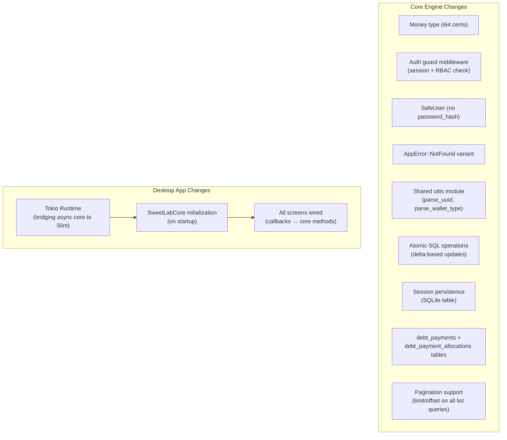
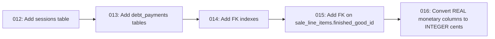

# Design Document: Sweet Lab Hardening

## Overview

This design addresses all 39 issues from the senior code review and wires the desktop Slint UI to the live Core_Engine. The changes are organized into four phases:

1. **Foundation fixes** — Monetary precision (f64→i64 cents), error types, shared utilities, schema migrations
2. **Security & correctness** — Authorization enforcement, password hash exclusion, session persistence, input validation, atomic operations
3. **Financial & data integrity** — Revenue calculation fix, debt payment wallet credit, debt persistence, wallet atomic deltas, query consolidation
4. **Desktop UI wiring** — Connect all Slint screens to the Core_Engine with async Tokio runtime bridge

The existing architecture (Rust core + Slint desktop + Android/UniFFI) remains unchanged. All fixes are internal to the core crate and the desktop shell.

## Architecture

The overall architecture is unchanged from the original design. The key structural additions are:



### Migration Strategy

All schema changes are delivered as new SQLx migrations (012+). The migration order matters because the Money migration (REAL→INTEGER) must run before any new code that expects i64 columns.



## Components and Interfaces

### 1. Money Type (Req 1)

A newtype wrapper around i64 representing cents. All monetary fields in domain models change from `f64` to `Money`.

```rust
/// Integer-cents monetary type. 1 Money = 0.01 display currency.
#[derive(Debug, Clone, Copy, PartialEq, Eq, PartialOrd, Ord, Hash, Serialize, Deserialize)]
pub struct Money(pub i64);

impl Money {
    pub const ZERO: Money = Money(0);

    /// Create from a whole-unit amount (e.g., 25.50 → Money(2550)).
    /// Used only for migration and test helpers.
    pub fn from_f64(val: f64) -> Money {
        Money((val * 100.0).round() as i64)
    }

    /// Format as "25.50" for display.
    pub fn to_display(&self) -> String {
        let whole = self.0 / 100;
        let frac = (self.0 % 100).abs();
        if self.0 < 0 && whole == 0 {
            format!("-0.{frac:02}")
        } else {
            format!("{whole}.{frac:02}")
        }
    }

    /// Parse "25.50" → Money(2550). Returns Err on malformed input.
    pub fn parse(s: &str) -> AppResult<Money> {
        // Split on '.', validate, convert
        let s = s.trim();
        let parts: Vec<&str> = s.split('.').collect();
        match parts.len() {
            1 => {
                let whole: i64 = parts[0].parse().map_err(|_| AppError::Validation {
                    field: "money".into(), message: format!("Invalid amount: {s}"),
                })?;
                Ok(Money(whole * 100))
            }
            2 => {
                let whole: i64 = parts[0].parse().map_err(|_| AppError::Validation {
                    field: "money".into(), message: format!("Invalid amount: {s}"),
                })?;
                let frac_str = parts[1];
                if frac_str.len() > 2 { return Err(AppError::Validation {
                    field: "money".into(), message: "Max 2 decimal places".into(),
                }); }
                let padded = format!("{frac_str:0<2}");
                let frac: i64 = padded.parse().map_err(|_| AppError::Validation {
                    field: "money".into(), message: format!("Invalid amount: {s}"),
                })?;
                let sign = if whole < 0 || s.starts_with('-') { -1 } else { 1 };
                Ok(Money(sign * (whole.abs() * 100 + frac)))
            }
            _ => Err(AppError::Validation {
                field: "money".into(), message: format!("Invalid amount: {s}"),
            }),
        }
    }
}

impl std::ops::Add for Money {
    type Output = Money;
    fn add(self, rhs: Money) -> Money { Money(self.0 + rhs.0) }
}
impl std::ops::Sub for Money {
    type Output = Money;
    fn sub(self, rhs: Money) -> Money { Money(self.0 - rhs.0) }
}
impl std::ops::Mul<i64> for Money {
    type Output = Money;
    fn mul(self, rhs: i64) -> Money { Money(self.0 * rhs) }
}
```

### 2. Updated Error Types (Req 9)

```rust
#[derive(Error, Debug)]
pub enum AppError {
    // ... existing variants unchanged ...

    #[error("Not found: {entity_type} with id {entity_id}")]
    NotFound {
        entity_type: String,
        entity_id: String,
    },

    // Update InsufficientStock/InsufficientFunds to use Money
    #[error("Insufficient stock: {material_name} has {available}, requested {requested}")]
    InsufficientStock {
        material_name: String,
        available: i64,  // was f64
        requested: i64,  // was f64
    },

    #[error("Insufficient funds: {wallet_name} has {available}, requested {requested}")]
    InsufficientFunds {
        wallet_name: String,
        available: Money,  // was f64
        requested: Money,  // was f64
    },
}
```

### 3. SafeUser Type (Req 3)

```rust
/// User data safe for API responses — no password_hash.
#[derive(Debug, Clone, Serialize, Deserialize)]
pub struct SafeUser {
    pub id: Uuid,
    pub username: String,
    pub full_name: String,
    pub role: UserRole,
}

impl From<AppUser> for SafeUser {
    fn from(u: AppUser) -> Self {
        SafeUser { id: u.id, username: u.username, full_name: u.full_name, role: u.role }
    }
}
```

### 4. Shared Utilities Module (Req 17)

```rust
// core/src/utils.rs

/// Parse a UUID string, returning NotFound on failure.
pub fn parse_uuid(entity_type: &str, id_str: &str) -> AppResult<Uuid> {
    Uuid::parse_str(id_str).map_err(|_| AppError::NotFound {
        entity_type: entity_type.to_string(),
        entity_id: id_str.to_string(),
    })
}

/// Parse a wallet type string from the database.
pub fn parse_wallet_type(s: &str) -> AppResult<WalletType> {
    match s {
        "Bank" => Ok(WalletType::Bank),
        "Cash" => Ok(WalletType::Cash),
        "Representative" => Ok(WalletType::Representative),
        other => Err(AppError::Unknown(format!("Invalid wallet type: {other}"))),
    }
}

/// Parse an RFC3339 timestamp string.
pub fn parse_timestamp(s: &str) -> AppResult<DateTime<Utc>> {
    s.parse().map_err(|e| AppError::Unknown(format!("Invalid timestamp: {e}")))
}
```

### 5. Authorization Guard (Req 2)

Every mutating API method on `SweetLabCore` gains a `session_token: Uuid` parameter. The guard pattern:

```rust
impl SweetLabCore {
    /// Validate session and check RBAC permission. Returns the session on success.
    async fn authorize(&self, session_token: Uuid, resource: &str, action: &str) -> AppResult<Session> {
        let session = self.auth.get_session(session_token).await?
            .ok_or_else(|| AppError::Authentication {
                message: "Invalid or expired session".to_string(),
            })?;

        let now = Utc::now();
        if !session.is_valid(now) {
            self.auth.remove_session(session_token).await?;
            return Err(AppError::Authentication {
                message: "Session expired".to_string(),
            });
        }

        // Update last_activity (Req 10.2)
        self.auth.touch_session(session_token, now).await?;

        let allowed = self.auth.check_permission(&session.role, resource, action).await?;
        if !allowed {
            return Err(AppError::Authorization {
                actual_role: session.role.to_string(),
                resource: resource.to_string(),
            });
        }

        Ok(session)
    }

    // Example: create_sale now requires session
    pub async fn create_sale(
        &self,
        session_token: Uuid,
        customer_id: Uuid,
        line_items: Vec<SaleLineItem>,
        amount_paid: Money,
        wallet_id: Uuid,
    ) -> AppResult<Sale> {
        self.authorize(session_token, "sales", "create").await?;
        self.sales.create_sale(customer_id, line_items, amount_paid, wallet_id).await
    }
}
```

### 6. Session Persistence (Req 10)

Sessions move from `Arc<Mutex<HashMap>>` to a SQLite `sessions` table:

```sql
-- 012_create_sessions.sql
CREATE TABLE IF NOT EXISTS sessions (
    id TEXT PRIMARY KEY NOT NULL,
    user_id TEXT NOT NULL REFERENCES users(id),
    role TEXT NOT NULL,
    created_at TEXT NOT NULL,
    last_activity TEXT NOT NULL,
    expires_at TEXT NOT NULL
);
CREATE INDEX IF NOT EXISTS idx_sessions_user_id ON sessions(user_id);
```

The `AuthServiceImpl` methods change to:
- `login()` → INSERT into sessions table
- `logout()` → DELETE from sessions table
- `get_session()` → SELECT from sessions table
- `touch_session()` → UPDATE last_activity

### 7. Atomic Inventory Deduction (Req 4)

Replace the two-step SELECT→UPDATE with a single atomic UPDATE:

```sql
-- Single-item atomic deduction
UPDATE raw_materials
SET current_quantity = current_quantity - ?,
    last_updated = ?,
    updated_at = ?
WHERE id = ? AND current_quantity >= ?
-- If rows_affected == 0, either not found or insufficient stock
```

After the UPDATE, if `rows_affected == 0`, do a SELECT to distinguish "not found" from "insufficient stock" for the error message.

### 8. Wallet Atomic Delta (Req 7.3)

Replace absolute SET with delta operations:

```sql
-- Credit (was: SET current_balance = new_balance)
UPDATE wallets
SET current_balance = current_balance + ?,
    updated_at = ?
WHERE id = ?

-- Debit with balance check
UPDATE wallets
SET current_balance = current_balance - ?,
    updated_at = ?
WHERE id = ? AND current_balance >= ?
```

### 9. Sale Input Validation (Req 5)

Added to `SalesServiceImpl::create_sale()` before any DB operations:

```rust
// Validate line_items not empty
if line_items.is_empty() {
    return Err(AppError::Validation { field: "line_items", message: "At least one line item required" });
}
// Validate each line item
for item in &line_items {
    if item.quantity <= 0 {
        return Err(AppError::Validation { field: "quantity", message: "Quantity must be positive" });
    }
    // Verify unit_price against DB
    let fg = get_finished_good(tx, item.finished_good_id)?;
    if item.unit_price != fg.unit_price {
        return Err(AppError::Validation { field: "unit_price", message: "Price mismatch" });
    }
}
// Validate amount_paid
if amount_paid < Money::ZERO {
    return Err(AppError::Validation { field: "amount_paid", message: "Cannot be negative" });
}
if amount_paid > total_amount {
    return Err(AppError::Validation { field: "amount_paid", message: "Cannot exceed total" });
}
```

### 10. Debt Payment with Wallet Credit (Req 6)

`DebtServiceImpl::record_payment()` now credits the wallet within the same transaction:

```rust
pub async fn record_payment(&self, customer_id: Uuid, amount: Money, wallet_id: Uuid) -> AppResult<DebtPayment> {
    // ... validate amount > 0, fetch active debts ...
    let mut tx = self.pool.begin().await?;

    // Validate wallet exists
    let wallet = get_wallet_in_tx(&mut *tx, wallet_id)?
        .ok_or(AppError::NotFound { entity_type: "wallet", entity_id: wallet_id.to_string() })?;

    // FIFO allocation (unchanged logic)
    let (allocations, total_allocated) = allocate_fifo(&mut tx, &active_debts, amount)?;

    // Credit wallet by amount actually allocated (not full amount if overpayment)
    atomic_credit_wallet(&mut tx, wallet_id, total_allocated)?;

    // Persist payment + allocations (Req 14)
    insert_debt_payment(&mut tx, payment_id, customer_id, total_allocated, wallet_id)?;
    for alloc in &allocations {
        insert_debt_payment_allocation(&mut tx, payment_id, alloc)?;
    }

    tx.commit().await?;
    Ok(DebtPayment { ..., amount: total_allocated, unallocated: amount - total_allocated })
}
```

### 11. Pagination Support (Req 13)

A shared pagination struct used across all list queries:

```rust
#[derive(Debug, Clone)]
pub struct Pagination {
    pub limit: i64,
    pub offset: i64,
}

impl Default for Pagination {
    fn default() -> Self {
        Pagination { limit: 100, offset: 0 }
    }
}
```

All list query functions gain an optional `Pagination` parameter. SQL queries append `LIMIT ? OFFSET ?`.

### 12. Financial Summary Fix (Req 8)

```rust
// Was: total_revenue = sum(sales.total_amount)
// Now: total_revenue = sum(sales.amount_paid)
let total_revenue: Money = sale_rows.iter().map(|r| r.amount_paid).sum();

// net_profit labeled as gross margin (COGS not tracked yet)
// net_profit = total_revenue - total_expenses
```

### 13. Customer Debt Computation (Req 12.4, H10)

Replace hardcoded `total_debt: 0.0, overdue_days: 0` with a JOIN query:

```sql
SELECT c.*,
    COALESCE(SUM(d.remaining_amount), 0) AS total_debt,
    COALESCE(MAX(CAST((julianday('now') - julianday(d.sale_date)) AS INTEGER)), 0) AS overdue_days
FROM customers c
LEFT JOIN debt_records d ON d.customer_id = c.id AND d.is_settled = 0
GROUP BY c.id
```

### 14. Desktop UI Wiring Architecture (Req 24)

The desktop `main.rs` initializes a Tokio runtime and a `SweetLabCore` instance. Slint callbacks invoke core methods via `rt.block_on()` or `slint::spawn_local()` with a channel pattern.

```rust
fn main() {
    let rt = tokio::runtime::Runtime::new().unwrap();

    // Initialize core
    let core = rt.block_on(async {
        SweetLabCore::new("sweet_lab.db").await.unwrap()
    });
    let core = Arc::new(core);

    let app = AppWindow::new().unwrap();

    // Login callback
    let core_ref = core.clone();
    let app_weak = app.as_weak();
    app.on_login(move |username, password| {
        let core = core_ref.clone();
        let app = app_weak.unwrap();
        let u = username.to_string();
        let p = password.to_string();
        app.set_login_loading(true);

        // Use slint::invoke_from_event_loop for async bridging
        let app_weak2 = app.as_weak();
        let _ = slint::spawn_local(async move {
            match core.login(&u, &p).await {
                Ok(session) => {
                    let app = app_weak2.unwrap();
                    match session.role {
                        UserRole::Admin => {
                            app.set_current_role(UserRole::Admin);
                            app.set_current_view(ActiveView::AdminDashboard);
                        }
                        // ... Chef, Representative ...
                    }
                }
                Err(_) => {
                    let app = app_weak2.unwrap();
                    app.set_login_error("بيانات الدخول غير صحيحة".into());
                }
            }
            app_weak2.unwrap().set_login_loading(false);
        });
    });

    // Each screen gets similar wiring:
    // 1. Slint callback fires
    // 2. Rust closure calls core method via spawn_local
    // 3. Result updates Slint properties
    // 4. Loading/error states managed

    app.run().unwrap();
}
```

Each Slint screen component exposes:
- `in-out property` for data models (as Slint structs)
- `callback` for user actions (create, update, delete, refresh)
- `in property <bool> is-loading` for loading state
- `in property <string> error-message` for error display

The Rust side maps domain models to Slint-compatible types (Slint uses `SharedString`, `ModelRc`, etc.).

## Data Models

### New Migration: 012_create_sessions.sql

```sql
CREATE TABLE IF NOT EXISTS sessions (
    id TEXT PRIMARY KEY NOT NULL,
    user_id TEXT NOT NULL REFERENCES users(id) ON DELETE CASCADE,
    role TEXT NOT NULL,
    created_at TEXT NOT NULL,
    last_activity TEXT NOT NULL,
    expires_at TEXT NOT NULL
);
CREATE INDEX IF NOT EXISTS idx_sessions_user_id ON sessions(user_id);
CREATE INDEX IF NOT EXISTS idx_sessions_expires_at ON sessions(expires_at);
```

### New Migration: 013_create_debt_payments.sql

```sql
CREATE TABLE IF NOT EXISTS debt_payments (
    id TEXT PRIMARY KEY NOT NULL,
    customer_id TEXT NOT NULL REFERENCES customers(id),
    amount INTEGER NOT NULL CHECK (amount > 0),
    wallet_id TEXT NOT NULL REFERENCES wallets(id),
    timestamp TEXT NOT NULL,
    sync_status TEXT NOT NULL DEFAULT 'Synced',
    updated_at TEXT NOT NULL
);
CREATE INDEX IF NOT EXISTS idx_debt_payments_customer_id ON debt_payments(customer_id);
CREATE INDEX IF NOT EXISTS idx_debt_payments_wallet_id ON debt_payments(wallet_id);

CREATE TABLE IF NOT EXISTS debt_payment_allocations (
    id TEXT PRIMARY KEY NOT NULL,
    payment_id TEXT NOT NULL REFERENCES debt_payments(id) ON DELETE CASCADE,
    debt_record_id TEXT NOT NULL REFERENCES debt_records(id),
    amount_applied INTEGER NOT NULL CHECK (amount_applied > 0)
);
CREATE INDEX IF NOT EXISTS idx_dpa_payment_id ON debt_payment_allocations(payment_id);
CREATE INDEX IF NOT EXISTS idx_dpa_debt_record_id ON debt_payment_allocations(debt_record_id);
```

### New Migration: 014_add_fk_indexes.sql

```sql
-- Indexes on FK columns that currently lack them (Req 16.2)
CREATE INDEX IF NOT EXISTS idx_sales_customer_id ON sales(customer_id);
CREATE INDEX IF NOT EXISTS idx_sales_payment_wallet_id ON sales(payment_wallet_id);
CREATE INDEX IF NOT EXISTS idx_sale_line_items_sale_id ON sale_line_items(sale_id);
CREATE INDEX IF NOT EXISTS idx_production_logs_recipe_id ON production_logs(recipe_id);
CREATE INDEX IF NOT EXISTS idx_production_logs_chef_id ON production_logs(chef_id);
CREATE INDEX IF NOT EXISTS idx_production_logs_finished_good_id ON production_logs(finished_good_id);
CREATE INDEX IF NOT EXISTS idx_recipe_ingredients_recipe_id ON recipe_ingredients(recipe_id);
CREATE INDEX IF NOT EXISTS idx_recipe_ingredients_raw_material_id ON recipe_ingredients(raw_material_id);
CREATE INDEX IF NOT EXISTS idx_debt_records_customer_id ON debt_records(customer_id);
CREATE INDEX IF NOT EXISTS idx_debt_records_sale_id ON debt_records(sale_id);
CREATE INDEX IF NOT EXISTS idx_expenses_wallet_id ON expenses(wallet_id);
CREATE INDEX IF NOT EXISTS idx_expenses_recorded_by ON expenses(recorded_by);
CREATE INDEX IF NOT EXISTS idx_wallet_transactions_wallet_id ON wallet_transactions(wallet_id);
```

### New Migration: 015_add_sale_line_items_fk.sql

```sql
-- SQLite doesn't support ALTER TABLE ADD CONSTRAINT, so we recreate the table (Req 16.1)
CREATE TABLE sale_line_items_new (
    id TEXT PRIMARY KEY NOT NULL,
    sale_id TEXT NOT NULL REFERENCES sales(id) ON DELETE CASCADE,
    finished_good_id TEXT NOT NULL REFERENCES finished_goods(id),
    finished_good_name TEXT NOT NULL,
    quantity INTEGER NOT NULL CHECK (quantity > 0),
    unit_price INTEGER NOT NULL CHECK (unit_price >= 0)
);
INSERT INTO sale_line_items_new SELECT * FROM sale_line_items;
DROP TABLE sale_line_items;
ALTER TABLE sale_line_items_new RENAME TO sale_line_items;
CREATE INDEX IF NOT EXISTS idx_sale_line_items_sale_id ON sale_line_items(sale_id);
CREATE INDEX IF NOT EXISTS idx_sale_line_items_fg_id ON sale_line_items(finished_good_id);
```

### New Migration: 016_convert_monetary_to_integer_cents.sql

```sql
-- Convert all REAL monetary columns to INTEGER cents (Req 1.5)
-- raw_materials.current_quantity stays REAL (it's physical quantity, not money)
-- finished_goods.unit_price → INTEGER cents
-- finished_goods.current_quantity stays REAL (physical quantity)

-- finished_goods: unit_price REAL → INTEGER
CREATE TABLE finished_goods_new (
    id TEXT PRIMARY KEY NOT NULL,
    name TEXT NOT NULL,
    current_quantity REAL NOT NULL DEFAULT 0.0 CHECK (current_quantity >= 0),
    unit_price INTEGER NOT NULL DEFAULT 0 CHECK (unit_price >= 0),
    last_updated TEXT NOT NULL,
    sync_status TEXT NOT NULL DEFAULT 'Synced',
    updated_at TEXT NOT NULL
);
INSERT INTO finished_goods_new
    SELECT id, name, current_quantity, CAST(ROUND(unit_price * 100) AS INTEGER), last_updated, sync_status, updated_at
    FROM finished_goods;
DROP TABLE finished_goods;
ALTER TABLE finished_goods_new RENAME TO finished_goods;

-- sales: total_amount, amount_paid REAL → INTEGER
CREATE TABLE sales_new (
    id TEXT PRIMARY KEY NOT NULL,
    customer_id TEXT NOT NULL REFERENCES customers(id),
    total_amount INTEGER NOT NULL CHECK (total_amount >= 0),
    amount_paid INTEGER NOT NULL CHECK (amount_paid >= 0),
    payment_wallet_id TEXT NOT NULL REFERENCES wallets(id),
    timestamp TEXT NOT NULL,
    sync_status TEXT NOT NULL DEFAULT 'Synced',
    updated_at TEXT NOT NULL
);
INSERT INTO sales_new
    SELECT id, customer_id, CAST(ROUND(total_amount * 100) AS INTEGER),
           CAST(ROUND(amount_paid * 100) AS INTEGER), payment_wallet_id, timestamp, sync_status, updated_at
    FROM sales;
DROP TABLE sales;
ALTER TABLE sales_new RENAME TO sales;
CREATE INDEX IF NOT EXISTS idx_sales_customer_id ON sales(customer_id);
CREATE INDEX IF NOT EXISTS idx_sales_payment_wallet_id ON sales(payment_wallet_id);

-- wallets: current_balance REAL → INTEGER
CREATE TABLE wallets_new (
    id TEXT PRIMARY KEY NOT NULL,
    name TEXT NOT NULL,
    wallet_type TEXT NOT NULL CHECK (wallet_type IN ('Bank', 'Cash', 'Representative')),
    current_balance INTEGER NOT NULL DEFAULT 0,
    sync_status TEXT NOT NULL DEFAULT 'Synced',
    updated_at TEXT NOT NULL
);
INSERT INTO wallets_new
    SELECT id, name, wallet_type, CAST(ROUND(current_balance * 100) AS INTEGER), sync_status, updated_at
    FROM wallets;
DROP TABLE wallets;
ALTER TABLE wallets_new RENAME TO wallets;

-- wallet_transactions: amount REAL → INTEGER
CREATE TABLE wallet_transactions_new (
    id TEXT PRIMARY KEY NOT NULL,
    wallet_id TEXT NOT NULL REFERENCES wallets(id),
    amount INTEGER NOT NULL,
    description TEXT NOT NULL,
    related_entity_id TEXT,
    timestamp TEXT NOT NULL,
    sync_status TEXT NOT NULL DEFAULT 'Synced',
    updated_at TEXT NOT NULL
);
INSERT INTO wallet_transactions_new
    SELECT id, wallet_id, CAST(ROUND(amount * 100) AS INTEGER), description,
           related_entity_id, timestamp, sync_status, updated_at
    FROM wallet_transactions;
DROP TABLE wallet_transactions;
ALTER TABLE wallet_transactions_new RENAME TO wallet_transactions;
CREATE INDEX IF NOT EXISTS idx_wallet_transactions_wallet_id ON wallet_transactions(wallet_id);

-- debt_records: original_amount, remaining_amount REAL → INTEGER
CREATE TABLE debt_records_new (
    id TEXT PRIMARY KEY NOT NULL,
    customer_id TEXT NOT NULL REFERENCES customers(id),
    sale_id TEXT NOT NULL REFERENCES sales(id),
    original_amount INTEGER NOT NULL CHECK (original_amount > 0),
    remaining_amount INTEGER NOT NULL CHECK (remaining_amount >= 0),
    sale_date TEXT NOT NULL,
    is_settled INTEGER NOT NULL DEFAULT 0,
    sync_status TEXT NOT NULL DEFAULT 'Synced',
    updated_at TEXT NOT NULL
);
INSERT INTO debt_records_new
    SELECT id, customer_id, sale_id, CAST(ROUND(original_amount * 100) AS INTEGER),
           CAST(ROUND(remaining_amount * 100) AS INTEGER), sale_date, is_settled, sync_status, updated_at
    FROM debt_records;
DROP TABLE debt_records;
ALTER TABLE debt_records_new RENAME TO debt_records;
CREATE INDEX IF NOT EXISTS idx_debt_records_customer_id ON debt_records(customer_id);
CREATE INDEX IF NOT EXISTS idx_debt_records_sale_id ON debt_records(sale_id);

-- expenses: amount REAL → INTEGER
CREATE TABLE expenses_new (
    id TEXT PRIMARY KEY NOT NULL,
    description TEXT NOT NULL,
    amount INTEGER NOT NULL CHECK (amount > 0),
    category TEXT NOT NULL CHECK (category IN ('Purchase', 'OperatingCost')),
    wallet_id TEXT NOT NULL REFERENCES wallets(id),
    recorded_by TEXT NOT NULL REFERENCES users(id),
    timestamp TEXT NOT NULL,
    sync_status TEXT NOT NULL DEFAULT 'Synced',
    updated_at TEXT NOT NULL
);
INSERT INTO expenses_new
    SELECT id, description, CAST(ROUND(amount * 100) AS INTEGER), category,
           wallet_id, recorded_by, timestamp, sync_status, updated_at
    FROM expenses;
DROP TABLE expenses;
ALTER TABLE expenses_new RENAME TO expenses;
CREATE INDEX IF NOT EXISTS idx_expenses_wallet_id ON expenses(wallet_id);
CREATE INDEX IF NOT EXISTS idx_expenses_recorded_by ON expenses(recorded_by);
```

### Updated Domain Model Fields (f64 → Money)

All monetary fields in domain structs change type. Non-exhaustive list:

| Struct | Field | Old Type | New Type |
|--------|-------|----------|----------|
| FinishedGood | unit_price | f64 | Money |
| Sale | total_amount, amount_paid | f64 | Money |
| SaleLineItem | unit_price | f64 | Money |
| Wallet | current_balance | f64 | Money |
| WalletTransaction | amount | f64 | Money |
| FundTransfer | amount | f64 | Money |
| DebtRecord | original_amount, remaining_amount | f64 | Money |
| DebtPayment | amount | f64 | Money |
| DebtAllocation | amount_applied | f64 | Money |
| Expense | amount | f64 | Money |
| FinancialSummary | total_revenue, total_expenses, net_profit | f64 | Money |
| Invoice | total_amount, amount_paid, remaining_balance | f64 | Money |
| Receipt | remaining_balance | f64 | Money |
| Customer | total_debt | f64 | Money |
| AppError::InsufficientFunds | available, requested | f64 | Money |

Physical quantities (raw_materials.current_quantity, finished_goods.current_quantity, recipe_ingredients.required_quantity) remain f64 since they represent physical units (kg, liters, pieces), not money.

## Correctness Properties

*A property is a characteristic or behavior that should hold true across all valid executions of a system — essentially, a formal statement about what the system should do. Properties serve as the bridge between human-readable specifications and machine-verifiable correctness guarantees.*

### Property 1: Money format/parse round-trip

*For any* valid Money value (i64 cents), formatting to a display string and then parsing that string back SHALL produce the original Money value.

**Validates: Requirements 1.2, 1.3, 1.4**

### Property 2: Money parsing rejects malformed input

*For any* string that is not a valid decimal number (contains letters, multiple dots, more than 2 decimal places, or is empty), parsing as Money SHALL return a Validation error.

**Validates: Requirements 1.3**

### Property 3: Sale amount_paid bounds validation

*For any* sale creation request where amount_paid is negative or exceeds the computed total_amount, THE Sales_Service SHALL reject the sale with a Validation error and leave inventory and wallet unchanged.

**Validates: Requirements 5.1, 5.2**

### Property 4: Sale unit price verification

*For any* sale creation request where a line item's unit_price differs from the finished good's current unit_price in the database, THE Sales_Service SHALL reject the sale with a Validation error.

**Validates: Requirements 5.3**

### Property 5: Authorization guard rejects invalid sessions

*For any* mutating API call with a session token that is expired (last_activity > 8 hours or created > 24 hours) or does not exist, THE Core_Engine SHALL return an Authentication error without executing the operation.

**Validates: Requirements 2.1, 2.3**

### Property 6: Authorization guard enforces RBAC

*For any* mutating API call with a valid session whose role lacks permission for the requested resource/action per the Casbin policy, THE Core_Engine SHALL return an Authorization error without executing the operation.

**Validates: Requirements 2.2, 2.4**

### Property 7: SafeUser excludes password hash from serialization

*For any* SafeUser value, serializing to JSON SHALL produce a string that does not contain the substring "password_hash" and does not contain any argon2 hash prefix ("$argon2").

**Validates: Requirements 3.2, 3.4**

### Property 8: Atomic raw material deduction correctness

*For any* raw material with current quantity Q and deduction amount D: if D ≤ Q, the deduction SHALL succeed and the new quantity SHALL equal Q - D; if D > Q, the deduction SHALL fail with InsufficientStock and the quantity SHALL remain Q.

**Validates: Requirements 4.1, 4.2**

### Property 9: Atomic finished good deduction correctness

*For any* finished good with current quantity Q and sale quantity S: if S ≤ Q, the deduction SHALL succeed and the new quantity SHALL equal Q - S; if S > Q, the deduction SHALL fail with InsufficientStock and the quantity SHALL remain Q.

**Validates: Requirements 4.3**

### Property 10: Debt payment credits wallet capped at total debt

*For any* debt payment of amount A against a customer with total outstanding debt D and wallet W: the wallet balance SHALL increase by min(A, D), debt records SHALL be reduced by the FIFO-allocated amount, and if A > D the response SHALL indicate the unallocated remainder (A - D).

**Validates: Requirements 6.1, 6.3**

### Property 11: Wallet rejects non-positive amounts

*For any* wallet credit, debit, or transfer operation with an amount ≤ 0, THE Wallet_Service SHALL return a Validation error and leave all wallet balances unchanged.

**Validates: Requirements 7.1**

### Property 12: Wallet rejects self-transfer

*For any* fund transfer where source_id equals destination_id, THE Wallet_Service SHALL return a Validation error and leave the wallet balance unchanged.

**Validates: Requirements 7.2**

### Property 13: Financial summary uses amount_paid for revenue

*For any* set of sales and expenses in a date range, the financial summary SHALL report total_revenue equal to the sum of amount_paid (not total_amount), total_expenses equal to the sum of expense amounts, and net_profit equal to total_revenue minus total_expenses.

**Validates: Requirements 8.1, 8.2**

### Property 14: NotFound on missing entities

*For any* service lookup by a UUID that does not exist in the database, THE Core_Engine SHALL return AppError::NotFound with the correct entity_type and entity_id fields.

**Validates: Requirements 9.2, 9.3**

### Property 15: Session persistence survives service restart

*For any* session created via login, constructing a new AuthServiceImpl with the same database pool SHALL allow retrieving the same session by its token.

**Validates: Requirements 10.1**

### Property 16: Session expiry rules

*For any* session, it SHALL be considered valid if and only if (now - last_activity) < 8 hours AND (now - created_at) < 24 hours. The authorize guard SHALL update last_activity on every successful check.

**Validates: Requirements 10.2, 10.3, 10.4**

### Property 17: Password minimum length enforcement

*For any* password string shorter than 8 characters, user creation SHALL return a Validation error. For any password string of 8 or more characters (with other fields valid), user creation SHALL succeed.

**Validates: Requirements 11.1, 11.2**

### Property 18: Customer debt computed from debt records

*For any* customer with active (unsettled) debt records, the customer's total_debt field SHALL equal the sum of remaining_amount across those records, and overdue_days SHALL equal the maximum overdue days across those records.

**Validates: Requirements 12.4**

### Property 19: Pagination bounds

*For any* list query with limit L and offset O against a dataset of size N, the result SHALL contain at most L items, the items SHALL start from position O in the full ordered result set, and when L and O are omitted the result SHALL contain at most 100 items.

**Validates: Requirements 13.1, 13.2, 13.3**

### Property 20: Debt payment persistence

*For any* recorded debt payment, the debt_payments table SHALL contain a row with the payment's id, customer_id, amount, wallet_id, and timestamp, and the debt_payment_allocations table SHALL contain one row per allocation with the correct payment_id, debt_record_id, and amount_applied.

**Validates: Requirements 14.3**

### Property 21: Expense validates recorded_by user exists

*For any* expense recording request where the recorded_by UUID does not exist in the users table, THE Core_Engine SHALL return a NotFound error and not create the expense.

**Validates: Requirements 15.1, 15.2**

### Property 22: Insufficient materials threshold correctness

*For any* recipe and production quantity P, a material SHALL be listed as insufficient in RecipeAvailability if and only if its current_quantity < required_quantity × P.

**Validates: Requirements 18.1, 18.2**

### Property 23: Invoice uses configured business name

*For any* configured business_name string, all generated invoices and receipts SHALL contain that string as the business_name field, not a hardcoded value.

**Validates: Requirements 19.2**

### Property 24: Conflict log cleanup respects retention period

*For any* set of conflict log entries and a retention period of R days, after cleanup all entries older than R days SHALL be deleted and all entries newer than R days SHALL be retained.

**Validates: Requirements 23.2**

## Error Handling

### Updated Error Table

| Scenario | Error Type | Handling |
|---|---|---|
| Entity not found by ID | `AppError::NotFound` | Return entity_type and entity_id (Req 9) |
| Missing/expired session token | `AppError::Authentication` | "Invalid or expired session" (Req 2) |
| Role lacks permission | `AppError::Authorization` | Role and resource in message (Req 2) |
| Negative/zero wallet amount | `AppError::Validation` | "Amount must be positive" (Req 7) |
| Self-transfer | `AppError::Validation` | "Source and destination must differ" (Req 7) |
| Negative amount_paid | `AppError::Validation` | "Cannot be negative" (Req 5) |
| Overpayment (amount_paid > total) | `AppError::Validation` | "Cannot exceed total" (Req 5) |
| Price mismatch on sale line item | `AppError::Validation` | "Price mismatch with current price" (Req 5) |
| Password too short | `AppError::Validation` | "Password must be at least 8 characters" (Req 11) |
| Malformed money string | `AppError::Validation` | "Invalid amount: {input}" (Req 1) |
| Expense with invalid recorded_by | `AppError::NotFound` | "user with id {id}" (Req 15) |
| Debt payment with invalid wallet | `AppError::NotFound` | "wallet with id {id}" (Req 6) |
| Font directory not found | `AppError::Validation` | "Font directory not found: {path}" (Req 22) |
| Atomic deduction insufficient stock | `AppError::InsufficientStock` | Material name and shortfall (Req 4) |

### Transaction Safety

All multi-step operations continue to use SQLx transactions. The key change is that debt payment now includes wallet credit within the same transaction (Req 6), and wallet balance updates use atomic delta SQL instead of absolute SET (Req 7.3).

## Testing Strategy

### Testing Framework

- **Unit Tests**: `#[cfg(test)]` modules with `cargo test`
- **Property-Based Tests**: `proptest` crate with custom strategies (existing 39 properties + 24 new properties = 63 total)
- **Integration Tests**: `tests/` directory with in-memory SQLite databases
- **Async Testing**: `tokio::test` for async function testing

### Property-Based Testing Configuration

Each property test MUST:
- Use `proptest!` macro with a minimum of 100 cases (`PROPTEST_CASES=100`)
- Reference the design document property number in a comment tag
- Use custom `proptest::strategy::Strategy` implementations for domain objects

Tag format: `// Feature: sweet-lab-hardening, Property {N}: {title}`

Each correctness property from this design document MUST be implemented by a SINGLE property-based test.

### New Generators Required

```rust
// Money generator — generates valid cent amounts
fn arb_money() -> impl Strategy<Value = Money> {
    (-10_000_000i64..10_000_000i64).prop_map(Money)
}

// Positive money generator — for amounts that must be positive
fn arb_positive_money() -> impl Strategy<Value = Money> {
    (1i64..10_000_000i64).prop_map(Money)
}

// Valid decimal string generator — for Money parsing tests
fn arb_money_string() -> impl Strategy<Value = String> {
    arb_money().prop_map(|m| m.to_display())
}

// Malformed money string generator — for rejection tests
fn arb_malformed_money_string() -> impl Strategy<Value = String> {
    prop_oneof![
        "[a-zA-Z]{1,10}",                    // letters
        "\\d+\\.\\d{3,5}",                   // too many decimals
        Just("".to_string()),                 // empty
        "\\d+\\.\\d+\\.\\d+",               // multiple dots
    ]
}

// Password generators
fn arb_short_password() -> impl Strategy<Value = String> {
    "[a-zA-Z0-9]{1,7}"  // 1-7 chars, always < 8
}

fn arb_valid_password() -> impl Strategy<Value = String> {
    "[a-zA-Z0-9]{8,30}"  // 8-30 chars, always >= 8
}

// Pagination generator
fn arb_pagination() -> impl Strategy<Value = Pagination> {
    (1i64..200, 0i64..1000).prop_map(|(limit, offset)| Pagination { limit, offset })
}
```

### Test Organization (New Files)

```
core/tests/
├── money_properties.rs              ← Properties 1-2
├── sale_validation_properties.rs    ← Properties 3-4
├── auth_guard_properties.rs         ← Properties 5-7
├── atomic_deduction_properties.rs   ← Properties 8-9
├── debt_payment_properties.rs       ← Properties 10, 20
├── wallet_validation_properties.rs  ← Properties 11-12
├── financial_properties.rs          ← Property 13
├── notfound_properties.rs           ← Property 14
├── session_properties.rs            ← Properties 15-16
├── password_properties.rs           ← Property 17
├── customer_debt_properties.rs      ← Property 18
├── pagination_properties.rs         ← Property 19
├── expense_validation_properties.rs ← Property 21
├── recipe_availability_properties.rs← Property 22
├── config_properties.rs             ← Property 23
└── conflict_cleanup_properties.rs   ← Property 24
```

### Dual Testing Approach

- **Unit tests**: Specific examples, edge cases (empty line items, self-transfer, exact boundary values, zero amounts, nonexistent entities)
- **Property tests**: Universal properties across randomized inputs (24 new properties covering all hardening requirements)

Unit tests focus on edge cases identified in prework: empty sale line items (5.5), self-transfer (7.2), nonexistent wallet on debt payment (6.2), password exactly 7 vs 8 chars (11.1), session at exactly 8hr/24hr boundaries (10.3/10.4), FK constraint enforcement (16.1/16.3).
