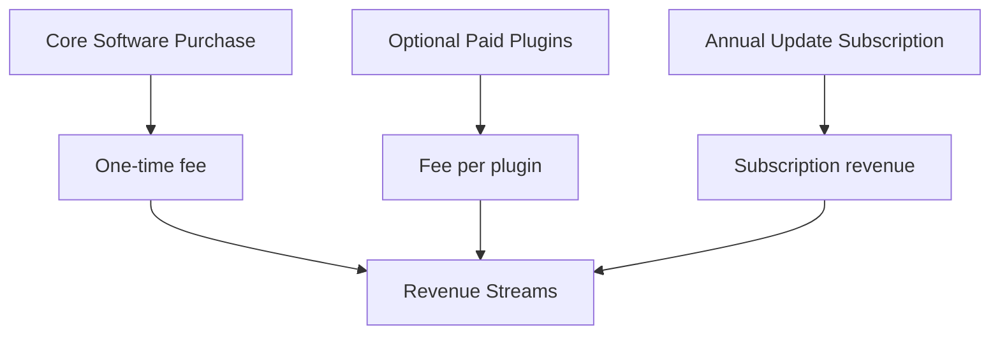
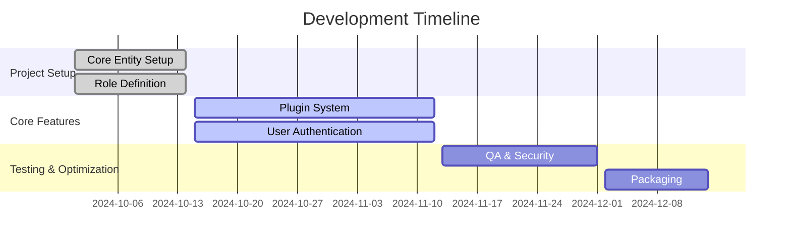

# Commerce Services Management Solution

> This document synthesizes the project’s business strategy, technical direction, and market potential, providing a comprehensive roadmap for your commerce services management solution.

---

## Getting Started

This project is a starting point for a Flutter application.

A few resources to get you started if this is your first Flutter project:

- [Lab: Write your first Flutter app](https://docs.flutter.dev/get-started/codelab)
- [Cookbook: Useful Flutter samples](https://docs.flutter.dev/cookbook)

For help getting started with Flutter development, view the
[online documentation](https://docs.flutter.dev/), which offers tutorials,
samples, guidance on mobile development, and a full API reference.

## 1. Executive Summary

This document outlines a business and technical roadmap for developing the **Commerce Services Management Solution**. Designed as an on-premises application, the solution focuses on empowering traders with tools for inventory, sales, shipment, and commercial strategy management without the cost or complexity of extensive cloud infrastructure. Our hybrid revenue model combines upfront software purchase, optional plugins, and annual updates, setting it apart from subscription-based SaaS alternatives.

## 2. Business Model and Revenue Strategy

### On-Premises Strategy
- **Cost Efficiency**: This model enables cost reduction by minimizing cloud dependency and maintenance fees. Users have control over data security and infrastructure, enhancing privacy.
- **Self-Hosted**: Users install and run the software locally, ensuring continuous access and control, even offline.

### Revenue Streams
- **Core Software Purchase**: Initial product purchase includes core features necessary for essential commerce management tasks.
- **Optional Paid Plugins**: Users can add new functionalities via paid plugins tailored to specialized needs like analytics, custom reporting, or integrations.
- **Annual Update Subscription**: Regular updates (once or twice a year) provide customers with the latest features, security patches, and enhancements, ensuring a steady revenue stream.

### Market Positioning
This unique revenue strategy allows users to pay only for needed features, while regular updates assure long-term support. It’s a blend of flexibility and affordability, providing SMBs with a customizable yet robust solution.

## 3. Technical Architecture

### Core Technologies
- **Frameworks**:
  - **Java Spring Boot**: Suitable for back-end services with JavaFX for the desktop GUI.
  - **Alternatives**: Electron, Python Django with PyQt, or a custom REST API if Java is not ideal.
- **Architecture**:
  - **Monolithic** with plugin support, aiming for simplicity in creation, maintenance, and extension.
  - **JWT Authentication** for secure, token-based user management.
  - **JHipster Proof of Concept (POC)** for scaffolding, using generated JDL for essential entities and roles.

### Development Workflow
1. **Project Setup and Initialization**:
   - Define core entities, roles, and relationships in JDL (JHipster Domain Language).
2. **Development Stack**:
   - IDEs: VS Code or IntelliJ for collaborative coding, JHipster for POC generation.
   - Version control: Git with feature branching.
3. **Milestones and Timeline**:
   - **Phase 1**: Core Entity Setup and Role Definition - 2 weeks
   - **Phase 2**: Core Features & Plugin System Implementation - 4 weeks
   - **Phase 3**: Testing, Security, and Optimization - 3 weeks
   - **Phase 4**: User Documentation & Packaging - 2 weeks
   - **Total Estimated Time**: 11 weeks

## 4. Project Management and Execution

### Key Responsibilities
- **Project Manager**: Oversee project development, manage timelines, and ensure stakeholder communication.
- **Development Team**: Focus on coding, testing, and maintaining the application.
- **QA Team**: Conduct thorough testing to ensure functionality and security.

### Communication Strategy
- **Regular Stand-Ups**: Daily brief meetings to discuss progress and blockers.
- **Weekly Updates**: Comprehensive updates to stakeholders on project status.
- **Feedback Loops**: Ensure that user feedback is incorporated into the development cycle.

### Task Management
- Use tools like **Jira** or **Trello** for tracking tasks and assigning responsibilities.
- Break down the project into sprints for agile development.

### Documentation
- Maintain detailed technical documentation for development processes, APIs, and user manuals.
- Use tools like **Confluence** or **Markdown** files for collaborative documentation.

### Version Control
- Utilize Git for version control, ensuring a clear history of changes and easy collaboration among developers.

## 5. Competitive Analysis

| Competitor     | Business Model       | Product Type      | Strengths                                                                 | Weaknesses                           |
|----------------|----------------------|-------------------|--------------------------------------------------------------------------|--------------------------------------|
| SAP Business One | SaaS & On-Premises | ERP & Commerce    | Robust feature set, wide integration possibilities                       | High costs, complex deployment       |
| QuickBooks     | SaaS                 | Financial & Inventory | User-friendly, high adoption rate, extensive accounting features        | Limited customization                |
| Odoo           | SaaS & On-Premises   | ERP               | Modular, open-source, flexible                                          | Requires technical expertise for setup |
| Zoho Inventory | SaaS                 | Inventory         | Seamless integrations with Zoho suite, affordable                        | Limited offline functionality        |
| Open Source Alternatives: ERPNext, Apache OFBiz | Open Source | ERP | Customizable, community-supported                                        | Requires in-house maintenance        |

### Open-Source Options
- **ERPNext** and **Apache OFBiz** are strong open-source contenders, providing highly customizable ERP features with active community support.

## 6. Risks and Pitfalls

### Technical Risks
- **Monolithic Model Limitations**: Extending a monolithic structure might lead to scalability challenges if demand grows rapidly.
- **Plugin Integration**: Adding plugin support in a monolithic setup requires careful management to avoid compatibility issues.

### Operational Risks
- **On-Premises Installation Support**: Users may face difficulties during installation or setup, necessitating dedicated support channels or detailed guides.
- **Regular Updates**: Managing version control and ensuring that updates are smoothly implemented across varied environments can be complex.

### Market Risks
- **Competitor Pressure**: SaaS platforms dominate the market and offer streamlined experiences that may appeal to some users despite the cost.
- **Adoption Rate**: Convincing users of the benefits of a paid, on-premises solution with optional plugins could be challenging in a crowded marketplace.

## 7. Potential and Opportunity Analysis

### Competitive Potential
The Commerce Services Management Solution’s unique blend of on-premises flexibility and modular expandability gives it an edge in the SMB market, particularly for cost-conscious users seeking robust functionality without committing to SaaS.

### Expansion Opportunities
Future growth may involve:
- **Cloud/Hybrid Models**: Depending on user feedback, adding optional cloud-based features or integrations could enhance user experience.
- **Plugin Ecosystem Expansion**: Creating a developer community around plugin development for custom solutions.

---

## Diagrams and Charts

### Revenue Model Structure


### Development Workflow Timeline


### Competitor Positioning Chart
| Competitor      | Flexibility | Feature Depth | Cost Efficiency | Market Popularity |
|-----------------|-------------|---------------|-----------------|-------------------|
| SAP Business One | Medium      | High          | Low             | High              |
| QuickBooks      | Low         | Medium        | High            | High              |
| Odoo            | High        | High          | Medium          | Medium            |
| Zoho Inventory  | Medium      | Medium        | Medium          | Medium            |
| ERPNext         | High        | High          | High            | Medium            |

## 8. Management and Organization

### Table of Roles and Responsibilities

| Role                  | Responsibility                                         |
|-----------------------|-------------------------------------------------------|
| Project Manager       | Overall project oversight, timeline management, stakeholder communication |
| Business Analyst       | Requirements gathering, market analysis, user experience design |
| Software Developer     | Core application development, feature implementation, debugging |
| QA Tester             | Testing and validation of application functionality    |
| Technical Support     | Assisting users with installation, configuration, and troubleshooting issues |
| Documentation Specialist | Creating and maintaining user manuals and technical documentation |
| Marketing Specialist   | Promoting the product, handling customer outreach and feedback |

## 9. Structure of a dart POC

This is a tree structure of the dart POC of the chaoffice (ex k_trade) applications. They should both follow the same strucutre:

```
[Application]
│
├─[AuthWrapper]
│  │
│  ├─[LoginScreen]
│  │
│  └─[AppScaffold]
│     │
│     ├─[SidebarMenu]
│     │
│     └─[ContentArea]
│        │
│        ├─[HomeScreen]
│        │
│        ├─[DashboardScreen]
│        │
│        ├─[PluginListScreen]
│        │  │
│        │  └─[PluginItem]
│        │
│        └─[PluginScreen]
│
├─[ThemeProvider]
│
├─[AuthService]
│
├─[DatabaseService]
│
└─[PluginManager]
```
