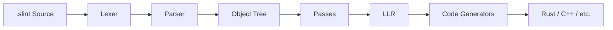
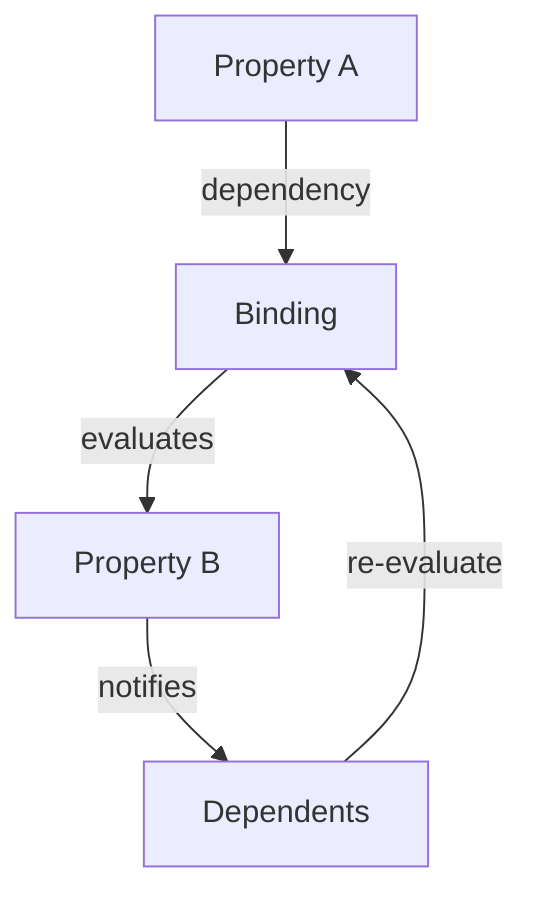
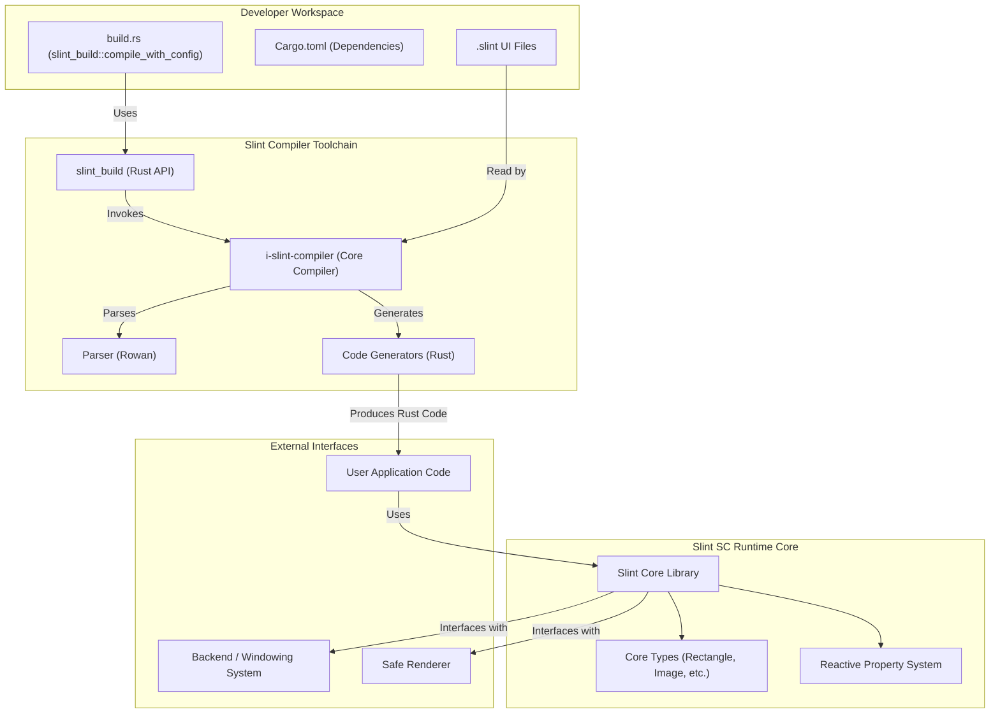
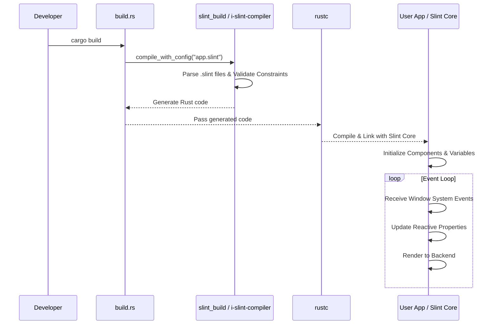

<!-- cSpell: ignore xkbcommon fontconfig vcpkg DCMAKE RUSTDOCFLAGS cppdocs frontends -->
# Slint Build Guide

This page explains how to build and test Slint.

## Prerequisites

### Installing Rust

Install Rust by following the [Rust Getting Started Guide](https://www.rust-lang.org/learn/get-started). If you already
have Rust installed, make sure that it's at least version 1.92 or newer. You can check which version you have installed
by running `rustc --version`.

Once this is done, you should have the `rustc` compiler and the `cargo` build system installed in your path.

### Dependencies

- **FFMPEG**

- **Skia** (binaries limited to few platforms):

<center>

| Platform                          | Binaries                                           |
| --------------------------------- | -------------------------------------------------- |
| Windows                           | `x86_64-pc-windows-msvc`                           |
| Linux Ubuntu 16+<br />CentOS 7, 8 | `x86_64-unknown-linux-gnu`                         |
| macOS                             | `x86_64-apple-darwin`                              |
| Android                           | `aarch64-linux-android`<br/>`x86_64-linux-android` |
| iOS                               | `aarch64-apple-ios`<br/>`x86_64-apple-ios`         |
| WebAssembly                       | `wasm32-unknown-emscripten`                        |

</center>

### Linux

For Linux a few additional packages beyond the usual build essentials are needed for development and running apps:

- xcb (`libxcb-shape0-dev` `libxcb-xfixes0-dev` on debian based distributions)
- xkbcommon (`libxkbcommon-dev` on debian based distributions)
- fontconfig library (`libfontconfig-dev` on debian based distributions)
- (optional) Qt will be used when `qmake` is found in `PATH`
- FFMPEG library `clang` `libavcodec-dev` `libavformat-dev` `libavutil-dev` `libavfilter-dev` `libavdevice-dev` `libasound2-dev` `pkg-config`
- openssl (`libssl-dev` on debian based distributions)

`xcb` and `xcbcommon` aren't needed if you are only using `backend-winit-wayland` without `backend-winit-x11`.

### macOS

- Make sure the "Xcode Command Line Tools" are installed: `xcode-select --install`
- (optional) Qt will be used when `qmake` is found in `PATH`
- FFMPEG `brew install pkg-config ffmpeg`

### Windows

- Use Skia capable toolchain `rustup default stable-x86_64-pc-windows-msvc`

- See [System Link](#symlinks-in-the-repository-windows)
- Make sure the MSVC Build Tools are installed: `winget install Microsoft.VisualStudio.2022.BuildTools`
- (optional) make sure Qt is installed and `qmake` is in the `Path`
- FFMPEG

  - Option 1:

    - install [vcpkg](https://github.com/microsoft/vcpkg#quick-start-windows)
    - `vcpkg install ffmpeg --triplet x64-windows`
    - Make sure `VCPKG_ROOT` is set to where `vcpkg` is installed
    - Make sure `%VCPKG_ROOT%\installed\x64-windows\bin` is in your path

  - Option 2:
    - Download FFMPEG 4.4 shared and extract (<https://github.com/BtbN/FFmpeg-Builds/releases/tag/latest>)
    - Add FFMPEG to path: `*\ffmpeg\bin` `*\ffmpeg\include\libavutil` `*\ffmpeg\lib`

### C++ API (optional)

To use Slint from C++, the following extra dependencies are needed:

- **[cmake](https://cmake.org/download/)** (3.21 or newer)
- **[Ninja](https://ninja-build.org)** (Optional, or remove the `-GNinja` when invoking `cmake`)
- A C++ compiler that supports C++20 (e.g., **MSVC 2022 17.3** on Windows, or **GCC 10**)

### Node.js API (optional)

To use Slint from Node.js, the following extra dependencies are needed.

- **[Node.js](https://nodejs.org/en/)** (including npm) Version 20 or newer is recommended.
- **[Python](https://www.python.org)**

### Symlinks in the repository (Windows)

The Slint repository makes use of symbolic links to avoid duplication.
On Windows, this require to set a git config before cloning, and have Windows
switched in developer mode or do the git clone as Administrator

```sh
git clone -c core.symlinks=true https://github.com/slint-ui/slint
```

More info: <https://github.com/git-for-windows/git/wiki/Symbolic-Links>

## Building and Testing

Most of the project is written in Rust, and compiling and running the test can
be done with cargo.

```sh
cargo build
cargo test
```

**Important:** Note that `cargo test` does not work without first calling `cargo build` because the
the required dynamic library won't be found.

### Building workspace

To build all examples install the entire workplace to executables
(excluding [UEFI-demo](https://github.com/slint-ui/slint/tree/master/examples/uefi-demo) - different target)

```sh
cargo build --workspace --exclude uefi-demo --release
```

### C++ Tests

The C++ tests are contained in the `test-driver-cpp` crate. It requires the Slint C++ library to be built,
which isn't done by default. Build it explicitly before running the tests:

```sh
cargo build --lib -p slint-cpp
cargo test -p test-driver-cpp
```

### Node.js Tests

The Node.js tests are contained in the `test-driver-nodejs` crate. The node integration will be run
automatically when running the tests:

```sh
cargo build -p test-driver-nodejs
```

### More Info About Tests

For more details about the tests and how they are implemented, see [testing.md](./testing.md).

## C++ API Build

The Slint C++ API is implemented as a normal cmake build:

```sh
mkdir cppbuild && cd cppbuild
cmake -GNinja ..
cmake --build .
```

The build will call cargo to build the Rust libraries, and build the examples.
To install the libraries and everything you need, use:

```sh
cmake --install .
```

You can pass `-DCMAKE_INSTALL_PREFIX` in the first cmake command in order to choose the installation location.

### Node.js API Build

The Slint Node.js API is implemented as npm build. You can build it locally using the following command line:

```sh
cd api/node
npm install
```

To build your own project against the Git version of the Slint Node.js API, add the path to the `api/node` folder
in the dependencies section of your `package.json`:

```json
    "dependencies": {
        "slint-ui": "/path/to/api/node"
    },
```

## Cross-Compiling

Slint can be cross-compiled to different target architectures and environments. For the Rust build we
have had a good experience using [`cross`](https://github.com/rust-embedded/cross). For convenience we're
including a `Cross.toml` configuration file for `cross` in the source tree along with Docker containers that
allow targeting a Debian ARMv7 and ARMv8 based Distribution with X11 or Wayland, out of the box. If you want to use the default Cross containers or your own, make sure the [dependencies](#prerequisites) are in the container.

This includes for example the Raspberry Pi OS. Using the following steps you can run the examples on a
pi:

```sh
cross build --target armv7-unknown-linux-gnueabihf --workspace --exclude slint-node --exclude pyslint --release
scp target/armv7-unknown-linux-gnueabihf/release/printerdemo pi@raspberrypi.local:.
```

Finally on a shell on the Pi:

```sh
DISPLAY=:0 ./printerdemo
```

## Examples

See the [examples](/examples) folder for examples to build, run and test.

## Running the Viewer

Slint also includes a viewer tool that can load `.slint` files dynamically at run-time. It's a
cargo-integrated binary and can be run directly on the `.slint` files, for example:

```sh
cargo run --release --bin slint-viewer -- demos/printerdemo/ui/printerdemo.slint
```

## Generating the Documentation

The Slint documentation consists of five parts:

- The quickstart guide
- The Rust API documentation
- The C++ API documentation
- The Node.js API documentation
- The DSL documentation

The quickstart guide is part of the DSL documentation.

### Quickstart and DSL docs

See [astro/README.md](astro/README.md)

### Rust API docs

Run the following command to generate the documentation using rustdoc in the `target/doc/` sub-folder:

```sh
RUSTDOCFLAGS="--html-in-header=$PWD/docs/astro/src/utils/slint-docs-preview.html --html-in-header=$PWD/docs/astro/src/utils/slint-docs-highlight.html" cargo doc --package slint --no-deps --features slint/document-features,slint/log
```

Note: `--html-in-header` arguments passed to rustdoc via `RUSTDOCFLAGS` are used to enable syntax highlighting and live-preview for Slint example snippets.

### C++ API docs

**Prerequisites**:

- [Doxygen](https://www.doxygen.nl/download.html)

Run the following command to generate the documentation using sphinx/exhale/breathe/doxygen/myst_parser in the `target/cppdocs` sub-folder:

```sh
cargo xtask cppdocs
```

### Node.js API docs

Run the following commands from the `/api/node` sub-folder to generate the docs using [typedoc](https://typedoc.org/) in the `/api/node/docs` sub-folder:

```sh
npm install
npm run docs
```

### Building search database

We use Typesense for document search.

#### Infrastructure

* Typesense Server: The Typesense Server will hold the search index.
* Accessibility: The Typesense server must be accessible from the search bar in documentation site.
* Docker: Docker is needed to run the Typesense Docsearch Scraper.
* Typesense Docsearch Scraper: This tool will be used to index the documentation website.

#### Pre-requisites

* Install docker (<https://docs.docker.com/engine/install/>)

* Install jq

```sh
pip3 install jq
```

#### Testing Locally

* Install and start Typesense server (<https://typesense.org/docs/guide/install-typesense.html#option-2-local-machine-self-hosting>)
  * Note down the API key, the default port, and the data directory.

* Verify that the server is running
  * Replace the port below with the default port
  * It should return {"ok":true} if the server is running correctly.

```sh
curl http://localhost:8108/health
```

#### Testing on Typesense Cloud

* Create an account as per instructions (<https://typesense.org/docs/guide/install-typesense.html#option-1-typesense-cloud>)
  * Note down the API key and the hostname.

#### Creating search index

A helper script is located under `search` sub-folder that will (optionally) build the docs (currently only Slint docs), scrape the documents, and upload the search index to Typesense server.

The script accepts the following arguments

-a : API key to authenticate with Typesense Server (default: `xyz`)

-b : Build Slint docs (for testing locally set this flag ) (default: `false`)

-c : Location of config file (default: `docs/search/scraper-config.json`)

-d : Location of index.html of docs (default: `target/slintdocs/html`)

-i : Name of the search index (default: `local`)

-p : Port to access Typesense server (default: `8108`)

-r : Remote Server when using Typesense Cloud

-u : URL on which the docs will be served (default: `http://localhost:8000`)

Example when running locally

```sh
docs/search/docsearch-scraper.sh -b
```

Example when running on Typesense Cloud, where `$cluster_name` is the name of the cluster on Typesense Cloud

```sh
docs/search/docsearch-scraper.sh -a API_KEY -b -r TYPESENSE_CLOUD_HOST_NAME
```

#### Testing search functionality

Run http server

```sh
python3 -m http.server -d target/slintdocs/html
```

Open browser (<http://localhost:8000>) and use the search bar to search for content
# Animation System Internals

> Note for AI coding assistants (agents):
> **When to load this document:** Working on `internal/core/animations.rs`,
> debugging animation timing issues, or optimizing animation performance.
> For general build commands and project structure, see `/AGENTS.md`.

## Animation Timing System

Slint animations use a **mocked time system** rather than real-time clocks. This provides:
- Deterministic animation behavior for testing
- Frame-rate independence
- Consistent behavior across platforms

The animation driver (`internal/core/animations.rs`) manages a global instant that advances each frame:

```
AnimationDriver
├── global_instant: Property<Instant>  // Current animation time
├── active_animations: bool            // Whether animations are running
└── update_animations(new_tick)        // Called per frame by the backend
```

**Key components:**

| Function/Type | Location | Purpose |
|---------------|----------|---------|
| `Instant` | `internal/core/animations.rs` | Milliseconds since animation driver started |
| `current_tick()` | `internal/core/animations.rs` | Get current animation time (registers dependency) |
| `animation_tick()` | `internal/core/animations.rs` | Same, but signals a frame is needed |
| `update_timers_and_animations()` | `internal/core/platform.rs` | Called by platform each frame |
| `EasingCurve` | `internal/core/items.rs` | Enum of easing curve types |

## Easing Curve Implementation

Easing curves are defined in the `EasingCurve` enum in `internal/core/items.rs`. The interpolation logic is in `internal/core/animations.rs`.

For `cubic-bezier(a, b, c, d)`, Slint uses a binary search algorithm to find the t parameter for a given x value, then evaluates the y component of the bezier curve.

Standard easings (`ease-in`, `ease-out`, `ease-in-out`, etc.) are pre-defined cubic bezier curves.

## Animation Performance

Each animated property:
1. Re-evaluates its binding every frame
2. Marks dependents dirty
3. Triggers re-rendering of affected items

**Efficient to animate** (no layout recalculation):
- `x`, `y` - Position
- `opacity` - Transparency
- `rotation-angle` - Rotation
- `background` - Colors/gradients

**Expensive to animate** (triggers layout):
- `width`, `height`
- `preferred-width`, `preferred-height`
- Any property that affects sibling positioning

## Debugging Animations

### Slow Motion

```sh
# Slow animations by factor of 4
SLINT_SLOW_ANIMATIONS=4 cargo run

# Slow by factor of 10 for detailed inspection
SLINT_SLOW_ANIMATIONS=10 cargo run
```

Useful for:
- Verifying easing curves
- Checking animation start/end states
- Debugging timing between multiple animations

### Checking Active Animations

```rust
// In application code
if window.has_active_animations() {
    // Animations are in progress
}
```

### Mock Time in Tests

For deterministic testing without real-time waits:

```rust
use slint_testing::mock_elapsed_time;

// Advance animation time by 100ms
mock_elapsed_time(100);

// Complete a 300ms animation
mock_elapsed_time(300);
```

This is implemented in `internal/core/tests/` and used throughout the test suite.

## Key Files

| File | Purpose |
|------|---------|
| `internal/core/animations.rs` | Animation driver, timing, interpolation |
| `internal/core/items.rs` | `EasingCurve` enum definition |
| `internal/core/timers.rs` | Timer integration with animation system |
| `internal/core/platform.rs` | `update_timers_and_animations()` entry point |

## Common Modification Patterns

### Adding a New Easing Curve

1. Add variant to `EasingCurve` enum in `internal/core/items.rs`
2. Handle interpolation in `internal/core/animations.rs`
3. Add parsing support in `internal/compiler/` if new syntax needed
4. Add tests in `tests/cases/`

### Debugging Animation Glitches

1. Use `SLINT_SLOW_ANIMATIONS=10` to slow down
2. Check if issue is in timing (`animations.rs`) or rendering (`renderers/`)
3. Add `eprintln!` in `update_animations()` to trace tick values
4. Use screenshot tests to capture specific animation frames
# Compiler & Runtime Internals

> Note for AI coding assistants (agents):
> **When to load this document:** Working on compiler passes, code generation,
> property bindings, the reactive system, or adding new language features.
> For general build commands and project structure, see `/AGENTS.md`.

## Compiler Pipeline

The Slint compiler transforms `.slint` source files into target language code through these stages:



| Stage | Location | Description |
|-------|----------|-------------|
| **Lexer** | `internal/compiler/lexer.rs` | Tokenizes `.slint` source into tokens |
| **Parser** | `internal/compiler/parser.rs` | Builds syntax tree from tokens |
| **Object Tree** | `internal/compiler/object_tree.rs` | High-level IR representing components and elements |
| **Passes** | `internal/compiler/passes/` | ~50 transformation and optimization passes |
| **LLR** | `internal/compiler/llr/` | Low-Level Representation for code generation |
| **Generators** | `internal/compiler/generator/` | Target-specific code generators (Rust, C++, etc.) |

## Compiler Passes

Passes are organized into three phases in `internal/compiler/passes.rs`:

### 1. Import Passes (`run_import_passes`)
- `inject_debug_hooks` - Add debugging support
- `infer_aliases_types` - Resolve type aliases
- `resolving` - Resolve expressions, types, and references
- `purity_check` - Verify function purity
- `check_expressions` - Validate expression semantics

### 2. Transformation Passes (main `run_passes`)
- `lower_*` passes - Transform high-level constructs (states, layouts, popups, etc.)
- `inlining` - Inline components as needed
- `collect_*` passes - Gather globals, structs, subcomponents
- `focus_handling` - Set up focus navigation
- `default_geometry` - Calculate default sizes

### 3. Optimization Passes
- `const_propagation` - Propagate constant values
- `remove_aliases` - Eliminate property aliases
- `remove_unused_properties` - Dead code elimination
- `deduplicate_property_read` - Optimize property access
- `optimize_useless_rectangles` - Remove unnecessary elements

## Property Binding & Reactivity

Slint's reactive property system is implemented in `internal/core/properties.rs`:



**Key concepts:**
- **Properties** (`Property<T>`) hold values and track dependencies
- **Bindings** are expressions that compute property values
- **Dependency tracking** uses a doubly-linked list (`DependencyListHead`/`DependencyNode`)
- When a property changes, all dependent bindings are marked dirty and re-evaluated

The binding evaluation is lazy - properties are only recomputed when read after being marked dirty.

## Interpreter vs Compiled Modes

Slint supports two execution modes with different code paths:

| Mode | Entry Point | Use Case |
|------|-------------|----------|
| **Compiled** | `slint!` macro, `slint-build` | Production apps, maximum performance |
| **Interpreted** | `slint-interpreter` crate | Runtime `.slint` loading, tooling, scripting |

The interpreter (`internal/interpreter/`) compiles `.slint` at runtime and uses dynamic dispatch, while the compiled path generates static Rust/C++ code at build time.

## Key Data Structures

| Structure | Location | Purpose |
|-----------|----------|---------|
| `Document` | `compiler/object_tree.rs` | Root of parsed `.slint` file |
| `Component` | `compiler/object_tree.rs` | A component definition |
| `Element` | `compiler/object_tree.rs` | An element within a component |
| `Expression` | `compiler/expression_tree.rs` | Compiled expressions |
| `Type` | `compiler/langtype.rs` | Type system representation |
| `CompilationUnit` | `compiler/llr/mod.rs` | LLR output ready for code generation |

## Common Modification Patterns

### Adding a New Built-in Element

1. **Define the element** in `internal/compiler/builtins.slint`
2. **Add runtime item** in `internal/core/items/` (new file or existing)
3. **Register the item** in `internal/core/items.rs` (add to `ItemVTable`)
4. **Update type registry** in `internal/compiler/typeregister.rs`
5. **Add rendering support** in each renderer (`internal/renderers/*/`)
6. **Add tests** in `tests/cases/elements/`

### Adding a New Compiler Pass

1. **Create pass file** in `internal/compiler/passes/your_pass.rs`
2. **Add to mod.rs** in `internal/compiler/passes/mod.rs`
3. **Register in pipeline** in `internal/compiler/passes.rs` (choose appropriate phase)
4. **Add tests** - either unit tests in the pass file or `.slint` test cases

### Adding a New Property Type

1. **Define type** in `internal/compiler/langtype.rs`
2. **Add parsing support** if new syntax needed
3. **Handle in relevant passes** (type checking, lowering)
4. **Add runtime support** in `internal/core/` if needed
5. **Update code generators** in `internal/compiler/generator/`

## Debugging Tips

### Inspecting Generated Code

To see the Rust code that the compiler generates from a `.slint` file:

```sh
cargo run -p slint-compiler -- -f rust path/to/file.slint | rustfmt > path/to/file.slint.rs
```

To see the generated C++ code:
```sh
cargo run -p slint-compiler -- -f cpp path/to/file.slint > path/to/file.slint.cpp
```

This is invaluable when debugging code generation issues — you can see exactly what the generators emit without running a full build of an application.
# Custom Renderer Implementation Guide

> Note for AI coding assistants (agents):
> **When to load this document:** Working on `internal/renderers/`, adding
> rendering backends, fixing drawing bugs, or implementing custom graphics output.
> For general build commands and project structure, see `/AGENTS.md`.

This document covers how to implement a custom renderer for Slint. This is intended for developers extending Slint's rendering capabilities or debugging existing renderers.

## Overview

Slint includes three built-in renderers:
- **Software Renderer** (`internal/renderers/software/`) - Pure Rust CPU-based rendering
- **FemtoVG Renderer** (`internal/renderers/femtovg/`) - OpenGL ES 2.0 via FemtoVG library
- **Skia Renderer** (`internal/renderers/skia/`) - GPU-accelerated via Skia library

## Core Traits

### RendererSealed (`internal/core/renderer.rs`)

The fundamental trait all renderers must implement. Uses the sealed trait pattern—`RendererSealed` is internal, while `Renderer` is the public re-export that external code uses.

**Key methods:**

| Method | Purpose |
|--------|---------|
| `text_size()` | Measure text dimensions with optional wrapping |
| `font_metrics()` | Query font ascent, descent, line height |
| `text_input_byte_offset_for_position()` | Hit-testing for text input cursor placement |
| `text_input_cursor_rect_for_byte_offset()` | Get cursor rectangle for a byte offset |
| `set_window_adapter()` / `window_adapter()` | Associate renderer with a window |
| `free_graphics_resources()` | Cleanup when components are destroyed |
| `mark_dirty_region()` | Manual dirty region marking for partial rendering |
| `register_font_from_memory()` / `register_font_from_path()` | Custom font registration |
| `set_rendering_notifier()` | Lifecycle callbacks (BeforeRendering, AfterRendering, etc.) |
| `resize()` | Handle window resize events |
| `take_snapshot()` | Capture rendered frame to pixel buffer |

### ItemRenderer (`internal/core/item_rendering.rs`)

The drawing interface for all UI elements. Each renderer provides its own implementation.

**Drawing methods:**
- `draw_rectangle()` - Solid/gradient rectangles
- `draw_border_rectangle()` - Rectangles with borders and border-radius
- `draw_image()` - Images with fit, alignment, tiling options
- `draw_text()` - Text with colors, alignment, wrapping
- `draw_text_input()` - Text input fields with selection/cursor
- `draw_path()` - Custom vector paths
- `draw_box_shadow()` - Shadow effects

**Clipping and transformations:**
- `combine_clip()` - Set clip region (supports rounded corners)
- `get_current_clip()` - Query current clip bounds
- `translate()` / `rotation()` / `scale()` - 2D transformations
- `apply_opacity()` - Alpha blending

**State management:**
- `save_state()` / `restore_state()` - State stack for nested rendering
- `filter_item()` - Early-out clipping test
- `scale_factor()` - DPI scaling factor

## Renderer Architecture Patterns

### FemtoVG Pattern: Generic Backend

FemtoVG abstracts over graphics APIs using generics:

```rust
pub struct FemtoVGRenderer<B: GraphicsBackend> { ... }

pub trait GraphicsBackend {
    type Renderer: femtovg::Renderer + TextureImporter;
    type WindowSurface: WindowSurface<Self::Renderer>;

    fn new_suspended() -> Self;
    fn begin_surface_rendering(&self) -> Result<Self::WindowSurface, ...>;
    fn submit_commands(&self, commands: ...);
    fn present_surface(&self, surface: Self::WindowSurface) -> Result<(), ...>;
    fn resize(&self, width: NonZeroU32, height: NonZeroU32) -> Result<(), ...>;
}
```

### Skia Pattern: Trait Object Surfaces

Skia uses trait objects for dynamic surface selection:

```rust
pub trait Surface {
    fn new(
        shared_context: &SkiaSharedContext,
        window_handle: Arc<dyn HasWindowHandle + Sync + Send>,
        display_handle: Arc<dyn HasDisplayHandle + Sync + Send>,
        size: PhysicalWindowSize,
        requested_graphics_api: Option<RequestedGraphicsAPI>,
    ) -> Result<Self, PlatformError>;

    fn name(&self) -> &'static str;
    fn render(&self, window: &Window, size: PhysicalWindowSize,
              render_callback: &dyn Fn(&Canvas, ...), ...) -> Result<(), ...>;
    fn resize_event(&self, size: PhysicalWindowSize) -> Result<(), ...>;
    fn use_partial_rendering(&self) -> bool { false }
}
```

Available surface implementations: `OpenGLSurface`, `MetalSurface`, `VulkanSurface`, `D3DSurface`, `SoftwareSurface`

### Software Renderer Pattern: Scene Building

The software renderer builds a scene graph then rasterizes:

```rust
pub struct SoftwareRenderer { ... }

impl SoftwareRenderer {
    pub fn render(&self, buffer: &mut [impl TargetPixel], pixel_stride: usize);
    pub fn render_by_line(&self, line_callback: impl FnMut(&mut [impl TargetPixel]));
}
```

Supports memory-constrained devices via line-by-line rendering.

## Backend Integration

### WinitCompatibleRenderer (`internal/backends/winit/`)

For winit-based applications, renderers implement:

```rust
pub trait WinitCompatibleRenderer: std::any::Any {
    fn render(&self, window: &Window) -> Result<(), PlatformError>;
    fn as_core_renderer(&self) -> &dyn Renderer;
    fn suspend(&self) -> Result<(), PlatformError>;
    fn resume(&self, event_loop: &ActiveEventLoop,
              attrs: WindowAttributes) -> Result<Arc<winit::window::Window>, ...>;
}
```

## Key Supporting Types

| Type | Location | Purpose |
|------|----------|---------|
| `ItemCache<T>` | `internal/core/` | Per-item graphics caching with automatic invalidation |
| `DirtyRegion` | `internal/core/` | Partial rendering dirty tracking |
| `RenderingNotifier` | `internal/core/` | Lifecycle event callbacks |
| `CachedRenderingData` | `internal/core/` | Per-item cached rendering state |
| `BorderRadius` | `internal/core/` | Rounded corner support |
| `Brush` | `internal/core/` | Color and gradient fills |
| `SharedPixelBuffer` | `internal/core/` | Pixel buffer for snapshots |

## Implementation Checklist

To implement a custom renderer:

1. **Implement `RendererSealed`** - Text measurement, font handling, window association
2. **Implement `ItemRenderer`** - Drawing all UI element types
3. **Handle graphics API abstraction** - Surface/backend trait if supporting multiple APIs
4. **Integrate with `WindowAdapter`** - Register renderer and handle window events
5. **Support `RenderingNotifier`** - For BeforeRendering/AfterRendering hooks
6. **Implement partial rendering** (optional) - Dirty region tracking for performance
7. **Implement caching** - Texture/image caching via `ItemCache`

## Renderer Registration & Selection

### Feature Flags

Renderers are enabled via Cargo features in `api/rs/slint/Cargo.toml`:

```toml
renderer-femtovg = ["i-slint-backend-selector/renderer-femtovg"]
renderer-skia = ["i-slint-backend-selector/renderer-skia"]
renderer-software = ["i-slint-backend-selector/renderer-software"]
```

### Backend Selector

The selector (`internal/backends/selector/lib.rs`) chooses renderer at runtime:

1. Check `SLINT_BACKEND` environment variable (e.g., `winit-skia`, `winit-femtovg`)
2. Fall back to compile-time feature priority

To add a new renderer:
1. Add feature flag to `internal/backends/selector/Cargo.toml`
2. Update `try_create_renderer()` in `internal/backends/selector/lib.rs`
3. Wire up in the appropriate backend (e.g., `internal/backends/winit/`)

### Runtime Selection

```sh
SLINT_BACKEND=winit-software cargo run    # Force software renderer
SLINT_BACKEND=winit-skia cargo run        # Force Skia renderer
```

## Window & Event Loop Integration

Renderers integrate with the platform through `WindowAdapter`:

```
Platform (winit/qt/linuxkms)
    └── WindowAdapter
            ├── window() -> Window (Slint window abstraction)
            └── renderer() -> &dyn Renderer
                    └── render() called by event loop on redraw
```

**Render lifecycle:**
1. Event loop receives redraw request
2. Backend calls `WindowAdapter::renderer().render()`
3. Renderer traverses item tree via `ItemRenderer` methods
4. Renderer presents to screen/surface

**Key integration points:**
- `internal/backends/winit/winitwindowadapter.rs` - Winit integration
- `internal/core/window.rs` - Platform-agnostic window logic
- `internal/core/api.rs` - Public `Window` API

## Testing Renderer Changes

### Screenshot Tests

```sh
# Run screenshot comparison tests
cargo test -p test-driver-screenshots

# Generate new reference screenshots (run when intentionally changing rendering)
SLINT_CREATE_SCREENSHOTS=1 cargo test -p test-driver-screenshots
```

### Testing Backend

Use the headless testing backend for automated tests:

```sh
SLINT_BACKEND=testing cargo test
```

The testing backend (`internal/backends/testing/`) provides:
- Headless rendering without display
- Simulated input events
- Screenshot capture for comparison

### Visual Verification

```sh
# Run gallery to visually inspect rendering
cargo run -p gallery

# View specific .slint file with hot reload
cargo run --bin slint-viewer -- path/to/file.slint
```

## Directory Structure

```
internal/renderers/
├── femtovg/
│   ├── lib.rs           # FemtoVGRenderer, GraphicsBackend trait
│   ├── itemrenderer.rs  # GLItemRenderer (ItemRenderer impl)
│   ├── opengl.rs        # OpenGL backend
│   └── wgpu.rs          # WebGPU backend
├── skia/
│   ├── lib.rs           # SkiaRenderer, Surface trait
│   ├── itemrenderer.rs  # SkiaItemRenderer (ItemRenderer impl)
│   ├── opengl_surface.rs
│   ├── metal_surface.rs
│   ├── vulkan_surface.rs
│   └── software_surface.rs
└── software/
    ├── lib.rs           # SoftwareRenderer, scene building
    ├── scene.rs         # Scene graph structures
    └── draw_functions.rs
```

## Example: Studying Existing Implementations

The software renderer is the simplest to study as it has no external dependencies:

- Entry point: `internal/renderers/software/lib.rs`
- Scene builder implements `ItemRenderer`: builds a scene graph from draw calls
- `render()` method rasterizes the scene to a pixel buffer

For GPU rendering patterns, study `internal/renderers/skia/itemrenderer.rs` which shows:
- Texture caching strategies
- Transformation matrix handling
- Clipping with GPU-accelerated paths
# FFI & Language Bindings

> Note for AI coding assistants (agents):
> **When to load this document:** Working on `api/cpp/`, `api/node/`, `api/python/`,
> language bindings, cbindgen, FFI modules in `internal/`, or adding new cross-language APIs.
> For general build commands and project structure, see `/AGENTS.md`.

## Overview

Slint provides language bindings for C++, Node.js, and Python, all built on top of the Rust core. The FFI layer uses:

- **C++ bindings**: cbindgen-generated headers with manual C++ wrapper classes
- **Node.js bindings**: Neon/NAPI framework for native Node modules
- **Python bindings**: PyO3 with maturin build system
- **Internal FFI**: `#[no_mangle] extern "C"` functions in core crates

## Key Files

| File | Purpose |
|------|---------|
| `api/cpp/lib.rs` | Core C FFI exports (window, event loop, timers) |
| `api/cpp/cbindgen.rs` | C++ header generator (enums, structs, vtables) |
| `api/cpp/platform.rs` | Platform abstraction for C++ |
| `api/cpp/CMakeLists.txt` | CMake integration via Corrosion |
| `api/node/rust/lib.rs` | Neon/NAPI module entry point |
| `api/node/rust/interpreter/` | Interpreter bindings for Node.js |
| `api/python/slint/lib.rs` | PyO3 module initialization |
| `api/python/slint/interpreter.rs` | Interpreter bindings for Python |
| `internal/core/properties/ffi.rs` | Property system FFI |
| `internal/core/window.rs` | Window FFI in `ffi` module |
| `internal/core/item_tree.rs` | ItemTreeVTable definitions |
| `internal/interpreter/ffi.rs` | Interpreter value FFI |
| `internal/backends/testing/ffi.rs` | Testing backend FFI |

## Architecture

```
┌─────────────────────────────────────────────────────────────────────┐
│                        Language APIs                                 │
├─────────────────┬─────────────────┬─────────────────────────────────┤
│   C++ (api/cpp) │ Node.js (api/node)│ Python (api/python)            │
│   cbindgen      │ Neon/NAPI        │ PyO3                           │
├─────────────────┴─────────────────┴─────────────────────────────────┤
│                     FFI Layer (extern "C")                           │
│  ┌─────────────┐ ┌─────────────┐ ┌─────────────┐ ┌─────────────┐   │
│  │ properties/ │ │ window.rs   │ │ item_tree.rs│ │ interpreter/│   │
│  │ ffi.rs      │ │ ffi module  │ │ VTables     │ │ ffi.rs      │   │
│  └─────────────┘ └─────────────┘ └─────────────┘ └─────────────┘   │
├─────────────────────────────────────────────────────────────────────┤
│                     Internal Rust Crates                             │
│  i-slint-core   i-slint-compiler   slint-interpreter                │
└─────────────────────────────────────────────────────────────────────┘
```

## C++ Bindings

### Structure

The C++ API consists of:
- **Generated headers**: Created by `cbindgen.rs` from Rust types
- **Hand-written headers**: C++ wrapper classes in `api/cpp/include/`
- **Rust FFI**: `extern "C"` functions in `api/cpp/lib.rs`

### FFI Function Pattern

```rust
// api/cpp/lib.rs
#[unsafe(no_mangle)]
pub unsafe extern "C" fn slint_windowrc_init(out: *mut WindowAdapterRcOpaque) {
    // Size assertion for ABI safety
    assert_eq!(
        core::mem::size_of::<Rc<dyn WindowAdapter>>(),
        core::mem::size_of::<WindowAdapterRcOpaque>()
    );
    let win = with_platform(|b| b.create_window_adapter()).unwrap();
    unsafe {
        core::ptr::write(out as *mut Rc<dyn WindowAdapter>, win);
    }
}

#[unsafe(no_mangle)]
pub extern "C" fn slint_run_event_loop(quit_on_last_window_closed: bool) {
    with_platform(|b| {
        if !quit_on_last_window_closed {
            b.set_event_loop_quit_on_last_window_closed(false);
        }
        b.run_event_loop()
    }).unwrap();
}
```

### Opaque Pointer Types

Hide internal Rust types from C++:

```rust
/// Opaque type for Rc<dyn WindowAdapter>
#[repr(C)]
pub struct WindowAdapterRcOpaque(*const c_void, *const c_void);

/// Opaque type for PropertyHandle
#[repr(C)]
pub struct PropertyHandleOpaque(PropertyHandle);

/// Opaque type for callbacks
#[repr(C)]
pub struct CallbackOpaque(*const c_void, *const c_void);
```

### cbindgen Code Generation

The `cbindgen.rs` file (900+ lines) generates C++ headers:

```rust
// api/cpp/cbindgen.rs
fn gen_enums(include_dir: &Path) {
    // Generates slint_enums.h and slint_enums_internal.h
    i_slint_common::for_each_enums!(gen_enum_descriptors);
}

fn gen_structs(include_dir: &Path) {
    // Generates slint_builtin_structs.h
    i_slint_common::for_each_builtin_structs!(gen_struct_descriptors);
}

// Type renaming for C++
config.export.rename = [
    ("Callback".into(), "private_api::CallbackHelper".into()),
    ("Coord".into(), "float".into()),
    ("SharedString".into(), "slint::SharedString".into()),
    // ... more mappings
];
```

**Generated headers:**
- `slint_enums.h` / `slint_enums_internal.h` - Public/private enums
- `slint_builtin_structs.h` / `slint_builtin_structs_internal.h` - Structs
- `slint_string_internal.h` - SharedString, StyledText
- `slint_properties_internal.h` - Property system
- `slint_timer_internal.h` - Timer management
- Item VTables for UI elements

### CMake Integration

Uses Corrosion to bridge CMake and Cargo:

```cmake
# api/cpp/CMakeLists.txt
define_cargo_feature(freestanding "Enable freestanding environment" OFF)
define_cargo_dependent_feature(interpreter "Enable .slint loading" ON)
define_cargo_feature(backend-winit "Enable winit windowing" ON)

# Feature flags map: CMake options → Cargo features
# SLINT_FEATURE_BACKEND_WINIT → --features backend-winit
```

### Building C++ Library

```sh
cargo build --lib -p slint-cpp

# With CMake
mkdir build && cd build
cmake -GNinja ..
cmake --build .
```

## Node.js Bindings

### Structure

Uses Neon/NAPI for Node.js native modules:

```
api/node/
├── rust/
│   ├── lib.rs              # Module entry point
│   ├── types/              # Type wrappers
│   │   ├── brush.rs
│   │   ├── image.rs
│   │   └── ...
│   └── interpreter/        # Interpreter bindings
│       ├── component_compiler.rs
│       ├── component_instance.rs
│       └── value.rs
├── Cargo.toml
└── package.json
```

### NAPI Function Pattern

```rust
// api/node/rust/lib.rs
use napi::{Env, JsFunction};
extern crate napi_derive;

#[napi]
pub fn mock_elapsed_time(ms: f64) {
    i_slint_core::tests::slint_mock_elapsed_time(ms as _);
}

#[napi]
pub enum ProcessEventsResult {
    Continue,
    Exited,
}

#[napi]
pub fn process_events() -> napi::Result<ProcessEventsResult> {
    i_slint_backend_selector::with_platform(|b| {
        b.process_events(std::time::Duration::ZERO, i_slint_core::InternalToken)
    })
    .map_err(|e| napi::Error::from_reason(e.to_string()))
    .map(|result| match result {
        core::ops::ControlFlow::Continue(()) => ProcessEventsResult::Continue,
        core::ops::ControlFlow::Break(()) => ProcessEventsResult::Exited,
    })
}
```

### Type Bindings

```rust
// api/node/rust/types/brush.rs
#[napi(object)]
pub struct RgbaColor {
    pub red: f64,
    pub green: f64,
    pub blue: f64,
    pub alpha: Option<f64>,
}

#[napi]
pub struct SlintRgbaColor {
    inner: Color,
}

#[napi]
impl SlintRgbaColor {
    #[napi(constructor)]
    pub fn new() -> Self { ... }

    #[napi]
    pub fn red(&self) -> f64 { self.inner.red() as f64 }
}
```

### Callback Handling

```rust
#[napi]
pub fn invoke_from_event_loop(env: Env, callback: JsFunction) -> napi::Result<napi::JsUndefined> {
    let function_ref = RefCountedReference::new(&env, callback)?;
    let function_ref = send_wrapper::SendWrapper::new(function_ref);

    i_slint_core::api::invoke_from_event_loop(move || {
        let guard = function_ref.get();
        if let Err(e) = guard.call::<JsUnknown>(None, &[]) {
            eprintln!("Callback error: {:?}", e);
        }
    })
    .map_err(|e| napi::Error::from_reason(e.to_string()))?;

    env.get_undefined()
}
```

### Building Node.js Module

```sh
cd api/node
pnpm install
pnpm build
```

## Python Bindings

### Structure

Uses PyO3 with maturin build system:

```
api/python/slint/
├── lib.rs              # Module initialization
├── interpreter.rs      # Compiler, ComponentInstance
├── value.rs            # Value conversions
├── models.rs           # Model wrappers
├── image.rs            # Image type
├── errors.rs           # Error types
└── Cargo.toml
```

### PyO3 Function Pattern

```rust
// api/python/slint/lib.rs
use pyo3::prelude::*;

#[gen_stub_pyfunction]
#[pyfunction]
fn run_event_loop(py: Python<'_>) -> Result<(), PyErr> {
    EVENT_LOOP_EXCEPTION.replace(None);
    EVENT_LOOP_RUNNING.set(true);

    let result = py.allow_threads(|| slint_interpreter::run_event_loop());

    EVENT_LOOP_RUNNING.set(false);
    result.map_err(|e| errors::PyPlatformError::from(e))?;
    EVENT_LOOP_EXCEPTION.take().map_or(Ok(()), |err| Err(err))
}

#[pymodule]
fn slint(_py: Python<'_>, m: &Bound<'_, PyModule>) -> PyResult<()> {
    m.add_class::<Compiler>()?;
    m.add_class::<CompilationResult>()?;
    m.add_class::<ComponentInstance>()?;
    m.add_function(wrap_pyfunction!(run_event_loop, m)?)?;
    Ok(())
}
```

### Class Bindings

```rust
// api/python/slint/interpreter.rs
#[gen_stub_pyclass]
#[pyclass(unsendable)]
pub struct Compiler {
    compiler: slint_interpreter::Compiler,
}

#[gen_stub_pymethods]
#[pymethods]
impl Compiler {
    #[new]
    fn py_new() -> PyResult<Self> {
        Ok(Self { compiler: slint_interpreter::Compiler::new() })
    }

    #[getter]
    fn get_include_paths(&self) -> PyResult<Vec<PathBuf>> {
        Ok(self.compiler.include_paths().map(|p| p.to_owned()).collect())
    }

    #[setter]
    fn set_include_paths(&mut self, paths: Vec<PathBuf>) {
        self.compiler.set_include_paths(paths);
    }

    fn build_from_path(&mut self, py: Python<'_>, path: PathBuf) -> CompilationResult {
        py.allow_threads(|| {
            self.compiler.build_from_path(&path).into()
        })
    }
}
```

### Value Conversion

```rust
// api/python/slint/value.rs
impl<'py> IntoPyObject<'py> for SlintToPyValue {
    fn into_pyobject(self, py: Python<'py>) -> Result<Self::Output, Self::Error> {
        match self.slint_value {
            slint_interpreter::Value::Void => ().into_bound_py_any(py),
            slint_interpreter::Value::Number(num) => num.into_bound_py_any(py),
            slint_interpreter::Value::String(str) => str.into_bound_py_any(py),
            slint_interpreter::Value::Bool(b) => b.into_bound_py_any(py),
            slint_interpreter::Value::Image(image) => {
                crate::image::PyImage::from(image).into_bound_py_any(py)
            }
            slint_interpreter::Value::Model(model) => {
                crate::models::PyModelShared::rust_into_py_model(&model, py)
                    .map_or_else(
                        || type_collection.model_to_py(&model).into_bound_py_any(py),
                        |m| Ok(m),
                    )
            }
            // ... more conversions
        }
    }
}
```

### Building Python Module

```sh
cd api/python
maturin develop  # Development build
maturin build    # Release wheel
```

## Internal FFI Modules

### Property FFI (`internal/core/properties/ffi.rs`)

```rust
#[repr(C)]
pub struct PropertyHandleOpaque(PropertyHandle);

#[unsafe(no_mangle)]
pub unsafe extern "C" fn slint_property_init(out: *mut PropertyHandleOpaque) {
    // Initialize property handle
}

#[unsafe(no_mangle)]
pub unsafe extern "C" fn slint_property_update(
    handle: &PropertyHandleOpaque,
    val: *mut c_void,
) {
    // Update property value
}

#[unsafe(no_mangle)]
pub unsafe extern "C" fn slint_property_set_changed(
    handle: &PropertyHandleOpaque,
    value: *const c_void,
) {
    // Mark property as changed
}

// C function binding support
fn make_c_function_binding(
    binding: extern "C" fn(*mut c_void, *mut c_void),
    user_data: *mut c_void,
    drop_user_data: Option<extern "C" fn(*mut c_void)>,
    intercept_set: Option<extern "C" fn(*mut c_void, ...) -> bool>,
) -> impl Fn() -> T {
    // Creates Rust closure from C function pointers
}
```

### Window FFI (`internal/core/window.rs`)

```rust
pub mod ffi {
    #[repr(C)]
    pub struct WindowAdapterRcOpaque(*const c_void, *const c_void);

    #[unsafe(no_mangle)]
    pub unsafe extern "C" fn slint_windowrc_init(out: *mut WindowAdapterRcOpaque) { ... }

    #[unsafe(no_mangle)]
    pub unsafe extern "C" fn slint_windowrc_drop(handle: *mut WindowAdapterRcOpaque) { ... }

    #[unsafe(no_mangle)]
    pub unsafe extern "C" fn slint_windowrc_clone(
        source: &WindowAdapterRcOpaque,
        target: *mut WindowAdapterRcOpaque,
    ) { ... }

    #[unsafe(no_mangle)]
    pub unsafe extern "C" fn slint_windowrc_show(handle: &WindowAdapterRcOpaque) { ... }

    #[unsafe(no_mangle)]
    pub unsafe extern "C" fn slint_windowrc_hide(handle: &WindowAdapterRcOpaque) { ... }
}
```

### Item Tree VTables (`internal/core/item_tree.rs`)

```rust
/// VTable for component instances
pub struct ItemTreeVTable {
    /// Visit children in traversal order
    pub visit_children_item: extern "C" fn(
        Pin<VRef<ItemTreeVTable>>,
        index: isize,
        order: TraversalOrder,
        visitor: VRefMut<ItemVisitorVTable>,
    ) -> VisitChildrenResult,

    /// Get item reference by index
    pub get_item_ref: extern "C" fn(
        Pin<VRef<ItemTreeVTable>>,
        index: u32,
    ) -> Pin<VRef<ItemVTable>>,

    /// Get subtree range for repeaters
    pub get_subtree_range: extern "C" fn(
        Pin<VRef<ItemTreeVTable>>,
        index: u32,
    ) -> IndexRange,

    // ... more vtable entries
}
```

### Interpreter FFI (`internal/interpreter/ffi.rs`)

```rust
/// Value type enum for FFI
#[repr(C)]
pub enum ValueType {
    Void, Number, String, Bool, Model, Struct, Brush, Image,
}

#[unsafe(no_mangle)]
pub extern "C" fn slint_interpreter_value_new() -> Box<Value> {
    Box::new(Value::Void)
}

#[unsafe(no_mangle)]
pub extern "C" fn slint_interpreter_value_new_string(str: &SharedString) -> Box<Value> {
    Box::new(Value::String(str.clone()))
}

#[unsafe(no_mangle)]
pub extern "C" fn slint_interpreter_value_type(val: &Value) -> ValueType {
    match val {
        Value::Void => ValueType::Void,
        Value::Number(_) => ValueType::Number,
        Value::String(_) => ValueType::String,
        // ...
    }
}

#[unsafe(no_mangle)]
pub extern "C" fn slint_interpreter_value_to_string(val: &Value) -> Option<&SharedString> {
    match val {
        Value::String(s) => Some(s),
        _ => None,
    }
}
```

## Core FFI Patterns

### Pattern 1: Opaque Pointer Types

Hide internal types from FFI consumers:

```rust
#[repr(C)]
pub struct OpaqueType(*const c_void, *const c_void);

// Size must match the actual type
assert_eq!(
    core::mem::size_of::<ActualType>(),
    core::mem::size_of::<OpaqueType>()
);
```

### Pattern 2: User Data + Cleanup

For callbacks that need to release resources:

```rust
#[unsafe(no_mangle)]
pub unsafe extern "C" fn slint_set_callback(
    callback: extern "C" fn(user_data: *mut c_void),
    user_data: *mut c_void,
    drop_user_data: Option<extern "C" fn(*mut c_void)>,
) {
    struct UserData {
        user_data: *mut c_void,
        drop_user_data: Option<extern "C" fn(*mut c_void)>,
    }

    impl Drop for UserData {
        fn drop(&mut self) {
            if let Some(drop_fn) = self.drop_user_data {
                drop_fn(self.user_data)
            }
        }
    }

    let ud = UserData { user_data, drop_user_data };
    // Use ud, it will be cleaned up when dropped
}
```

### Pattern 3: VTable System

For polymorphic behavior across FFI:

```rust
#[repr(C)]
pub struct MyVTable {
    pub method_a: extern "C" fn(VRef<MyVTable>, arg: i32) -> i32,
    pub method_b: extern "C" fn(VRef<MyVTable>) -> bool,
    pub drop: extern "C" fn(VRefMut<MyVTable>),
}

// Use with vtable crate
vtable::VRef<MyVTable>
vtable::VBox<MyVTable>
```

### Pattern 4: Feature-Gated FFI

```rust
#[cfg(feature = "ffi")]
pub mod ffi {
    #[unsafe(no_mangle)]
    pub extern "C" fn slint_feature_specific_function() { ... }
}

#[cfg(all(feature = "ffi", feature = "std"))]
#[unsafe(no_mangle)]
pub unsafe extern "C" fn slint_register_font_from_path(...) { ... }
```

### Pattern 5: cbindgen Visibility

```rust
// Make types visible to cbindgen without exporting
#[cfg(cbindgen)]
#[repr(C)]
struct InternalRect {
    x: f32, y: f32, width: f32, height: f32,
}
```

## Adding New FFI Functions

### Step 1: Add to Internal Module

```rust
// internal/core/mymodule.rs
#[cfg(feature = "ffi")]
pub mod ffi {
    use super::*;

    #[unsafe(no_mangle)]
    pub extern "C" fn slint_mymodule_new_function(
        param: i32,
        out: *mut ResultType,
    ) -> bool {
        // Implementation
        let result = internal_function(param);
        unsafe { *out = result };
        true
    }
}
```

### Step 2: Update cbindgen (for C++)

```rust
// api/cpp/cbindgen.rs
config.export.include = [
    // ... existing exports
    "slint_mymodule_new_function",
];
```

### Step 3: Add C++ Wrapper

```cpp
// api/cpp/include/slint_mymodule.h
namespace slint {
    inline ResultType mymodule_new_function(int param) {
        ResultType result;
        slint_mymodule_new_function(param, &result);
        return result;
    }
}
```

### Step 4: Add Python Binding

```rust
// api/python/slint/mymodule.rs
#[gen_stub_pyfunction]
#[pyfunction]
fn new_function(param: i32) -> PyResult<ResultType> {
    Ok(internal_function(param))
}

// In lib.rs
m.add_function(wrap_pyfunction!(mymodule::new_function, m)?)?;
```

### Step 5: Add Node.js Binding

```rust
// api/node/rust/mymodule.rs
#[napi]
pub fn new_function(param: i32) -> napi::Result<ResultType> {
    Ok(internal_function(param))
}
```

## Build System

### Cargo Features

```toml
# api/cpp/Cargo.toml
[lib]
crate-type = ["lib", "cdylib", "staticlib"]
links = "slint_cpp"

[features]
# Renderers
renderer-femtovg = ["i-slint-backend-selector/renderer-femtovg"]
renderer-skia = ["i-slint-backend-selector/renderer-skia"]
renderer-software = ["i-slint-backend-selector/renderer-software"]

# Backends
backend-winit = ["i-slint-backend-selector/backend-winit"]
backend-qt = ["i-slint-backend-selector/backend-qt"]
backend-linuxkms = ["i-slint-backend-selector/backend-linuxkms"]

# Other
freestanding = ["i-slint-core/freestanding"]
interpreter = ["slint-interpreter"]
testing = ["i-slint-backend-testing"]
```

### CMake Feature Mapping

```cmake
# Feature flags: CMake options → Cargo features
define_cargo_feature(backend-winit "Enable winit" ON)
define_cargo_feature(backend-qt "Enable Qt" OFF)
define_cargo_feature(renderer-femtovg "Enable FemtoVG" ON)
define_cargo_feature(interpreter "Enable interpreter" ON)
```

### Header Generation

```sh
# Generate headers via xtask
cargo xtask cbindgen

# Headers placed in:
# - target/slint-cpp-generated/include/
```

## Testing

### C++ Tests

```sh
# Build with testing backend
cargo build -p slint-cpp --features testing

# Run C++ tests
cd cppbuild
ctest
```

### Node.js Tests

```sh
cd api/node
pnpm test
```

### Python Tests

```sh
cd api/python
pytest
```

### FFI-Specific Tests

```sh
# Test interpreter FFI
cargo test -p slint-interpreter ffi

# Test core FFI
cargo test -p i-slint-core ffi
```

## Debugging Tips

### Common Issues

| Issue | Cause | Solution |
|-------|-------|----------|
| Segfault on init | Size mismatch | Check `assert_eq!` for opaque types |
| Memory leak | Missing drop_user_data | Ensure cleanup function is called |
| Type mismatch | cbindgen out of sync | Regenerate headers with `cargo xtask cbindgen` |
| Undefined symbol | FFI function not exported | Add to `config.export.include` |
| Python crash | GIL issues | Use `py.allow_threads()` for blocking calls |
| Node crash | Ref counting | Use `RefCountedReference` for callbacks |

### Checking ABI Compatibility

```rust
// Add size checks in FFI functions
#[unsafe(no_mangle)]
pub unsafe extern "C" fn slint_init(out: *mut OpaqueType) {
    const _: () = assert!(
        core::mem::size_of::<ActualType>() == core::mem::size_of::<OpaqueType>()
    );
    // ...
}
```

### Inspecting Generated Headers

```sh
# View generated C++ headers
ls target/slint-cpp-generated/include/

# Check specific header
cat target/slint-cpp-generated/include/slint_properties_internal.h
```

### Tracing FFI Calls

```rust
#[unsafe(no_mangle)]
pub extern "C" fn slint_debug_function(param: i32) -> i32 {
    eprintln!("slint_debug_function called with: {}", param);
    let result = internal_function(param);
    eprintln!("slint_debug_function returning: {}", result);
    result
}
```

## Rust Public API

### Private Unstable API

Generated code uses internal helpers:

```rust
// api/rs/slint/private_unstable_api.rs
pub mod re_exports {
    pub use i_slint_core::{*, properties::*, item_tree::*};
    pub use vtable::*;
    pub use pin_weak::rc::PinWeak;
}

pub fn set_property_binding<T, StrongRef>(
    property: Pin<&Property<T>>,
    component_strong: &StrongRef,
    binding: fn(StrongRef) -> T,
) {
    let weak = component_strong.to_weak();
    property.set_binding(move || {
        StrongRef::from_weak(&weak).map(binding).unwrap_or_default()
    })
}
```

### Build Script Support

```rust
// api/rs/build/lib.rs
pub struct CompilerConfiguration {
    pub include_paths: Vec<PathBuf>,
    pub library_paths: HashMap<String, PathBuf>,
    pub style: Option<String>,
}

pub fn compile_with_config(
    path: impl AsRef<Path>,
    config: CompilerConfiguration,
) -> Result<(), CompileError> {
    // Compile .slint file and generate Rust code
}
```
# Input & Event System

> Note for AI coding assistants (agents):
> **When to load this document:** Working on `internal/core/input.rs`,
> `internal/core/item_focus.rs`, `internal/core/window.rs` event handling,
> mouse/keyboard/touch processing, or focus management.
> For general build commands and project structure, see `/AGENTS.md`.

## Overview

Slint's input system handles mouse, touch, keyboard events and focus management. Events flow from the platform through the window to items in the item tree, with support for:

- **Mouse/touch events**: Press, release, move, wheel, drag-drop
- **Keyboard events**: Key press/release, text input, IME composition
- **Focus management**: Tab navigation, programmatic focus, focus delegation
- **Event filtering**: Items can intercept, delay, or forward events

## Key Files

| File | Purpose |
|------|---------|
| `internal/core/input.rs` | MouseEvent, KeyEvent, event processing |
| `internal/core/item_focus.rs` | Focus chain navigation |
| `internal/core/window.rs` | Window-level event dispatch |
| `internal/core/items.rs` | Item event handlers (input_event, etc.) |

## Mouse Events

### MouseEvent Enum

```rust
pub enum MouseEvent {
    /// Mouse/finger pressed
    Pressed {
        position: LogicalPoint,
        button: PointerEventButton,
        click_count: u8,
        is_touch: bool,
    },

    /// Mouse/finger released
    Released {
        position: LogicalPoint,
        button: PointerEventButton,
        click_count: u8,
        is_touch: bool,
    },

    /// Pointer moved
    Moved { position: LogicalPoint, is_touch: bool },

    /// Mouse wheel
    Wheel { position: LogicalPoint, delta_x: Coord, delta_y: Coord },

    /// Drag operation in progress over item
    DragMove(DropEvent),

    /// Drop occurred on item
    Drop(DropEvent),

    /// Mouse exited the item
    Exit,
}
```

### Click Counting

The `ClickState` tracks multi-clicks (double-click, triple-click):

```rust
pub struct ClickState {
    click_count_time_stamp: Cell<Option<Instant>>,
    click_count: Cell<u8>,
    click_position: Cell<LogicalPoint>,
    click_button: Cell<PointerEventButton>,
}
```

**Logic:**
- If press occurs within `click_interval` of previous press, at same position, with same button → increment `click_count`
- Otherwise reset to count 0
- `click_count` is included in Press/Release events

### Mouse Input State

Tracks the current state of mouse interaction:

```rust
pub struct MouseInputState {
    /// Stack of items under cursor, with their filter results
    item_stack: Vec<(ItemWeak, InputEventFilterResult)>,

    /// Offset for popup positioning
    pub(crate) offset: LogicalPoint,

    /// True if an item has grabbed the mouse
    grabbed: bool,

    /// Active drag-drop data
    pub(crate) drag_data: Option<DropEvent>,

    /// Delayed event (for Flickable touch handling)
    delayed: Option<(Timer, MouseEvent)>,

    /// Items pending exit events
    delayed_exit_items: Vec<ItemWeak>,
}
```

## Event Processing Flow

### Mouse Event Flow

```
┌─────────────────┐
│  Platform       │  (winit, Qt, etc.)
│  WindowEvent    │
└────────┬────────┘
         │
         ▼
┌─────────────────┐
│  WindowInner::  │  Click counting, modifier tracking
│  process_mouse_ │
│  input()        │
└────────┬────────┘
         │
         ▼
┌─────────────────┐
│  handle_mouse_  │  Check if item has grab
│  grab()         │  If so, send directly to grabber
└────────┬────────┘
         │ (if no grab)
         ▼
┌─────────────────┐
│  process_mouse_ │  Traverse item tree
│  input()        │  front-to-back
└────────┬────────┘
         │
         ▼
┌─────────────────┐
│  send_mouse_    │  For each item:
│  event_to_item()│  1. filter_before_children
│                 │  2. recurse to children
│                 │  3. input_event
└─────────────────┘
```

### Item Event Handlers

Each item has two event handlers:

```rust
// Called before children process the event
fn input_event_filter_before_children(
    &self,
    event: &MouseEvent,
    window_adapter: &Rc<dyn WindowAdapter>,
    self_rc: &ItemRc,
) -> InputEventFilterResult;

// Called after children (unless filtered)
fn input_event(
    &self,
    event: &MouseEvent,
    window_adapter: &Rc<dyn WindowAdapter>,
    self_rc: &ItemRc,
) -> InputEventResult;
```

### InputEventFilterResult

Controls how events are forwarded:

```rust
pub enum InputEventFilterResult {
    /// Forward to children, then call input_event on self
    ForwardEvent,

    /// Forward to children, don't call input_event on self
    ForwardAndIgnore,

    /// Forward, but keep receiving events even if child grabs
    ForwardAndInterceptGrab,

    /// Don't forward to children, handle here
    Intercept,

    /// Delay forwarding (for touch scrolling detection)
    DelayForwarding(u64),  // milliseconds
}
```

### InputEventResult

Returned by `input_event`:

```rust
pub enum InputEventResult {
    /// Event was handled
    EventAccepted,

    /// Event was not handled, continue propagation
    EventIgnored,

    /// Grab all future mouse events until release
    GrabMouse,

    /// Start drag-drop operation (DragArea only)
    StartDrag,
}
```

## Mouse Grab

When an item returns `GrabMouse`:

1. All future mouse events go directly to that item
2. Events bypass the normal traversal
3. Grab continues until:
   - Item returns non-grab result
   - Mouse is released
   - An intercepting ancestor calls `Intercept`

```rust
// In handle_mouse_grab()
if mouse_input_state.grabbed {
    // Send event directly to grabber
    let grabber = mouse_input_state.top_item().unwrap();
    let result = grabber.input_event(&event, ...);

    match result {
        InputEventResult::GrabMouse => None,  // Keep grab
        _ => {
            mouse_input_state.grabbed = false;
            Some(MouseEvent::Moved { ... })  // Resume normal processing
        }
    }
}
```

## Drag and Drop

### Starting a Drag

Only `DragArea` items can start drags:

```rust
// DragArea returns StartDrag from input_event
InputEventResult::StartDrag => {
    mouse_input_state.grabbed = false;
    mouse_input_state.drag_data = Some(DropEvent {
        mime_type: drag_area.mime_type(),
        data: drag_area.data(),
        position: Default::default(),
    });
}
```

### During Drag

Items receive `DragMove` events:

```rust
MouseEvent::DragMove(DropEvent { mime_type, data, position })
```

Items return `EventAccepted` to indicate they can receive the drop.

### Drop

When mouse is released during drag:

```rust
MouseEvent::Drop(DropEvent { mime_type, data, position })
```

## Keyboard Events

### KeyEvent Structure

```rust
pub struct KeyEvent {
    pub text: SharedString,           // Character or key code
    pub modifiers: KeyboardModifiers, // Alt, Ctrl, Shift, Meta
    pub event_type: KeyEventType,
    // ... IME composition fields
}

pub enum KeyEventType {
    KeyPressed,
    KeyReleased,
    UpdateComposition,  // IME pre-edit
    CommitComposition,  // IME finalized
}

pub struct KeyboardModifiers {
    pub alt: bool,
    pub control: bool,
    pub meta: bool,
    pub shift: bool,
}
```

### Key Codes

Special keys are encoded as Unicode private-use characters:

```rust
pub mod key_codes {
    pub const Backspace: char = '\u{0008}';
    pub const Tab: char = '\u{0009}';
    pub const Return: char = '\u{000D}';
    pub const Escape: char = '\u{001B}';
    pub const LeftArrow: char = '\u{F702}';
    pub const RightArrow: char = '\u{F703}';
    pub const UpArrow: char = '\u{F700}';
    pub const DownArrow: char = '\u{F701}';
    // ... more in key_codes module
}
```

### Keyboard Event Flow

```
Platform KeyEvent
       │
       ▼
WindowInner::process_key_input()
       │
       ├── Update modifier state
       │
       ├── If popup active → send to popup
       │
       └── Send to focus item
              │
              ├── Item handles → KeyEventResult::EventAccepted
              │
              └── Item ignores → bubble up to parent
                     │
                     └── Continue until handled or root
```

### Shortcuts

```rust
impl KeyEvent {
    /// Check for standard shortcuts (Ctrl+C, etc.)
    pub fn shortcut(&self) -> Option<StandardShortcut>;

    /// Check for text editing shortcuts
    pub fn text_shortcut(&self) -> Option<TextShortcut>;
}

pub enum StandardShortcut {
    Copy, Cut, Paste, SelectAll, Find, Save, Print, Undo, Redo, Refresh,
}

pub enum TextShortcut {
    Move(TextCursorDirection),
    DeleteForward, DeleteBackward,
    DeleteWordForward, DeleteWordBackward,
    DeleteToStartOfLine,
}
```

## Focus Management

### Focus State

The window tracks the currently focused item:

```rust
// In WindowInner
focus_item: RefCell<crate::item_tree::ItemWeak>,
```

### Setting Focus

```rust
pub fn set_focus_item(
    &self,
    new_focus_item: &ItemRc,
    set_focus: bool,       // true = focus, false = clear focus
    reason: FocusReason,
)
```

### FocusReason

```rust
pub enum FocusReason {
    /// Focus changed via click
    PointerAction,
    /// Focus changed via Tab key
    TabNavigation,
    /// Focus changed via code (forward-focus, etc.)
    Other,
}
```

### Focus Events

Items receive focus events:

```rust
pub enum FocusEvent {
    FocusIn(FocusReason),
    FocusOut(FocusReason),
}

pub enum FocusEventResult {
    FocusAccepted,
    FocusIgnored,
}
```

### Focus Chain Navigation

Tab/Shift+Tab navigation traverses the item tree:

```rust
// Forward: depth-first, children before siblings
fn default_next_in_local_focus_chain(index: u32, item_tree: &ItemTreeNodeArray) -> Option<u32> {
    // First try first child
    if let Some(child) = item_tree.first_child(index) {
        return Some(child);
    }
    // Then try next sibling, or parent's next sibling
    step_out_of_node(index, item_tree)
}

// Backward: reverse of forward
fn default_previous_in_local_focus_chain(index: u32, item_tree: &ItemTreeNodeArray) -> Option<u32> {
    // Try previous sibling's deepest descendant
    if let Some(previous) = item_tree.previous_sibling(index) {
        Some(step_into_node(item_tree, previous))
    } else {
        // Or parent
        item_tree.parent(index)
    }
}
```

### Focus Delegation

Items can delegate focus via `forward-focus` property:

```slint,ignore
component MyInput {
    forward-focus: input;
    input := TextInput { }
}
```

## Text Cursor Blinker

For text input cursor animation:

```rust
pub struct TextCursorBlinker {
    cursor_visible: Property<bool>,
    cursor_blink_timer: Timer,
}

impl TextCursorBlinker {
    /// Create binding that toggles visibility
    pub fn set_binding(
        instance: Pin<Rc<TextCursorBlinker>>,
        prop: &Property<bool>,
        cycle_duration: Duration,
    );

    /// Start blinking
    pub fn start(self: &Pin<Rc<Self>>, cycle_duration: Duration);

    /// Stop blinking (e.g., window loses focus)
    pub fn stop(&self);
}
```

## Delayed Event Handling

For touch interfaces, `Flickable` delays events to distinguish scroll from tap:

```rust
InputEventFilterResult::DelayForwarding(duration_ms)
```

**Flow:**
1. Flickable returns `DelayForwarding(150)` on touch press
2. Timer starts, event is stored
3. If release comes before timeout → forward original press, then release
4. If movement detected → Flickable handles as scroll, original target never sees press

## Common Patterns

### Implementing Custom Input Handling

```rust
fn input_event(
    self: Pin<&Self>,
    event: &MouseEvent,
    _window_adapter: &Rc<dyn WindowAdapter>,
    self_rc: &ItemRc,
) -> InputEventResult {
    match event {
        MouseEvent::Pressed { button: PointerEventButton::Left, .. } => {
            // Handle press
            InputEventResult::GrabMouse  // Capture further events
        }
        MouseEvent::Released { .. } => {
            // Handle release
            InputEventResult::EventAccepted
        }
        MouseEvent::Moved { position, .. } => {
            // Handle move (only received if grabbed)
            InputEventResult::GrabMouse
        }
        _ => InputEventResult::EventIgnored,
    }
}
```

### Intercepting Child Events

```rust
fn input_event_filter_before_children(
    self: Pin<&Self>,
    event: &MouseEvent,
    _window_adapter: &Rc<dyn WindowAdapter>,
    _self_rc: &ItemRc,
) -> InputEventFilterResult {
    if self.should_intercept(event) {
        InputEventFilterResult::Intercept
    } else {
        InputEventFilterResult::ForwardEvent
    }
}
```

### Handling Keyboard Focus

```rust
fn focus_event(
    self: Pin<&Self>,
    event: &FocusEvent,
    _window_adapter: &Rc<dyn WindowAdapter>,
    _self_rc: &ItemRc,
) -> FocusEventResult {
    match event {
        FocusEvent::FocusIn(_) => {
            // Start cursor blink, etc.
            FocusEventResult::FocusAccepted
        }
        FocusEvent::FocusOut(_) => {
            // Stop cursor blink, etc.
            FocusEventResult::FocusAccepted
        }
    }
}
```

## Debugging Tips

### Common Issues

| Issue | Cause | Solution |
|-------|-------|----------|
| Item not receiving events | Not in event path | Check item geometry, clips_children |
| Click not working | Event being grabbed | Check for GrabMouse returns |
| Focus not moving | forward-focus loop | Check focus delegation chain |
| Double-click not detected | Click interval too short | Check platform click_interval |
| Touch scroll not working | DelayForwarding not used | Check Flickable setup |

### Tracing Events

```rust
// Add logging in input_event
fn input_event(...) -> InputEventResult {
    eprintln!("input_event: {:?} on {:?}", event, self_rc.index());
    // ...
}
```

### Checking Focus

```rust
// Get current focus item
let focus = window.focus_item();
if let Some(item) = focus.upgrade() {
    println!("Focused: {:?}", item.index());
}
```

## Testing

```sh
# Run input handling tests
cargo test -p i-slint-core input

# Run focus tests
cargo test -p i-slint-core item_focus

# Run with specific test
cargo test -p i-slint-core test_focus_chain
```
# Item Tree & Component Model

> Note for AI coding assistants (agents):
> **When to load this document:** Working on `internal/core/item_tree.rs`,
> component instantiation, event handling, focus management, or understanding
> how compiled/interpreted Slint runs at runtime.
> For general build commands and project structure, see `/AGENTS.md`.

## Overview

The item tree is Slint's runtime representation of UI components:
- **Items** are individual UI elements (Rectangle, Text, TouchArea, etc.)
- **Item Trees** are hierarchical structures of items forming a component
- Both compiled and interpreted Slint use the same `ItemTreeVTable` interface

## Key Files

| File | Purpose |
|------|---------|
| `internal/core/item_tree.rs` | ItemTree trait, ItemRc/ItemWeak, traversal |
| `internal/core/items.rs` | ItemVTable, built-in item definitions |
| `internal/core/item_focus.rs` | Focus chain traversal functions |
| `internal/core/item_rendering.rs` | ItemCache, rendering infrastructure |
| `internal/core/window.rs` | WindowInner, input handling |
| `internal/interpreter/dynamic_item_tree.rs` | Runtime ItemTree for interpreter |

## Tree Node Structure

Items are stored as a flat array with parent/child indices:

```rust
pub enum ItemTreeNode {
    Item {
        is_accessible: bool,      // Has accessibility info
        children_count: u32,      // Number of children
        children_index: u32,      // Index of first child
        parent_index: u32,        // Parent's index
        item_array_index: u32,    // Index in item storage
    },
    DynamicTree {
        index: u32,               // Repeater index
        parent_index: u32,
    },
}
```

- Root item always at index 0
- Children stored contiguously
- `DynamicTree` nodes represent repeaters (dynamic content)

## Key Types

### ItemRc - Reference to an Item

```rust
pub struct ItemRc {
    item_tree: VRc<ItemTreeVTable>,  // Containing tree
    index: u32,                       // Index within tree
}
```

**Navigation methods:**
- `parent_item()` - Get parent (with optional popup boundary)
- `first_child()` / `last_child()` - First/last child
- `next_sibling()` / `previous_sibling()` - Siblings
- `visit_descendants()` - Visit all descendants

### ItemWeak - Weak Reference

- Created via `ItemRc::downgrade()`
- Can become invalid if tree is destroyed
- Upgrade to `ItemRc` via `.upgrade()`

### ItemTreeVTable

The virtual function table all component trees implement:

| Function | Purpose |
|----------|---------|
| `visit_children_item` | Traverse children with visitor pattern |
| `get_item_ref` | Get item at index |
| `get_item_tree` | Get static tree structure |
| `parent_node` | Get parent item reference |
| `layout_info` | Get layout constraints |
| `item_geometry` | Get item position/size |
| `window_adapter` | Get/create window adapter |

## Compiled vs Interpreted

Both paths implement the same `ItemTreeVTable`:

| Aspect | Compiled | Interpreted |
|--------|----------|-------------|
| Tree structure | Compile-time array | `ItemTreeDescription` |
| Properties | Struct fields | Dynamic offsets |
| Bindings | Generated code | Runtime evaluation |
| VTable | Static | `dynamic_item_tree.rs` |

**Interpreter key types:**
- `ItemTreeDescription<'id>` - Component metadata
- `ItemTreeBox<'id>` - Instance container
- `InstanceRef<'a, 'id>` - Runtime instance access

## Tree Traversal

### Traversal Order

```rust
pub enum TraversalOrder {
    BackToFront,  // Rendering (background → foreground)
    FrontToBack,  // Hit testing (foreground → background)
}
```

### Visitor Pattern

```rust
pub struct VisitChildrenResult(u64);

impl VisitChildrenResult {
    pub const CONTINUE: Self;  // Keep traversing
    pub fn abort(index, repeater_index) -> Self;  // Stop here
}
```

### Traversal Uses

| Purpose | Order | Notes |
|---------|-------|-------|
| Rendering | BackToFront | Draw base layers first |
| Hit testing | FrontToBack | Top-most item wins |
| Tab focus | Forward | First child → next sibling |
| Shift+Tab | Backward | Previous sibling → parent |

## Focus Management

Focus traversal functions in `item_focus.rs`:

```rust
// Next item in tab order
pub fn default_next_in_local_focus_chain(index, item_tree) -> Option<u32>

// Previous item in tab order
pub fn default_previous_in_local_focus_chain(index, item_tree) -> Option<u32>

// Step out to sibling or parent's sibling
pub fn step_out_of_node(index, item_tree) -> Option<u32>
```

**Focus on ItemRc:**
- `next_focus_item()` - Tab key navigation
- `previous_focus_item()` - Shift+Tab navigation

## Component Instantiation

### Creating a Component

```rust
// Interpreter path
pub fn instantiate(
    description: Rc<ItemTreeDescription>,
    parent_ctx: Option<ErasedItemTreeBoxWeak>,
    root: Option<ErasedItemTreeBoxWeak>,
    window_options: Option<&WindowOptions>,
    globals: GlobalStorage,
) -> DynamicComponentVRc
```

### Window Options

```rust
pub enum WindowOptions {
    CreateNewWindow,                    // New window
    UseExistingWindow(WindowAdapterRc), // Attach to existing
    Embed { parent_item_tree, parent_item_tree_index }, // Sub-component
}
```

### Initialization Sequence

1. Allocate instance memory
2. Create `ItemTreeBox` wrapper
3. Initialize properties and bindings
4. Call `register_item_tree()` to init items
5. Register with window adapter

### Cleanup

```rust
pub fn unregister_item_tree(base, item_tree, item_array, window_adapter)
```
- Frees graphics resources
- Closes dependent popups

## Item VTable

Each item type implements `ItemVTable`:

| Function | Purpose |
|----------|---------|
| `init()` | Initialize after allocation |
| `layout_info()` | Return size constraints |
| `input_event()` | Handle mouse/touch |
| `input_event_filter_before_children()` | Filter events before children |
| `key_event()` | Handle keyboard |
| `focus_event()` | Handle focus changes |
| `render()` | Draw the item |
| `bounding_rect()` | Get bounds |

## Repeaters and Dynamic Content

Repeaters create dynamic subtrees:
- `DynamicTree` node in parent tree
- `get_subtree_range()` returns count of instances
- `get_subtree()` retrieves specific instance
- Each instance is a full `ItemTreeRc`

## Common Modification Patterns

### Adding a New Built-in Item

1. Define item struct in `internal/core/items.rs` or new file
2. Implement `Item` trait with required methods
3. Add to `ItemVTable` registration
4. Add to compiler's `builtins.slint`
5. Handle in renderers (`internal/renderers/*/`)

### Debugging Item Tree Issues

1. **Print tree structure**: Traverse with visitor, log indices
2. **Check parent/child**: Verify `children_index` and `parent_index`
3. **Focus issues**: Add logging in `item_focus.rs` functions
4. **Hit testing**: Log in `input_event_filter_before_children`

### Adding New Traversal Logic

1. Decide traversal order (BackToFront vs FrontToBack)
2. Implement visitor via `ItemVisitorVTable`
3. Call `visit_item_tree()` with your visitor
4. Handle `DynamicTree` nodes for repeaters

## Key Concepts for Agents

1. **Flat array with indices**: Tree stored as array, not nested structs
2. **Same interface for both paths**: Compiled and interpreted share `ItemTreeVTable`
3. **Visitor pattern**: All traversal uses visitors for flexibility
4. **Weak references for parents**: Avoids reference cycles
5. **DynamicTree for repeaters**: Repeaters are subtrees, not inline items
6. **Two-phase input**: Filter phase, then handle phase
7. **Index 0 is root**: Always start traversal from index 0

## Testing

```sh
# Run interpreter tests (exercises dynamic item tree)
cargo test -p test-driver-interpreter

# Run Rust API tests
cargo test -p test-driver-rust

# Visual inspection
cargo run -p gallery
```
# Layout System Internals

> Note for AI coding assistants (agents):
> **When to load this document:** Working on `internal/core/layout.rs`,
> `internal/compiler/passes/lower_layout.rs`, debugging sizing/positioning issues,
> or implementing new layout features.
> For general build commands and project structure, see `/AGENTS.md`.

## Overview

Slint's layout system has two phases:
1. **Compile-time**: Layout elements are lowered to constraint expressions and cache structures
2. **Runtime**: Constraints are evaluated and positions/sizes are calculated

Layout types:
- **HorizontalLayout / VerticalLayout** - Linear box layouts
- **GridLayout** - 2D grid with row/column positioning, spans
- **Dialog** - Special grid with platform-specific button ordering
- **FlexboxLayout** - CSS Flexbox layout

## Key Files

| File | Purpose |
|------|---------|
| `internal/core/layout.rs` | Runtime layout solving algorithms |
| `internal/compiler/layout.rs` | Compiler-side layout data structures |
| `internal/compiler/passes/lower_layout.rs` | Lowers layout elements to expressions |
| `internal/compiler/passes/default_geometry.rs` | Sets default width/height (runs after layout lowering) |
| `internal/compiler/llr/lower_layout_expression.rs` | Converts layout expressions to LLR |

## Constraint System

### LayoutInfo (Runtime)

```rust
pub struct LayoutInfo {
    pub min: Coord,           // Minimum size
    pub max: Coord,           // Maximum size
    pub min_percent: Coord,   // Minimum as % of parent
    pub max_percent: Coord,   // Maximum as % of parent
    pub preferred: Coord,     // Preferred size
    pub stretch: f32,         // Stretch factor (0.0 = don't stretch)
}
```

### Constraint Merging

When constraints combine (e.g., nested layouts):
- **min**: Take the larger (tightest constraint)
- **max**: Take the smaller (tightest constraint)
- **preferred**: Take the larger
- **stretch**: Take the smaller

### Constraint Properties

Elements can specify these properties:
- `min-width`, `min-height`
- `max-width`, `max-height`
- `preferred-width`, `preferred-height`
- `horizontal-stretch`, `vertical-stretch`

## Layout Solving Algorithm

Both grid and box layouts use the same core algorithm in `layout_items()`:

```
1. Set initial sizes to preferred values
2. Calculate total size needed

3. If total > available space:
   → Shrink items proportionally (respecting min constraints)

4. If total < available space:
   → Grow items proportionally based on stretch factors
   → Items with stretch=0 stay at preferred size

5. Assign positions sequentially with spacing
```

### Box Layout Alignment

When items fit without shrinking, alignment determines positioning:

| Alignment | Behavior |
|-----------|----------|
| `Stretch` | Grow items to fill space (default) |
| `Start` | Pack at beginning |
| `Center` | Pack in center |
| `End` | Pack at end |
| `SpaceBetween` | Equal gaps between items |
| `SpaceAround` | Equal gaps around items |
| `SpaceEvenly` | Equal gaps including edges |

### Grid Layout

Grid layouts solve independently for each axis:
1. **Organize**: Convert cell definitions to row/column assignments
2. **Solve horizontal**: Calculate column widths and x positions
3. **Solve vertical**: Calculate row heights and y positions

Cells with `colspan`/`rowspan` > 1 require iterative constraint distribution.

### Flexbox layout

Flexbox layout is solved in both axes simultaneously.
The layouting algorithm is provided by the `taffy` crate, which implements the CSS flexbox algorithm.

## Compile-Time Lowering

The `lower_layout.rs` pass transforms layout elements:

```
GridLayout element
    ↓
lower_grid_layout()
    ↓
Creates synthetic properties:
  - layout-organized-data (cell organization)
  - layout-cache-h (horizontal positions/sizes)
  - layout-cache-v (vertical positions/sizes)
  - layoutinfo-h, layoutinfo-v (constraints)
    ↓
Child x/y/width/height bound to cache access expressions
```

### Key Expressions Generated

| Expression | Purpose |
|------------|---------|
| `OrganizeGridLayout` | Compute cell row/column assignments |
| `SolveBoxLayout`     | Compute positions and sizes for items in a box layout |
| `SolveGridLayout`    | Compute positions and sizes for items in a grid layout |
| `SolveFlexboxLayout` | Compute positions and sizes for items in a flexbox layout |
| `ComputeLayoutInfo`  | Calculate combined constraints |
| `LayoutCacheAccess`  | Read position/size from cache |
| `GridRepeaterCacheAccess` | Two-level indirection cache read (for repeaters in grids) |

## Key Data Structures

### Compiler-Side

```rust
// internal/compiler/layout.rs

pub struct GridLayout {
    pub elems: Vec<GridLayoutElement>,  // Cells
    pub geometry: LayoutGeometry,        // Padding, spacing, alignment
}

pub struct BoxLayout {
    pub orientation: Orientation,  // Horizontal or Vertical
    pub elems: Vec<LayoutItem>,
    pub geometry: LayoutGeometry,
}

pub struct LayoutConstraints {
    pub min_width: Option<NamedReference>,
    pub max_width: Option<NamedReference>,
    // ... other constraint properties as references
}
```

### Runtime

```rust
// internal/core/layout.rs

pub struct GridLayoutData {
    pub size: Coord,
    pub spacing: Coord,
    pub padding: Padding,
    pub organized_data: GridLayoutOrganizedData,
}

pub struct BoxLayoutData<'a> {
    pub size: Coord,
    pub spacing: Coord,
    pub padding: Padding,
    pub alignment: LayoutAlignment,
    pub cells: Slice<'a, LayoutItemInfo>,
}
```

## Layout Cache Formats

The layout cache is a flat `SharedVector<Coord>` (i.e. `SharedVector<f32>`) storing solved
positions and sizes for all children of a layout. Each child occupies 2 slots: `[pos, size]`
(e.g. `[x, width]` for horizontal, `[y, height]` for vertical). There are separate caches
for horizontal and vertical axes.

### Static-only layout (no repeaters)

When all children are known at compile time, the cache is a simple flat array.

```
cache = [pos0, size0, pos1, size1, ..., posN, sizeN]
```

Access: `cache[index]` where `index = child_idx * 2` for pos, `child_idx * 2 + 1` for size.

### Standard cache (box layouts)

Used by `HorizontalLayout`/`VerticalLayout`/`FlexboxLayout` (via `LayoutCacheGenerator`).
Static children occupy a fixed slot; each repeater instance contributes exactly one cell (one pos +
one size). When repeaters are present, their instances are stored in a contiguous block at
the end of the cache, with a jump cell in the static region pointing to the start of that
block.

**`repeater_indices`**: Pairs of `(start_cell_index, instance_count)` — one pair per repeater.

**Example**: 1 fixed cell, then a repeater with 3 instances

```
repeater_indices = [1, 3]  // repeater starts at cell 1, has 3 instances

cache = [
  0., 50.,         // fixed cell: pos=0, size=50
  4., 5.,          // jump cell: points to offset 4 (first dynamic slot)
  80., 50.,        // repeated instance 0
  160., 50.,       // repeated instance 1
  240., 50.,       // repeated instance 2
]
```

**Access**: `cache[cache[jump_index] + repeater_index * entries_per_item]`

- `jump_index`: the cache index of the jump cell (compile-time known)
- `repeater_index`: which instance (0..count), runtime value
- `entries_per_item`: 2 for the coordinate cache (pos + size), compile-time known

### Two-level indirection cache (grid layouts with repeaters)

Used by `GridLayout` (via `GridLayoutCacheGenerator`) for any repeater, whether single-item or multi-child.
Like the standard cache, it uses jump cells for indirection, but with a key difference: the stride is **variable and dynamic**.

For box layouts, the stride is always fixed at `entries_per_item` (2 for coordinates). For grid layouts with repeaters,
the stride is `step * entries_per_item`, where `step` is the number of children per instance. The stride can be:
- **Compile-time constant**: When all repeater children are static
- **Runtime value**: When a repeater instance contains nested repeaters, retrieved from the jump cell itself

This enables grids to handle both single-item repeaters (step=1) and multi-child repeaters (step=N) with potentially nested repeaters inside.

**`repeater_steps`**: A vector with one entry per repeater — how many children each instance contributes.

**Example**: 1 repeater with 3 row instances, each having 2 children (step=2):

```
slint! {
    GridLayout {
        for _ in 3: Row {
            Rectangle {}
            Rectangle {}
        }
    }
};

repeater_indices = [0, 3]   // starts at cell 0, 3 instances
repeater_steps   = [2]      // 2 children per instance

cache = [
  2., 4.,                    // [0-1] jump cell: data_base=2, stride=4 (step*2)
  0., 50., 0., 50.,          // [2-5] row 0 data: child0=(pos=0,size=50), child1=(pos=0,size=50)
  50., 50., 50., 50.,        // [6-9] row 1 data
  100., 50., 100., 50.,      // [10-13] row 2 data
]
```

If rows have different numbers of children (jagged), the stride is based on the maximum number
of children across all rows, and shorter rows are padded to match that stride.

**Access**: `cache[cache[jump_index] + ri * stride + child_offset]`

- `jump_index`: compile-time known (index of the jump cell, always `jump_cell_pos * 2`)
- `ri`: repeater instance index (0..count), runtime value from `$repeater_index`
- `stride`: `step * 2` — either a compile-time literal (for static repeater children) or read from `cache[jump_index + 1]` (for rows containing nested repeaters)
- `child_offset`: which child within the rows (0, 2, 4, ...), compile-time known per child

### How children read from the cache

During compile-time lowering (`lower_layout.rs`), each child element gets bindings like:

```
// Static child in a grid:
x: layout_cache_h[4]           // direct index, compile-time known
width: layout_cache_h[5]

// Repeated child in box layout — standard cache (LayoutCacheAccess):
x: layout_cache_h[cache[2] + $repeater_index * 2]
width: layout_cache_h[cache[2] + $repeater_index * 2 + 1]

// Repeated element in grid layout (even single-item) — two-level indirection cache (GridRepeaterCacheAccess):
// For single-item: step=1, stride=2 (step * entries_per_item)
// For multiple children per repeater: step=N, stride=N*2
x: layout_cache_h[cache[jump_cell] + $repeater_index * stride + child_offset]
width: layout_cache_h[cache[jump_cell] + $repeater_index * stride + child_offset + 1]
```

These are represented as `Expression::LayoutCacheAccess` (standard, for box layouts and static items in grids) or
`Expression::GridRepeaterCacheAccess` (grid repeaters with any repeater structure) in the expression tree, which
the code generators compile to the appropriate runtime access pattern.

## Common Modification Patterns

### Adding a New Layout Property

1. Add property to builtin layout element in `internal/compiler/builtins.slint`
2. Handle in `LayoutGeometry` or `LayoutConstraints` in `internal/compiler/layout.rs`
3. Update `lower_layout.rs` to extract and use the property
4. Update runtime structs in `internal/core/layout.rs` if needed
5. Add tests in `tests/cases/layout/`

### Debugging Layout Issues

1. **Check constraint propagation**: Add `eprintln!` in `LayoutInfo::merge()`
2. **Check solving**: Add logging in `layout_items()` to see shrink/grow steps
3. **Verify cache access**: Check `LayoutCacheAccess` indices in generated code
4. **Use inspector**: Run with Slint inspector to see element bounds

### Adding a New Alignment Mode

1. Add variant to `LayoutAlignment` enum in `internal/core/layout.rs`
2. Handle in `solve_box_layout()` alignment switch
3. Add parsing in compiler if new syntax needed
4. Add tests for the new alignment

## Key Concepts for Agents

1. **Two-phase architecture**: Compile-time creates structure, runtime evaluates values
2. **Independent axis solving**: Horizontal and vertical are solved separately (for horizontal, vertical and grid layouts)
3. **Constraint tightening**: Merging takes the most restrictive bounds
4. **Stretch factors**: Control how extra space is distributed (0 = don't grow)
5. **Cache indirection**: Enables repeaters without runtime structure changes
6. **Default geometry**: Elements default to 100% of parent unless content-sized

## Testing Layout Changes

```sh
# Run all layout-specific tests
cargo test -p test-driver-rust --test layout
cargo test -p test-driver-interpreter layout

# Run a specific test case, filtered by substring (don't prepend sh/bash, run_tests.sh is executable)
tests/run_tests.sh rust grid_conditional_row
tests/run_tests.sh interpreter grid_conditional_row
tests/run_tests.sh cpp grid_conditional_row

# Run all interpreter tests (fast)
cargo test -p test-driver-interpreter

# Visual verification (for humans)
cargo run -p gallery
```
# LSP Server Architecture

> Note for AI coding assistants (agents):
> **When to load this document:** Working on `tools/lsp/`, language server features,
> code completion, hover, go-to-definition, semantic tokens, live preview integration,
> or IDE tooling.
> For general build commands and project structure, see `/AGENTS.md`.

## Overview

The Slint LSP (Language Server Protocol) server provides IDE features for `.slint` files:

- **Code completion** - Property, element, type suggestions
- **Hover** - Type information and documentation
- **Go-to-definition** - Navigate to declarations
- **Semantic tokens** - Syntax highlighting
- **Document symbols** - Outline view
- **Rename** - Refactoring support
- **Formatting** - Code formatting
- **Live preview** - Real-time UI preview with hot reload

## Key Files

| File | Purpose |
|------|---------|
| `tools/lsp/main.rs` | Native entry point, CLI parsing, message loop |
| `tools/lsp/wasm_main.rs` | WASM entry point for web-based editors |
| `tools/lsp/language.rs` | LSP request handlers, server capabilities |
| `tools/lsp/language/completion.rs` | Code completion logic |
| `tools/lsp/language/goto.rs` | Go-to-definition |
| `tools/lsp/language/hover.rs` | Hover information |
| `tools/lsp/language/semantic_tokens.rs` | Syntax highlighting |
| `tools/lsp/language/signature_help.rs` | Function/callback signatures |
| `tools/lsp/common/document_cache.rs` | Document caching and compilation |
| `tools/lsp/preview.rs` | Live preview engine |
| `tools/lsp/fmt/` | Code formatter |

## Architecture

```
┌─────────────────────────────────────────────────────────────────┐
│                         IDE / Editor                            │
│                  (VS Code, vim, etc.)                           │
└───────────────────────────┬─────────────────────────────────────┘
                            │ LSP Protocol (JSON-RPC)
                            ▼
┌─────────────────────────────────────────────────────────────────┐
│                      ServerNotifier                             │
│              (sends notifications/requests to client)           │
├─────────────────────────────────────────────────────────────────┤
│                        Context                                  │
│  ┌─────────────────┐  ┌─────────────────┐  ┌──────────────────┐ │
│  │ DocumentCache   │  │ PreviewConfig   │  │ InitializeParams │ │
│  │ (TypeLoader)    │  │                 │  │ (client caps)    │ │
│  └─────────────────┘  └─────────────────┘  └──────────────────┘ │
├─────────────────────────────────────────────────────────────────┤
│                    RequestHandler                               │
│  ┌───────────┐ ┌───────────┐ ┌───────────┐ ┌───────────┐        │
│  │Completion │ │ Hover     │ │ GotoDef   │ │ Rename    │ ...    │
│  └───────────┘ └───────────┘ └───────────┘ └───────────┘        │
├─────────────────────────────────────────────────────────────────┤
│                    Live Preview                                 │
│  ┌─────────────────┐  ┌─────────────────┐                       │
│  │ PreviewState    │  │ ComponentInst   │                       │
│  │ (UI, selection) │  │ (interpreter)   │                       │
│  └─────────────────┘  └─────────────────┘                       │
└─────────────────────────────────────────────────────────────────┘
```

## Core Types

### Context

Main server state shared across all request handlers:

```rust
pub struct Context {
    /// Cached compiled documents
    pub document_cache: RefCell<DocumentCache>,

    /// Preview configuration (style, backend)
    pub preview_config: RefCell<PreviewConfig>,

    /// For sending messages to client
    pub server_notifier: ServerNotifier,

    /// Client capabilities from initialization
    pub init_param: InitializeParams,

    /// Currently open files in editor
    pub open_urls: RefCell<HashSet<Url>>,

    /// Channel to preview process
    pub to_preview: Rc<dyn LspToPreview>,

    /// Files to recompile after all other operations are done
    /// (recompilations triggered by updates to unopened files)
    pub pending_recompile: RefCell<HashSet<Url>>,
}
```

### DocumentCache

Manages compiled documents using the compiler's TypeLoader:

```rust
pub struct DocumentCache {
    type_loader: TypeLoader,
    open_import_callback: Option<OpenImportCallback>,
    source_file_versions: Rc<RefCell<SourceFileVersionMap>>,
    pub format: ByteFormat,  // UTF-8 or UTF-16
}

impl DocumentCache {
    /// Get compiled document by URL
    pub fn get_document(&self, url: &Url) -> Option<&Document>;

    /// Get document and text offset for position
    pub fn get_document_and_offset(
        &self,
        uri: &Url,
        pos: &Position,
    ) -> Option<(&Document, TextSize)>;

    /// Iterate all documents
    pub fn all_url_documents(&self) -> impl Iterator<Item = (Url, &syntax_nodes::Document)>;

    /// Reconfigure compiler settings
    pub async fn reconfigure(
        &mut self,
        style: Option<String>,
        include_paths: Option<Vec<PathBuf>>,
        library_paths: Option<HashMap<String, PathBuf>>,
    ) -> Result<CompilerConfiguration>;

    /// Create snapshot for preview
    pub fn snapshot(&self) -> Option<Self>;

    /// Drop document and reload from disk. Returns invalidated dependencies.
    pub fn drop_document(&mut self, url: &Url) -> Result<HashSet<Url>>;

    /// Invalidate document but keep CST in cache (only re-analyze).
    pub fn invalidate_url(&mut self, url: &Url) -> HashSet<Url>;
}
```

### RequestHandler

Dispatches LSP requests to handlers:

```rust
pub struct RequestHandler(
    HashMap<
        &'static str,
        Box<dyn Fn(Value, Rc<Context>) -> Pin<Box<dyn Future<Output = Result<Value, LspError>>>>>,
    >,
);

impl RequestHandler {
    pub fn register<R: Request, Fut>(
        &mut self,
        handler: fn(R::Params, Rc<Context>) -> Fut,
    );
}

// Registration example
pub fn register_request_handlers(rh: &mut RequestHandler) {
    rh.register::<GotoDefinition, _>(goto_definition_handler);
    rh.register::<Completion, _>(completion_handler);
    rh.register::<HoverRequest, _>(hover_handler);
    // ...
}
```

## Server Capabilities

The LSP server advertises these capabilities:

```rust
ServerCapabilities {
    hover_provider: true,
    signature_help_provider: SignatureHelpOptions {
        trigger_characters: ["(", ","],
    },
    completion_provider: CompletionOptions {
        trigger_characters: ["."],
    },
    definition_provider: true,
    text_document_sync: TextDocumentSyncKind::FULL,
    code_action_provider: true,
    execute_command_provider: ["slint/populate", "slint/showPreview"],
    document_symbol_provider: true,
    color_provider: true,
    code_lens_provider: true,
    semantic_tokens_provider: SemanticTokensOptions { ... },
    document_highlight_provider: true,
    rename_provider: RenameOptions { prepare_provider: true },
    document_formatting_provider: true,
}
```

## Code Completion

### Completion Contexts

The completion system handles different contexts:

```rust
pub fn completion_at(
    document_cache: &mut DocumentCache,
    token: SyntaxToken,
    offset: TextSize,
    client_caps: Option<&CompletionClientCapabilities>,
) -> Option<Vec<CompletionItem>>;
```

**Contexts handled:**
- **String literals**: Path completion for imports and `@image-url`
- **Element scope**: Child elements, properties, callbacks, keywords
- **Binding expressions**: Variables, properties, functions
- **Type annotations**: Type names from registry
- **Callback declarations**: Parameter types

### Element Scope Completion

```rust
fn resolve_element_scope(
    element: syntax_nodes::Element,
    document_cache: &DocumentCache,
    with_snippets: bool,
) -> Option<Vec<CompletionItem>>;
```

Suggests:
- Available child element types
- Properties from element type
- Callbacks from element type
- Keywords (`property`, `callback`, `animate`, `states`, etc.)
- Components available for import

### Expression Scope Completion

```rust
fn resolve_expression_scope(
    lookup_ctx: &LookupCtx,
    document_cache: &DocumentCache,
    snippet_support: bool,
) -> Option<Vec<CompletionItem>>;
```

Suggests:
- Local variables
- Properties from scope
- Built-in functions (`Math.*`, `Colors.*`)
- Enumeration values

## Semantic Tokens

Provides syntax highlighting data:

```rust
// Token types
pub const LEGEND_TYPES: &[SemanticTokenType] = &[
    TYPE, PARAMETER, VARIABLE, PROPERTY, FUNCTION,
    MACRO, KEYWORD, COMMENT, STRING, NUMBER, OPERATOR,
    ENUM, ENUM_MEMBER,
];

// Token modifiers
pub const LEGEND_MODS: &[SemanticTokenModifier] = &[
    DEFINITION, DECLARATION,
];
```

### Token Assignment

| Syntax Kind | Token Type | Notes |
|-------------|------------|-------|
| `Comment` | COMMENT | |
| `StringLiteral` | STRING | |
| `NumberLiteral` | NUMBER | |
| `ColorLiteral` | NUMBER | |
| Component name | TYPE | With DEFINITION modifier |
| Element ID | VARIABLE | With DEFINITION modifier |
| Property binding | PROPERTY | |
| Callback name | FUNCTION | |
| `@children` | MACRO | |

## Go-to-Definition

Navigates to declarations:

```rust
pub fn goto_definition(
    document_cache: &mut DocumentCache,
    token: SyntaxToken,
) -> Option<GotoDefinitionResponse>;
```

**Handles:**
- Element IDs → Element definition
- Property names → Property declaration
- Type names → Struct/component definition
- Import paths → Imported file
- Qualified names → Resolved definition

## Live Preview

### Preview State

```rust
pub struct PreviewState {
    pub ui: Option<PreviewUi>,
    handle: Rc<RefCell<Option<ComponentInstance>>>,
    document_cache: Rc<RefCell<Option<Rc<DocumentCache>>>>,
    selected: Option<ElementSelection>,

    source_code: SourceCodeCache,
    config: PreviewConfig,
    current_previewed_component: Option<PreviewComponent>,
    loading_state: PreviewFutureState,

    pub to_lsp: RefCell<Option<Rc<dyn PreviewToLsp>>>,
}
```

### Preview Loading States

```
                              ┌─────────────┐
                           ┌──│ NeedsReload │◄─┐
                           │  └─────────────┘  │
                           ▼                   │
┌─────────────┐     ┌─────────────┐     ┌─────────────┐
│ Pending     │────►│ PreLoading  │────►│ Loading     │
└─────────────┘     └─────────────┘     └─────────────┘
       ▲                                       │
       │                                       │
       └───────────────────────────────────────┘
```

### LSP ↔ Preview Communication

```rust
// LSP to Preview
pub enum LspToPreviewMessage {
    SetContents { url: VersionedUrl, contents: String },
    SetConfiguration { config: PreviewConfig },
    ShowPreview(PreviewComponent),
    HighlightFromEditor { url: Url, offset: TextSize },
}

// Preview to LSP
pub enum PreviewToLspMessage {
    RequestState { unused: bool },
    UpdateElement { ... },
    SendWorkspaceEdit { ... },
    ShowDocument { ... },
}
```

## Document Synchronization

### Open/Change/Close Flow

```
Editor                    LSP Server
   │                          │
   │──didOpen(uri, text)─────►│ Compile document
   │                          │ Cache in DocumentCache
   │                          │
   │──didChange(uri, text)───►│ Re-compile document
   │                          │ Publish diagnostics
   │                          │ Notify preview
   │                          │
   │◄──publishDiagnostics─────│
   │                          │
   │──didClose(uri)──────────►│ Remove from open set
   │                          │ Drop document, queue
   │                          │ dependent recompilations
```

### File Watching

The server registers for file change notifications:

```rust
let fs_watcher = DidChangeWatchedFilesRegistrationOptions {
    watchers: vec![FileSystemWatcher {
        glob_pattern: "**/*".to_string(),
        kind: WatchKind::Change | WatchKind::Delete,
    }],
};
```

When a file changes on disk:
1. If the file is not open in the editor, drop it from the cache
2. Queue any open dependent documents for recompilation via `pending_recompile`
3. After a 50ms debounce delay, recompile all pending documents
4. If a resource file changes, the live preview is reloaded

## Commands

### Show Preview

```rust
const SHOW_PREVIEW_COMMAND: &str = "slint/showPreview";

// Arguments: [file_uri, component_name]
Command::new(
    "Show Preview",
    SHOW_PREVIEW_COMMAND,
    Some(vec![file.as_str().into(), component_name.into()]),
)
```

### Populate (Insert Text)

```rust
const POPULATE_COMMAND: &str = "slint/populate";

// Used for auto-inserting property templates
Command::new(
    title,
    POPULATE_COMMAND,
    Some(vec![text_document.into(), text.into()]),
)
```

## Common Patterns

### Finding Token at Position

```rust
let (doc, offset) = document_cache.get_document_and_offset(&uri, &position)?;
let token = doc.node.as_ref()?.token_at_offset(offset).right_biased()?;
```

### Using Lookup Context

```rust
fn with_lookup_ctx<R>(
    document_cache: &DocumentCache,
    node: SyntaxNode,
    offset: Option<TextSize>,
    f: impl FnOnce(&LookupCtx) -> R,
) -> Option<R>;

// Example usage
with_lookup_ctx(document_cache, node, Some(offset), |ctx| {
    resolve_expression_scope(ctx, document_cache, snippet_support)
})?
```

### Finding Element at Position

```rust
fn element_at_position(
    document_cache: &DocumentCache,
    uri: &Url,
    position: &Position,
) -> Option<ElementRc>;
```

### Publishing Diagnostics

```rust
ctx.server_notifier.send_notification::<PublishDiagnostics>(
    PublishDiagnosticsParams {
        uri: file_to_uri(&path)?,
        diagnostics: diags,
        version: document_cache.document_version(&uri),
    },
)?;
```

## Testing

### Running LSP Tests

```sh
# Run all LSP tests
cargo test -p slint-lsp

# Run specific module tests
cargo test -p slint-lsp language::test
cargo test -p slint-lsp completion

# Run with logging
RUST_LOG=debug cargo test -p slint-lsp
```

### Test Utilities

```rust
// In language/test.rs
pub fn compile_test_source(source: &str) -> (DocumentCache, Url);

// Test completion
#[test]
fn test_element_completion() {
    let (mut dc, url) = compile_test_source("component Foo { }");
    let completions = completion_at(&mut dc, token, offset, None);
    assert!(completions.iter().any(|c| c.label == "Rectangle"));
}
```

## Debugging Tips

### Common Issues

| Issue | Cause | Solution |
|-------|-------|----------|
| No completions | Token not found | Check offset calculation, byte format |
| Wrong definitions | Stale cache | Trigger recompile via didChange |
| Preview not updating | Message not sent | Check to_preview channel |
| Semantic tokens wrong | Token classification | Check SyntaxKind → token type mapping |

### Logging

The LSP server uses the `tracing` crate for structured logging:

```sh
# Enable debug logging
RUST_LOG=slint_lsp=debug slint-lsp

# Enable trace logging for more detail
RUST_LOG=slint_lsp=trace slint-lsp
```

Key events are logged at appropriate levels:
- `trace`: Document loading, diagnostics sending, file imports
- `debug`: Document open/close/change, file watcher events, preview diagnostics

### Inspecting Document State

```rust
// List all cached documents
for (url, doc) in document_cache.all_url_documents() {
    tracing::trace!("Cached: {}", url);
}

// Check document version
let version = document_cache.document_version(&uri);
```

## Building

```sh
# Build LSP server
cargo build -p slint-lsp

# Build with preview
cargo build -p slint-lsp --features preview-engine

# Build for WASM (VS Code web)
cargo build -p slint-lsp --target wasm32-unknown-unknown
```
# Embedded MCP Server

The testing backend includes an embedded [MCP (Model Context Protocol)](https://modelcontextprotocol.io/) server that allows MCP-compatible clients (e.g. Claude Code) to inspect and interact with a running Slint application over HTTP. This document covers the architecture and internals for developers working on `internal/backends/testing/`.

## Overview

The MCP server shares a common introspection layer with the system-testing (protobuf/TCP) transport. Both transports use the same `IntrospectionState` for window and element tracking, the same protobuf-derived types for data structures, and the same `ElementHandle` API for interacting with the UI. The MCP transport adds a thin JSON-RPC/HTTP wrapper on top.

```
┌─────────────────────────────────────────────┐
│         Slint Application (event loop)      │
├──────────────────┬──────────────────────────┤
│                  │  introspection.rs         │
│                  │  IntrospectionState       │
│                  │  (window/element arenas)  │
│       ┌──────────┴──────────┐               │
│       │                     │               │
│  systest.rs            mcp_server.rs        │
│  (TCP/protobuf)        (HTTP/JSON-RPC)      │
│  system-testing        mcp feature          │
│  feature                                    │
└───────┴─────────────────────┴───────────────┘
```

## Feature Gating

The MCP server is controlled by two layers:

1. **Cargo feature `mcp`** — Compiles the MCP server code. Defined in `internal/backends/testing/Cargo.toml` and forwarded through `internal/backends/selector/Cargo.toml`. Not currently exposed through the public `slint` crate.

2. **Environment variable `SLINT_MCP_PORT`** — Controls whether the server actually starts at runtime. If not set, `mcp_server::init()` returns immediately with no overhead.

### Enabling for a Slint Application

See the [README](../../internal/backends/testing/README.md#enabling-the-mcp-server) for setup instructions.

## Initialization Flow

Initialization is triggered from the backend selector (`internal/backends/selector/lib.rs`) after the platform is successfully created:

1. `mcp_server::init()` checks `SLINT_MCP_PORT`. If absent, returns early.
2. Calls `introspection::ensure_window_tracking()` to install a window-shown hook that registers windows with the shared `IntrospectionState`.
3. Installs a second window-shown hook that lazily starts the TCP listener on the first window show. The server task is spawned onto the Slint event loop via `context.spawn_local()`.

The lazy start via `OnceCell` ensures the server only binds the port once the application has an event loop running and a window to inspect.

## Shared Introspection Layer (`introspection.rs`)

### IntrospectionState

The central data structure, stored as a thread-local `Rc<IntrospectionState>`:

- **`windows`** — `Arena<TrackedWindow>`: tracks live windows via weak references to their `WindowAdapter`.
- **`element_handles`** — `Arena<ElementHandle>`: maps arena indices to `ElementHandle` instances.
- **`element_handle_order`** — `VecDeque<Index>`: tracks insertion order for FIFO eviction.

### Handle System

Both transports use `generational_arena::Index` internally. The proto `Handle` type (`{index, generation}`) is the wire format — `index_to_handle()` and `handle_to_index()` convert between them.

Handles are generational: if an element is evicted and its arena slot reused, stale handles are detected because the generation won't match.

### FIFO Eviction

The element arena is capped at 10,000 entries (`ELEMENT_HANDLE_CAP`). When the cap is exceeded, the oldest handles are evicted (FIFO order), with one exception: root element handles for tracked windows are never evicted — they are pushed to the back of the queue instead.

### Validity Checking

When a handle is resolved via `IntrospectionState::element()`, the returned `ElementHandle` is checked with `is_valid()`. If the underlying UI element has been destroyed (e.g. the component was removed), the stale handle is cleaned up and an error is returned.

## MCP Transport (`mcp_server.rs`)

### Protocol

The server implements MCP's [Streamable HTTP transport](https://modelcontextprotocol.io/specification/2025-06-18/basic/transports#streamable-http):

- Endpoint: `POST /mcp` (or `POST /`)
- Content-Type: `application/json`
- JSON-RPC 2.0 messages

The server is stateless (no session management). Each request is a single JSON-RPC call — batch requests are rejected.

### HTTP Server

The HTTP server is built directly on `async-net` (async TCP) and `httparse` (HTTP/1.1 parsing), with no framework dependency. It supports:

- HTTP/1.1 keep-alive (persistent connections)
- CORS preflight (`OPTIONS`) for browser-based clients
- Origin validation: only `localhost`, `127.0.0.1`, and `::1` origins are accepted
- 4 MB maximum body size

### Security

- **Localhost only**: the server binds to `127.0.0.1`, not `0.0.0.0`.
- **Origin validation**: cross-origin requests from non-localhost origins are rejected with 403.
- **No authentication**: since the server is localhost-only and intended for development/testing, there is no auth mechanism.

### Tool Dispatch

Tool calls arrive as `tools/call` JSON-RPC methods. The `handle_tool_call()` function dispatches by tool name. All tools deserialize parameters into proto request types (leveraging `pbjson`-generated `Deserialize` impls), call methods on `IntrospectionState`, and serialize the response back to JSON.

### MCP Instructions

The `initialize` response includes a detailed `instructions` field that guides MCP clients through the workflow, handle format, enum values, and query syntax. This is the primary documentation that AI clients see when connecting.

## Proto Build Pipeline (`build.rs`)

Both `system-testing` and `mcp` features trigger the same build pipeline:

1. `protox` compiles `slint_systest.proto` (pure-Rust, no external `protoc` needed)
2. `prost-build` generates Rust structs from the proto descriptors → `proto.rs`
3. `pbjson-build` generates `Serialize`/`Deserialize` impls → `proto.serde.rs`

The MCP transport uses the `serde_json`-based serialization, while the system-testing transport uses prost's binary encoding. Both share the same proto types.

## Adding a New Tool

1. Add request and response message types to `slint_systest.proto`. The build pipeline will auto-generate the JSON schema for the MCP tool's `inputSchema`.
2. Add a `ToolDef` entry to the `TOOLS` table in `mcp_server.rs` with name, description, proto request type, and optional fields.
3. Add a match arm in `handle_tool_call()`.
4. If the tool needs new introspection capabilities, add methods to `IntrospectionState` in `introspection.rs` so both transports can use them.
5. Update the `instructions` string in the `initialize` response if the new tool changes the recommended workflow.

## Key Files

| File | Purpose |
|------|---------|
| `internal/backends/testing/introspection.rs` | Shared `IntrospectionState`, arena management, window/element operations |
| `internal/backends/testing/mcp_server.rs` | HTTP server, JSON-RPC dispatch, MCP tool definitions |
| `internal/backends/testing/systest.rs` | System-testing TCP/protobuf transport (shares introspection layer) |
| `internal/backends/testing/slint_systest.proto` | Protobuf definitions (source of truth for data types) |
| `internal/backends/testing/build.rs` | Proto compilation pipeline |
| `internal/backends/selector/lib.rs` | Backend initialization, MCP server startup hook |
# Model & Repeater System

> Note for AI coding assistants (agents):
> **When to load this document:** Working on `internal/core/model.rs`,
> `internal/core/model/adapters.rs`, repeater-related code generation,
> list views, or debugging data binding issues in `for` loops.
> For general build commands and project structure, see `/AGENTS.md`.

## Overview

The Model system provides data for repeated elements in Slint's `for` expressions. It's a reactive data source with change notifications that allow efficient UI updates when data changes.

**Key concepts:**
- **Model**: Trait providing data rows with change notifications
- **ModelRc**: Reference-counted wrapper for models (used in array properties)
- **Repeater**: Runtime component that instantiates item trees based on model data
- **Adapters**: Transforms like `map`, `filter`, `sort`, `reverse`

## Key Files

| File | Purpose |
|------|---------|
| `internal/core/model.rs` | Model trait, VecModel, ModelRc, Repeater |
| `internal/core/model/adapters.rs` | MapModel, FilterModel, SortModel, ReverseModel |
| `internal/core/model/model_peer.rs` | Change notification system |

## Core Types

### The Model Trait

```rust
pub trait Model {
    type Data;

    /// Number of rows in the model
    fn row_count(&self) -> usize;

    /// Get data for a row (None if out of bounds)
    fn row_data(&self, row: usize) -> Option<Self::Data>;

    /// Set data for a row (optional, default prints warning)
    fn set_row_data(&self, row: usize, data: Self::Data) { ... }

    /// Return the tracker for change notifications
    fn model_tracker(&self) -> &dyn ModelTracker;

    /// For downcasting (typically return `self`)
    fn as_any(&self) -> &dyn core::any::Any { &() }
}
```

### ModelTracker

The interface for dependency tracking:

```rust
pub trait ModelTracker {
    /// Attach a peer to receive change notifications
    fn attach_peer(&self, peer: ModelPeer);

    /// Register dependency on row count changes
    fn track_row_count_changes(&self);

    /// Register dependency on a specific row's data
    fn track_row_data_changes(&self, row: usize);
}
```

### ModelNotify

The standard implementation of change notifications:

```rust
pub struct ModelNotify {
    inner: OnceCell<Pin<Box<ModelNotifyInner>>>,
}

impl ModelNotify {
    /// Notify that a row's data changed
    pub fn row_changed(&self, row: usize);

    /// Notify that rows were inserted
    pub fn row_added(&self, index: usize, count: usize);

    /// Notify that rows were removed
    pub fn row_removed(&self, index: usize, count: usize);

    /// Notify that the entire model was reset
    pub fn reset(&self);
}
```

### ModelRc

The standard wrapper for models in Slint's public API:

```rust
pub struct ModelRc<T>(Option<Rc<dyn Model<Data = T>>>);

// Construction
ModelRc::default()                    // Empty model
ModelRc::new(vec_model)               // From any Model impl
ModelRc::from(&[1, 2, 3])            // From slice (creates VecModel)
ModelRc::from(rc_model)              // From Rc<Model>

// Array properties in Slint become ModelRc<T>
// property<[string]> items;  ->  ModelRc<SharedString>
```

## Change Notification Flow

```
┌──────────────┐    notify     ┌───────────────┐    callback    ┌──────────────┐
│   VecModel   │──────────────>│  ModelNotify  │───────────────>│   Repeater   │
│  .push(x)    │               │               │                │  (UI peer)   │
└──────────────┘               │  row_added()  │                │              │
                               │  row_changed()│                │  creates/    │
                               │  row_removed()│                │  updates     │
                               │  reset()      │                │  instances   │
                               └───────────────┘                └──────────────┘
                                      │
                                      │ also marks dirty
                                      ▼
                               ┌───────────────┐
                               │  Properties   │
                               │  (bindings)   │
                               └───────────────┘
```

### ModelChangeListener

Interface implemented by peers (like Repeater):

```rust
pub trait ModelChangeListener {
    fn row_changed(self: Pin<&Self>, row: usize);
    fn row_added(self: Pin<&Self>, index: usize, count: usize);
    fn row_removed(self: Pin<&Self>, index: usize, count: usize);
    fn reset(self: Pin<&Self>);
}
```

## Built-in Model Implementations

### VecModel

The most common mutable model:

```rust
pub struct VecModel<T> {
    array: RefCell<Vec<T>>,
    notify: ModelNotify,
}

impl<T> VecModel<T> {
    pub fn push(&self, value: T);
    pub fn insert(&self, index: usize, value: T);
    pub fn remove(&self, index: usize) -> T;
    pub fn set_vec(&self, new: impl Into<Vec<T>>);
    pub fn extend<I: IntoIterator<Item = T>>(&self, iter: I);
    pub fn clear(&self);
    pub fn swap(&self, a: usize, b: usize);
}
```

### SharedVectorModel

For shared/cloneable vectors:

```rust
pub struct SharedVectorModel<T> {
    array: RefCell<SharedVector<T>>,
    notify: ModelNotify,
}
```

### Primitive Models

- `usize` implements Model: produces rows 0..n with data = row index
- `bool` implements Model: produces 0 or 1 rows

## Model Adapters

Adapters wrap existing models to transform their data without copying.

### MapModel

Transform each row's data:

```rust
let model = VecModel::from(vec![1, 2, 3]);
let mapped = MapModel::new(model, |x| x * 2);  // [2, 4, 6]

// Or using extension trait:
let mapped = model.map(|x| x * 2);
```

**Key behavior:**
- Same row count as source
- Changes propagate through directly
- No internal state - transformation applied on each access

### FilterModel

Filter rows based on predicate:

```rust
let model = VecModel::from(vec![1, 2, 3, 4, 5]);
let filtered = FilterModel::new(model, |x| *x > 2);  // [3, 4, 5]

// Or using extension trait:
let filtered = model.filter(|x| *x > 2);
```

**Key behavior:**
- Maintains internal mapping (source index → filtered index)
- `row_changed` may cause row to appear/disappear from filtered view
- Call `reset()` to re-evaluate filter for all rows

### SortModel

Sort rows by comparison function:

```rust
let model = VecModel::from(vec![3, 1, 4, 1, 5]);
let sorted = SortModel::new(model, |a, b| a.cmp(b));  // [1, 1, 3, 4, 5]

// Or ascending sort (requires Ord):
let sorted = model.sort();

// Or using extension trait:
let sorted = model.sort_by(|a, b| a.cmp(b));
```

**Key behavior:**
- Maintains sorted index mapping
- Source changes trigger re-sort
- Call `reset()` to force full re-sort

### ReverseModel

Reverse row order:

```rust
let model = VecModel::from(vec![1, 2, 3]);
let reversed = ReverseModel::new(model);  // [3, 2, 1]

// Or using extension trait:
let reversed = model.reverse();
```

### Adapter Chaining

Adapters can be chained:

```rust
let result = VecModel::from(vec![5, 2, 8, 1, 9])
    .filter(|x| *x > 2)     // [5, 8, 9]
    .map(|x| x * 10)        // [50, 80, 90]
    .sort();                // [50, 80, 90]
```

## Repeater

The `Repeater<C>` manages instantiation of item trees based on model data.

### Structure

```rust
pub struct Repeater<C: RepeatedItemTree>(
    ModelChangeListenerContainer<RepeaterTracker<C>>
);

struct RepeaterTracker<T: RepeatedItemTree> {
    inner: RefCell<RepeaterInner<T>>,
    model: Property<ModelRc<T::Data>>,
    is_dirty: Property<bool>,
    listview_geometry_tracker: PropertyTracker,
}

struct RepeaterInner<C: RepeatedItemTree> {
    instances: Vec<(RepeatedInstanceState, Option<ItemTreeRc<C>>)>,
    offset: usize,              // For ListView virtualization
    cached_item_height: LogicalLength,
    // ...
}
```

### RepeatedItemTree Trait

Item trees that can be repeated implement:

```rust
pub trait RepeatedItemTree: ItemTree + HasStaticVTable<ItemTreeVTable> + 'static {
    type Data: 'static;

    /// Called when model data changes
    fn update(&self, index: usize, data: Self::Data);

    /// Called after first instantiation
    fn init(&self) {}

    /// For ListView layout
    fn listview_layout(self: Pin<&Self>, offset_y: &mut LogicalLength) -> LogicalLength;
}
```

### Update Flow

1. **Model changes** → `ModelChangeListener` callbacks called on `RepeaterTracker`
2. **RepeaterTracker** marks `is_dirty` and updates instance states
3. **During rendering** → `ensure_updated()` called
4. **Repeater** creates/updates/removes instances as needed

```rust
impl<C: RepeatedItemTree> Repeater<C> {
    /// Ensure all instances are up-to-date
    pub fn ensure_updated(self: Pin<&Self>, init: impl Fn() -> ItemTreeRc<C>);

    /// For ListView with virtualization
    pub fn ensure_updated_listview(
        self: Pin<&Self>,
        init: impl Fn() -> ItemTreeRc<C>,
        viewport_width: Pin<&Property<LogicalLength>>,
        viewport_height: Pin<&Property<LogicalLength>>,
        viewport_y: Pin<&Property<LogicalLength>>,
        listview_width: LogicalLength,
        listview_height: Pin<&Property<LogicalLength>>,
    );
}
```

### ListView Virtualization

For `ListView`, only visible items are instantiated:

```
Model rows: [0] [1] [2] [3] [4] [5] [6] [7] [8] [9]
                     ↑                   ↑
                   offset         offset + len

Instances:          [2] [3] [4] [5] [6]
                   (only visible rows instantiated)
```

The `offset` tracks which model row corresponds to `instances[0]`.

## Conditional

For `if` expressions in Slint (0 or 1 instances):

```rust
pub struct Conditional<C: RepeatedItemTree> {
    model: Property<bool>,
    instance: RefCell<Option<ItemTreeRc<C>>>,
}
```

## Row Data Tracking

Two levels of dependency tracking:

### Row Count Tracking

```rust
// In binding, tracks when row count changes:
model.model_tracker().track_row_count_changes();
let count = model.row_count();  // Binding re-evaluates when count changes
```

### Row Data Tracking

```rust
// In binding, tracks when specific row changes:
model.model_tracker().track_row_data_changes(row);
let data = model.row_data(row);  // Binding re-evaluates when row changes

// Convenience method:
let data = model.row_data_tracked(row);  // Combines both calls
```

## Common Patterns

### Creating a Custom Model

```rust
pub struct MyModel {
    data: RefCell<Vec<MyData>>,
    notify: ModelNotify,
}

impl Model for MyModel {
    type Data = MyData;

    fn row_count(&self) -> usize {
        self.data.borrow().len()
    }

    fn row_data(&self, row: usize) -> Option<Self::Data> {
        self.data.borrow().get(row).cloned()
    }

    fn set_row_data(&self, row: usize, data: Self::Data) {
        self.data.borrow_mut()[row] = data;
        self.notify.row_changed(row);  // Important!
    }

    fn model_tracker(&self) -> &dyn ModelTracker {
        &self.notify
    }

    fn as_any(&self) -> &dyn core::any::Any {
        self
    }
}

impl MyModel {
    pub fn push(&self, value: MyData) {
        self.data.borrow_mut().push(value);
        self.notify.row_added(self.data.borrow().len() - 1, 1);
    }

    pub fn remove(&self, index: usize) {
        self.data.borrow_mut().remove(index);
        self.notify.row_removed(index, 1);
    }
}
```

### Modifying Model from UI Callback

```rust
// Keep Rc to model for later modification
let model: Rc<VecModel<SharedString>> = Rc::new(VecModel::default());
ui.set_items(model.clone().into());

ui.on_add_clicked({
    let model = model.clone();
    move || {
        model.push("New Item".into());
    }
});
```

### Downcasting to Modify

```rust
// Get model from property, downcast to concrete type
let items = ui.get_items();
if let Some(vec_model) = items.as_any().downcast_ref::<VecModel<SharedString>>() {
    vec_model.push("Added".into());
}
```

### Updating from Background Thread

```rust
let ui_weak = ui.as_weak();
std::thread::spawn(move || {
    let new_data = fetch_data();  // Background work

    // Must update UI on main thread
    ui_weak.upgrade_in_event_loop(move |ui| {
        let model = ui.get_items();
        let vec_model = model.as_any()
            .downcast_ref::<VecModel<String>>()
            .unwrap();
        vec_model.set_vec(new_data);
    });
});
```

## Debugging Tips

### Common Issues

| Issue | Cause | Solution |
|-------|-------|----------|
| UI not updating | Missing `notify.row_changed()` | Call appropriate notify method after data change |
| Downcast fails | Type mismatch | Check actual model type (often wrapped in adapter) |
| Performance issues | Recreating model on every change | Modify existing model, don't replace |
| Index out of bounds | Stale row index after model change | Use model's notification to update indices |

### Inspecting Model State

```rust
// Check row count
println!("Rows: {}", model.row_count());

// Iterate all data
for data in model.iter() {
    println!("{:?}", data);
}

// Check if model is empty
if model.row_count() == 0 {
    println!("Empty model");
}
```

### Testing Models

```rust
#[test]
fn test_model_notifications() {
    let model = Rc::new(VecModel::from(vec![1, 2, 3]));
    let tracker = Box::pin(PropertyTracker::default());

    // Track row count changes
    tracker.as_ref().evaluate(|| {
        model.model_tracker().track_row_count_changes();
        model.row_count()
    });

    assert!(!tracker.is_dirty());
    model.push(4);
    assert!(tracker.is_dirty());  // Notified of change
}
```

## Performance Considerations

1. **Prefer modify over replace**: Calling `set_row_data()` is more efficient than replacing the entire model
2. **Use adapters lazily**: MapModel doesn't copy data - transformation happens on access
3. **ListView virtualization**: Only visible rows are instantiated
4. **Batch changes**: Multiple `push()` calls trigger multiple notifications; use `extend()` for bulk inserts
5. **Filter/Sort caching**: These adapters maintain index mappings; call `reset()` sparingly

## Testing

```sh
# Run model tests
cargo test -p i-slint-core model

# Run adapter tests
cargo test -p i-slint-core adapters

# Run with specific test
cargo test -p i-slint-core test_vecmodel_set_vec
```
# Property Binding & Reactivity Deep Dive

> Note for AI coding assistants (agents):
> **When to load this document:** Working on `internal/core/properties.rs`,
> debugging binding issues, implementing new property types, or understanding
> how Slint's reactive system works under the hood.
> For general build commands and project structure, see `/AGENTS.md`.

## Overview

Slint's property system is the reactive foundation of the entire framework. Every UI element's state (position, color, text, visibility) is stored in properties. When properties change, dependent bindings automatically re-evaluate, keeping the UI in sync.

**Key characteristics:**
- **Lazy evaluation**: Bindings only re-evaluate when their value is actually read
- **Automatic dependency tracking**: Reading a property inside a binding automatically registers a dependency
- **Dirty marking**: Changes propagate instantly through the dependency graph, but evaluation is deferred

## Key Files

| File | Purpose |
|------|---------|
| `internal/core/properties.rs` | Core Property<T>, bindings, dependency tracking |
| `internal/core/properties/change_tracker.rs` | ChangeTracker for property change callbacks |
| `internal/core/properties/properties_animations.rs` | Animated property values |
| `internal/core/properties/ffi.rs` | FFI bindings for C++ interop |

## Core Data Structures

### Property<T>

The main property type that holds a value and optional binding:

```rust
#[repr(C)]
pub struct Property<T> {
    handle: PropertyHandle,      // Binding state + dependency list
    value: UnsafeCell<T>,        // The actual value (interior mutability)
    pinned: PhantomPinned,       // Must be pinned for dependency tracking
}
```

**Important**: Properties must be `Pin`ned because dependency nodes store raw pointers back to them. Moving a property would invalidate these pointers.

### PropertyHandle

The handle manages binding state using bit flags in a single `usize`:

```rust
struct PropertyHandle {
    handle: Cell<usize>,
}

// Bit flags:
const BINDING_BORROWED: usize = 0b01;           // Lock flag (prevents recursion)
const BINDING_POINTER_TO_BINDING: usize = 0b10; // Has binding vs dependency list
```

The handle serves dual purpose:
- **With binding**: Points to a `BindingHolder` (bit 1 set)
- **Without binding**: Is the head of the dependency linked list

### BindingHolder

Wraps a binding callable with metadata:

```rust
#[repr(C)]
struct BindingHolder<B = ()> {
    dependencies: Cell<usize>,   // Head of dependents list (who depends on us)
    dep_nodes: Cell<...>,        // Nodes in other properties' dependency lists
    vtable: &'static BindingVTable,
    dirty: Cell<bool>,           // Needs re-evaluation?
    is_two_way_binding: bool,
    binding: B,                  // The actual binding callable
}
```

### Dependency Tracking Structures

```rust
// Head of a doubly-linked list of dependents
pub struct DependencyListHead<T>(Cell<*const DependencyNode<T>>);

// Node in the dependency list
pub struct DependencyNode<T> {
    next: Cell<*const DependencyNode<T>>,
    prev: Cell<*const Cell<*const DependencyNode<T>>>,  // Points to prev.next
    binding: T,  // Pointer to the BindingHolder that depends on us
}
```

## Dependency Tracking Flow

### How Dependencies Are Registered

When a binding evaluates and reads a property:

```
┌─────────────────┐     ┌─────────────────┐     ┌─────────────────┐
│  Property A     │     │  Binding B      │     │  Property C     │
│  (being read)   │     │  (evaluating)   │     │  (depends on A) │
└────────┬────────┘     └────────┬────────┘     └─────────────────┘
         │                       │
         │  1. B calls A.get()   │
         │<──────────────────────│
         │                       │
         │  2. A checks CURRENT_BINDING thread-local
         │     (finds B is currently evaluating)
         │                       │
         │  3. A adds B to its dependency list
         │     (B now listed as dependent on A)
         │                       │
         │  4. B stores a DependencyNode pointing to A
         │     (so B can unregister when re-evaluated)
         │                       │
```

**Code path:**
1. `Property::get()` calls `handle.update()` then `register_as_dependency_to_current_binding()`
2. `CURRENT_BINDING` thread-local contains the currently evaluating binding
3. The binding's `DependencyNode` is added to the property's `DependencyListHead`

### How Changes Propagate

When a property value changes:

```
┌─────────────────┐           ┌─────────────────┐
│  Property A     │──────────>│  Binding B      │
│  value changed  │  mark     │  dirty=true     │
└────────┬────────┘  dirty    └────────┬────────┘
         │                             │
         │                             │ (B has dependents too)
         │                             ▼
         │                    ┌─────────────────┐
         │                    │  Binding C      │
         │                    │  dirty=true     │
         │                    └─────────────────┘
```

**Code path:**
1. `Property::set()` calls `handle.mark_dirty()`
2. `mark_dependencies_dirty()` iterates the dependency list
3. Each dependent binding's `dirty` flag is set to `true`
4. The vtable's `mark_dirty` callback is invoked (for animations, etc.)
5. Recursively marks dependents of dependents

### Lazy Evaluation

Bindings don't evaluate immediately when marked dirty. Instead:

```rust
// In Property::get()
unsafe { self.handle.update(self.value.get()) };  // Only evaluates if dirty

// In PropertyHandle::update()
if binding.dirty.get() {
    // Clear old dependencies
    binding.dep_nodes.set(Default::default());

    // Evaluate with CURRENT_BINDING set to this binding
    CURRENT_BINDING.set(Some(binding), || {
        (binding.vtable.evaluate)(...)
    });

    binding.dirty.set(false);
}
```

## Two-Way Bindings

Two-way bindings link properties so changes to either propagate to both:

```rust
struct TwoWayBinding<T> {
    common_property: Pin<Rc<Property<T>>>,  // Shared backing property
}
```

**How it works:**
1. Both properties get a `TwoWayBinding` that points to a shared "common property"
2. Reading either property reads from the common property
3. Setting either property sets the common property (which notifies both)
4. The `intercept_set` callback redirects writes to the common property

```
┌──────────┐     ┌─────────────────┐     ┌──────────┐
│ Property │────>│ Common Property │<────│ Property │
│    A     │     │   (shared)      │     │    B     │
└──────────┘     └─────────────────┘     └──────────┘
     │                   │                    │
     └───────────────────┴────────────────────┘
              All reads/writes go here
```

## PropertyTracker

For tracking dependencies outside of property bindings:

```rust
pub struct PropertyTracker<DirtyHandler = ()> {
    holder: BindingHolder<DirtyHandler>,
}
```

**Usage:**
```rust
let tracker = Box::pin(PropertyTracker::default());

// Evaluate and track dependencies
let value = tracker.as_ref().evaluate(|| {
    prop_a.as_ref().get() + prop_b.as_ref().get()
});

// Check if any dependency changed
if tracker.is_dirty() {
    // Re-evaluate...
}
```

**With dirty handler:**
```rust
let tracker = PropertyTracker::new_with_dirty_handler(|| {
    // Called immediately when any dependency changes
    schedule_repaint();
});
```

## ChangeTracker

For running callbacks when property values actually change:

```rust
let change = ChangeTracker::default();
change.init(
    data,                           // User data passed to callbacks
    |data| property.get(),          // Eval function (reads property)
    |data, new_value| { ... },      // Notify function (called on change)
);

// Later, process all pending changes:
ChangeTracker::run_change_handlers();
```

**Key difference from PropertyTracker:**
- `PropertyTracker`: Notified when dependencies become dirty
- `ChangeTracker`: Notified when the evaluated value actually changes

## Animation Integration

Animated properties use special bindings:

```rust
pub struct AnimatedBindingCallable<T, A> {
    original_binding: PropertyHandle,  // The underlying binding
    state: Cell<AnimatedBindingState>, // Animating/NotAnimating/ShouldStart
    animation_data: RefCell<PropertyValueAnimationData<T>>,
    compute_animation_details: A,      // Returns animation parameters
}
```

**Animation flow:**
1. When the underlying binding changes, `mark_dirty` sets state to `ShouldStart`
2. On next `evaluate`, animation begins from current value to new binding value
3. Animation driver calls `update_animations()` to advance time
4. Each evaluation interpolates between from/to values
5. When finished, state returns to `NotAnimating`

## Constant Properties

Properties can be marked constant to optimize dependency tracking:

```rust
static CONSTANT_PROPERTY_SENTINEL: u32 = 0;

// A property is constant if its dependency list head points to the sentinel
pub fn set_constant(&self) {
    // ... sets dependency head to point to CONSTANT_PROPERTY_SENTINEL
}
```

When reading a constant property, no dependency is registered (optimization).

## Pin and Unsafe Patterns

### Why Pin?

Properties must be pinned because:
1. `DependencyNode` stores raw pointers to `DependencyListHead`
2. `DependencyListHead` stores raw pointers to `DependencyNode`
3. Moving either would invalidate these pointers

### Key Unsafe Invariants

1. **Lock flag**: The `BINDING_BORROWED` flag must be set before accessing `value` and cleared after
2. **Dependency list integrity**: `prev` and `next` pointers must remain valid while nodes exist
3. **CURRENT_BINDING**: Must be restored after binding evaluation
4. **VTable safety**: `BindingHolder<B>` must only be cast via its own vtable

### Safe Accessors

```rust
// Safe way to access binding - handles lock flag
fn access<R>(&self, f: impl FnOnce(Option<Pin<&mut BindingHolder>>) -> R) -> R {
    assert!(!self.lock_flag(), "Recursion detected");
    self.set_lock_flag(true);
    scopeguard::defer! { self.set_lock_flag(false); }
    // ... access binding ...
}
```

## Common Patterns

### Creating a Reactive Component

```rust
#[derive(Default)]
struct MyComponent {
    input: Property<i32>,
    output: Property<i32>,  // Will be bound to input * 2
}

let comp = Rc::pin(MyComponent::default());
let weak = Rc::downgrade(&comp);

comp.output.set_binding(move || {
    let comp = weak.upgrade().unwrap();
    Pin::new(&comp.input).get() * 2
});
```

### Detecting Property Changes

```rust
// Using PropertyTracker
let tracker = Box::pin(PropertyTracker::new_with_dirty_handler(|| {
    println!("Something changed!");
}));
tracker.as_ref().evaluate(|| {
    a.get() + b.get()
});

// Using ChangeTracker
let change = ChangeTracker::default();
change.init((), |_| property.get(), |_, val| println!("New value: {}", val));
```

### Two-Way Binding Between Properties

```rust
let prop1 = Rc::pin(Property::new(42));
let prop2 = Rc::pin(Property::new(0));

Property::link_two_way(prop1.as_ref(), prop2.as_ref());
// Now prop1 and prop2 are synchronized
```

## Debugging Tips

### Enable Debug Names

Compile with `RUSTFLAGS='--cfg slint_debug_property'` to enable property debug names:

```rust
#[cfg(slint_debug_property)]
pub debug_name: RefCell<String>,
```

This helps identify which property is involved in recursion errors.

### Common Issues

| Issue | Cause | Solution |
|-------|-------|----------|
| "Recursion detected" panic | Binding reads its own property | Break the cycle, use `get_untracked()` |
| Binding not updating | Dependency not registered | Ensure property read happens during binding evaluation |
| Memory leak | Circular Rc references | Use weak references in bindings |
| Stale value | Missing `mark_dirty` call | Ensure all value changes go through `set()` |

### Tracing Dependency Graph

```rust
// Check if property has binding
prop.handle.access(|b| b.is_some())

// Check if property is dirty
prop.is_dirty()

// Check if property is constant
prop.is_constant()
```

## Testing

```sh
# Run property system tests
cargo test -p i-slint-core properties

# Run with debug names enabled
RUSTFLAGS='--cfg slint_debug_property' cargo test -p i-slint-core properties

# Run animation tests
cargo test -p i-slint-core animation_tests
```

## Performance Considerations

1. **Binding allocation**: Each binding allocates a `BindingHolder` on the heap
2. **Dependency list traversal**: `mark_dirty` traverses all dependents recursively
3. **Lazy evaluation**: Avoids unnecessary computation but can cause latency spikes
4. **Constant properties**: Skip dependency registration entirely

For hot paths, consider:
- Using `get_untracked()` when dependency tracking isn't needed
- Marking properties constant when they won't change
- Batching property changes to reduce dirty propagation
# Python Test Infrastructure

There are two separate test systems for Python:

## 1. Python-native tests (pytest)

Located in `api/python/slint/tests/`. These test the `slint` Python API directly.

```sh
cd api/python/slint && uv run pytest -s -v
```

This automatically builds the `slint-python` shared library via maturin if needed.

## 2. Rust test driver (`test-driver-python`)

The Rust test driver (`tests/driver/python/python.rs`) processes `.slint` test cases from `tests/cases/`:

1. **Compiles the `.slint` file** using `OutputFormat::Python` (via `compile_syntax_node` + `generator::generate`). This goes through LLR lowering and generates a `.py` file.

2. **Runs the generated `.py` file** as a subprocess using `uv run`. The subprocess loads the `slint` Python module, which re-compiles the `.slint` source using `slint-interpreter` (with full inlining enabled).

Run with:
```sh
cargo test -p test-driver-python
# or with a filter:
cargo test -p test-driver-python -- test_name
```

## Rebuilding slint-python

The `slint-python` shared library used by the Python subprocess is built by `uv sync` in `api/python/slint/`, not by `cargo build`. It's installed into a Python venv managed by `uv`.

To force a rebuild after code changes:

```sh
cd api/python/slint && uv sync --reinstall-package slint && cd -
```

`cargo build -p slint-python` builds a separate artifact that is NOT used by the Python tests. The test driver's `LazyLock<PYTHON_PATH>` calls `uv sync` once per test run, but this may not detect source changes.

## Debugging

Issues can occur in two places:

- **Test driver process** (compilation): the test driver compiles the `.slint` source with `OutputFormat::Python` and generates the `.py` file. To debug, modify compiler code and rebuild with `cargo build -p test-driver-python`.

- **Python subprocess** (runtime): the `slint` Python module re-compiles the `.slint` source via `slint-interpreter` and executes it. To debug, modify compiler/runtime code AND rebuild slint-python (`cd api/python/slint && uv sync --reinstall-package slint`).

The subprocess's STDERR/STDOUT is captured and printed in the test output under `STDERR:` / `STDOUT:` headers.
# Text Layout System

> Note for AI coding assistants (agents):
> **When to load this document:** Working on `internal/core/textlayout.rs`,
> `internal/core/textlayout/`, `internal/core/styled_text.rs`,
> text rendering, line breaking, or font handling.
> For general build commands and project structure, see `/AGENTS.md`.

## Overview

Slint's text layout system handles the complex process of converting text strings into positioned glyphs for rendering. It supports:

- **Text shaping**: Converting characters to glyphs with proper metrics
- **Script-aware boundaries**: Splitting text by Unicode script for font selection
- **Line breaking**: Unicode-compliant line break algorithm
- **Text wrapping**: Word wrap, character wrap, and no wrap modes
- **Text overflow**: Clipping and elision (ellipsis)
- **Styled text**: Markdown parsing with formatting spans

## Key Files

| File | Purpose |
|------|---------|
| `internal/core/textlayout.rs` | Main layout algorithms, TextParagraphLayout |
| `internal/core/textlayout/shaping.rs` | TextShaper trait, Glyph, ShapeBuffer |
| `internal/core/textlayout/linebreaker.rs` | TextLineBreaker, TextLine |
| `internal/core/textlayout/fragments.rs` | TextFragment, fragment iteration |
| `internal/core/textlayout/glyphclusters.rs` | Glyph cluster grouping |
| `internal/core/textlayout/linebreak_unicode.rs` | Unicode line break algorithm |
| `internal/core/styled_text.rs` | Markdown/HTML parsing |

## Text Layout Pipeline

```
Input Text
    │
    ▼
┌─────────────────────────────┐
│ 1. Script Boundary Detection│  ShapeBoundaries
│    Split by Unicode script  │  (e.g., Latin vs Arabic)
└─────────────┬───────────────┘
              │
              ▼
┌─────────────────────────────┐
│ 2. Text Shaping             │  TextShaper::shape_text()
│    Characters → Glyphs      │  (rustybuzz, platform shaper)
│    Apply letter spacing     │
└─────────────┬───────────────┘
              │
              ▼
┌─────────────────────────────┐
│ 3. Glyph Clustering         │  GlyphClusterIterator
│    Group glyphs by source   │  (combining chars, ligatures)
└─────────────┬───────────────┘
              │
              ▼
┌─────────────────────────────┐
│ 4. Fragment Creation        │  TextFragmentIterator
│    Group clusters between   │  LineBreakIterator
│    break opportunities      │
└─────────────┬───────────────┘
              │
              ▼
┌─────────────────────────────┐
│ 5. Line Breaking            │  TextLineBreaker
│    Fit fragments to width   │  WordWrap/CharWrap/NoWrap
│    Handle elision           │
└─────────────┬───────────────┘
              │
              ▼
┌─────────────────────────────┐
│ 6. Paragraph Layout         │  TextParagraphLayout
│    Vertical/horizontal      │  layout_lines()
│    alignment, selection     │
└─────────────────────────────┘
```

## Core Types

### Glyph

Represents a single shaped glyph:

```rust
pub struct Glyph<Length> {
    pub advance: Length,           // Horizontal advance
    pub offset_x: Length,          // X offset from origin
    pub offset_y: Length,          // Y offset from origin
    pub glyph_id: Option<NonZeroU16>,  // Font-specific glyph ID
    pub text_byte_offset: usize,   // Byte offset in source string
}
```

### TextShaper Trait

Interface for platform-specific text shaping:

```rust
pub trait TextShaper {
    type LengthPrimitive;  // e.g., f32
    type Length;           // e.g., f32 or LogicalLength

    /// Shape text and append glyphs to storage
    fn shape_text<GlyphStorage: Extend<Glyph<Self::Length>>>(
        &self,
        text: &str,
        glyphs: &mut GlyphStorage,
    );

    /// Get glyph for a single character (e.g., ellipsis)
    fn glyph_for_char(&self, ch: char) -> Option<Glyph<Self::Length>>;

    /// Calculate max lines that fit in height
    fn max_lines(&self, max_height: Self::Length) -> usize;
}
```

### FontMetrics Trait

Font measurement interface:

```rust
pub trait FontMetrics<Length> {
    fn height(&self) -> Length { self.ascent() - self.descent() }
    fn ascent(&self) -> Length;   // Distance above baseline
    fn descent(&self) -> Length;  // Distance below baseline (negative)
    fn x_height(&self) -> Length; // Height of lowercase 'x'
    fn cap_height(&self) -> Length; // Height of capital letters
}
```

### AbstractFont

Combined trait for fonts:

```rust
pub trait AbstractFont: TextShaper + FontMetrics<<Self as TextShaper>::Length> {}
```

## Script Boundary Detection

The `ShapeBoundaries` iterator splits text by Unicode script for optimal font selection:

```rust
pub struct ShapeBoundaries<'a> {
    text: &'a str,
    chars: core::str::CharIndices<'a>,
    last_script: Option<unicode_script::Script>,
}

// Example: "Hello தோசை" splits into:
// ["Hello "] (Latin/Common)
// ["தோசை"]   (Tamil)
```

**Why it matters:**
- Different scripts may need different fonts
- Shaping rules differ by script (e.g., Arabic ligatures)
- Allows fallback font selection per script

## Shape Buffer

Holds shaped glyphs organized by text runs:

```rust
pub struct ShapeBuffer<Length> {
    pub glyphs: Vec<Glyph<Length>>,
    pub text_runs: Vec<TextRun>,
}

pub struct TextRun {
    pub byte_range: Range<usize>,   // Source text range
    pub glyph_range: Range<usize>,  // Glyphs for this run
}
```

Letter spacing is applied during shaping:
- Added to advance of last glyph in each grapheme cluster
- Preserves proper spacing between characters

## Line Breaking

### Line Break Opportunities

Uses Unicode Line Break Algorithm (UAX #14) or simple ASCII fallback:

```rust
pub enum BreakOpportunity {
    Allowed,    // Can break here (e.g., after space)
    Mandatory,  // Must break here (e.g., newline)
}
```

### Text Fragments

Fragments are units between break opportunities:

```rust
pub struct TextFragment<Length> {
    pub byte_range: Range<usize>,
    pub glyph_range: Range<usize>,
    pub width: Length,
    pub trailing_whitespace_width: Length,
    pub trailing_whitespace_bytes: usize,
    pub trailing_mandatory_break: bool,
}
```

**Whitespace handling:**
- Trailing whitespace width tracked separately
- Allows line to exceed width by trailing whitespace
- Whitespace at line end not counted for alignment

### TextLine

Represents a laid-out line:

```rust
pub struct TextLine<Length> {
    pub byte_range: Range<usize>,        // Source text (excluding trailing WS)
    pub trailing_whitespace_bytes: usize,
    pub(crate) glyph_range: Range<usize>,
    trailing_whitespace: Length,
    pub(crate) text_width: Length,
}

impl TextLine {
    pub fn width_including_trailing_whitespace(&self) -> Length;
    pub fn line_text<'a>(&self, paragraph: &'a str) -> &'a str;
    pub fn is_empty(&self) -> bool;
}
```

### TextLineBreaker

Iterator that breaks text into lines:

```rust
pub struct TextLineBreaker<'a, Font: TextShaper> {
    fragments: TextFragmentIterator<'a, Font::Length>,
    available_width: Option<Font::Length>,
    current_line: TextLine<Font::Length>,
    num_emitted_lines: usize,
    mandatory_line_break_on_next_iteration: bool,
    max_lines: Option<usize>,
    text_wrap: TextWrap,
}
```

**Wrap modes:**
- `TextWrap::NoWrap`: Single line, no wrapping
- `TextWrap::WordWrap`: Break at word boundaries, fallback to anywhere
- `TextWrap::CharWrap`: Break anywhere (character boundaries)

**Break anywhere fallback:**
When a word doesn't fit even on its own line, WordWrap falls back to breaking anywhere.

## Paragraph Layout

### TextParagraphLayout

Full paragraph layout with alignment:

```rust
pub struct TextParagraphLayout<'a, Font: AbstractFont> {
    pub string: &'a str,
    pub layout: TextLayout<'a, Font>,
    pub max_width: Font::Length,
    pub max_height: Font::Length,
    pub horizontal_alignment: TextHorizontalAlignment,
    pub vertical_alignment: TextVerticalAlignment,
    pub wrap: TextWrap,
    pub overflow: TextOverflow,
    pub single_line: bool,
}
```

### layout_lines()

Main layout function - iterates over positioned glyphs:

```rust
pub fn layout_lines<R>(
    &self,
    mut line_callback: impl FnMut(
        &mut dyn Iterator<Item = PositionedGlyph<Font::Length>>,
        Font::Length,     // line_x
        Font::Length,     // line_y
        &TextLine<Font::Length>,
        Option<Range<Font::Length>>,  // selection
    ) -> ControlFlow<R>,
    selection: Option<Range<usize>>,  // byte range
) -> Result<Font::Length, R>;  // Returns baseline_y
```

### PositionedGlyph

Final glyph with absolute position:

```rust
pub struct PositionedGlyph<Length> {
    pub x: Length,              // X position relative to line
    pub y: Length,              // Y position (usually 0)
    pub advance: Length,
    pub glyph_id: NonZeroU16,
    pub text_byte_offset: usize,
}
```

### Alignment

**Horizontal:**
- `Left`: x = 0
- `Center`: x = (max_width - text_width) / 2
- `Right`: x = max_width - text_width

**Vertical:**
- `Top`: baseline_y = 0
- `Center`: baseline_y = (max_height - text_height) / 2
- `Bottom`: baseline_y = max_height - text_height

### Text Overflow

**Clip:** Text is simply clipped at boundaries

**Elide:** Ellipsis (…) replaces truncated text:
```rust
// Elision logic:
// 1. Get ellipsis glyph width
// 2. When line width + next glyph > max_width - ellipsis_width:
//    - Replace remaining with ellipsis
// 3. Also elide last visible line when more lines exist
```

## Cursor Positioning

### cursor_pos_for_byte_offset()

Get cursor position for text offset:

```rust
pub fn cursor_pos_for_byte_offset(
    &self,
    byte_offset: usize,
) -> (Font::Length, Font::Length)  // (x, y)
```

### byte_offset_for_position()

Get text offset for click position:

```rust
pub fn byte_offset_for_position(
    &self,
    (pos_x, pos_y): (Font::Length, Font::Length),
) -> usize
```

**Click position logic:**
- Find line by y position
- Iterate glyphs to find x position
- If click is in left half of glyph → return glyph offset
- If click is in right half → return next glyph offset

## Styled Text

### Style Types

```rust
pub enum Style {
    Emphasis,       // *italic*
    Strong,         // **bold**
    Strikethrough,  // ~~strikethrough~~
    Code,           // `code`
    Link,           // [text](url)
    Underline,      // <u>underline</u>
    Color(Color),   // <span style="color:...">
}
```

### StyledTextParagraph

```rust
pub struct StyledTextParagraph {
    pub text: String,                              // Raw text
    pub formatting: Vec<FormattedSpan>,            // Style ranges
    pub links: Vec<(Range<usize>, String)>,        // Link destinations
}

pub struct FormattedSpan {
    pub range: Range<usize>,  // Byte range in text
    pub style: Style,
}
```

### StyledText

```rust
pub struct StyledText {
    pub paragraphs: SharedVector<StyledTextParagraph>,
}

impl StyledText {
    /// Parse markdown string
    pub fn parse(string: &str) -> Result<Self, StyledTextError>;
}
```

**Supported Markdown:**
- `*emphasis*` / `_emphasis_`
- `**strong**` / `__strong__`
- `~~strikethrough~~`
- `[link](url)`
- Lists (ordered and unordered)
- Soft/hard breaks

**Supported HTML:**
- `<u>underline</u>`
- `<span style="color:...">colored</span>`

## Common Patterns

### Measuring Text

```rust
let layout = TextLayout { font: &font, letter_spacing: None };
let (width, height) = layout.text_size(
    "Hello World",
    Some(max_width),  // None for unconstrained
    TextWrap::WordWrap,
);
```

### Rendering Text

```rust
let paragraph = TextParagraphLayout {
    string: text,
    layout: TextLayout { font: &font, letter_spacing: None },
    max_width: 200.0,
    max_height: 100.0,
    horizontal_alignment: TextHorizontalAlignment::Left,
    vertical_alignment: TextVerticalAlignment::Top,
    wrap: TextWrap::WordWrap,
    overflow: TextOverflow::Elide,
    single_line: false,
};

paragraph.layout_lines::<()>(
    |glyphs, line_x, line_y, line, selection| {
        for glyph in glyphs {
            draw_glyph(
                glyph.glyph_id,
                line_x + glyph.x,
                line_y,
            );
        }
        ControlFlow::Continue(())
    },
    None,  // selection
).ok();
```

### Implementing TextShaper

```rust
impl TextShaper for MyFont {
    type LengthPrimitive = f32;
    type Length = f32;

    fn shape_text<G: Extend<Glyph<f32>>>(&self, text: &str, glyphs: &mut G) {
        // Use rustybuzz or platform shaper
        let buffer = rustybuzz::UnicodeBuffer::new();
        buffer.push_str(text);
        let output = rustybuzz::shape(&self.face, &[], buffer);

        for (info, pos) in output.glyph_infos().iter()
            .zip(output.glyph_positions())
        {
            glyphs.extend(std::iter::once(Glyph {
                glyph_id: NonZeroU16::new(info.glyph_id as u16),
                advance: pos.x_advance as f32,
                offset_x: pos.x_offset as f32,
                offset_y: pos.y_offset as f32,
                text_byte_offset: info.cluster as usize,
            }));
        }
    }

    fn glyph_for_char(&self, ch: char) -> Option<Glyph<f32>> {
        let glyph_id = self.face.glyph_index(ch)?;
        // ... build glyph
    }

    fn max_lines(&self, max_height: f32) -> usize {
        (max_height / self.height()).floor() as usize
    }
}
```

## Feature Flags

| Feature | Effect |
|---------|--------|
| `unicode-linebreak` | Full Unicode line break algorithm |
| `unicode-script` | Script boundary detection for font selection |
| `shared-parley` | Parley text shaping integration |
| `std` | Markdown parsing (pulldown-cmark) |

## Debugging Tips

### Common Issues

| Issue | Cause | Solution |
|-------|-------|----------|
| Missing glyphs | Font doesn't cover script | Check script boundaries, font fallback |
| Wrong line breaks | Unicode linebreak rules | Check BreakOpportunity detection |
| Alignment off | Trailing whitespace counted | Check width_including_trailing_whitespace |
| Elision wrong | Ellipsis width not subtracted | Check max_width_without_elision |
| Cursor position wrong | Byte vs glyph offset mismatch | Check text_byte_offset mapping |

### Inspecting Layout

```rust
// Debug line breaking
for line in TextLineBreaker::new(text, &shape_buffer, Some(width), None, wrap) {
    println!("Line: {:?} width={:?}", line.line_text(text), line.text_width);
}

// Debug fragments
for fragment in TextFragmentIterator::new(text, &shape_buffer) {
    println!("Fragment: {:?}", fragment);
}

// Debug glyphs
for glyph in &shape_buffer.glyphs {
    println!("Glyph: id={:?} advance={:?} offset={}",
             glyph.glyph_id, glyph.advance, glyph.text_byte_offset);
}
```

## Testing

```sh
# Run text layout tests
cargo test -p i-slint-core textlayout

# Run with specific test
cargo test -p i-slint-core test_elision
cargo test -p i-slint-core test_basic_line_break

# Run styled text tests
cargo test -p i-slint-core styled_text
```
# Slint Type System

> Note for AI coding assistants (agents):
> **When to load this document:** Working on `internal/compiler/langtype.rs`,
> `internal/compiler/lookup.rs`, `internal/compiler/typeregister.rs`,
> type checking passes, or debugging type inference issues.
> For general build commands and project structure, see `/AGENTS.md`.

## Overview

Slint has a rich type system that includes primitive types, unit types for dimensional quantities, composite types (structs, enumerations), callbacks, functions, and element types. The type system supports:

- **Unit types** for compile-time dimension checking (px, phx, rem, ms, deg, %)
- **Automatic conversions** between compatible types
- **Type inference** for property bindings and two-way bindings
- **Generic element types** for components and built-in items

## Key Files

| File | Purpose |
|------|---------|
| `internal/compiler/langtype.rs` | Core `Type` enum and type definitions |
| `internal/compiler/lookup.rs` | Name resolution and expression lookup |
| `internal/compiler/typeregister.rs` | Type registry, built-in types, reserved properties |
| `internal/compiler/expression_tree.rs` | Unit definitions and expressions |
| `internal/compiler/typeloader.rs` | Import resolution and document loading |

## Core Type Enum

The `Type` enum represents all possible types in Slint:

```rust
pub enum Type {
    // Error/placeholder types
    Invalid,           // Uninitialized or error
    Void,              // Expression returns nothing
    InferredProperty,  // Two-way binding type not yet inferred
    InferredCallback,  // Callback alias type not yet inferred

    // Callable types
    Callback(Rc<Function>),
    Function(Rc<Function>),

    // Primitive types
    Float32,
    Int32,
    String,
    Bool,

    // Unit types (dimensional quantities)
    Duration,          // Time (ms, s)
    PhysicalLength,    // Physical pixels (phx)
    LogicalLength,     // Logical pixels (px, cm, mm, in, pt)
    Rem,               // Font-relative size
    Angle,             // Rotation (deg, rad, turn, grad)
    Percent,           // Percentage values

    // Visual types
    Color,
    Brush,
    Image,
    Easing,

    // Composite types
    Array(Rc<Type>),
    Struct(Rc<Struct>),
    Enumeration(Rc<Enumeration>),

    // Special types
    Model,             // Anything convertible to a model
    UnitProduct(Vec<(Unit, i8)>),  // Product of units (e.g., px²)
    ElementReference,  // Reference to an element
    ComponentFactory,  // Factory for dynamic components
    // ... internal types
}
```

## Unit System

Units provide compile-time dimension checking. A number with a unit becomes a typed value:

### Available Units

| Unit | Syntax | Type | Notes |
|------|--------|------|-------|
| None | `100` | `Float32` | Unitless number |
| Percent | `50%` | `Percent` | Percentage |
| Phx | `100phx` | `PhysicalLength` | Physical pixels |
| Px | `100px` | `LogicalLength` | Logical pixels |
| Cm | `2.5cm` | `LogicalLength` | Centimeters (×37.8) |
| Mm | `25mm` | `LogicalLength` | Millimeters (×3.78) |
| In | `1in` | `LogicalLength` | Inches (×96) |
| Pt | `12pt` | `LogicalLength` | Points (×96/72) |
| Rem | `1.5rem` | `Rem` | Font-relative size |
| S | `2s` | `Duration` | Seconds (×1000) |
| Ms | `500ms` | `Duration` | Milliseconds |
| Deg | `45deg` | `Angle` | Degrees |
| Grad | `50grad` | `Angle` | Gradians |
| Turn | `0.25turn` | `Angle` | Turns (×360) |
| Rad | `3.14rad` | `Angle` | Radians |

### Unit Products

For expressions like `width * height`, the type system tracks unit products:

```rust
// Type::UnitProduct(vec![(Unit::Px, 2)])  represents px²
// This allows: area: length * length; // Valid
// And catches: area: length + length; // Type mismatch
```

The `unit_product_length_conversion()` function determines if one unit product can be converted to another by multiplying by scale factors (px↔phx conversion, rem↔px conversion).

## Type Conversions

The `can_convert()` method defines which types can be implicitly converted:

### Allowed Conversions

```
Float32 ↔ Int32          (numeric conversion)
Float32 → String         (to_string)
Int32 → String           (to_string)
Float32/Int32 → Model    (single-element model)
PhysicalLength ↔ LogicalLength  (scale factor)
Rem ↔ LogicalLength      (font-size multiplication)
Rem ↔ PhysicalLength     (combined conversion)
Percent → Float32        (divide by 100)
Color ↔ Brush            (solid brush)
Array<T> → Model         (where T is property type)
Struct → Struct          (compatible fields)
```

### Struct Compatibility

Struct A can convert to Struct B if:
1. All fields in B exist in A with convertible types
2. If B has extra fields, A must not have any fields missing from B

```slint,ignore
// This works:
struct Small { x: int }
struct Large { x: int, y: int }
property<Large> p: { x: 5 };  // OK: y gets default value
```

## Element Types

Elements (components/items) have their own type hierarchy:

```rust
pub enum ElementType {
    Component(Rc<Component>),  // User-defined component
    Builtin(Rc<BuiltinElement>),  // Built-in item (Rectangle, Text, etc.)
    Native(Rc<NativeClass>),   // After native class resolution
    Error,                     // Lookup failed
    Global,                    // Global component base
    Interface,                 // Interface base
}
```

### Property Lookup on Elements

When looking up a property on an element:

1. Check the element's declared properties
2. Check inherited properties from base type
3. For built-in elements, check `BuiltinElement.properties`
4. For item types, check reserved properties (x, y, width, height, etc.)
5. Handle property aliases (deprecated names)

```rust
impl ElementType {
    pub fn lookup_property(&self, name: &str) -> PropertyLookupResult {
        // Returns type, visibility, deprecated status, etc.
    }
}
```

## Name Resolution (Lookup)

The `LookupCtx` provides context for resolving identifiers in expressions:

```rust
pub struct LookupCtx<'a> {
    pub property_name: Option<&'a str>,     // Current property being bound
    pub property_type: Type,                 // Expected type
    pub component_scope: &'a [ElementRc],   // Element scope stack
    pub arguments: Vec<SmolStr>,             // Callback/function arguments
    pub type_register: &'a TypeRegister,    // Type registry
    pub local_variables: Vec<Vec<(SmolStr, Type)>>,  // Local variable scopes
}
```

### Lookup Order

When resolving an identifier, lookup proceeds in this order:

1. **Local variables** - Variables declared in the current scope
2. **Arguments** - Callback/function parameters
3. **Special identifiers** - `self`, `parent`, `true`, `false`
4. **Element IDs** - Named elements in the component
5. **In-scope properties** - Properties from scope stack (legacy syntax: parent properties)
6. **Built-in namespaces** - `Colors`, `Math`, `Key`, `Easing`
7. **Global types** - Types from the type register

### LookupResult

Lookup returns one of:

```rust
pub enum LookupResult {
    Expression { expression: Expression, deprecated: Option<String> },
    Enumeration(Rc<Enumeration>),
    Namespace(BuiltinNamespace),
    Callable(LookupResultCallable),
}
```

## Type Register

The `TypeRegister` maintains all known types:

```rust
pub struct TypeRegister {
    types: HashMap<SmolStr, Type>,
    elements: HashMap<SmolStr, ElementType>,
    pub expose_internal_types: bool,
    // ...
}
```

### Built-in Types

The register is initialized with:

1. **Primitive types**: `int`, `float`, `string`, `bool`, `color`, etc.
2. **Built-in enumerations**: `TextHorizontalAlignment`, `ImageFit`, etc.
3. **Built-in structs**: `Point`, `KeyEvent`, `PointerEvent`, etc.
4. **Built-in elements**: `Rectangle`, `Text`, `Image`, etc.

### Reserved Properties

All items automatically get reserved properties:

```rust
// Geometry
("x", Type::LogicalLength),
("y", Type::LogicalLength),
("width", Type::LogicalLength),
("height", Type::LogicalLength),

// Layout
("min-width", Type::LogicalLength),
("max-width", Type::LogicalLength),
("preferred-width", Type::LogicalLength),
("horizontal-stretch", Type::Float32),
// ...

// Grid layout
("col", Type::Int32),
("row", Type::Int32),
("colspan", Type::Int32),
("rowspan", Type::Int32),

// Accessibility
("accessible-role", AccessibleRole),
("accessible-label", Type::String),
// ...
```

## Property Visibility

Properties have visibility levels that control access:

```rust
pub enum PropertyVisibility {
    Private,    // Only accessible within the component
    Input,      // Can be set from outside, read inside
    Output,     // Can be read from outside, set inside
    InOut,      // Both readable and writable
    Public,     // For functions/callbacks
    Constexpr,  // Compile-time constant
}
```

### Visibility Rules

| Visibility | Set from outside | Set from inside | Read from outside | Read from inside |
|------------|-----------------|-----------------|-------------------|------------------|
| Private    | No | Yes | No | Yes |
| Input      | Yes | No | No | Yes |
| Output     | No | Yes | Yes | Yes |
| InOut      | Yes | Yes | Yes | Yes |

## Structs and Enumerations

### Struct Definition

```rust
pub struct Struct {
    pub fields: BTreeMap<SmolStr, Type>,
    pub name: StructName,  // None, User, BuiltinPublic, BuiltinPrivate
}
```

### Enumeration Definition

```rust
pub struct Enumeration {
    pub name: SmolStr,
    pub values: Vec<SmolStr>,
    pub default_value: usize,  // Index in values
    pub node: Option<syntax_nodes::EnumDeclaration>,
}
```

### Accessing Enumeration Values

```slint,ignore
// In Slint code:
property<TextHorizontalAlignment> align: TextHorizontalAlignment.center;

// In compiler, lookup resolves:
// 1. "TextHorizontalAlignment" -> LookupResult::Enumeration
// 2. ".center" -> Expression::EnumerationValue { value: 1, enumeration: ... }
```

## Type Inference

### Two-Way Binding Inference

When a two-way binding is created without explicit type:

```slint,ignore
property foo <=> other.bar;  // Type inferred from other.bar
```

The type starts as `Type::InferredProperty` and is resolved during the `infer_aliases_types` pass.

### Callback Type Inference

Similarly for callback aliases:

```slint,ignore
callback my-callback <=> parent.some-callback;
```

Starts as `Type::InferredCallback` and is resolved during type inference.

## Common Patterns

### Checking Type Compatibility

```rust
if !source_type.can_convert(&target_type) {
    diag.push_error("Type mismatch", span);
}
```

### Looking Up a Property

```rust
let result = element.borrow().lookup_property("width");
if result.is_valid() {
    let ty = result.property_type;
    let visibility = result.property_visibility;
}
```

### Creating a Typed Expression

```rust
// Number with unit
Expression::NumberLiteral(100.0, Unit::Px)  // Type: LogicalLength

// Struct literal
Expression::Struct {
    ty: Type::Struct(struct_def),
    values: fields,
}
```

### Registering a Custom Type

```rust
register.insert_type(Type::Struct(Rc::new(Struct {
    fields: [("x".into(), Type::Int32)].into_iter().collect(),
    name: StructName::User { name: "MyStruct".into(), node },
})));
```

## Debugging Tips

### Type Display

All types implement `Display` for readable output:
```rust
println!("Type: {}", my_type);  // e.g., "length", "[int]", "{ x: int, y: int }"
```

### Common Type Errors

| Error | Cause | Solution |
|-------|-------|----------|
| "cannot convert X to Y" | Incompatible types | Check unit compatibility, add explicit conversion |
| "Unknown type" | Type not in register | Check import, spelling |
| "Cannot access property" | Visibility violation | Check property visibility modifier |
| "Type mismatch in binding" | Binding returns wrong type | Fix binding expression type |

### Inspecting the Type Register

```rust
// List all types
for (name, ty) in &register.types {
    println!("{}: {}", name, ty);
}

// Check if type exists
if let Some(ty) = register.lookup("MyType") {
    // ...
}
```

## Testing

```sh
# Run type system tests
cargo test -p slint-compiler langtype
cargo test -p slint-compiler lookup
cargo test -p slint-compiler typeregister

# Run all compiler tests
cargo test -p slint-compiler
```
# Window & Backend Integration

> Note for AI coding assistants (agents):
> **When to load this document:** Working on `internal/core/window.rs`,
> `internal/core/platform.rs`, `internal/backends/`, window management,
> platform integration, or implementing custom backends.
> For general build commands and project structure, see `/AGENTS.md`.

## Overview

Slint's window system provides an abstraction layer between the UI framework and platform windowing systems. It consists of:

- **Window API**: Public interface for window operations
- **WindowAdapter trait**: Backend implementation interface
- **Platform trait**: Backend factory and event loop
- **WindowEvent enum**: Events from windowing system to Slint
- **WindowInner**: Internal state management

## Key Files

| File | Purpose |
|------|---------|
| `internal/core/window.rs` | WindowInner, WindowAdapter trait |
| `internal/core/platform.rs` | Platform trait, WindowEvent enum |
| `internal/core/window/popup.rs` | Popup placement and management |
| `internal/backends/winit/` | Winit-based cross-platform backend |
| `internal/backends/qt/` | Qt integration backend |
| `internal/backends/linuxkms/` | Direct Linux KMS rendering |
| `internal/backends/android-activity/` | Android activity backend |
| `internal/backends/testing/` | Testing/headless backend |

## Architecture

```
┌─────────────────────────────────────────────────────────────┐
│                    User Application                          │
├─────────────────────────────────────────────────────────────┤
│                    Window (Public API)                       │
│  - show(), hide(), set_size(), set_position()               │
│  - request_redraw(), dispatch_event()                       │
├─────────────────────────────────────────────────────────────┤
│                    WindowInner                               │
│  - Component management, focus, popups                      │
│  - Mouse/keyboard input processing                          │
│  - Property tracking for redraw/updates                     │
├─────────────────────────────────────────────────────────────┤
│                    WindowAdapter (trait)                     │
│  - Platform-specific window implementation                  │
│  - Renderer integration                                     │
├─────────────────────────────────────────────────────────────┤
│                    Platform (trait)                          │
│  - Window creation, event loop                              │
│  - Clipboard, timers, duration                              │
├─────────────────────────────────────────────────────────────┤
│              Platform Backend (winit, Qt, etc.)              │
└─────────────────────────────────────────────────────────────┘
```

## WindowAdapter Trait

The main interface backends must implement:

```rust
pub trait WindowAdapter {
    /// Returns the window API object
    fn window(&self) -> &Window;

    /// Show or hide the window
    fn set_visible(&self, visible: bool) -> Result<(), PlatformError>;

    /// Get window position (physical screen coordinates)
    fn position(&self) -> Option<PhysicalPosition>;

    /// Set window position
    fn set_position(&self, position: WindowPosition);

    /// Get window size (physical pixels, excluding frame)
    fn size(&self) -> PhysicalSize;

    /// Set window size
    fn set_size(&self, size: WindowSize);

    /// Request asynchronous redraw
    fn request_redraw(&self);

    /// Return the renderer
    fn renderer(&self) -> &dyn Renderer;

    /// Update window properties (title, constraints, etc.)
    fn update_window_properties(&self, properties: WindowProperties<'_>);
}
```

### WindowAdapterInternal

Additional internal methods (not public API):

```rust
pub trait WindowAdapterInternal {
    /// Called when component tree is created
    fn register_item_tree(&self);

    /// Called when component tree is destroyed
    fn unregister_item_tree(&self, component: ItemTreeRef, items: &mut dyn Iterator<Item = Pin<ItemRef<'_>>>);

    /// Create a separate window for popup (or None for embedded)
    fn create_popup(&self, geometry: LogicalRect) -> Option<Rc<dyn WindowAdapter>>;

    /// Set the mouse cursor
    fn set_mouse_cursor(&self, cursor: MouseCursor);

    /// Handle input method requests
    fn input_method_request(&self, request: InputMethodRequest);

    /// Handle focus change (for accessibility)
    fn handle_focus_change(&self, old: Option<ItemRc>, new: Option<ItemRc>);

    /// Get the color scheme (light/dark)
    fn color_scheme(&self) -> ColorScheme;

    /// Returns safe area insets (for notches, system bars)
    fn safe_area_inset(&self) -> PhysicalEdges;
}
```

## Platform Trait

Factory for windows and event loop management:

```rust
pub trait Platform {
    /// Create a new window adapter
    fn create_window_adapter(&self) -> Result<Rc<dyn WindowAdapter>, PlatformError>;

    /// Run the event loop (blocking)
    fn run_event_loop(&self) -> Result<(), PlatformError>;

    /// Run event loop for specified duration
    fn run_event_loop_until_quit(
        &self,
        timeout: Option<Duration>,
    ) -> Result<EventLoopQuitBehavior, PlatformError>;

    /// Exit the event loop
    fn quit_event_loop(&self) -> Result<(), PlatformError>;

    /// Get event loop proxy for cross-thread communication
    fn event_loop_proxy(&self) -> Option<Box<dyn EventLoopProxy>>;

    /// Get clipboard contents
    fn clipboard_text(&self, clipboard: Clipboard) -> Option<SharedString>;

    /// Set clipboard contents
    fn set_clipboard_text(&self, text: &str, clipboard: Clipboard);

    /// Duration since application start (for animations)
    fn duration_since_start(&self) -> Duration;

    /// Click interval for double-click detection
    fn click_interval(&self) -> Duration;
}
```

## WindowEvent

Events dispatched from platform to Slint:

```rust
pub enum WindowEvent {
    // Pointer events
    PointerPressed { position: LogicalPosition, button: PointerEventButton },
    PointerReleased { position: LogicalPosition, button: PointerEventButton },
    PointerMoved { position: LogicalPosition },
    PointerScrolled { position: LogicalPosition, delta_x: f32, delta_y: f32 },
    PointerExited,

    // Touch events
    TouchPressed { touch_id: i32, position: LogicalPosition },
    TouchReleased { touch_id: i32, position: LogicalPosition },
    TouchMoved { touch_id: i32, position: LogicalPosition },

    // Keyboard events
    KeyPressed { text: SharedString },
    KeyPressRepeated { text: SharedString },
    KeyReleased { text: SharedString },

    // Window state events
    ScaleFactorChanged { scale_factor: f32 },
    Resized { size: LogicalSize },
    CloseRequested,
    WindowActiveChanged(bool),
}
```

**Dispatching events:**
```rust
// From platform backend to Slint
window.dispatch_event(WindowEvent::PointerPressed {
    position: LogicalPosition::new(100.0, 50.0),
    button: PointerEventButton::Left,
});
```

## WindowInner

Internal state management for windows:

```rust
pub struct WindowInner {
    window_adapter_weak: Weak<dyn WindowAdapter>,
    component: RefCell<ItemTreeWeak>,
    strong_component_ref: RefCell<Option<ItemTreeRc>>,

    // Input state
    mouse_input_state: Cell<MouseInputState>,
    modifiers: Cell<InternalKeyboardModifierState>,
    click_state: ClickState,

    // Focus
    focus_item: RefCell<ItemWeak>,
    cursor_blinker: RefCell<PinWeak<TextCursorBlinker>>,

    // Property tracking
    pinned_fields: Pin<Box<WindowPinnedFields>>,  // scale_factor, active, etc.

    // Window state
    maximized: Cell<bool>,
    minimized: Cell<bool>,

    // Popups
    active_popups: RefCell<Vec<PopupWindow>>,
    next_popup_id: Cell<NonZeroU32>,

    // Callbacks
    close_requested: Callback<(), CloseRequestResponse>,
}
```

### Property Tracking

Windows use `PropertyTracker` to automatically request updates:

```rust
// Redraw tracker - requests redraw when any rendered property changes
struct WindowRedrawTracker {
    window_adapter_weak: Weak<dyn WindowAdapter>,
}

impl PropertyDirtyHandler for WindowRedrawTracker {
    fn notify(self: Pin<&Self>) {
        if let Some(adapter) = self.window_adapter_weak.upgrade() {
            adapter.request_redraw();
        }
    }
}

// Properties tracker - notifies when window properties change
struct WindowPropertiesTracker {
    window_adapter_weak: Weak<dyn WindowAdapter>,
}

impl PropertyDirtyHandler for WindowPropertiesTracker {
    fn notify(self: Pin<&Self>) {
        // Deferred update via timer
        Timer::single_shot(Default::default(), move || {
            // ... update_window_properties() ...
        });
    }
}
```

## Popup Management

### PopupWindow Structure

```rust
pub struct PopupWindow {
    pub popup_id: NonZeroU32,
    pub location: PopupWindowLocation,
    pub component: ItemTreeRc,
    pub close_policy: PopupClosePolicy,
    focus_item_in_parent: ItemWeak,
    pub parent_item: ItemWeak,
    is_menu: bool,
}

pub enum PopupWindowLocation {
    /// Separate top-level window
    TopLevel(Rc<dyn WindowAdapter>),
    /// Embedded in parent at position
    ChildWindow(LogicalPoint),
}

pub enum PopupClosePolicy {
    CloseOnClick,        // Close on any click
    CloseOnClickOutside, // Close only on click outside
    NoAutoClose,         // Manual close only
}
```

### Popup Placement

```rust
pub enum Placement {
    Fixed(LogicalRect),
}

/// Place popup within clip region (window/screen bounds)
pub fn place_popup(
    placement: Placement,
    clip_region: &Option<LogicalRect>,
) -> LogicalRect;
```

The placement algorithm:
1. If popup fits within clip region, use requested position
2. Otherwise, clamp position to keep popup visible
3. If popup is larger than clip region, shrink to fit

## Available Backends

### Winit Backend (`internal/backends/winit/`)

Cross-platform backend using the winit library:

- **Platforms**: Windows, macOS, Linux (X11/Wayland), iOS, Android, WASM
- **Renderers**: FemtoVG (OpenGL/WGPU), Skia, Software
- **Features**: Accessibility (AccessKit), menus (muda)

```rust
pub trait WinitCompatibleRenderer {
    fn render(&self, window: &Window) -> Result<(), PlatformError>;
    fn as_core_renderer(&self) -> &dyn Renderer;
    fn suspend(&self) -> Result<(), PlatformError>;
    fn resume(&self, ...) -> Result<Arc<winit::window::Window>, PlatformError>;
}
```

### Qt Backend (`internal/backends/qt/`)

Native Qt integration:

- Native styling and widgets
- Qt event loop integration
- Platform dialogs (file, color, etc.)

### Linux KMS Backend (`internal/backends/linuxkms/`)

Direct framebuffer rendering:

- No windowing system required
- DRM/KMS for display
- libinput for input

### Testing Backend (`internal/backends/testing/`)

Headless testing:

- No actual rendering
- Simulated input
- Automated UI testing

## Window Properties

Properties exposed to backends via `WindowProperties`:

```rust
impl WindowProperties<'_> {
    /// Window title
    pub fn title(&self) -> SharedString;

    /// Background color/brush
    pub fn background(&self) -> Brush;

    /// Layout constraints (min, max, preferred size)
    pub fn layout_constraints(&self) -> LayoutConstraints;

    /// Fullscreen state
    pub fn is_fullscreen(&self) -> bool;

    /// Maximized state
    pub fn is_maximized(&self) -> bool;

    /// Minimized state
    pub fn is_minimized(&self) -> bool;
}

pub struct LayoutConstraints {
    pub min: Option<LogicalSize>,
    pub max: Option<LogicalSize>,
    pub preferred: LogicalSize,
}
```

## Input Method Support

For text input with IME:

```rust
pub enum InputMethodRequest {
    Enable(InputMethodProperties),
    Update(InputMethodProperties),
    Disable,
}

pub struct InputMethodProperties {
    pub text: SharedString,           // Surrounding text
    pub cursor_position: usize,       // Cursor byte offset
    pub anchor_position: Option<usize>, // Selection anchor
    pub preedit_text: SharedString,   // Pre-edit/composition text
    pub preedit_offset: usize,
    pub cursor_rect_origin: LogicalPosition,
    pub cursor_rect_size: LogicalSize,
    pub input_type: InputType,        // Text, Number, Password, etc.
}
```

## Common Patterns

### Implementing a Minimal WindowAdapter

```rust
struct MyWindowAdapter {
    window: Window,
    renderer: SoftwareRenderer,
    size: Cell<PhysicalSize>,
}

impl WindowAdapter for MyWindowAdapter {
    fn window(&self) -> &Window {
        &self.window
    }

    fn size(&self) -> PhysicalSize {
        self.size.get()
    }

    fn renderer(&self) -> &dyn Renderer {
        &self.renderer
    }

    fn request_redraw(&self) {
        // Schedule redraw in your event loop
    }
}
```

### Dispatching Events

```rust
// Window resize
window.dispatch_event(WindowEvent::Resized {
    size: LogicalSize::new(800.0, 600.0),
});

// Scale factor change (important for DPI)
window.dispatch_event(WindowEvent::ScaleFactorChanged {
    scale_factor: 2.0,
});

// Mouse input
window.dispatch_event(WindowEvent::PointerMoved {
    position: LogicalPosition::new(x, y),
});

// Keyboard input (using Key enum)
window.dispatch_event(WindowEvent::KeyPressed {
    text: slint::platform::Key::Return.into(),
});
```

### Handling Close Request

```rust
// In platform backend
window.dispatch_event(WindowEvent::CloseRequested);

// In application
window.on_close_requested(|| {
    if has_unsaved_changes() {
        CloseRequestResponse::KeepWindowShown
    } else {
        CloseRequestResponse::HideWindow
    }
});
```

## Coordinate Systems

| Type | Description |
|------|-------------|
| **Physical** | Actual screen pixels |
| **Logical** | DPI-independent pixels (physical / scale_factor) |

```rust
// Conversion
let logical = physical_size.to_logical(scale_factor);
let physical = logical_size.to_physical(scale_factor);

// Window API uses both
fn position(&self) -> Option<PhysicalPosition>;  // Physical
fn set_size(&self, size: WindowSize);            // Can be either

pub enum WindowSize {
    Physical(PhysicalSize),
    Logical(LogicalSize),
}
```

## Debugging Tips

### Common Issues

| Issue | Cause | Solution |
|-------|-------|----------|
| No rendering | Missing request_redraw | Call request_redraw after changes |
| Wrong size | Scale factor not set | Dispatch ScaleFactorChanged event |
| Input not working | Events not dispatched | Check dispatch_event calls |
| Window not updating | PropertyTracker not triggering | Check component is set |
| Popup in wrong place | Coordinate system mismatch | Use logical coordinates |

### Checking Window State

```rust
// Get current focus
let focus = window.focus_item();

// Check scale factor
let scale = WindowInner::from_pub(&window).scale_factor();

// Check active popups
let popups = WindowInner::from_pub(&window).active_popups();
```

## Testing

```sh
# Run window tests
cargo test -p i-slint-core window

# Run backend-specific tests
cargo test -p i-slint-backend-winit
cargo test -p i-slint-backend-qt

# Run with testing backend
cargo test -p i-slint-backend-testing
```
<!-- cSpell: ignore frontends -->
# Slint development guide

The build instructions are in the [building.md](./building.md) file.
The testing instructions are in the [testing.md](./testing.md) file.

## Environment Setup

[`mise-en-place`](https://mise.jdx.dev/) can be used to install the necessary
development tooling. After installing `mise` and registering `mise` with your
shell, go into your git checkout directory and `mise trust -a` the configuration
we ship. Afterwards `mise install` makes all the necessary tooling available.

Even if you do not want to use mise: `.mise/config.toml` contains a handy list of tools
to make available.

If you would like to automatically invoke autofix tasks (formatting, linting) before committing changes using a git pre-commit hook, set up the hook with the following command:

```
mise generate git-pre-commit --write --task=ci:autofix:fix
```

## Repository structures

### `helper_crates`

A set of crates that are somehow not strictly related to Slint, and that could be moved to
their own repository and have their own version release at some point.

### `internal`

`internal` contains code that isn't meant to be used directly by a user of Slint.

#### `compiler`

The main library for the compiler for .slint.

Nothing in there should depend on the runtime crates.

There is a **`test`** subdirectory that contains the syntax tests.
These tests allow you to test the proper error conditions.

#### Runtime libraries

The library crates that are used at runtime.

* **`core`** is the main library. It's meant to be used for all front-ends. Ideally it should
  be kept as small as possible. **`corelib-macros`** contains some procedural macro used by core library.
* **`backends`** contains the different backend for the different platform, separated from
  core library. Currently there is just the gl backend
* **`interpreter`** is the library used by the more dynamic languages backend to compile and
  interpret .slint files. It links both against core library and the compiler lib

### `tools`

* **`compiler`** is the tool to generate the target language (e.g. c++) from the .slint files for
  frontend that have a compilation step and generated code.
* **`viewer`** is a tool that allow to open and view a .slint file.

### `api`

Here one can find the frontends for different languages.

### `tests`

The integration test that are testing a bunch of .slint with different front-ends

See [testing.md](./testing.md)

### `examples`

Some manual tests

## Documentation

There are some documentation comments in the code.
HTML documentation can be generated with something like

```sh
cargo doc --document-private-items --no-deps --open
```

The documentation that lives on <https://docs.slint.dev> is rendered with Astro Starlight.
See the ./astro/README.md file for details.

For a deep dive into certain aspects of slint's architecture and implementation, see the files in the **`development`** subdirectory.

## Rust to C++ bindings

We use a rather complex mechanism to expose internal data structures implemented in Rust to C++, in a way that allows us to provide a nice C++ API.

As a starting point, we recommend reading the blog entry we published about this:

[https://slint.dev/blog/expose-rust-library-to-other-languages.html](https://slint.dev/blog/expose-rust-library-to-other-languages.html)

What this article omits are how we invoke cbindgen and what kind of tweaks we apply on various levels:

The C++ library consists of four components:

1. The `slint-cpp` cdylib created by `cargo`/`rustc` from `api/cpp`.
2. The public header files in `api/cpp/include`.
3. Internal header files generated by `cbindgen`, via `cargo xtask cbindgen`.
4. The CMake project to tie it all together by invoking `corrosion` to call `cargo` and invoking `cbindgen`.

### `cbindgen`

The `cbindgen` xtask generates multiple header files for four different modules:

1. The types in the core library. This is the bulk of the generated code.
2. The entry points into the C++ library for creating backends, invoking the event loop, etc. - from `api/cpp/lib.rs`.
3. The types specific to the Qt backend used by the Qt style, such as `NativeButton`, etc.
4. The types used by the C++ interpreter API, written to `slint_interpreter_internal.h`.

Typically the input to `cbindgen` is within `ffi` sub-modules in the corresponding input crates to `cbindgen`. These `ffi` modules are gated with `#[cfg(feature = "ffi")]`.

## Commit History & Code Reviews

Linear history is preferred over merge commits. Long lived features can live in feature branches and those can be integrated
with merge commits, of course.

As a consequence, we typically integrate pull requests as "rebase and merge" or "squash and merge".

During code review, consider adding small commits on top to make it easier for the reviewer and contributor to track feedback and
how the feedback was incorporated - rebase can tend to make it harder. It's perfectly fine to then squash these commits when the
review phase is complete and approval is given.

Example:

A PR consists of three commits:

1. Add new widget
2. Add documentation for new widget
3. Change example to use new widget

In the review phase, the reviewer suggests to make changes to the widget implementation and the documentation. Consider pushing
these as follow-up fixes:

1. Add new widget
2. Add documentation for new widget
3. Change example to use new widget
4. Fix an issue in widget found during review
5. Fix a typo in the documentation

Finally, the PR is approved. As contributor, in your local branch, feel free to merge 4. into 1. and 5. into 2.:

(commits are real, sha1s are just examples)

As a first step, let's rebase our changes to make sure that there are no conflicts:

```bash
git rebase origin/master
```

This might run through without stopping. If there are merge conflicts to be resolved, `git rebase` will stop
and let you fix it. For instructions how to resolve the conflicts and continue, see [Resolving merge conflicts after a Git rebase](https://docs.github.com/en/get-started/using-git/resolving-merge-conflicts-after-a-git-rebase).

When your branch is rebased, proceed to squash the fixup commits. Start an interactive rebase that starts at the base commit:

```
$ git rebase -i origin/master
```

This launches the configured editor with the above list of commits,
in the order as they will committed:

```
pick 82916bc2 Add new widget
pick e55bde4c Add documentation for new widget
pick 9bc8d203 Change example to use new widget
pick a6feda52 Fix an issue in widget found during review
pick 032032dc Fix a typo in the documentation
```

Let's merge 4. into 1. and 5. into 2. by changing the above:

```
pick 82916bc2 Add new widget
fixup a6feda52 Fix an issue in widget found during review
pick e55bde4c Add documentation for new widget
fixup 032032dc Fix a typo in the documentation
pick 9bc8d203 Change example to use new widget
```

Save and exit the editor.

Now git will start at the base commit, cherry-pick the first commit, and squash the "Fix an issue in widget found during code review"
change into the same commit. Use `squash` instead of `fixup` if you want to also further edit the commit message.

Save and exit the editor.

Now git continues to do the same with the second squash. Do as in the previous step and adjust the commit message to suit the
original intent ("Add documentation for new widget").

Save and exit the editor. Rinse and repeat until the rebase is complete.

Use a tool like [GitHub Desktop](https://desktop.github.com) or [gitk](https://git-scm.com/docs/gitk) to take another look at the
git history of commits.

Are all the fix-up commits merged with the original changes? Do the commit messages look okay?

If you need further changes, run `$ git rebase -i origin/master` again.

When the history is clean, double check that you're going to push to the right branch:

```
$ git push --dry-run -f
```

If that looks okay and targets the right branch for your PR, push with force:

```
$ git push -f
```

# Embedded Tutorial template


<!-- Copy and use as a basis -->

Start with an introduction to the tutorial. Include the following:

-   What will the reader learn by the end of it?
-   What hardware, and architecture combination is this tutorial designed for?

## Known limitations

Does this platform and architecture combination have any limitations, issues, etc?

## Prerequisites

-   What must a reader have available or installed to follow this tutorial?
    -   Slint language SDKs (seems obvious, but always worth providing people with a path back to earlier concepts)
        -   Are there any prerequisites for the language SDK for this hardware or architecture combination?
            -   For example can it only run versions up to a particular number, etc?
    -   The SDK for their board, etc
    -   Are any other dependencies needed for Slint to work on this setup?
        -   Windowing systems, headers, IDE plugins
        -   Slint supports Wayland, X-Windows, glibc, and d-bus
        -   Build systems
        -   Input and output drivers
-   What should they have ideally followed or understood before starting this tutorial?
    -   The quickstart, the introduction?
    -   Are there any external tutorials or resources specific to running Slint or a Slint-compatible language on the setup?

## Develop application

Suggest following the getting started tutorial. Note any special build steps required for the hardware, architecture, and software combination.

## Debugging techniques

Detail how people can test and debug an application running on another device.

## Conclusion and summary

- What did the reader learn in this tutorial and what should they read or do next?
- Does this platform and/or software combination require licensing? Then provide details on how to get in touch.
- Is there any other reason someone should get in touch with the Slint team about this platform and software combination? Then provide details on how to get in touch.
# Install Qt

TLDR; If you are redirected to this document because of a link in the warning that Qt wasn't found and
you want to silence the warning without installing Qt, you can set this environment variable: `SLINT_NO_QT=1`

## Do I need Qt to use Slint?

Short answer: No. Only if you want to use the Qt backend used for the native style.

Slint has two backends: GL and Qt. The GL backend uses the `femtovg` and `winit` crate for the rendering.
The Qt backend uses Qt. In addition, the Qt backend provide the implementation for the native widget
from the `native` style.
Qt is only needed if you want native looking widgets. Otherwise, another style will be used for widget, which does not
look native.
In the future, we plan to have native backend using the native API, which will allow native widgets without using Qt.

## How to install Qt

You will need the Qt >= 5.15

You can just download and install the latest version of Qt from https://www.qt.io/download-qt-installer or any other sources

Then simply make sure that `qmake` executable is in the `PATH` when you build Slint. The executable is
typically located in the `bin` sub-directory of a Qt installation that was produced by the Qt installer.
Alternatively, you can set the `QMAKE` environment variable to point to the `qmake` executable.
(more info: <https://docs.rs/qttypes/*/qttypes/#finding-qt> )

### Linux

Many distributions may provide Qt 5.15 in the distribution package. In that case you can install these packages
and there isn't much more to do. On many distributions, you also need the **-dev** packages. For distributions that
split the packages in different modules, you just need `qtbase` (for QtWidgets) and `qtsvg` for the SVG plugin.

If when running your Slint application you get an error that libQt5Core.so.5 or such can't be found, you need to
adjust the `LD_LIBRARY_PATH` environment variable to contain a path that contains the Qt libraries.

### macOS

In addition to either having `qmake` in your `PATH` or setting `QMAKE`, you also need to modify the `DYLD_FRAMEWORK_PATH`
environment variable. It needs to be set to the `lib` directory of your Qt installation, for example `$HOME/Qt/6.2.0/macos/lib`,
in order for the dynamic linker to find the Qt libraries when starting an application.

### Windows

For Windows it's necessary to have the `bin` directory of your Qt installation in the list of paths in the `PATH`
environment variable, in order for the build system to locate `qmake` and to find the Qt DLLs when starting an application.

## How To Disable the Qt Backend

By setting the `SLINT_NO_QT` environment variable when building Slint, the Qt backend won't be compiled and
no attempt will be made to find Qt on the system. This will also disable the warning stating that Qt wasn't found.
# Internal procedures

## Repositories

Almost all the development of Slint is done in the https://github.com/slint-ui/slint mono-repository.

There are a few other repositories in the organization, they are either
 - Template repositories which are on their own as user are invited to use them as templates for their own projects
 - Forks of 3rd party repository which member of the slint organization have made pull requests
 - Experiments or short lived projects or example that are not part of the product
 - Private repositories used for specific customer projects
 - Website repository
 - Other repositories for code that needs to be kept private as it is part of a proprietary product

All the code of the Slint product is in the mono-repository.
Having a single mono-repository makes it easier to do changes across the whole product

Different files in the Slint repository have different licenses, and all the license are tracked with [REUSE](https://reuse.software/).
 - Most files have headers that are compatible with the [SPDX](https://spdx.org/licenses/) license identifiers
 - Otherwise the license is tracked in the REUSE.toml in the root of the repository

## Organization members

The administrators of the slint-ui Github organization are the founders of SixtyFPS GmbH.
All employees of SixtyFPS GmbH are members of the organization.
External contributors may also be invited to become members of the Github organization.

## Code changes

The development happens in the `master` branch.
Developers can create a branch `<developer-name>/<feature-name>` in the slint-ui/slint repository to make a PR, although some developers prefer to work on their own forks.
Only members of the organization can push to a branch in `slint-ui/slint`, so outside contributors need to create a PR from a branch in their own fork.

For simple commits that do not need to be reviewed and are unlikely to break the CI, the commit can be directly pushed to the `master` branch without creating a PR.
The master branch is protected, only admins are able to push directly to the `master` branch.

A PR should be reviewed before being merged, unless the PR is trivial. Trivial PRs may be merged without review.

Reviewers can leave comments on the PR. Some comments are just nitpicks but some other comments should be addressed before merging the PR. Reviewers should make an effort to clearly indicate what needs to be addressed to obtain approval.

Once approved, the author of the PR can merge the PR if he has the rights to do so.
For external contribution, the reviewer must merge the PR.

Ideally, the PR should keep a clean history with self contained commits.
If the history of the PR is clean, the PR can be "Rebased and merged" so that the individual commits are merged into the `master` branch.
But some developers do not take care to keep a clean history and a PR may contain many commits or "autofix" commits.
In this case it is preferable to "Squash and merge" the PR in the Github UI.
The submitter can edit the commit message to make it nicer and removed the artifacts of all the "fixups".

## CI

The CI is driven by Github Actions.
The CI is triggered for any PR (including drafts) to the `master` branch, or to a branch that starts with `feature/`.
The CI is also triggered for every push to the `master` branch.
A new commit on a branch will cancel the previous CI run on that branch if it is still running.

## Nightly build

There is a nightly build that runs every night.
It will build release artifacts and upload them to the `nightly` Github release.
And will also generate the docs, wasm build of examples, and publish them on snapshots.slint.dev/master

It will also run a few extra tests (like running `cargo update` to check for broken dependencies).

## Release

New minor releases of Slint are done every couple of months.

The release process is described in <./release.md>

## Issues

Users are reporting bugs and feature requests on the [Github issue tracker](https://github.com/slint-ui/slint/issues).

The process to triage and assign label is documented in the <./triage.md> file.

## Long-Term Planning

For long-term planning, we primarily use two processes: Initiatives and Project Boards.

### Initiatives

Initiatives describe long-term goals that we as a team want to work towards.

Writing these goals down as an initiative benefits us in several ways:


- Allows us to prioritize issues based on current initiatives
- Lets us discuss priorities and bring in fresh ideas from everyone

All Slint Members can propose Initiatives in Outline.
Ideally, a proposal should address:

- **Ownership & Resources:** Who owns the initiative? Who works on it?
- **Strategic Alignment Check:** Does the initiative fit our vision?
- **Clarity & Scope:** Clearly define the initiatives scope.
- **Impact & Effort:** Is the target outcome worth it in terms of cost (work time and materials)
- **Success Criteria:** When is the initiative considered "done"?
- **Milestones:** Outline the high-level steps needed to achieve the success criteria
- **Process:** Any specific process to follow
    - Template:
        ```
        - Approved Initiative is added to the roadmap with info owner/timeline/key results
          - Priority is based on urgency, impact, and capacity.
        - Owner tracks progress towards key results. Updates shared weekly.
        ```

Initiatives are discussed by the team, reworked if necessary, and finally accepted or rejected.

Once an initiative has been accepted, the owner should migrate it to a Github issue. For this, use either the ["Tracking Issue"](https://github.com/slint-ui/slint/issues/new?template=3-tracking-issue.md) template, or assign the "roadmap" label to an existing issue. Add any corresponding sub-issues if needed.

The issue will be automatically added to the "Team Planning" Board when it receives the "roadmap" label.

### Project Boards

We encourage the use of Github Project Boards to organize tasks.

To track long-running tasks, we use a private "Team Planning" Github Project board.
When Members of the Slint organization work on long-term goals, they should make sure that they are assigned to a corresponding issue on this board.
Maintaining this board allows us to get an overview of who is working on which topics at any given time and to better plan long-term.
We check this board during our weekly meeting to see if it is still up-to-date.

Larger initiatives and tasks may also benefit from their own project boards.
We leave it up to each individual project owner to decide whether they want to organize their tasks using additional Project boards.
# Release process

This document describes the Slint release process

## Before a release

* Check that the dependencies are up-to-date:
  - `cargo update --verbose` gives some hint on what rust dependency to update
  - Corrosion in api/cpp/CMakeLists.txt
  - Tree sitter: in `.github/workflows/ci.yaml` for the `tree-sitter` job, bump the `tag`
    to the latest release as per https://github.com/tree-sitter/tree-sitter/releases

* Verify that the list of supported platforms in docs/astro/src/content/docs/guide/platforms/desktop.mdx matches what we * Publish the helper_crates, if needed

* Update version number in the documentation  (Only for major release)
  - Crate documentation have sample .toml files (api/rs/lib.rs, api/rs/build/lib.rs, api/rs/README)
      - `sed --follow-symlinks -i 's/^\(slint.*\) = ".*"$/\1 = "1.16.0"/' **/*.rs **/*.md`
  - The `[dependencies.slint]` in mcu.md

* Check the `zed` extension has the latest sha-1 for the tree-sitter repo in editors/zed/extension.toml
  in the `grammars.slint` section

## Branching

About a week before the expected release, create a temporary `pre-release/<major.minor>` branch based on the latest `master`.
Use this branch to collect fixes and run testing (apply cherry-picks here).

 1. Create the branch

    ```sh
    git push origin origin/master:pre-release/<major.minor>
    ```

 2. Change .github/workflows/schedule_nightly_snapshot.yaml to include that pre-release branch in the matrix.
    This commit needs to be done in the `master` branch.

 3. Send a discussion in the ["Show And Tell" category](https://github.com/slint-ui/slint/discussions/categories/show-and-tell)
    with "Call for testing for Slint \<version\>"  with a link to the testing instructions
    (the [nightly release tag](https://github.com/slint-ui/slint/releases/tag/nightly))
    and a link to the ChangeLog.
    The discussion can also include the highlights of the release.

 4. Forward links to this call for testing on social media (Twitter/BlueSky/Mastodon/...)

During that week more testing can be done and we monitor new issue and report from user closely in order to address regressions in time.
From the point of branching, only non-destabilizing bugfixes should be included in the branch.

Bugfixes should first get submitted to the `master` branch using the normal process.
PR and issue that should be backported can be tagged with the `candidate-for-bugfix-release` tag.

The commits can then be cherry-picked into the branch by the release manager with the `-x` option
to include a reference to the original sha1.

```sh
git cherry-pick -x <sha1>
```

In the mean time, the version in the master branch can be updated
 - On the master branch, run https://github.com/slint-ui/slint/actions/workflows/upgrade_version.yaml
 - Set the version number to the next minor release `1.y.0`

## Release

 - Make sure the ChangeLog and its date are accurate.
   The ChangeLog updates also need to be done in the pre-release branch.

 - Check that the CI is green for the top of the branch commit

 - **Trigger a build of binary artifacts** (docs, demos, etc.) on https://github.com/slint-ui/slint/actions/workflows/nightly_snapshot.yaml
    Select the right `pre-release/x.y` branch, and choose false for private and true for release.
    As a result artifacts will be built and made available for download and a new VS code extension be built and uploaded to the market places (open-vsx.org and microsoft).

 - **Publish to crates.io** using the `./scripts/publish.sh`.
    (This can be done in parallel to the nightly_snapshot build)
    Before running the script, make sure that your working directory is clean and that you are checked out on the same commit as the one for which the nightly_snapshot.
    - If new crates were uploaded to crates.io, go to the crates.io settings and send permission invitations

 - **Publish to npm:** Trigger a build on https://github.com/slint-ui/slint/actions/workflows/publish_npm_package.yaml
    Select the right `pre-release/x.y` branch, and choose false for private and true for release.

 - **Publish to PyPi:** Trigger a build on the following workflows on the right branch and choose `true` for release.
   The deployments will also need to be approved
  - https://github.com/slint-ui/slint/actions/workflows/upload_pypi.yaml
  - https://github.com/slint-ui/slint/actions/workflows/upload_pypi_briefcase.yaml
  - https://github.com/slint-ui/slint/actions/workflows/upload_pypi_slint_compiler.yaml

 - **Publish the blog post** (if any). Remove the `DRAFT: ` from the title, check the date, and push to `prod` on the `slint/website` repo.

- **Create the GitHub release**: The nightly_snapshot will create a draft release on GitHub.
  Publishing a release with the right text is important as it will be send by mail notification for these watching the repository for release or discussions.
   - Edit the beginning of the description to include link to the blog post (if any).
   - Edit the changelog link in the draft to point to the actual release
   - For minor releases with blog post, select **Create a discussion for this release** (remember the id)
   - Publish the release
   - Add the discussion ID in the published blog post
   - Edit the discussion text to remove links to artifacts

- **Publish to https://components.espressif.com**: Trigger a build of https://github.com/slint-ui/slint/actions/workflows/upload_esp_idf_component.yaml from the right branch and choose false for private and true for release.
   (This needs to be done after the creation of the tag, otherwise th build would be broken for users until the tag is created)

- Update the `release/x` and `release/x.y` branches
  ```bash
  git fetch
  git push origin v1.y.z:refs/heads/release/1.y
  git push origin v1.y.z:refs/heads/release/1
  ```

- Ask Simon to create a new release in `meta-slint`

- Publish the **figma extension**: https://github.com/slint-ui/slint/blob/master/tools/figma-inspector/PUBLISH.md
  (If there was changes in the figma extension)

- Release the **zed extension**:
  Fork the repository https://github.com/zed-industries/extensions (need to be in your personal account because PR from organization won't allow maintainer to update it)
  ```bash
  git clone https://github.com/zed-industries/extensions && cd extensions
  git pull --rebase
  git submodule update --init extensions/slint
  git -C extensions/slint fetch && git -C extensions/slint checkout v1.y.z
  # update the extensions.toml to the same version as Slint
  bash -c 'VER=$(grep -m1 "^version" extensions/slint/editors/zed/extension.toml); sed -i "/^\[slint\]/,/^\[/{s/^version = \".*\"/$VER/}" extensions.toml'
  git commit -a -m "Update slint extension"
  git push git@github.com:ogoffart/zed-extensions-fork HEAD:update-slint  # (replace the url with your fork)
  # Open a PR with the given URL
  ```

 - Send **Social media** posts to announce the release with link to the blog post for minor release, or to the release tag on github for patch releases.

 - **Release Party**: Use the next office hours call to celebrate the release. 🥳


## Post-release checks

* Check that the build of https://docs.rs/crate/slint/latest and https://docs.rs/crate/slint-interpreter/latest succeeded

* Check that the [`versions.json`](https://github.com/slint-ui/www-releases/blob/master/releases/versions.json) is accurate.
  (Version of the nightly build and no duplicated version)
  FIXME: the release scripts or version upgrade scripts might need fixes

* Notify Torizon guys to update the base images that contain Slint or create PR for https://github.com/commontorizon/Containerfiles

* [Update tree-sitter configurations for editors](https://github.com/slint-ui/wiki/blob/309a3b0327731ba2cfb229595e0fa7209ba868c6/infrastructure/release_checklist.md?plain=1#L91)

## Patch Releases

After the release, monitor for bug report about regressions or critical issue.
These can be tagged with `candidate-for-bugfixes-release`.
Only non-destabilizing bugfixes and regressions should go in the branch.

If it is decided that there are enough reason to make a patch release, one can make a patch release.

 - Update the version in the branch with https://github.com/slint-ui/slint/actions/workflows/upgrade_version.yaml

 - Cherry-pick commits with `-x`

 - Follow the instructions from the `Release` section

## Introduction

This document will outline the process to triage GitHub issues and provide an explanation of GitHub labels.

## GitHub Labels

Labels that start with `a:` are area labels.
Area labels help categorize issues based on their scope. Each issue should ideally have at least one area label.
The description of the area label ends with a code that indicates the maintainer or backup maintainer of that area.
For example, if a label description ends with `(mX,bY)`, it means person X is the maintainer, and person Y is the backup maintainer for that area.

Apart from area labels, there can be other labels used to provide additional context to issues.

- https://github.com/slint-ui/slint/labels/bug: Indicates that the issue is a bug or a software defect.
- https://github.com/slint-ui/slint/labels/enhancement: Indicates that the issue suggests an improvement or new feature.
- https://github.com/slint-ui/slint/labels/good%20first%20issue: Indicates that the issue is suitable for newcomers to contribute to the project.
   The issue should have a good description and ideally a comment to describe how to implement it.
- https://github.com/slint-ui/slint/labels/needs%20info: Indicates that the issue lacks sufficient information to be able to act on it right now and requires additional details from the reporter.
  The maintainer for the area must remove the tag when more info is provided, or close it if it is too old.
- https://github.com/slint-ui/slint/labels/need%20triaging: Indicates that the issue needs to be triaged.

## GitHub Assignee

Here are some guidelines for GitHub assignees:
- Assign issues to individuals who are actively working on them or going to actively work on them in the near future.
- Avoid assigning too many issues to a single person to prevent overload.
- Assign an issue to yourself if you plan to work on it to inform others that the issue is being addressed.
- Assign an issue to someone else if you expect a quick action or if someone else is better suited to handle it.
- Unassign issues that you are not actively working on to allow others to pick them up.

## Issue Description

A clear and concise issue description is crucial for effective communication.
- Edit the title and description of the issue to ensure clarity and conciseness.
- If modifications have been made to the original issue, indicate it by adding "Edited:" to the description.
- Consider adding "acceptance criterial" so that it's easy to understand what needs to be accomplished in order to close the issue as done.

## Triage Process

1. The first person who identifies an issue can assign labels to it. Make sure to include at least one area label.
   Add the `Needs Triage` label to the issue if triage is not complete, so that the individual responsible
   for the area can continue with the process.
2. Investigate the issue by trying to reproduce and analyze it.
   (Is it for a specific platform? what part of the code is involved? Narrowing down to the root cause)
3. If the issue can be done in less than one hour, do it now.
   (Unless it's a low importance bug or some feature that would be a good candidate for a good-first-issue)
4. Otherwise, evaluate if the area is correct, if this is a bug or an enhancement, set the right tag, maybe a priority.
   If needed edit the description and title to make it more clear.
5. Answer the issue by thanking the reporter for reporting the issue. Asking relevant question if any.
   The comment can add context and information from the analyze step so that the next person looking at the issue can understand it better.

Issues should be responded to reasonably fast. Ideally, within one business day.
Remember, effective communication and prompt action are essential for successful issue triage.

If an issue seems like a good candidate for a good-first-issue, add the `good first issue` label to it and add instructions
in a comment on how to do it, ideally with link to the code.

## Filters

Use the following scripts to generate the filters.

Filter for all the issues not assigned to an area:

```sh
curl -H 'Accept: application/vnd.github.v3+json' "https://api.github.com/repos/slint-ui/slint/labels?per_page=100&page=1" | jq -r '.[].name'  | grep "^a:" | sed 's/^\(.*\)$/-label:\\\"\1\\\"/' | xargs echo
```

Filter of all issues for which X is a maintainer (replace the X in `"mX"` with the right letter name, or `bX` for the backup)

```sh
curl -H 'Accept: application/vnd.github.v3+json' "https://api.github.com/repos/slint-ui/slint/labels?per_page=100&page=1" | jq -r '.[] | select(.description | contains("mX")) | .name' | awk '{printf "\"%s\",", $0}' | sed 's/^\(.*\),$/label:\1\n/'
```

This GitHub release is a nightly snapshot of Slint development. It serves to provide access to pre-release binaries.

The attached binaries are updated once a day by a GitHub action building from the  `{branch}` branch.

## How To Try Out This Development Release

### Rust

For Rust users, include the following in your Cargo.toml (or .cargo/config.toml):

```toml
[patch.crates-io]
slint = { git = "https://github.com/slint-ui/slint", branch = "{branch}" }
slint-build = { git = "https://github.com/slint-ui/slint", branch = "{branch}" }
```

Please note: All Slint dependencies need to be on the same revision. To update and run, use `cargo update` and `cargo run`.
Make sure the log shows you are building the right version of Slint.


### C++

For C++ users with a binary package, download the binary from the "Assets" section below.

If you're building from source with CMake's `FetchContent`, change the `GIT_TAG` to `{branch}`:

```cmake
FetchContent_Declare(
    Slint
    GIT_REPOSITORY https://github.com/slint-ui/slint.git
    GIT_TAG {branch}  # Change this to {branch}
    SOURCE_SUBDIR api/cpp
)
```

Remember to remove your build directory and re-run cmake.

### JavaScript / Node.js

Run `npm install slint-ui@nightly` to install or upgrade. This works for new and existing projects.

### Python

Add the following section to your `pyproject.toml` to configure [uv](https://docs.astral.sh/uv/) to build Slint from sources:

```toml
[tool.uv.sources]
slint = { git = "https://github.com/slint-ui/slint", subdirectory = "api/python/slint" }
```

### Editors / IDEs

For VSCode, you download the ["Slint (Nightly)" extension from the Visual Studio Code Marketplace](https://marketplace.visualstudio.com/items?itemName=Slint.slint-nightly).
Note that you need to disable or uninstall an existing version of the Slint  VS Code extension.

For other editors, you compile the latest version of the Slint Language Server with:

```sh
cargo install --git https://github.com/slint-ui/slint slint-lsp --branch {branch}
```

Alternatively, download the binary from "Assets" section below.

### Online Demos and Documentation

 - Documentation: https://slint.dev/snapshots/{feature}/docs
 - SlintPad: https://slint.dev/snapshots/{feature}/editor
 - Demos: links from https://github.com/slint-ui/slint/tree/master/examples

# Slint Documentation

```
docs/
├── astro/          # The Astro project that builds the Slint language docs
├── README.md       # This file
├── building.md     # How to build Slint
├── development.md  # How to develop Slint
├── embedded-tutorials.md       # Embedded tutorials template
├── install_qt.md   # How to install Qt
├── nightly-release-notes.md    # Release note template
├── release-artifacts.md
├── platform-integrations.md    # Platform integrations template
└── release-notes.md            # Release note template
```

# Assets

## C++ SDK

For C++ developers, this release contains the following pre-packed builds of Slint:

| Desktop Operating System | Compiler | Architecture | Download |
|--------------------------|----------|--------------|----------|
| Linux                    | gcc      | x86-64       | [Slint-cpp-{version}-Linux-x86_64.tar.gz](https://github.com/slint-ui/slint/releases/download/{download_version}/Slint-cpp-{version}-Linux-x86_64.tar.gz) |
| Linux                    | gcc      | arm64        | [Slint-cpp-{version}-Linux-arm64.tar.gz](https://github.com/slint-ui/slint/releases/download/{download_version}/Slint-cpp-{version}-Linux-arm64.tar.gz) |
| Linux                    | gcc      | armhf        | [Slint-cpp-{version}-Linux-armhf.tar.gz](https://github.com/slint-ui/slint/releases/download/{download_version}/Slint-cpp-{version}-Linux-armhf.tar.gz) |
| Windows                  | MSVC     | x86-64       | [Slint-cpp-{version}-win64-MSVC-AMD64.exe](https://github.com/slint-ui/slint/releases/download/{download_version}/Slint-cpp-{version}-win64-MSVC-AMD64.exe) |
| Windows                  | MSVC     | arm64        | [Slint-cpp-{version}-win64-MSVC-ARM64.exe](https://github.com/slint-ui/slint/releases/download/{download_version}/Slint-cpp-{version}-win64-MSVC-ARM64.exe) |

| Templates for Microcontroller Evaluation Board | Download |
|----------------------------------|----------|
| [STM32H747I-DISCO](https://www.st.com/en/evaluation-tools/stm32h747i-disco.html): Dual-core Arm M7/M4 MCU with 4” touch LCD display module | [slint-cpp-template-stm32h747i-disco.zip](https://github.com/slint-ui/slint/releases/download/{download_version}/slint-cpp-template-stm32h747i-disco.zip) |
| [STM32H735G-DK](https://www.st.com/en/evaluation-tools/stm32h735g-dk.html): Arm M7 MCU with 4” touch LCD display module | [slint-cpp-template-stm32h735g-dk.zip](https://github.com/slint-ui/slint/releases/download/{download_version}/slint-cpp-template-stm32h735g-dk.zip) |

## Tool Binaries

| Add-on    | Linux x86-64 | Windows (x86-64) | Windows (aarch64) | macOS (universal) | Linux aarch64 | Linux armv7 |
|-----------|--------------|---------|-------|-------|-------|-------|
| **slint-lsp** | [slint-lsp-linux.tar.gz](https://github.com/slint-ui/slint/releases/download/{download_version}/slint-lsp-linux.tar.gz) | [slint-lsp-windows-x86_64.zip](https://github.com/slint-ui/slint/releases/download/{download_version}/slint-lsp-windows-x86_64.zip) | [slint-lsp-windows-arm64.zip](https://github.com/slint-ui/slint/releases/download/{download_version}/slint-lsp-windows-arm64.zip) | [slint-lsp-macos.tar.gz](https://github.com/slint-ui/slint/releases/download/{download_version}/slint-lsp-macos.tar.gz) | [slint-lsp-aarch64-unknown-linux-gnu.tar.gz](https://github.com/slint-ui/slint/releases/download/{download_version}/slint-lsp-aarch64-unknown-linux-gnu.tar.gz) | [slint-lsp-armv7-unknown-linux-gnueabihf.tar.gz](https://github.com/slint-ui/slint/releases/download/{download_version}/slint-lsp-armv7-unknown-linux-gnueabihf.tar.gz)
| **slint-viewer** | [slint-viewer-linux.tar.gz](https://github.com/slint-ui/slint/releases/download/{download_version}/slint-viewer-linux.tar.gz) | [slint-viewer-windows-x86_64.zip](https://github.com/slint-ui/slint/releases/download/{download_version}/slint-viewer-windows-x86_64.zip) | [slint-viewer-windows-arm64.zip](https://github.com/slint-ui/slint/releases/download/{download_version}/slint-viewer-windows-arm64.zip) | [slint-viewer-macos.tar.gz](https://github.com/slint-ui/slint/releases/download/{download_version}/slint-viewer-macos.tar.gz) | [slint-viewer-aarch64-unknown-linux-gnu.tar.gz](https://github.com/slint-ui/slint/releases/download/{download_version}/slint-viewer-aarch64-unknown-linux-gnu.tar.gz) | [slint-viewer-armv7-unknown-linux-gnueabihf.tar.gz](https://github.com/slint-ui/slint/releases/download/{download_version}/slint-viewer-armv7-unknown-linux-gnueabihf.tar.gz)

Slint {version} is a patch release that fixes several bugs and crashes. For a complete list of changes, check out the [ChangeLog](https://github.com/slint-ui/slint/blob/master/CHANGELOG.md).

Upgrading to Slint {version}:

   * Rust: Run `cargo update`.
   * C++: If you're using `FetchContent` with CMake, update the GIT_TAG entry in CMakeLists.txt to `v{version}` or `release/{major_version}.{minor_version}` for automatic tracking of {major_version}.{minor_version}.x releases.
   * Node.js: Run `npm update slint-ui` to bring your `package.json` up-to-date.
   * ESP-IDF developers: Run `idf.py update-dependencies` to bring your idf_component.yml up-to-date.
   * Python: Run `uv lock --upgrade-package slint` to update your [uv](https://docs.astral.sh/uv/) lock file to the latest version.
# Slint SC Safety Manual

Astro Starlight site for the Slint SC Safety Manual and Qualification Plan.

Content lives in `src/content/docs/`.

## Prerequisites

- [Node.js](https://nodejs.org/) (v22+)
- [pnpm](https://pnpm.io/)

Run `pnpm install` from the repository root first.

## Commands

```sh
pnpm install   # install dependencies
pnpm dev       # start dev server
pnpm build     # type-check and build for production
pnpm preview   # preview the production build
```
---
title: Development Phases
description: Development phases for Slint SC.

---

# Development Phases (ISO 26262-4)

# Phase 1: Ticket Approval

A ticket, also known as a Github Issue, should describe the work necessary to be done. The ticket should also contain the motivation for the change, and a proposed solution.

The ticket should detail the impact of the change on the safety of the system.

Once the ticket has been scoped and approved, Code Development may begin.

# Phase 2: Code Development

During this phase, the developer will implement the changes described in the ticket.

(TODO: add naming convention of git branches here?)

After work has reached the point where it should be reviewed by others, the developer will create a Pull Request (PR).

After each PR is created, or after each new commit is pushed to that branch, the CI/CD pipeline will run, and the developer can see the results of the Regression Tests.

# Phase 3: Code Review

The master branch is protected, only admins are able to push directly to the `master` branch.

Any Pull Request (PR) on Slint SC must be approved by a reviewer before being merged.

The full set of Regression Tests run by CI must pass on the merge commit between the PR and the base branch. The merge commit must be the one being fast-forwarded on the base branch. Testing a merge commit and then merging into the base branch with a different merge commit (for example if other changes were merged in the meantime) does not count.

Reviewers can leave comments on the PR. Some comments are just nitpicks but some other comments should be addressed before merging the PR. Reviewers should make an effort to clearly indicate what needs to be addressed to obtain approval.

Once approved, the author of the PR can merge the PR if he has the rights to do so.
For external contributions, the reviewer must merge the PR.

# Phase 4: Testing

We have a set of tests that are executed as part of this phase.
These tests can be run locally using the "cargo test" command.
They are described in more detail here: [Tests](/qualification-plan/test-cases/).


---
title: Development Process
description: Tools, processes, and infrastructure used for Slint SC development.
---


# The Development Process (ISO 26262-8 11.4.8)

This section describes the tools we use and the processes we follow to develop Slint SC, aiming to fulfill the supporting process requirements of ISO 26262 Part 8 (Sections 6-12)

## Organization members

The administrators of the slint-ui Github organization are the founders of SixtyFPS GmbH.
All employees of SixtyFPS GmbH are members of the organization.
External contributors may also be invited to become members of the Github organization.

## Language and Compiler

The `slint-compiler` translates `.slint` files into Rust code. Slint SC is itself written in Rust and is built using Ferrocene version 26.02.0.

* **Tool Impact (TI2):** The `slint-compiler` can introduce errors into the executable.
* **Tool Error Detection (TD2/TD3):** While Rust's strong type system and borrow checker catch many errors, compiler bugs might still bypass detection.
* **Tool Confidence Level (TCL):** The combination of TI2 and TD2/TD3 results in a Tool Confidence Level of TCL2 or TCL3.
* **Qualification Strategy:** As a high-impact tool, Ferrocene is already ASIL D qualified for safety-critical deployment. The `slint-compiler` is not yet qualified and must be qualified before being used in a safety-critical project.

## Configuration Management (ISO 26262-8 7.x)

Slint SC utilizes a structured configuration management process to ensure artifacts are reproducible and traceable.

* **Version Control:** Slint is hosted on GitHub (<https://github.com/slint-ui/slint>).
* **Baselining:** Releases are tagged in git as `release/MajorVersion.MinorVersion`.
* **Nightly Builds:** Automated nightly builds generate documentation, examples, and release artifacts to provide continuous visibility into the master branch's stability.

## Change Management (ISO 26262-8 8.x)

Modifications to the Slint SC codebase are managed to preserve the safety and integrity of the system.

* **Reporting and Tracking:** Issues, bugs, and feature requests are tracked via GitHub Issues (<https://github.com/slint-ui/slint/issues>).
* **Impact Analysis:** Before implementing a change for a safety-related concern, an impact analysis is conducted to ensure the modification will not compromise existing safety mechanisms or introduce new hazards.
* **Code Reviews:** While administrators have push access, all safety-impacting changes must go through a formal Pull Request (PR) process. PRs enforce peer review, providing an opportunity to challenge the impact analysis and verify the implementation before merging.
* **Traceability:** Every functional change merged into the codebase must be traceable back to an established issue or requirement, ensuring comprehensive oversight.

## CI System and Infrastructure

Continuous Integration (CI) is achieved through GitHub Actions, a platform provided by GitHub that is used to automate building, testing, and deployment of software. Here are some definitions of terms:

* **An Action** is a custom application that performs a complex but frequent repetitive task.
* **A job** is a set of steps that are either expressed as shell scripts or as actions. Steps are executed based on their ordering and dependencies, where data can be shared between steps.
* **A Workflow** is a configurable automated process that runs one or more jobs. Workflows are triggered by events, and executed by runners.
* **An event** is a specific activity associated with a GitHub repository, such as opening an issue or creating a PR.
* **A runner** is a server that executes triggered workflows.

For Slint, [Actions](https://github.com/slint-ui/slint/actions) are triggered for any Pull Request (PR) or direct push to the `master` branch.

(TODO: Show the Actions for Slint SC when we have some)

* **Tool Impact (TI1):** The CI system schedules and runs tests but does not generate the final executable code itself. Failures during CI block merging the PR.
* **Qualification Strategy:** Verification of the CI pipeline is achieved through increased confidence from use.

## Software Component Qualification (ISO 26262-8 12.x)

To ensure that software tools used in the development of Slint SC do not introduce or fail to detect errors, tools are assessed based on their Tool Impact (TI) and Tool Error Detection (TD) to determine their Tool Confidence Level (TCL).

### Dependencies

Because Slint SC is intended for embedded systems, there are very few internal dependencies, and exactly **zero external dependencies** for the core runtime portion of Slint SC.

For build-time tooling and optional features (e.g., image decoding), external libraries may be utilized.

(TODO: List specific dependencies here)

* **Qualification Strategy:** Any necessary external Software of Unknown Provenance (SOUP) must undergo rigorous evaluation, including static analysis, functional testing, and security auditing, to justify its suitability for reuse in a safety-related context before integration.

## Distributed Development (ISO 26262-8 5.x)

Employees of SixtyFPS GmbH are located in different countries, and some work remotely. This is not a problem, as we have all the necessary infrastructure in place to support this.

(TODO: Add more details about how distributed development is supported)

## Release Schedule

(TODO: add release schedule)

## Verification (ISO 26262-8 9.4.x)

A comprehensive verification strategy is employed to confirm that Slint SC meets its safety requirements. The CI pipeline enforces automated test execution, including:
* **Interpreter and API Tests:** Ensuring the core APIs behave as expected.
* **Syntax and Compiler Tests:** Verifying that the Slint compiler correctly parses and rejects invalid `.slint` markup.
* **Screenshot Tests:** Validating UI rendering fidelity against established references to catch visual regressions.

*Note: Specific test coverage metrics (e.g., MC/DC, statement coverage) and static analysis results are required for formal safety certification and are collected during the release baselining process.*

## Hardware Qualification (ISO 26262-8 13.x)

*Note: Section 13 is Out of Scope.* Slint SC is a purely software-based UI toolkit. Qualification of the underlying hardware elements (e.g., MCU/MPU, memory, display controllers) operating the safety-critical UI is the responsibility of the system integrator.
---
title: Failure Scenarios
description: Possible failure scenarios for Slint SC in safety-critical contexts.
---

Specific possible failure scenarios (especially in the context of software running on a car) each get their own section here. Discovery of these scenarios is done as part of the Hazard Analysis and Risk Assessment (HARA) phase.
---
title: Qualification Plan
description: ISO 26262 qualification plan for Slint SC.
---

The ISO 26262 standard requires us to track and report known safety-critical issues and possible failures, documenting for each how it arises, what issue# addresses it, what test case tests it, and what version it is fixed in.
---
title: Known Issues
description: Known safety-critical issues in Slint SC.
---


This section describes the safety critical issues (referenced by github issue ID) that we have faced. Which ones are fixed, fixed in which version, and which testcases test them.

This list/table could be auto-generated based on what is in the github issue database, if the relevant issues were each properly tagged with "safety-critical".


## Global Allocator

Slint SC makes use of a global allocator. This is a known issue (bugID?) that we plan to address in the future.
---
title: Test Cases
description: Test cases for Slint SC.
---
This section describes the safety critical test cases that are run as part of the qualification process.
Each test should be described in a section here, tagged with appropriate requirement IDs.

(TODO: Add test cases here)

---
title: Validation (ISO 26262-4 9.x)
description: Running and understanding Slint SC safety-critical tests.
---

Validation involves running a set of tests, which is done by the Validator Tool.

The requirements for the Validator Tool are described in ISO26262-8 Clause 11.4.9.
In the case of Slint SC, the Validator Tool is the `cargo test` command.
This command runs the tests and generates a report. These tests are triggered automatically
from the CI system and also on demand during the validation process.


---
title: "SR_BOUNDED_EXECUTION_TIME"
description: Bounded execution time requirement for Slint SC.
---

Slint SC shall guarantee a strictly bounded maximum execution time for rendering a single frame, ensuring that the critical rendering loop never blocks the main execution thread beyond the hardware display refresh interval (e.g., 16.6ms for 60Hz).

**(Reference: ISO 26262-6 Annex D.2.2 "Timing and execution", which identifies "incorrect allocation of execution time" and "blocking of execution" as interference faults.)**
---
title: "SR_CODE_GENERATION"
description: Code generation qualification requirement for Slint SC.
---

Slint-compiler's Rust output must be verifiable/qualified according to **ISO 26262-8 Clause 11 (Confidence in the use of software tools)**. This means
writing test cases that include each language feature of Slint SC, and verifying that the generated Rust code is correct.
---
title: "SR_SAFE_RUST_CODING_STANDARDS"
description: Rust coding standards requirement for Slint SC.
---

Slint SC Rust code must adhere to the **Ferrocene Language Specification** (the ISO 26262 ASIL D qualified Rust toolchain) and the emerging **AUTOSAR Rust guidelines**. Slint SC must also avoid, or properly encapsulate,
document, justify, and test the use of any unsafe features of Rust.

* https://doc.rust-lang.org/stable/reference/unsafety.html
---
title: "SR_CONCURRENCY_CONTROL"
description: Concurrency control requirement for Slint SC.
---

To avoid race conditions that could yield incorrect displays, the core UI update, layout, and rendering commands must execute sequentially on a single managed thread or explicitly defined thread pool with static concurrency constraints. This makes it possible to show that the core runtime, especially the property binding evaluation and Z-ordering layout mechanisms, are fully deterministic, bounded, and provably testable.
---
title: ISO 26262 Requirements
description: Overview of ISO 26262 safety requirements for Slint SC.
---

## Specification and Management of Safety Requirements (ISO 26262-6 6.x)

The ISO 26262 standard tells us what properties a safety-critical system must have (traceability, freedom from interference, determinism, etc.), but it doesn't tell us how to write those requirements for a GUI toolkit. The following sections contain specific, actionable engineering requirements that should be considered for Slint SC.

## ASIL B Capable

ASIL (Automotive Safety Integrity Level) describes the risk level of something. ASIL D=highest, C=high, B=medium, A=low risk, QM = not safety critical.

Since a compiler and a toolkit don't have a specific vehicle function, they don't have an intrinsic ASIL derived from a HARA (Hazard Analysis and Risk Assessment).

Slint SC is a "Safety Element out of Context" (SEooC). Slint SC is meant to be used for
mission-critical digital instrument clusters.

For non-critical (QM) interactive applications such as infotainment systems, Slint can be used. In that case, these ASIL requirements do not apply.

Each Requirement under this Section has a descriptive ID that begins with SR_, a description, and ASIL=B.

## Traceability

All ISO26262 references below are valid for the 2018 edition of the standard.

* ISO 26262-4 5.x: See [Development Phases](/development-phases/).
* ISO 26262-4 9.x: See [Validation](/qualification-plan/validation/).
* ISO 26262-6 7.x: See [Architecture Design](/using-slint-sc/#slint-sc-architecture-design-iso-262626-74)
* ISO 26262-8 5.x: See [Distributed Development](/development-process/#distributed-development-iso-26262-8-5x)
* ISO 26262-8 6.4: The safety requirements shall be traceable to the safety goals and to the safety concept. The traceability shall be documented and maintained.
* ISO 26262-8 7.x: See [Configuration Management](/development-process/#configuration-management-iso-26262-8-7x)
* ISO 26262-8 8.x: See [Change Management](/development-process/#change-management-iso-26262-8-8x)
* ISO 26262-8 9.4.x: See [Verification](/development-process/#verification-iso-26262-8-94x)
* ISO 26262-8 11.4.8: See [The Development Process](/development-process/#the-development-process-iso-26262-8-1148)
* ISO 26262-8 12.x: See [Software Component Qualification](/development-process/#software-component-qualification-iso-26262-8-12x)

---
title: "SR_STATIC_MEMORY_ALLOCATION"
description: Static memory allocation requirement for Slint SC.
---

According to the standard, Slint SC should not perform dynamic memory allocation during the continuous rendering loop. All memory pools, vertex buffers, and command buffers should be pre-allocated.

Slint SC is written in `no_std` rust, so it does not use the standard library. However, it currently does make use of a global allocator. This is a **known issue** (bugID?) that we plan to address in the future.

**(Reference: ISO 26262-6 Annex D.2.2 "Memory management", which identifies "unbounded memory consumption" and "memory leaks" as interference faults.)**
---
title: "SR_RESOURCE_FALLBACK"
description: Resource fallback requirement for Slint SC.
---

If an external graphical asset (e.g., image, font glyph, 3D mesh) is corrupted, missing, or fails to decode, the toolkit shall not crash or halt rendering. Missing resources should be detected at compile-time in Slint SC.
---
title: "SR_SEPARATION_OF_CONCERNS"
description: Separation of concerns requirement for Slint SC.
---

Slint SC architecture enforces the separation of business logic (backend/state) from presentation logic (frontend/pixels).
---
title: "SR_STATE_MACHINE_DETERMINISM"
description: State machine determinism requirement for Slint SC.
---

Slint SC's internal state machine for UI component lifecycle, event propagation, and rendering state must be fully deterministic and reproducible given a specific sequence of inputs.
---
title: "SR_TEST_COVERAGE"
description: Test coverage requirement for Slint SC.
---

Slint SC must support headless or offline automated testing frameworks capable of running on CI/CD pipelines to verify layout engines, event propagation, and state transitions.

Code coverage is highly measurable in Rust using LLVM source-based coverage tools such as `cargo-tarpaulin` or `grcov`. The goal for ASIL D is typically strict structural coverage, requiring >90% statement/branch coverage and often Modified Condition/Decision Coverage (MC/DC).
---
title: Safety Policy
description: Policy and strategy for achieving functional safety in Slint SC.
---

## Policy and strategy for achieving functional safety

The safety and quality of Slint SC are the primary objectives of all management, development, maintenance and support activities. In order to achieve these goals, all employees must be involved in the quality assurance measures. This requires

* Adequate qualification of employees
* A culture of safe working
* Compliance with the safety life cycle to avoid systematic errors
* Precise, complete documentation
* Compliance with procedures and measures
* Independent verification of all work results
* Processes are work products that are constantly being improved.
* Technical support, use of tools, automation where possible.


## External assessment of functional safety

The functional safety of Slint SC will be assessed independently by TÜV Nord in Germany.
---
title: Using Slint SC
description: Components included in Slint SC and use cases.
---

# Slint SC Software Units (ISO 26262:6 7.4.4)

This is what is included in Slint SC:

* A Slint Compiler, from the internal `i-slint-compiler` crate
* The `slint_build` crate which provides a Rust API for the compiler.
* Slint types: Currently we support `Rectangle` and `Image`, with basic properties.
* (TODO: Add list of Rust crates used by Slint SC)

Each of these things can have a **Usage** and a **Constraints** section.

Each feature of the language or a library can map to a Requirement ID, and have 1 or more code test-examples.

## Slint SC Architecture Design (ISO 26262:6 7.4)

During the development of the software architectural design, the following should be considered:

1. Verifiability of the software architectural design.
    This implies bi-directional traceability between the software architectural design and the
    software safety requirements.
2. Simplicity of the design/software (restricted size and complexity)
3. Modularity, Encapsulation, Reusability, Maintainability
4. Feasibility for the design and implementation of the software units
5. Testability of the software
6. Maintainability of the software architectural design

### Static Design

The software architectural design should have a static design part which
addresses:

- the software structure including its hierarchical levels;
- the dependencies;
- the data types and their characteristics;
- the global variables;
- the external interfaces of the software components; and
- the constraints including the scope of the architecture



### Dynamic Design

In addition, the software architectural design should have a dynamic design part which addresses:

- the functional chain of events and behaviour;
- the logical sequence of data processing;
- the control flow and concurrency of processes;
- the data flow through interfaces and global variables; and
- the temporal constraints.



### Safety Analysis Report (ISO 26262:6 7.4.10)

Safety-oriented analysis shall be carried out at the software architectural level in accordance with ISO 26262-9:2018, Clause 8, in order to:

* identify or confirm the safety-related parts of the software; and
* support the specification and verify the effectiveness of the safety measures.

(TODO: Insert Safety Analysis Report here)

# Use Cases (ISO 26262:8 11.4.5.1)

## Using Slint SC in a project

* **ID** : UC_ADD_SLINT_SC_TO_PROJECT
* **Input** : Cargo.toml file in the root of a rust project file tree
* **Output** : Modified Cargo.toml file that includes Slint SC as a dependency
* **Environment Constraints**: (TODO)

When Slint SC is available, it will be a crate on [crates.io](https://crates.io/).
To add it to a project, one simply adds Slint SC as a dependency in `Cargo.toml`.

(TODO - show example)

## Compiling a .slint file into Rust

* **ID** : UC_COMPILE_SLINT_FILE
* **Input** : a .slint file
* **Output** : Rust code that can be compiled into the final executable.
* **Environment Constraints**: (TODO)

Rust developers using Slint SC can instantiate and configure a `CompilerConfiguration` from the [`slint_build`](https://docs.slint.dev/latest/docs/rust/slint_build/) crate to compile `.slint` files into Rust.

This structure is typically created and used from a [Rust build script](https://doc.rust-lang.org/cargo/reference/build-scripts.html), `build.rs`, located in the root directory of the package. After it has the correct
values, it can be passed to `slint_build::compile_with_config`.
Here is a simple example:

```rust
fn main() {
    let mut config = slint_build::CompilerConfiguration::new();
    // [ ... ] set some values on config here
    slint_build::compile_with_config("mainFile.slint", config).unwrap();
}
```

# Constraints

The standard essentially views a **Requirement** as what the system *must do* (or a property it must have), whereas a **Constraint** is a boundary condition that *limits the solution space*.

For APIs, the Constraints might explain that some functions are experimental and can not be used safely yet. Or, that certain values passed as parameters into functions are not supported in Slint SC. In other words, certain features can only be used a certain way to be safe.

The "Slint SC" compiler is the regular Slint compiler with the argument `--safety-critical`.
When the Slint Compiler is used in a safety-critical project, it should impose constraints
on the input programs so that only safe parts of Slint SC can be used, and it should report a proper error message
when an unsafe feature is found.

Individual Constraints can have a section each here, with a descriptive ID that begins with CON_, and a Rationale, Impact, and Mitigation.

## CON_NO_GLOBAL_ALLOCATOR

The Slint SC Compiler should not generate or allow code that uses a global allocator.

**Rationale**: Global allocators can be a source of non-determinism and can make it difficult to reason about the behavior of the generated code.

**Impact**: The generated code may not be deterministic and may not be suitable for use in a safety-critical system.

**Mitigation**: The generated code should not use a global allocator. Instead, it should use a custom allocator that is specific to the generated code.

## CON_NO_DYNAMIC_MEMORY_ALLOCATION

The Slint SC Compiler should not generate or allow code that uses dynamic memory allocation.

**Rationale**: Dynamic memory allocation can be a source of non-determinism and can make it difficult to reason about the behavior of the generated code.

**Impact**: The generated code may not be deterministic and may not be suitable for use in a safety-critical system.

**Mitigation**: The generated code should not use dynamic memory allocation. Instead, it should use a custom allocator that is specific to the generated code.

## CON_NO_UNBOUNDED_RECURSION

The Slint SC Compiler should not generate or allow unbounded recursion.

**Rationale**: Unbounded recursion can be a source of non-determinism and can make it difficult to reason about the behavior of the generated code.

**Impact**: The generated code may not be deterministic and may not be suitable for use in a safety-critical system.

**Mitigation**: The generated code should not use unbounded recursion. Instead, it should use a custom allocator that is specific to the generated code.

## CON_NO_UNSAFE_CODE

The Slint SC Compiler should not generate or allow unsafe code.

**Rationale**: Unsafe code can be a source of non-determinism and can make it difficult to reason about the behavior of the generated code.

**Impact**: The generated code may not be deterministic and may not be suitable for use in a safety-critical system.

**Mitigation**: The generated code should not use unsafe code. Instead, it should use a custom allocator that is specific to the generated code.

---
name: slint
description: Expert guidance for building, debugging, and working with Slint GUI applications. Covers the .slint markup language, project setup, debugging with the embedded MCP server, and language API bindings for Rust, C++, JavaScript, and Python.
---

# Slint Development Skill

Use this skill when building, debugging, or reviewing applications that use [Slint](https://slint.dev), a declarative GUI toolkit for native user interfaces across desktop, embedded, mobile, and web platforms.

## When to Use This Skill

Use this skill when the task involves:
- Writing or debugging `.slint` files
- Integrating Slint with Rust, C++, JavaScript, or Python
- Investigating layout, binding, rendering, or event-handling issues
- Enabling the Slint MCP server for runtime inspection and UI debugging
- Explaining or reviewing Slint-specific code patterns

## How to Help

When using this skill:
- Prefer idiomatic Slint patterns over manual UI workarounds
- Match guidance to the user's language binding and Slint version
- Watch for common pitfalls such as binding loops, missing layout constraints, and type mismatches
- Suggest the MCP server when runtime inspection or interaction would make debugging easier
- Prefer solutions that preserve Slint's declarative and reactive model

## The .slint Language

Slint UIs are written in `.slint` markup files. The language is declarative and reactive.

## Project Setup

### Rust

```toml
# Cargo.toml
[dependencies]
slint = "1.x"

[build-dependencies]
slint-build = "1.x"
```

```rust
// build.rs
fn main() {
    slint_build::compile("ui/main.slint").unwrap();
}
```

```rust
// main.rs
slint::include_modules!();

fn main() -> Result<(), slint::PlatformError> {
    let app = MainWindow::new()?;
    // Set up callbacks, models, etc.
    app.run()
}
```

### C++

Use CMake with `FetchContent` or `find_package`:
```cmake
find_package(Slint)
slint_target_sources(my_app ui/main.slint)
```

### Node.js

```js
const slint = require("slint-ui");
const app = new slint.MainWindow();
app.run();
```

### Python

```python
import slint
# Load .slint files dynamically
```

## Debugging Slint Applications

### Common Issues

1. **Binding loops**: A property depends on itself through a chain of bindings. The compiler warns about these. Break the cycle by introducing an intermediate property or restructuring.

2. **Elements not visible**: Check `width`, `height` (may be 0 if not in a layout), `visible`, `opacity`, and parent clipping.

3. **Layout sizing**: Elements outside layouts need explicit `width`/`height`. Inside layouts, they get sized automatically. Use `preferred-width`, `min-width`, `max-width` to constrain.

4. **Type mismatches**: `length` and `int`/`float` are different types. Use `1px * my_int` to convert, or `my_length / 1px` to get a number.

5. **Performance**: Use `ListView` (not `for` in `ScrollView`) for long lists because it virtualizes. Use `image-rendering: pixelated` only when needed. Avoid deeply nested opacity or clip layers.

### Debug Helpers

- `debug("message", expression)` prints to stderr at runtime
- `SLINT_DEBUG_PERFORMANCE=refresh_lazy,console` enables performance diagnostics
- Run with `SLINT_BACKEND=winit-skia` or other backend variants for testing

## MCP Server for AI-Assisted Debugging

Slint includes an embedded MCP (Model Context Protocol) server that lets you inspect and interact with a running Slint application in real time. The server provides tools for exploring the UI tree, taking screenshots, clicking elements, dragging, typing, and more.

Once enabled, an AI coding assistant can connect to the MCP endpoint to inspect and interact with the running UI.

### Enabling the MCP Server

**Important**: The MCP server is exposed through the **internal** crate `i-slint-backend-selector`, not the public `slint` crate. This internal crate does not follow semver and **must be pinned to the exact Slint version** using `=`. If the project uses `slint = "1.16.0"`, then the backend selector must use `version = "=1.16.0"`. A version mismatch will cause build failures.

**Step 1**: Add the `i-slint-backend-selector` crate with the `mcp` feature to the project's `Cargo.toml`, pinned to the exact same version as the `slint` crate:

```toml
[dependencies]
slint = "1.16.0"
i-slint-backend-selector = { version = "=1.16.0", features = ["mcp"] }
```

If the project is part of a workspace that depends on Slint from a path (e.g. working within the Slint repo itself), use the workspace reference instead and enable the feature via `--features i-slint-backend-selector/mcp` on the cargo command line.

**Step 2**: Build with `SLINT_EMIT_DEBUG_INFO=1` so that element IDs and source locations are preserved in the compiled output. Without this, elements will lack the debug metadata needed for meaningful introspection. Set `SLINT_MCP_PORT` to an available port when running:

```sh
SLINT_EMIT_DEBUG_INFO=1 SLINT_MCP_PORT=9315 cargo run -p my-app
```

**Step 3**: Connect to the running application's MCP server at `http://localhost:9315/mcp` using Streamable HTTP transport and use the available tools to inspect and interact with the UI.

### Version Requirements

The MCP server uses internal Slint APIs (`i-slint-backend-selector`), so the available features depend on the Slint version:

| Slint Version | MCP Support |
|---------------|-------------|
| < 1.16.0 | Not available |
| >= 1.16.0 | Full MCP server with `i-slint-backend-selector` `mcp` feature |

The `i-slint-backend-selector` crate does not follow semver. It must be pinned to the exact Slint version with `=`. MCP features and tools may change between Slint releases without notice.

### When to Suggest MCP

Suggest enabling the MCP server when the user is:
- Debugging layout or visual issues
- Trying to understand the runtime element hierarchy
- Testing interactions programmatically
- Verifying accessibility properties
- Diagnosing event handling problems

## Documentation Reference

Full documentation for the latest version is at https://slint.dev/docs. Key sections:
- Language guide: concepts, syntax, and coding patterns
- Reference: elements, properties, types, and standard widgets
- Language integrations: Rust, C++, Node.js, and Python API docs
- Tutorials: step-by-step guides for each language

For a specific Slint version, the documentation can be found at `https://releases.slint.dev/<version>/docs`, for example `https://releases.slint.dev/1.15.1/docs`.
# Slint tests

This documents describe the testing infrastructure of Slint

## Syntax tests

The syntax tests are testing that the compiler show the right error messages in case of error.

The syntax tests are located in [internal/compiler/tests/syntax/](../internal/compiler/tests/syntax/) and it's driven by the
[`syntax_tests.rs`](../internal/compiler/tests/syntax_tests.rs) file. More info in the comments of that file.

In summary, each .slint files have comments with `> <error` like so:

```ignore
foo bar
//  > <error{parse error}
```

Meaning that there must be an error on the line above spanning `bar`, as indicated by the `>` and `<` arrows.

Ideally, each error message must be tested like so.

The syntax test can be run alone with

```sh
cargo test -p i-slint-compiler --features display-diagnostics --test syntax_tests
```

In order to update the failing tests, set the `SLINT_SYNTAX_TEST_UPDATE` environment variable to `1`.
```sh
SLINT_SYNTAX_TEST_UPDATE=1 cargo test -p i-slint-compiler --test syntax_tests
```
This will change the comments to add the error of the expected messages


## Driver tests

These tests make sure that feature in .slint behave as expected.
All the .slint files in the sub directories are going to be test by the drivers with the different
language frontends.

The `.slint` code contains a comment with some block of code which is extracted by the relevant driver.

### Interpreter test

The interpreter test is the faster test to compile and run. It test the compiler and the eval feature
as run by the viewer or such. It can be run like so:

```
cargo test -p test-driver-interpreter --
```

You can add an argument to test only for particular tests.

If the last component in the file includes a `bool` property named `test`, the test will verify that its value is `true`.

example:

```slint
export component Foo inherits Rectangle {
   // test would fail if that property was false
   in-out property <bool> test: 1 + 1 == 2;
}
```

### Rust driver

The rust driver will compile each snippet of code and put it in a `slint!` macro in its own module
In addition, if there are ```` ```rust ```` blocks in a comment, they are extracted into a `#[test]`
function in the same module. This is useful to test the rust api.
The `SLINT_TEST_FILTER` environment variable can be set while building to only build the tests
that matches the filter.
Example: to run all the layout tests:

```
SLINT_TEST_FILTER=layout cargo test -p test-driver-rust
```
or
```
tests/run_tests.sh rust layout
```

Instead of putting everything in a slint! macro, it's possible to tell the driver to do the
compilation in the build.rs, with the build-time feature:

```
SLINT_TEST_FILTER=layout cargo test -p test-driver-rust --features build-time
```
or
```
tests/run_tests.sh rust layout --features build-time
```

### C++ driver

The C++ test driver will take each .slint and generate a .h for it. It will also generate a .cpp that
includes it, and add the ```` ```cpp ```` block in the main function.
Each program is compiled separately. And then run.

Some macro like `assert_eq` are defined to look similar to the rust equivalent.

```
cargo test -p  test-driver-cpp --
```

Note that there are also C++ unit tests that can be run by CMake

### Node driver

This is used to test the NodeJS API. It takes the ```` ```js ```` blocks in comment and make .js file
with it that loads the .slint and runs node with it.
Each test is run in a different node process.

```
cargo  test -p test-driver-nodejs
```

## Screenshot tests

This is used to test renderer backends. At the moment it supports the `SoftwareRenderer`. Each `.slint` file in `tests/screenshots/cases` will be loaded
rendered and the results will be compared to the reference images in `tests/screenshots/references`.

To generate references images for all test files in `tests/screenshots/cases` run:

```
SLINT_CREATE_SCREENSHOTS=1 cargo test -p test-driver-screenshots
```

To start the tests run and compare images:

```
cargo test -p test-driver-screenshots
```

## Embedded MCP Server

The testing backend includes an embedded MCP (Model Context Protocol) server that allows
AI coding tools (e.g. Claude Code) to inspect and interact with a running Slint application
in real time. Enable the `mcp` Cargo feature on `i-slint-backend-selector` and set the
`SLINT_MCP_PORT` environment variable to start the server.

See the [testing backend README](../internal/backends/testing/README.md) for usage instructions
and [docs/development/mcp-server.md](development/mcp-server.md) for architecture details.

## Doctests

```
cargo test -p doctests
```

The doctests extracts the ```` ```slint ````  from the files in the docs folder and make  sure that
the snippets can be build without errors
<!-- cSpell: ignore Torizon Toradex imx8 am62 imx95 -->
# Running Slint Demos on Torizon OS

Toradex provides [Torizon OS](https://developer.toradex.com/torizon/) a Linux based platform for its embedded devices that packages applications in docker containers.

We provide our demos compiled for Toradex as docker containers with GPU acceleration support.

## Prerequisites

- A device running Torizon OS 6.0 or later
- SSH access to the Torizon device
- Docker installed on the device

**Note**: The Slint demos run directly on the linux/kms and do not require a Weston container.

## Running

Our pre-compiled demos are available in multiple variants optimized for different hardware platforms:

1. **Standard ARM64 without GPU build** (`torizon-demos-arm64`) - Uses software rendering
2. **i.MX8 GPU build** (`torizon-demos-arm64-imx8`) - Optimized for i.MX8 series with GPU acceleration
3. **AM62 GPU build** (`torizon-demos-arm64-am62`) - Optimized for AM62 series with GPU acceleration
4. **i.MX95 GPU build** (`torizon-demos-arm64-imx95`) - Optimized for i.MX95 series with GPU acceleration

A complete list of all containers can be found at

https://github.com/orgs/slint-ui/packages?q=torizon&tab=packages&q=torizon

### Running with Docker Compose

Deply the following `docker-compose.yaml` to launch the home-automation demo.

**Note**:
Change the `image` to match your hardware platform:

| Platform      | Image                                                    |
| ------------- | -------------------------------------------------------- |
| ARM64 no GPU  | `ghcr.io/slint-ui/slint/torizon-demos-arm64:latest`      |
| i.MX8 w/ GPU  | `ghcr.io/slint-ui/slint/torizon-demos-arm64-imx9:latest` |
| AM62 w/  GPU  | `ghcr.io/slint-ui/slint/torizon-demos-am62:latest`       |
| i.MX95 W/ GPU | `ghcr.io/slint-ui/slint/torizon-demos-imx95:latest`      |

```yaml
services:
  slint-demo:
    image: ghcr.io/slint-ui/slint/torizon-demos-arm64:latest
    restart: unless-stopped
    environment:
      - ACCEPT_FSL_EULA=1
    user: torizon
    privileged: true
    volumes:
      - type: bind
        source: /tmp
        target: /tmp
      - type: bind
        source: /dev
        target: /dev
      - type: bind
        source: /run/udev
        target: /run/udev
    device_cgroup_rules:
      # ... for tty
      - "c 4:* rmw"
      # ... for /dev/input devices
      - "c 13:* rmw"
      - "c 199:* rmw"
      # ... for /dev/dri devices
      - "c 226:* rmw"
```

### Running with Docker Manually

For i.MX8 series boards:

```bash
sudo docker run --rm --privileged \
  --user=torizon \
  -v /dev:/dev \
  -v /tmp:/tmp \
  -v /run/udev:/run/udev \
  --device-cgroup-rule='c 199:* rmw' \
  --device-cgroup-rule='c 226:* rmw' \
  --device-cgroup-rule='c 13:* rmw' \
  --device-cgroup-rule='c 4:* rmw' \
  ghcr.io/slint-ui/slint/torizon-demos-arm64-imx8
```

For AM62 series boards with GPU:

```bash
sudo docker run --rm --privileged \
  --user=torizon \
  -v /dev:/dev \
  -v /tmp:/tmp \
  -v /run/udev:/run/udev \
  --device-cgroup-rule='c 199:* rmw' \
  --device-cgroup-rule='c 226:* rmw' \
  --device-cgroup-rule='c 13:* rmw' \
  --device-cgroup-rule='c 4:* rmw' \
  ghcr.io/slint-ui/slint/torizon-demos-arm64-am62
```

For generic ARM64 devices without GPU acceleration:

```bash
sudo docker run --rm --privileged \
  --user=torizon \
  -v /dev:/dev \
  -v /tmp:/tmp \
  -v /run/udev:/run/udev \
  --device-cgroup-rule='c 199:* rmw' \
  --device-cgroup-rule='c 226:* rmw' \
  --device-cgroup-rule='c 13:* rmw' \
  --device-cgroup-rule='c 4:* rmw' \
  ghcr.io/slint-ui/slint/torizon-demos-arm64
```

## Available Demos

By default, the **energy-monitor** demo is run. The containers package multiple demo applications:

- **energy-monitor** (default) - Energy monitoring dashboard
- **printerdemo** - 3D printer control interface
- **gallery** - Image gallery with touch navigation
- **slide_puzzle** - Interactive sliding puzzle game
- **opengl_underlay** - OpenGL rendering demonstration
- **carousel** - 3D carousel interface
- **todo** - Task management application
- **weather-demo** - Weather information display (requires API key)
- **home-automation** - Smart home control panel

### Selecting Specific Demos

Run a specific demo by specifying it as a parameter:

```bash
# Printer demo on i.MX8 with GPU acceleration
sudo docker run --rm --privileged --user=torizon \
  -v /dev:/dev -v /tmp:/tmp -v /run/udev:/run/udev \
  --device-cgroup-rule='c 199:* rmw' --device-cgroup-rule='c 226:* rmw' \
  --device-cgroup-rule='c 13:* rmw' --device-cgroup-rule='c 4:* rmw' \
  ghcr.io/slint-ui/slint/torizon-demos-arm64-imx8 printerdemo

# Todo demo on AM62 without GPU acceleration
sudo docker run --rm --privileged --user=torizon \
  -v /dev:/dev -v /tmp:/tmp -v /run/udev:/run/udev \
  --device-cgroup-rule='c 199:* rmw' --device-cgroup-rule='c 226:* rmw' \
  --device-cgroup-rule='c 13:* rmw' --device-cgroup-rule='c 4:* rmw' \
  ghcr.io/slint-ui/slint/torizon-demos-arm64 todo
```

### Auto-running on Boot

Torizon OS supports automatically starting containers on boot by placing a `docker-compose.yml` file in `/var/sota/storage/docker-compose/` on the device.

[How to Autorun an Application With Torizon OS
](https://developer.toradex.com/torizon/application-development/working-with-containers/how-to-autorun-an-application-with-torizoncore/)

**Step 1: Create docker-compose.yml**

Create a file named `docker-compose.yml` with the following content (adjust the image variant for your platform):

```yaml
services:
  slint-demo:
    image: ghcr.io/slint-ui/slint/torizon-demos-arm64-imx8:latest
    restart: unless-stopped
    environment:
      - ACCEPT_FSL_EULA=1
      - SLINT_FULLSCREEN=1
      - SLINT_BACKEND=linuxkms-skia-opengl
    user: torizon
    privileged: true
    volumes:
      - type: bind
        source: /tmp
        target: /tmp
      - type: bind
        source: /dev
        target: /dev
      - type: bind
        source: /run/udev
        target: /run/udev
    device_cgroup_rules:
      # ... for tty
      - "c 4:* rmw"
      # ... for /dev/input devices
      - "c 13:* rmw"
      - "c 199:* rmw"
      # ... for /dev/dri devices
      - "c 226:* rmw"
    command: home-automation
```

**Step 2: Deploy to Device**

Copy the file to your Torizon device:

```bash
# Create the directory if it doesn't exist
ssh torizon@<device-ip> "sudo mkdir -p /var/sota/storage/docker-compose"

# Copy the docker-compose.yml file
scp docker-compose.yml torizon@<device-ip>:/tmp/
ssh torizon@<device-ip> "sudo mv /tmp/docker-compose.yml /var/sota/storage/docker-compose/"

# Reboot to start the application automatically
ssh torizon@<device-ip> "sudo reboot"
```

**Platform-specific variants:**
- For **i.MX8**: `ghcr.io/slint-ui/slint/torizon-demos-arm64-imx8:latest`
- For **AM62 with GPU**: `ghcr.io/slint-ui/slint/torizon-demos-arm64-am62:latest`
- For **i.MX95**: `ghcr.io/slint-ui/slint/torizon-demos-arm64-imx95:latest`
- For **Generic ARM64**: `ghcr.io/slint-ui/slint/torizon-demos-arm64:latest`

The demo will automatically start on boot and restart if it crashes. To stop auto-running, remove the file:

```bash
ssh torizon@<device-ip> "sudo rm /var/sota/storage/docker-compose/docker-compose.yml && sudo reboot"
```
